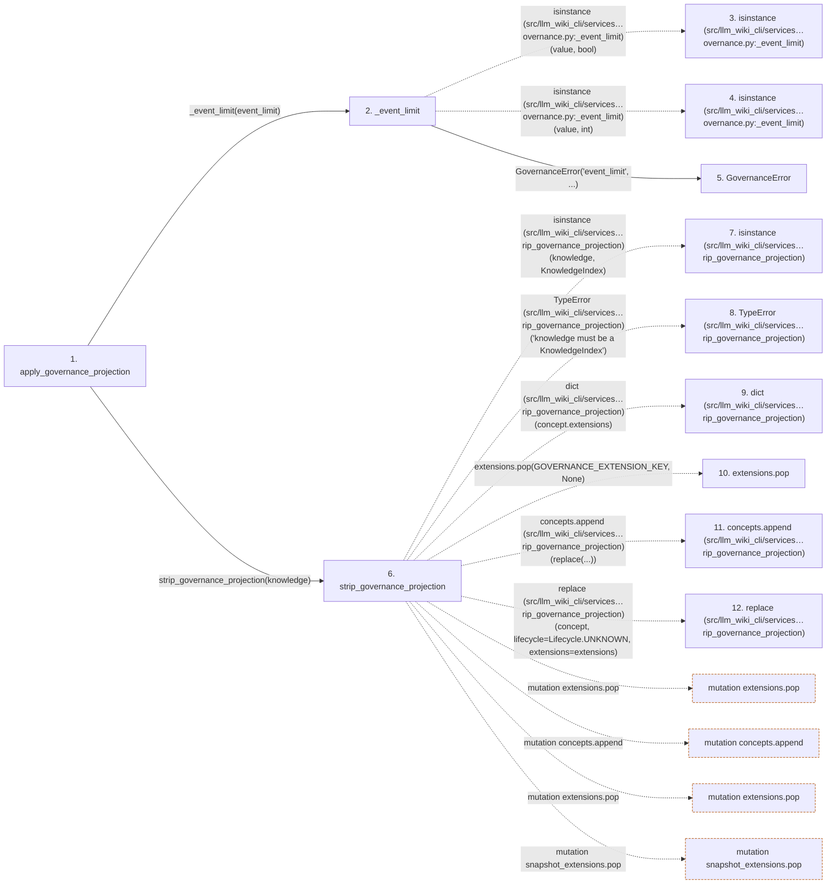

# apply_governance_projection

**Entry point:** `apply_governance_projection` (`api`)
**Source:** [knowledge_governance](../modules/knowledge_governance.md)
**Modules touched:** [concept_identity](../modules/concept_identity.md), [knowledge_artifacts](../modules/knowledge_artifacts.md), [knowledge_evidence](../modules/knowledge_evidence.md), and 6 more

**Complete modules touched:**

- [concept_identity](../modules/concept_identity.md)
- [knowledge_artifacts](../modules/knowledge_artifacts.md)
- [knowledge_evidence](../modules/knowledge_evidence.md)
- [knowledge_governance](../modules/knowledge_governance.md)
- [knowledge_graph](../modules/knowledge_graph.md)
- [knowledge_model](../modules/knowledge_model.md)
- [validation](../modules/validation.md)
- [wiki_media](../modules/wiki_media.md)
- [wiki_surface](../modules/wiki_surface.md)

## Call sequence

> Static overview in presentation order, not runtime execution order. Arrows retain captured callers; representative internal continuations and boundary examples precede repeated helper detail.

<!-- Auto-generated from static call edges. Dashed arrows are external or unresolved calls. Reviewed runtime conditions and side effects belong in Behavior. -->

```mermaid
sequenceDiagram
    participant p0 as apply_governance_projection
    participant p1 as _event_limit
    participant p2 as strip_governance_projection
    participant p3 as validate_governance_ledger
    participant p4 as _governance_concept_summaries
    participant p5 as _add_supersession_edges
    participant p6 as validate_governance_projection
    participant p7 as Lifecycle
    participant p8 as _governance_projection_payload
    participant p9 as concept_references_from_knowledge
    participant p10 as _supersession_records
    participant p11 as _bundle_id
    participant p12 as materialize_typed_graph
    participant p13 as lifecycle_state_by_uid
    participant p14 as _object (src/llm_wiki_cli/services/knowledge_governance.py)
    participant p15 as _exact_fields
    participant p16 as _concept_uid
    participant p17 as _concept_kind
    participant p18 as validate_typed_graph
    participant p19 as _identity_value
    participant p20 as _identity_ownership_key
    participant p21 as evaluate_review_event
    participant p22 as _supersession_edges
    participant p23 as _validate_concept_summary
    participant p24 as _validate_lifecycle_event_fields
    participant p25 as _validate_lifecycle_histories
    participant p26 as _validate_supersession_projection
    participant p27 as _validate_review_event_fields
    participant p28 as _validate_governance_ledger_parity
    participant p29 as replace (src/llm_wiki_cli/services…ply_governance_projection)
    participant p30 as current.content_hash
    p0->>p1: _event_limit
    p0->>p2: strip_governance_projection
    p0->>p3: validate_governance_ledger
    p0->>p4: _governance_concept_summaries
    p0->>p5: _add_supersession_edges
    p0->>p6: validate_governance_projection
    p0->>p7: Lifecycle
    p0->>p8: _governance_projection_payload
    p4->>p9: concept_references_from_knowledge
    p5->>p10: _supersession_records
    p3->>p11: _bundle_id
    p5->>p12: materialize_typed_graph
    p4->>p13: lifecycle_state_by_uid
    p6->>p14: _object (src/llm_wiki_cli/services/knowledge_governance.py)
    p6->>p15: _exact_fields
    p3->>p16: _concept_uid
    p3->>p17: _concept_kind
    p2->>p18: validate_typed_graph
    p3->>p19: _identity_value
    p3->>p20: _identity_ownership_key
    p4->>p21: evaluate_review_event
    p5->>p22: _supersession_edges
    p6->>p23: _validate_concept_summary
    p3->>p24: _validate_lifecycle_event_fields
    p3->>p25: _validate_lifecycle_histories
    p6->>p26: _validate_supersession_projection
    p3->>p27: _validate_review_event_fields
    p6->>p28: _validate_governance_ledger_parity
    p0-->>p29: replace (src/llm_wiki_cli/services…ply_governance_projection)(concept, lifecycle=Lifecycle(...), extensions={...})
    p0-->>p30: current.content_hash
```

> Call sequence diagram shows 30 of 1381 interactions; 1351 omitted to keep the visualization within the 30-interaction and generated-diagram limits, with uncertain identities omitted rather than inferred.

> Captured boundary calls: external 1 of 411 (410 omitted); unresolved 1 of 315 (314 omitted). These counts cover the captured static trace.

Omitted captured detail, grouped by actual caller occurrence and target module:

| Caller | Parent step | Target module | Kind | Omitted interactions |
| --- | --- | --- | --- | --- |
| `src/llm_wiki_cli/services/knowledge_governance.py:_event_limit` | 2 | - | external | 2 |
| `src/llm_wiki_cli/services/knowledge_governance.py:_event_limit` | 2 | [src/llm_wiki_cli/services/knowledge_governance.py](../modules/knowledge_governance.md) | internal | 1 |
| `src/llm_wiki_cli/services/knowledge_governance.py:strip_governance_projection` | 6 | - | external | 15 |
| `src/llm_wiki_cli/services/knowledge_governance.py:strip_governance_projection` | 6 | - | unresolved | 8 |
| `src/llm_wiki_cli/services/knowledge_graph.py:validate_typed_graph` | 23 | [src/llm_wiki_cli/services/knowledge_graph.py](../modules/knowledge_graph.md) | internal | 1 |
| `src/llm_wiki_cli/services/knowledge_graph.py:_parse_typed_graph` | 24 | [src/llm_wiki_cli/services/knowledge_graph.py](../modules/knowledge_graph.md) | internal | 16 |
| `src/llm_wiki_cli/services/knowledge_graph.py:_object` | 25 | [src/llm_wiki_cli/services/validation.py](../modules/validation.md) | internal | 1 |
| `src/llm_wiki_cli/services/validation.py:require_mapping` | 26 | - | external | 2 |
> Omission summary shows 8 of 301 groups; 293 further groups are not expanded here. Counts above include all omitted interactions.
> Detailed flow queries retain their own coverage and limits; omitted paths may execute at runtime.

> Trace truncated at the depth limit; deeper calls are omitted.

## Data flow

<!-- Auto-generated static analysis. Treat values and boundaries as best-effort hints, not runtime proof. -->

### Analysis coverage

**Effect analysis partially available.** Flow assembly and source effect analysis are separate; empty observations do not prove an empty handler body.

Source steps: 656; effect analysis evaluated: 416, partial: 9, unavailable: 231. Counts include steps omitted from the displayed trace.

Collector observations for 425 source steps with known totals: observed: 2076, emitted: 2030, omitted: 46. Unavailable totals are excluded.

- Callable record unavailable for one or more source steps; those steps have no represented callable body.
- Effect collector omitted observations before flow assembly; displayed effects are partial.
- Effect collector totals unavailable; observed counts cover captured records only.

| Step | Callable record | Effect analysis | Collector totals | Observed | Emitted | Omitted |
|---|---|---|---|---:|---:|---:|
| `apply_governance_projection` | `available` | `evaluated` | `available` | `8` | `8` | `0` |
| `_event_limit` | `available` | `evaluated` | `available` | `4` | `4` | `0` |
| `isinstance (src/llm_wiki_cli/services…overnance.py:_event_limit)` | `not_applicable` | `not_applicable` | `not_applicable` | — | — | — |
| `isinstance (src/llm_wiki_cli/services…overnance.py:_event_limit)` | `not_applicable` | `not_applicable` | `not_applicable` | — | — | — |
| `GovernanceError` | `unavailable` | `unavailable` | `unavailable` | — | — | — |
| `strip_governance_projection` | `available` | `evaluated` | `available` | `16` | `16` | `0` |
| `isinstance (src/llm_wiki_cli/services…rip_governance_projection)` | `not_applicable` | `not_applicable` | `not_applicable` | — | — | — |
| `TypeError (src/llm_wiki_cli/services…rip_governance_projection)` | `not_applicable` | `not_applicable` | `not_applicable` | — | — | — |
| `dict (src/llm_wiki_cli/services…rip_governance_projection)` | `not_applicable` | `not_applicable` | `not_applicable` | — | — | — |
| `extensions.pop` | `not_applicable` | `not_applicable` | `not_applicable` | — | — | — |
| `concepts.append (src/llm_wiki_cli/services…rip_governance_projection)` | `not_applicable` | `not_applicable` | `not_applicable` | — | — | — |
| `replace (src/llm_wiki_cli/services…rip_governance_projection)` | `not_applicable` | `not_applicable` | `not_applicable` | — | — | — |

```mermaid
flowchart LR
    s1["1. apply_governance_projection"]
    s2["2. _event_limit"]
    s3["3. isinstance (src/llm_wiki_cli/services…overnance.py:_event_limit)"]
    s4["4. isinstance (src/llm_wiki_cli/services…overnance.py:_event_limit)"]
    s5["5. GovernanceError"]
    s6["6. strip_governance_projection"]
    s7["7. isinstance (src/llm_wiki_cli/services…rip_governance_projection)"]
    s8["8. TypeError (src/llm_wiki_cli/services…rip_governance_projection)"]
    s9["9. dict (src/llm_wiki_cli/services…rip_governance_projection)"]
    s10["10. extensions.pop"]
    s11["11. concepts.append (src/llm_wiki_cli/services…rip_governance_projection)"]
    s12["12. replace (src/llm_wiki_cli/services…rip_governance_projection)"]
    s1 -->|"_event_limit(event_limit)"| s2
    s2 -. "isinstance (src/llm_wiki_cli/services…overnance.py:_event_limit)(value, bool)" .-> s3
    s2 -. "isinstance (src/llm_wiki_cli/services…overnance.py:_event_limit)(value, int)" .-> s4
    s2 -->|"GovernanceError('event_limit', ...)"| s5
    s1 -->|"strip_governance_projection(knowledge)"| s6
    s6 -. "isinstance (src/llm_wiki_cli/services…rip_governance_projection)(knowledge, KnowledgeIndex)" .-> s7
    s6 -. "TypeError (src/llm_wiki_cli/services…rip_governance_projection)('knowledge must be a KnowledgeIndex')" .-> s8
    s6 -. "dict (src/llm_wiki_cli/services…rip_governance_projection)(concept.extensions)" .-> s9
    s6 -. "extensions.pop(GOVERNANCE_EXTENSION_KEY, None)" .-> s10
    s6 -. "concepts.append (src/llm_wiki_cli/services…rip_governance_projection)(replace(...))" .-> s11
    s6 -. "replace (src/llm_wiki_cli/services…rip_governance_projection)(concept, lifecycle=Lifecycle.UNKNOWN, extensions=extensions)" .-> s12
    b0["mutation extensions.pop"]
    s6 -. "mutation extensions.pop" .-> b0
    b1["mutation concepts.append"]
    s6 -. "mutation concepts.append" .-> b1
    b2["mutation extensions.pop"]
    s6 -. "mutation extensions.pop" .-> b2
    b3["mutation snapshot_extensions.pop"]
    s6 -. "mutation snapshot_extensions.pop" .-> b3
    click s1 "../modules/knowledge_governance.md"
    click s2 "../modules/knowledge_governance.md"
    click s5 "../modules/knowledge_governance.md"
    click s6 "../modules/knowledge_governance.md"
    classDef boundary stroke:#b45309,stroke-dasharray: 4 2
    class b0 boundary
    class b1 boundary
    class b2 boundary
    class b3 boundary
```

### Step data

| Step | Inputs | Reads | Writes | Returns |
|---|---|---|---|---|
| `apply_governance_projection` | `knowledge: KnowledgeIndex`, `ledger: GovernanceLedger`, `event_limit: int` | `GOVERNANCE_EXTENSION_KEY`, `INVENTORY_HASH_EXTENSION` | `extensions[...]`, `snapshot_extensions[...]` | `projected` |
| `_event_limit` | `value: object` | `MAX_EVENT_LIMIT`, `MAX_EVENT_LIMIT` | - | `value` |
| `isinstance (src/llm_wiki_cli/services…overnance.py:_event_limit)` | - | - | - | - |
| `isinstance (src/llm_wiki_cli/services…overnance.py:_event_limit)` | - | - | - | - |
| `GovernanceError` | - | - | - | - |
| `strip_governance_projection` | `knowledge: KnowledgeIndex` | `KnowledgeIndex`, `GOVERNANCE_EXTENSION_KEY`, `Lifecycle`, `GOVERNANCE_EXTENSION_KEY`, `Mapping`, `Mapping`, `ConceptKind`, `GOVERNANCE_HASH_EXTENSION_KEY` | `graph_payload[...]`, `extensions[...]` | `replace(...)` |
| `isinstance (src/llm_wiki_cli/services…rip_governance_projection)` | - | - | - | - |
| `TypeError (src/llm_wiki_cli/services…rip_governance_projection)` | - | - | - | - |
| `dict (src/llm_wiki_cli/services…rip_governance_projection)` | - | - | - | - |
| `extensions.pop` | - | - | - | - |
| `concepts.append (src/llm_wiki_cli/services…rip_governance_projection)` | - | - | - | - |
| `replace (src/llm_wiki_cli/services…rip_governance_projection)` | - | - | - | - |

### Call data

| From | To | Line | Call |
|---|---|---:|---|
| apply_governance_projection | _event_limit | 1813 | `_event_limit(event_limit)` |
| _event_limit | isinstance (src/llm_wiki_cli/services…overnance.py:_event_limit) | 2692 | `isinstance(value, bool)` |
| _event_limit | isinstance (src/llm_wiki_cli/services…overnance.py:_event_limit) | 2693 | `isinstance(value, int)` |
| _event_limit | GovernanceError | 2696 | `GovernanceError('event_limit', ...)` |
| apply_governance_projection | strip_governance_projection | 1814 | `strip_governance_projection(knowledge)` |
| strip_governance_projection | isinstance (src/llm_wiki_cli/services…rip_governance_projection) | 1646 | `isinstance(knowledge, KnowledgeIndex)` |
| strip_governance_projection | TypeError (src/llm_wiki_cli/services…rip_governance_projection) | 1647 | `TypeError('knowledge must be a KnowledgeIndex')` |
| strip_governance_projection | dict (src/llm_wiki_cli/services…rip_governance_projection) | 1650 | `dict(concept.extensions)` |
| strip_governance_projection | extensions.pop | 1651 | `extensions.pop(GOVERNANCE_EXTENSION_KEY, None)` |
| strip_governance_projection | concepts.append (src/llm_wiki_cli/services…rip_governance_projection) | 1652 | `concepts.append(replace(...))` |
| strip_governance_projection | replace (src/llm_wiki_cli/services…rip_governance_projection) | 1653 | `replace(concept, lifecycle=Lifecycle.UNKNOWN, extensions=extensions)` |

### Boundary effects

| Kind | Target | Step | Line |
|---|---|---|---:|
| mutation | `extensions.pop` | `strip_governance_projection` | 1651 |
| mutation | `concepts.append` | `strip_governance_projection` | 1652 |
| mutation | `extensions.pop` | `strip_governance_projection` | 1660 |
| mutation | `snapshot_extensions.pop` | `strip_governance_projection` | 1689 |

### Static analysis gaps

| Kind | Step | Target | Line |
|---|---|---|---:|
| external_call | `_event_limit` | `isinstance` | 2692 |
| external_call | `_event_limit` | `isinstance` | 2693 |
| external_call | `strip_governance_projection` | `isinstance` | 1646 |
| external_call | `strip_governance_projection` | `TypeError` | 1647 |
| external_call | `strip_governance_projection` | `replace` | 1653 |
| step_limit | `apply_governance_projection` | `first 12 steps` | 0 |
| truncated_flow | `apply_governance_projection` | `depth limit` | 0 |

## Behavior

This flow starts at `apply_governance_projection` and is classified as `api`. The generated call and data-flow sections are bounded static projections; runtime conditions and side effects require source-level confirmation.
