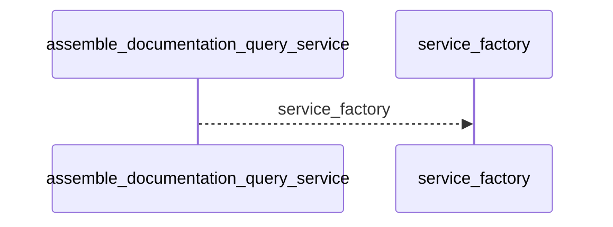
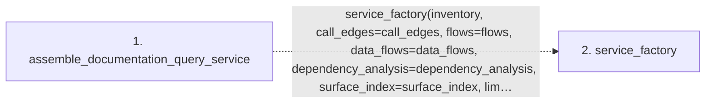

# assemble_documentation_query_service

**Entry point:** `assemble_documentation_query_service` (`api`)
**Source:** [documentation_query_builder](../modules/documentation_query_builder.md)
**Modules touched:** [documentation_query_builder](../modules/documentation_query_builder.md)

## Call sequence

<!-- Auto-generated from static call edges. Dashed arrows are external or unresolved calls. Reviewed runtime conditions and side effects belong in Behavior. -->

## Data flow

<!-- Auto-generated static analysis. Treat values and boundaries as best-effort hints, not runtime proof. -->

### Step data

| Step | Inputs | Reads | Writes | Returns |
|---|---|---|---|---|
| `assemble_documentation_query_service` | `inventory: Mapping[str, Mapping[str, Any]]`, `call_edges: Iterable[Mapping[str, Any]]`, `flows: Iterable[Mapping[str, Any]]`, `data_flows: object`, `dependency_analysis: Mapping[str, Any] \| None`, `surface_index: Mapping[str, Any] \| None`, `limit: int`, `knowledge_view: object` | - | - | `service_factory(...)` |
| `service_factory` | - | - | - | - |

### Call data

| From | To | Line | Call |
|---|---|---:|---|
| assemble_documentation_query_service | service_factory | 143 | `service_factory(inventory, call_edges=call_edges, flows=flows, data_flows=data_flows, dependency_analysis=dependency_analysis, surface_index=surface_index, limit=limit, knowledge_view=knowledge_view, machine_verification=machine_verification)` |

### Boundary effects

*No boundary effects detected.*

### Static analysis gaps

| Kind | Step | Target | Line |
|---|---|---|---:|
| unresolved_call | `assemble_documentation_query_service` | `service_factory` | 143 |

## Behavior

This flow starts at `assemble_documentation_query_service` and is classified as `api`. The generated call and data-flow sections are bounded static projections; runtime conditions and side effects require source-level confirmation.
