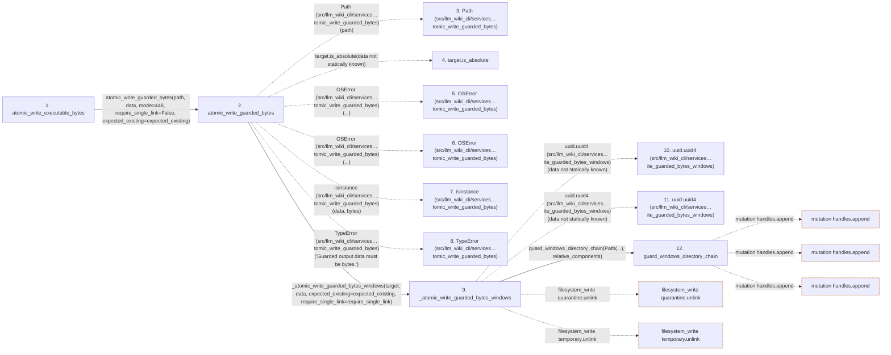

# atomic_write_executable_bytes

**Entry point:** `atomic_write_executable_bytes` (`api`)
**Source:** [filesystem_guard](../modules/filesystem_guard.md)
**Modules touched:** [filesystem_guard](../modules/filesystem_guard.md)

## Call sequence

```mermaid
sequenceDiagram
    participant p0 as atomic_write_executable_bytes
    participant p1 as atomic_write_guarded_bytes
    participant p2 as Path (src/llm_wiki_cli/services…tomic_write_guarded_bytes)
    participant p3 as target.is_absolute
    participant p4 as OSError (src/llm_wiki_cli/services…tomic_write_guarded_bytes)
    participant p5 as isinstance (src/llm_wiki_cli/services…tomic_write_guarded_bytes)
    participant p6 as TypeError (src/llm_wiki_cli/services…tomic_write_guarded_bytes)
    participant p7 as _atomic_write_guarded_bytes_windows
    participant p8 as uuid.uuid4 (src/llm_wiki_cli/services…ite_guarded_bytes_windows)
    participant p9 as guard_windows_directory_chain
    participant p10 as WindowsDirectoryGuardError
    participant p11 as Path (src/llm_wiki_cli/services…d_windows_directory_chain)
    participant p12 as os.path.abspath (src/llm_wiki_cli/services…d_windows_directory_chain)
    participant p13 as os.fspath (src/llm_wiki_cli/services…d_windows_directory_chain)
    participant p14 as handles.append
    participant p15 as _open_windows_directory_guard
    participant p16 as ctypes.WinDLL (src/llm_wiki_cli/services…n_windows_directory_guard)
    participant p17 as create_file (src/llm_wiki_cli/services…n_windows_directory_guard)
    participant p18 as _windows_api_path
    participant p19 as os.path.abspath (src/llm_wiki_cli/services…uard.py:_windows_api_path)
    participant p20 as os.fspath (src/llm_wiki_cli/services…uard.py:_windows_api_path)
    participant p21 as value.startswith
    participant p22 as wintypes.HANDLE (src/llm_wiki_cli/services…n_windows_directory_guard)
    participant p23 as ctypes.get_last_error (src/llm_wiki_cli/services…n_windows_directory_guard)
    participant p24 as ctypes.WinError (src/llm_wiki_cli/services…n_windows_directory_guard)
    participant p25 as _WindowsDirectoryGuardUnavailableError
    p0->>p1: atomic_write_guarded_bytes
    p1-->>p2: Path (src/llm_wiki_cli/services…tomic_write_guarded_bytes)
    p1-->>p3: target.is_absolute
    p1-->>p4: OSError (src/llm_wiki_cli/services…tomic_write_guarded_bytes)
    p1-->>p4: OSError (src/llm_wiki_cli/services…tomic_write_guarded_bytes)
    p1-->>p5: isinstance (src/llm_wiki_cli/services…tomic_write_guarded_bytes)
    p1-->>p6: TypeError (src/llm_wiki_cli/services…tomic_write_guarded_bytes)
    p1->>p7: _atomic_write_guarded_bytes_windows
    p7-->>p8: uuid.uuid4 (src/llm_wiki_cli/services…ite_guarded_bytes_windows)
    p7-->>p8: uuid.uuid4 (src/llm_wiki_cli/services…ite_guarded_bytes_windows)
    p7->>p9: guard_windows_directory_chain
    p9->>p10: WindowsDirectoryGuardError
    p9-->>p11: Path (src/llm_wiki_cli/services…d_windows_directory_chain)
    p9-->>p12: os.path.abspath (src/llm_wiki_cli/services…d_windows_directory_chain)
    p9-->>p13: os.fspath (src/llm_wiki_cli/services…d_windows_directory_chain)
    p9->>p10: WindowsDirectoryGuardError
    p9-->>p11: Path (src/llm_wiki_cli/services…d_windows_directory_chain)
    p9-->>p14: handles.append
    p9->>p15: _open_windows_directory_guard
    p15-->>p16: ctypes.WinDLL (src/llm_wiki_cli/services…n_windows_directory_guard)
    p15-->>p17: create_file (src/llm_wiki_cli/services…n_windows_directory_guard)
    p15->>p18: _windows_api_path
    p18-->>p19: os.path.abspath (src/llm_wiki_cli/services…uard.py:_windows_api_path)
    p18-->>p20: os.fspath (src/llm_wiki_cli/services…uard.py:_windows_api_path)
    p18-->>p21: value.startswith
    p18-->>p21: value.startswith
    p15-->>p22: wintypes.HANDLE (src/llm_wiki_cli/services…n_windows_directory_guard)
    p15-->>p23: ctypes.get_last_error (src/llm_wiki_cli/services…n_windows_directory_guard)
    p15-->>p24: ctypes.WinError (src/llm_wiki_cli/services…n_windows_directory_guard)
    p15->>p25: _WindowsDirectoryGuardUnavailableError
```

<!-- Auto-generated from static call edges. Dashed arrows are external or unresolved calls. Reviewed runtime conditions and side effects belong in Behavior. -->

> Call sequence diagram shows 30 of 345 interactions; 315 omitted to keep the visualization within the 30-interaction and generated-diagram limits.

> Trace truncated at the depth limit; deeper calls are omitted.

## Data flow

<!-- Auto-generated static analysis. Treat values and boundaries as best-effort hints, not runtime proof. -->

### Step data

| Step | Inputs | Reads | Writes | Returns |
|---|---|---|---|---|
| `atomic_write_executable_bytes` | `path: Path`, `data: bytes`, `expected_existing: bytes \| None \| object` | - | - | `atomic_write_guarded_bytes(...)` |
| `atomic_write_guarded_bytes` | `path: Path`, `data: bytes`, `mode: int`, `require_single_link: bool`, `expected_existing: bytes \| None \| object` | `os` | - | `target` |
| `Path (src/llm_wiki_cli/services…tomic_write_guarded_bytes)` | - | - | - | - |
| `target.is_absolute` | - | - | - | - |
| `OSError (src/llm_wiki_cli/services…tomic_write_guarded_bytes)` | - | - | - | - |
| `OSError (src/llm_wiki_cli/services…tomic_write_guarded_bytes)` | - | - | - | - |
| `isinstance (src/llm_wiki_cli/services…tomic_write_guarded_bytes)` | - | - | - | - |
| `TypeError (src/llm_wiki_cli/services…tomic_write_guarded_bytes)` | - | - | - | - |
| `_atomic_write_guarded_bytes_windows` | `target: Path`, `data: bytes`, `expected_existing: bytes \| None \| object`, `require_single_link: bool` | `os`, `os`, `os`, `os`, `os`, `_EXPECTED_EXISTING_UNSET` | - | - |
| `uuid.uuid4 (src/llm_wiki_cli/services…ite_guarded_bytes_windows)` | - | - | - | - |
| `uuid.uuid4 (src/llm_wiki_cli/services…ite_guarded_bytes_windows)` | - | - | - | - |
| `guard_windows_directory_chain` | `root: Path`, `relative_components: Sequence[str]`, `create_missing: bool`, `require_restrictive_dacl: bool` | `os`, `WindowsDurabilityError` | - | - |

### Call data

| From | To | Line | Call |
|---|---|---:|---|
| atomic_write_executable_bytes | atomic_write_guarded_bytes | 1584 | `atomic_write_guarded_bytes(path, data, mode=448, require_single_link=False, expected_existing=expected_existing)` |
| atomic_write_guarded_bytes | Path (src/llm_wiki_cli/services…tomic_write_guarded_bytes) | 1603 | `Path(path)` |
| atomic_write_guarded_bytes | target.is_absolute | 1604 | `target.is_absolute(data not statically known)` |
| atomic_write_guarded_bytes | OSError (src/llm_wiki_cli/services…tomic_write_guarded_bytes) | 1605 | `OSError(...)` |
| atomic_write_guarded_bytes | OSError (src/llm_wiki_cli/services…tomic_write_guarded_bytes) | 1607 | `OSError(...)` |
| atomic_write_guarded_bytes | isinstance (src/llm_wiki_cli/services…tomic_write_guarded_bytes) | 1608 | `isinstance(data, bytes)` |
| atomic_write_guarded_bytes | TypeError (src/llm_wiki_cli/services…tomic_write_guarded_bytes) | 1609 | `TypeError('Guarded output data must be bytes.')` |
| atomic_write_guarded_bytes | _atomic_write_guarded_bytes_windows | 1611 | `_atomic_write_guarded_bytes_windows(target, data, expected_existing=expected_existing, require_single_link=require_single_link)` |
| _atomic_write_guarded_bytes_windows | uuid.uuid4 (src/llm_wiki_cli/services…ite_guarded_bytes_windows) | 2566 | `uuid.uuid4(data not statically known)` |
| _atomic_write_guarded_bytes_windows | uuid.uuid4 (src/llm_wiki_cli/services…ite_guarded_bytes_windows) | 2567 | `uuid.uuid4(data not statically known)` |
| _atomic_write_guarded_bytes_windows | guard_windows_directory_chain | 2571 | `guard_windows_directory_chain(Path(...), relative_components)` |

### Boundary effects

| Kind | Target | Step | Line |
|---|---|---|---:|
| filesystem_write | `quarantine.unlink` | `_atomic_write_guarded_bytes_windows` | 2655 |
| filesystem_write | `temporary.unlink` | `_atomic_write_guarded_bytes_windows` | 2660 |
| mutation | `handles.append` | `guard_windows_directory_chain` | 182 |
| mutation | `handles.append` | `guard_windows_directory_chain` | 189 |
| mutation | `handles.append` | `guard_windows_directory_chain` | 216 |

### Static analysis gaps

| Kind | Step | Target | Line |
|---|---|---|---:|
| unresolved_call | `atomic_write_guarded_bytes` | `target.is_absolute` | 1604 |
| external_call | `atomic_write_guarded_bytes` | `OSError` | 1605 |
| external_call | `atomic_write_guarded_bytes` | `OSError` | 1607 |
| external_call | `atomic_write_guarded_bytes` | `isinstance` | 1608 |
| external_call | `atomic_write_guarded_bytes` | `TypeError` | 1609 |
| external_call | `_atomic_write_guarded_bytes_windows` | `uuid.uuid4` | 2566 |
| external_call | `_atomic_write_guarded_bytes_windows` | `uuid.uuid4` | 2567 |
| step_limit | `atomic_write_executable_bytes` | `first 12 steps` | 0 |
| truncated_flow | `atomic_write_executable_bytes` | `depth limit` | 0 |

## Behavior

This flow starts at `atomic_write_executable_bytes` and is classified as `api`. The generated call and data-flow sections are bounded static projections; runtime conditions and side effects require source-level confirmation.
