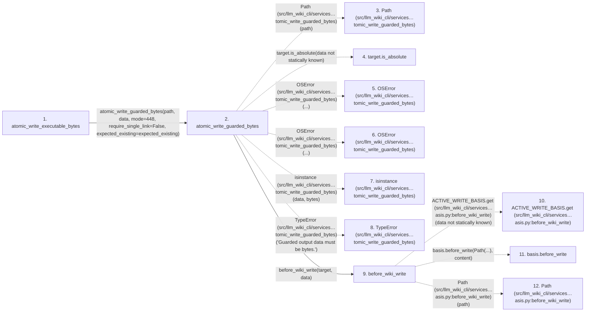

# atomic_write_executable_bytes

**Entry point:** `atomic_write_executable_bytes` (`api`)
**Source:** [filesystem_guard](../modules/filesystem_guard.md)
**Modules touched:** [filesystem_guard](../modules/filesystem_guard.md), [wiki_write_basis](../modules/wiki_write_basis.md)

## Call sequence

> Static overview in presentation order, not runtime execution order. Arrows retain captured callers; representative internal continuations and boundary examples precede repeated helper detail.

<!-- Auto-generated from static call edges. Dashed arrows are external or unresolved calls. Reviewed runtime conditions and side effects belong in Behavior. -->

```mermaid
sequenceDiagram
    participant p0 as atomic_write_executable_bytes
    participant p1 as atomic_write_guarded_bytes
    participant p2 as _atomic_write_guarded_bytes_windows
    participant p3 as _atomic_write_private_bytes_posix
    participant p4 as guard_windows_directory_chain
    participant p5 as windows_object_identity
    participant p6 as _commit_windows_absent_snapshot
    participant p7 as open_windows_readonly_file
    participant p8 as _restore_posix_quarantined_entry
    participant p9 as windows_object_identity_from_values
    participant p10 as _open_windows_readonly_file_handle
    participant p11 as _open_windows_directory_guard
    participant p12 as create_private_windows_directory
    participant p13 as _private_windows_security_attributes
    participant p14 as move_windows_path_write_through
    participant p15 as _verify_windows_handle_restrictive_dacl
    participant p16 as before_wiki_write
    participant p17 as after_wiki_write
    participant p18 as WindowsFileGuardError
    participant p19 as _read_posix_descriptor
    participant p20 as WindowsDirectoryGuardError
    participant p21 as _restore_posix_entry_between
    participant p22 as _close_windows_handle
    participant p23 as WindowsIdentityUnavailableError
    participant p24 as WindowsObjectIdentity
    participant p25 as _windows_api_path
    participant p26 as _WindowsDirectoryGuardUnavailableError
    participant p27 as WindowsDurabilityError
    participant p28 as _current_windows_user_sid
    participant p29 as Path (src/llm_wiki_cli/services…tomic_write_guarded_bytes)
    participant p30 as target.is_absolute
    p0->>p1: atomic_write_guarded_bytes
    p1->>p2: _atomic_write_guarded_bytes_windows
    p1->>p3: _atomic_write_private_bytes_posix
    p2->>p4: guard_windows_directory_chain
    p2->>p5: windows_object_identity
    p2->>p6: _commit_windows_absent_snapshot
    p2->>p7: open_windows_readonly_file
    p3->>p8: _restore_posix_quarantined_entry
    p5->>p9: windows_object_identity_from_values
    p7->>p10: _open_windows_readonly_file_handle
    p4->>p11: _open_windows_directory_guard
    p4->>p12: create_private_windows_directory
    p12->>p13: _private_windows_security_attributes
    p12->>p14: move_windows_path_write_through
    p11->>p15: _verify_windows_handle_restrictive_dacl
    p1->>p16: before_wiki_write
    p1->>p17: after_wiki_write
    p2->>p18: WindowsFileGuardError
    p3->>p19: _read_posix_descriptor
    p4->>p20: WindowsDirectoryGuardError
    p8->>p21: _restore_posix_entry_between
    p7->>p22: _close_windows_handle
    p9->>p23: WindowsIdentityUnavailableError
    p9->>p24: WindowsObjectIdentity
    p11->>p25: _windows_api_path
    p11->>p26: _WindowsDirectoryGuardUnavailableError
    p14->>p27: WindowsDurabilityError
    p13->>p28: _current_windows_user_sid
    p1-->>p29: Path (src/llm_wiki_cli/services…tomic_write_guarded_bytes)(path)
    p1-->>p30: target.is_absolute
```

> Call sequence diagram shows 30 of 365 interactions; 335 omitted to keep the visualization within the 30-interaction and generated-diagram limits, with uncertain identities omitted rather than inferred.

> Captured boundary calls: external 1 of 223 (222 omitted); unresolved 1 of 51 (50 omitted). These counts cover the captured static trace.

Omitted captured detail, grouped by actual caller occurrence and target module:

| Caller | Parent step | Target module | Kind | Omitted interactions |
| --- | --- | --- | --- | --- |
| `src/llm_wiki_cli/services/filesystem_guard.py:atomic_write_guarded_bytes` | 2 | - | external | 4 |
| `src/llm_wiki_cli/services/wiki_write_basis.py:before_wiki_write` | 9 | - | unresolved | 6 |
| `src/llm_wiki_cli/services/wiki_write_basis.py:before_wiki_write` | 9 | - | external | 3 |
| `src/llm_wiki_cli/services/filesystem_guard.py:_atomic_write_guarded_bytes_windows` | 19 | - | external | 19 |
| `src/llm_wiki_cli/services/filesystem_guard.py:guard_windows_directory_chain` | 22 | - | external | 9 |
| `src/llm_wiki_cli/services/filesystem_guard.py:guard_windows_directory_chain` | 22 | [src/llm_wiki_cli/services/filesystem_guard.py](../modules/filesystem_guard.md) | internal | 6 |
| `src/llm_wiki_cli/services/filesystem_guard.py:guard_windows_directory_chain` | 22 | - | unresolved | 4 |
| `src/llm_wiki_cli/services/filesystem_guard.py:_open_windows_directory_guard` | 30 | - | external | 14 |
> Omission summary shows 8 of 45 groups; 37 further groups are not expanded here. Counts above include all omitted interactions.
> Detailed flow queries retain their own coverage and limits; omitted paths may execute at runtime.

> Trace truncated at the depth limit; deeper calls are omitted.

## Data flow

<!-- Auto-generated static analysis. Treat values and boundaries as best-effort hints, not runtime proof. -->

### Analysis coverage

**Effect analysis partially available.** Flow assembly and source effect analysis are separate; empty observations do not prove an empty handler body.

Source steps: 92; effect analysis evaluated: 45, partial: 8, unavailable: 39. Counts include steps omitted from the displayed trace.

Collector observations for 53 source steps with known totals: observed: 376, emitted: 364, omitted: 12. Unavailable totals are excluded.

- Callable record unavailable for one or more source steps; those steps have no represented callable body.
- Effect collector omitted observations before flow assembly; displayed effects are partial.
- Effect collector totals unavailable; observed counts cover captured records only.

| Step | Callable record | Effect analysis | Collector totals | Observed | Emitted | Omitted |
|---|---|---|---|---:|---:|---:|
| `atomic_write_executable_bytes` | `available` | `evaluated` | `available` | `4` | `4` | `0` |
| `atomic_write_guarded_bytes` | `available` | `evaluated` | `available` | `7` | `7` | `0` |
| `Path (src/llm_wiki_cli/services…tomic_write_guarded_bytes)` | `not_applicable` | `not_applicable` | `not_applicable` | — | — | — |
| `target.is_absolute` | `not_applicable` | `not_applicable` | `not_applicable` | — | — | — |
| `OSError (src/llm_wiki_cli/services…tomic_write_guarded_bytes)` | `not_applicable` | `not_applicable` | `not_applicable` | — | — | — |
| `OSError (src/llm_wiki_cli/services…tomic_write_guarded_bytes)` | `not_applicable` | `not_applicable` | `not_applicable` | — | — | — |
| `isinstance (src/llm_wiki_cli/services…tomic_write_guarded_bytes)` | `not_applicable` | `not_applicable` | `not_applicable` | — | — | — |
| `TypeError (src/llm_wiki_cli/services…tomic_write_guarded_bytes)` | `not_applicable` | `not_applicable` | `not_applicable` | — | — | — |
| `before_wiki_write` | `available` | `evaluated` | `available` | `2` | `2` | `0` |
| `ACTIVE_WRITE_BASIS.get (src/llm_wiki_cli/services…asis.py:before_wiki_write)` | `not_applicable` | `not_applicable` | `not_applicable` | — | — | — |
| `basis.before_write` | `not_applicable` | `not_applicable` | `not_applicable` | — | — | — |
| `Path (src/llm_wiki_cli/services…asis.py:before_wiki_write)` | `not_applicable` | `not_applicable` | `not_applicable` | — | — | — |

```mermaid
flowchart LR
    s1["1. atomic_write_executable_bytes"]
    s2["2. atomic_write_guarded_bytes"]
    s3["3. Path (src/llm_wiki_cli/services…tomic_write_guarded_bytes)"]
    s4["4. target.is_absolute"]
    s5["5. OSError (src/llm_wiki_cli/services…tomic_write_guarded_bytes)"]
    s6["6. OSError (src/llm_wiki_cli/services…tomic_write_guarded_bytes)"]
    s7["7. isinstance (src/llm_wiki_cli/services…tomic_write_guarded_bytes)"]
    s8["8. TypeError (src/llm_wiki_cli/services…tomic_write_guarded_bytes)"]
    s9["9. before_wiki_write"]
    s10["10. ACTIVE_WRITE_BASIS.get (src/llm_wiki_cli/services…asis.py:before_wiki_write)"]
    s11["11. basis.before_write"]
    s12["12. Path (src/llm_wiki_cli/services…asis.py:before_wiki_write)"]
    s1 -->|"atomic_write_guarded_bytes(path, data, mode=448, require_single_link=False, expected_existing=expected_existing)"| s2
    s2 -. "Path (src/llm_wiki_cli/services…tomic_write_guarded_bytes)(path)" .-> s3
    s2 -. "target.is_absolute(data not statically known)" .-> s4
    s2 -. "OSError (src/llm_wiki_cli/services…tomic_write_guarded_bytes)(...)" .-> s5
    s2 -. "OSError (src/llm_wiki_cli/services…tomic_write_guarded_bytes)(...)" .-> s6
    s2 -. "isinstance (src/llm_wiki_cli/services…tomic_write_guarded_bytes)(data, bytes)" .-> s7
    s2 -. "TypeError (src/llm_wiki_cli/services…tomic_write_guarded_bytes)('Guarded output data must be bytes.')" .-> s8
    s2 -->|"before_wiki_write(target, data)"| s9
    s9 -. "ACTIVE_WRITE_BASIS.get (src/llm_wiki_cli/services…asis.py:before_wiki_write)(data not statically known)" .-> s10
    s9 -. "basis.before_write(Path(...), content)" .-> s11
    s9 -. "Path (src/llm_wiki_cli/services…asis.py:before_wiki_write)(path)" .-> s12
    click s1 "../modules/filesystem_guard.md"
    click s2 "../modules/filesystem_guard.md"
    click s9 "../modules/wiki_write_basis.md"
```

### Step data

| Step | Inputs | Reads | Writes | Returns |
|---|---|---|---|---|
| `atomic_write_executable_bytes` | `path: Path`, `data: bytes`, `expected_existing: bytes \| None \| object` | - | - | `atomic_write_guarded_bytes(...)` |
| `atomic_write_guarded_bytes` | `path: Path`, `data: bytes`, `mode: int`, `require_single_link: bool`, `expected_existing: bytes \| None \| object` | `os` | - | `target` |
| `Path (src/llm_wiki_cli/services…tomic_write_guarded_bytes)` | - | - | - | - |
| `target.is_absolute` | - | - | - | - |
| `OSError (src/llm_wiki_cli/services…tomic_write_guarded_bytes)` | - | - | - | - |
| `OSError (src/llm_wiki_cli/services…tomic_write_guarded_bytes)` | - | - | - | - |
| `isinstance (src/llm_wiki_cli/services…tomic_write_guarded_bytes)` | - | - | - | - |
| `TypeError (src/llm_wiki_cli/services…tomic_write_guarded_bytes)` | - | - | - | - |
| `before_wiki_write` | `path: str \| Path`, `content: bytes \| None` | - | - | - |
| `ACTIVE_WRITE_BASIS.get (src/llm_wiki_cli/services…asis.py:before_wiki_write)` | - | - | - | - |
| `basis.before_write` | - | - | - | - |
| `Path (src/llm_wiki_cli/services…asis.py:before_wiki_write)` | - | - | - | - |

### Call data

| From | To | Line | Call |
|---|---|---:|---|
| atomic_write_executable_bytes | atomic_write_guarded_bytes | 1596 | `atomic_write_guarded_bytes(path, data, mode=448, require_single_link=False, expected_existing=expected_existing)` |
| atomic_write_guarded_bytes | Path (src/llm_wiki_cli/services…tomic_write_guarded_bytes) | 1615 | `Path(path)` |
| atomic_write_guarded_bytes | target.is_absolute | 1616 | `target.is_absolute(data not statically known)` |
| atomic_write_guarded_bytes | OSError (src/llm_wiki_cli/services…tomic_write_guarded_bytes) | 1617 | `OSError(...)` |
| atomic_write_guarded_bytes | OSError (src/llm_wiki_cli/services…tomic_write_guarded_bytes) | 1619 | `OSError(...)` |
| atomic_write_guarded_bytes | isinstance (src/llm_wiki_cli/services…tomic_write_guarded_bytes) | 1620 | `isinstance(data, bytes)` |
| atomic_write_guarded_bytes | TypeError (src/llm_wiki_cli/services…tomic_write_guarded_bytes) | 1621 | `TypeError('Guarded output data must be bytes.')` |
| atomic_write_guarded_bytes | before_wiki_write | 1624 | `before_wiki_write(target, data)` |
| before_wiki_write | ACTIVE_WRITE_BASIS.get (src/llm_wiki_cli/services…asis.py:before_wiki_write) | 33 | `ACTIVE_WRITE_BASIS.get(data not statically known)` |
| before_wiki_write | basis.before_write | 35 | `basis.before_write(Path(...), content)` |
| before_wiki_write | Path (src/llm_wiki_cli/services…asis.py:before_wiki_write) | 35 | `Path(path)` |

### Boundary effects

*No boundary-effect observations were captured in this static trace.*

### Static analysis gaps

| Kind | Step | Target | Line |
|---|---|---|---:|
| unresolved_call | `atomic_write_guarded_bytes` | `target.is_absolute` | 1616 |
| external_call | `atomic_write_guarded_bytes` | `OSError` | 1617 |
| external_call | `atomic_write_guarded_bytes` | `OSError` | 1619 |
| external_call | `atomic_write_guarded_bytes` | `isinstance` | 1620 |
| external_call | `atomic_write_guarded_bytes` | `TypeError` | 1621 |
| unresolved_call | `before_wiki_write` | `ACTIVE_WRITE_BASIS.get` | 33 |
| unresolved_call | `before_wiki_write` | `basis.before_write` | 35 |
| step_limit | `atomic_write_executable_bytes` | `first 12 steps` | 0 |
| truncated_flow | `atomic_write_executable_bytes` | `depth limit` | 0 |

## Behavior

This flow starts at `atomic_write_executable_bytes` and is classified as `api`. The generated call and data-flow sections are bounded static projections; runtime conditions and side effects require source-level confirmation.
