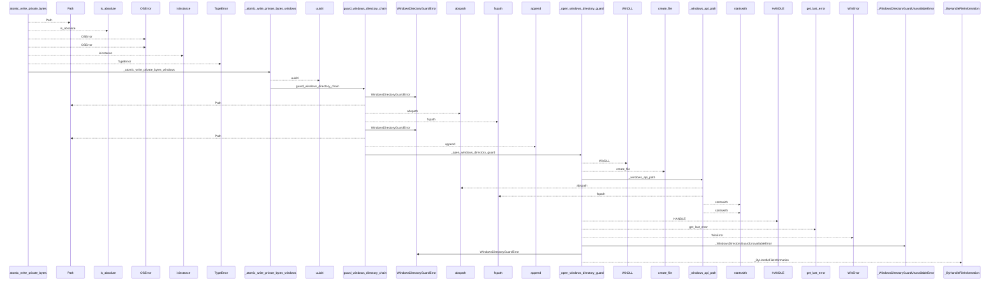
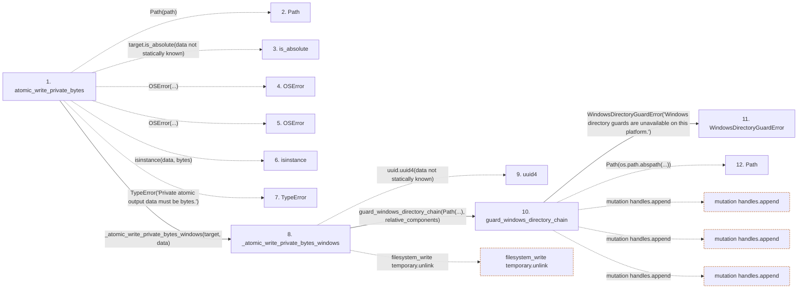

# atomic_write_private_bytes

**Entry point:** `atomic_write_private_bytes` (`api`)
**Source:** [filesystem_guard](../modules/filesystem_guard.md)
**Modules touched:** [filesystem_guard](../modules/filesystem_guard.md)

## Call sequence

<!-- Auto-generated from static call edges. Dashed arrows are external or unresolved calls. Reviewed runtime conditions and side effects belong in Behavior. -->

> Call sequence diagram shows 30 of 316 interactions; 286 omitted to keep the visualization within the 30-interaction and generated-diagram limits.

> Trace truncated at the depth limit; deeper calls are omitted.

## Data flow

<!-- Auto-generated static analysis. Treat values and boundaries as best-effort hints, not runtime proof. -->

### Step data

| Step | Inputs | Reads | Writes | Returns |
|---|---|---|---|---|
| `atomic_write_private_bytes` | `path: Path`, `data: bytes` | `os` | - | `target` |
| `Path` | - | - | - | - |
| `is_absolute` | - | - | - | - |
| `OSError` | - | - | - | - |
| `OSError` | - | - | - | - |
| `isinstance` | - | - | - | - |
| `TypeError` | - | - | - | - |
| `_atomic_write_private_bytes_windows` | `target: Path`, `data: bytes` | - | - | - |
| `uuid4` | - | - | - | - |
| `guard_windows_directory_chain` | `root: Path`, `relative_components: Sequence[str]`, `create_missing: bool`, `require_restrictive_dacl: bool` | `os`, `WindowsDurabilityError` | - | - |
| `WindowsDirectoryGuardError` | - | - | - | - |
| `Path` | - | - | - | - |

### Call data

| From | To | Line | Call |
|---|---|---:|---|
| atomic_write_private_bytes | Path | 1301 | `Path(path)` |
| atomic_write_private_bytes | is_absolute | 1302 | `target.is_absolute(data not statically known)` |
| atomic_write_private_bytes | OSError | 1303 | `OSError(...)` |
| atomic_write_private_bytes | OSError | 1305 | `OSError(...)` |
| atomic_write_private_bytes | isinstance | 1306 | `isinstance(data, bytes)` |
| atomic_write_private_bytes | TypeError | 1307 | `TypeError('Private atomic output data must be bytes.')` |
| atomic_write_private_bytes | _atomic_write_private_bytes_windows | 1309 | `_atomic_write_private_bytes_windows(target, data)` |
| _atomic_write_private_bytes_windows | uuid4 | 1410 | `uuid.uuid4(data not statically known)` |
| _atomic_write_private_bytes_windows | guard_windows_directory_chain | 1412 | `guard_windows_directory_chain(Path(...), relative_components)` |
| guard_windows_directory_chain | WindowsDirectoryGuardError | 165 | `WindowsDirectoryGuardError('Windows directory guards are unavailable on this platform.')` |
| guard_windows_directory_chain | Path | 169 | `Path(os.path.abspath(...))` |

### Boundary effects

| Kind | Target | Step | Line |
|---|---|---|---:|
| filesystem_write | `temporary.unlink` | `_atomic_write_private_bytes_windows` | 1440 |
| mutation | `handles.append` | `guard_windows_directory_chain` | 177 |
| mutation | `handles.append` | `guard_windows_directory_chain` | 184 |
| mutation | `handles.append` | `guard_windows_directory_chain` | 211 |

### Static analysis gaps

| Kind | Step | Target | Line |
|---|---|---|---:|
| unresolved_call | `atomic_write_private_bytes` | `target.is_absolute` | 1302 |
| unresolved_call | `atomic_write_private_bytes` | `OSError` | 1303 |
| unresolved_call | `atomic_write_private_bytes` | `OSError` | 1305 |
| unresolved_call | `atomic_write_private_bytes` | `isinstance` | 1306 |
| unresolved_call | `atomic_write_private_bytes` | `TypeError` | 1307 |
| external_call | `_atomic_write_private_bytes_windows` | `uuid.uuid4` | 1410 |
| step_limit | `atomic_write_private_bytes` | `first 12 steps` | 0 |
| truncated_flow | `atomic_write_private_bytes` | `depth limit` | 0 |

## Behavior

This flow starts at `atomic_write_private_bytes` and is classified as `api`. The generated call and data-flow sections are bounded static projections; runtime conditions and side effects require source-level confirmation.
