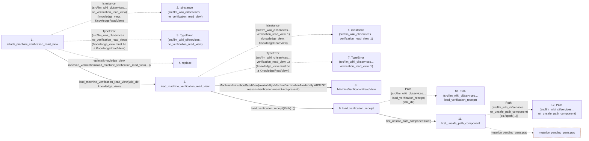

# attach_machine_verification_read_view

**Entry point:** `attach_machine_verification_read_view` (`api`)
**Source:** [knowledge_verification](../modules/knowledge_verification.md)
**Modules touched:** [io](../modules/io.md), [knowledge_artifacts](../modules/knowledge_artifacts.md), [knowledge_consumption](../modules/knowledge_consumption.md), [knowledge_evidence](../modules/knowledge_evidence.md), and 3 more

**Complete modules touched:**

- [io](../modules/io.md)
- [knowledge_artifacts](../modules/knowledge_artifacts.md)
- [knowledge_consumption](../modules/knowledge_consumption.md)
- [knowledge_evidence](../modules/knowledge_evidence.md)
- [knowledge_verification](../modules/knowledge_verification.md)
- [validation](../modules/validation.md)
- [verification_contracts](../modules/verification_contracts.md)

## Call sequence

> Static overview in presentation order, not runtime execution order. Arrows retain captured callers; representative internal continuations and boundary examples precede repeated helper detail.

<!-- Auto-generated from static call edges. Dashed arrows are external or unresolved calls. Reviewed runtime conditions and side effects belong in Behavior. -->

```mermaid
sequenceDiagram
    participant p0 as attach_machine_verification_read_view
    participant p1 as load_machine_verification_read_view
    participant p2 as load_verification_receipt
    participant p3 as _validated_artifacts_for_view
    participant p4 as evaluate_verification_receipt
    participant p5 as _read_regular_receipt
    participant p6 as deserialize_verification_receipt
    participant p7 as validate_verification_receipt
    participant p8 as serialize_verification_receipt
    participant p9 as formatted_json_bytes
    participant p10 as verification_receipt_to_payload
    participant p11 as _object
    participant p12 as _exact_fields
    participant p13 as _string
    participant p14 as _receipt_hash
    participant p15 as _scope_uid
    participant p16 as _receipt_anchor_mapping
    participant p17 as hash_json
    participant p18 as _parse_check
    participant p19 as MachineVerificationReadView
    participant p20 as machine_verification_summary
    participant p21 as require_validated_artifacts
    participant p22 as first_unsafe_path_component
    participant p23 as VerificationReceiptError
    participant p24 as verification_receipt_path
    participant p25 as VerificationReceiptEvaluation
    participant p26 as _receipt_to_payload
    participant p27 as VerificationResult
    participant p28 as VerificationReceipt
    participant p29 as isinstance (src/llm_wiki_cli/services…ne_verification_read_view)
    participant p30 as context
    p0->>p1: load_machine_verification_read_view
    p1->>p2: load_verification_receipt
    p1->>p3: _validated_artifacts_for_view
    p1->>p4: evaluate_verification_receipt
    p2->>p5: _read_regular_receipt
    p2->>p6: deserialize_verification_receipt
    p6->>p7: validate_verification_receipt
    p6->>p8: serialize_verification_receipt
    p8->>p9: formatted_json_bytes
    p8->>p10: verification_receipt_to_payload
    p7->>p11: _object
    p7->>p12: _exact_fields
    p7->>p13: _string
    p7->>p14: _receipt_hash
    p7->>p15: _scope_uid
    p7->>p16: _receipt_anchor_mapping
    p7->>p17: hash_json
    p7->>p18: _parse_check
    p1->>p19: MachineVerificationReadView
    p1->>p20: machine_verification_summary
    p3->>p21: require_validated_artifacts
    p2->>p22: first_unsafe_path_component
    p2->>p23: VerificationReceiptError
    p2->>p24: verification_receipt_path
    p4->>p25: VerificationReceiptEvaluation
    p7->>p26: _receipt_to_payload
    p7->>p27: VerificationResult
    p7->>p28: VerificationReceipt
    p0-->>p29: isinstance (src/llm_wiki_cli/services…ne_verification_read_view)(knowledge_view, KnowledgeReadView)
    p1-->>p30: context(None)
```

> Call sequence diagram shows 30 of 219 interactions; 189 omitted to keep the visualization within the 30-interaction and generated-diagram limits, with uncertain identities omitted rather than inferred.

> Captured boundary calls: external 1 of 85 (84 omitted); unresolved 1 of 31 (30 omitted). These counts cover the captured static trace.

Omitted captured detail, grouped by actual caller occurrence and target module:

| Caller | Parent step | Target module | Kind | Omitted interactions |
| --- | --- | --- | --- | --- |
| `src/llm_wiki_cli/services/knowledge_verification.py:attach_machine_verification_read_view` | 1 | - | external | 2 |
| `src/llm_wiki_cli/services/knowledge_verification.py:load_machine_verification_read_view` | 5 | - | external | 11 |
| `src/llm_wiki_cli/services/verification_contracts.py:load_verification_receipt` | 9 | - | external | 1 |
| `src/llm_wiki_cli/services/io.py:first_unsafe_path_component` | 11 | - | external | 20 |
| `src/llm_wiki_cli/services/io.py:first_unsafe_path_component` | 11 | - | unresolved | 5 |
| `src/llm_wiki_cli/services/verification_contracts.py:load_verification_receipt` | 9 | - | unresolved | 1 |
| `src/llm_wiki_cli/services/verification_contracts.py:load_verification_receipt` | 9 | [src/llm_wiki_cli/services/verification_contracts.py](../modules/verification_contracts.md) | internal | 1 |
| `src/llm_wiki_cli/services/verification_contracts.py:verification_receipt_path` | 40 | - | external | 1 |
> Omission summary shows 8 of 50 groups; 42 further groups are not expanded here. Counts above include all omitted interactions.
> Detailed flow queries retain their own coverage and limits; omitted paths may execute at runtime.

> Trace truncated at the depth limit; deeper calls are omitted.

## Data flow

<!-- Auto-generated static analysis. Treat values and boundaries as best-effort hints, not runtime proof. -->

### Analysis coverage

**Effect analysis partially available.** Flow assembly and source effect analysis are separate; empty observations do not prove an empty handler body.

Source steps: 104; effect analysis evaluated: 56, partial: 2, unavailable: 46. Counts include steps omitted from the displayed trace.

Collector observations for 58 source steps with known totals: observed: 263, emitted: 259, omitted: 4. Unavailable totals are excluded.

- Callable record unavailable for one or more source steps; those steps have no represented callable body.
- Effect collector omitted observations before flow assembly; displayed effects are partial.
- Effect collector totals unavailable; observed counts cover captured records only.

| Step | Callable record | Effect analysis | Collector totals | Observed | Emitted | Omitted |
|---|---|---|---|---:|---:|---:|
| `attach_machine_verification_read_view` | `available` | `evaluated` | `available` | `6` | `6` | `0` |
| `isinstance (src/llm_wiki_cli/services…ne_verification_read_view)` | `not_applicable` | `not_applicable` | `not_applicable` | — | — | — |
| `TypeError (src/llm_wiki_cli/services…ne_verification_read_view)` | `not_applicable` | `not_applicable` | `not_applicable` | — | — | — |
| `replace` | `not_applicable` | `not_applicable` | `not_applicable` | — | — | — |
| `load_machine_verification_read_view` | `available` | `evaluated` | `available` | `13` | `13` | `0` |
| `isinstance (src/llm_wiki_cli/services…verification_read_view, 1)` | `not_applicable` | `not_applicable` | `not_applicable` | — | — | — |
| `TypeError (src/llm_wiki_cli/services…verification_read_view, 1)` | `not_applicable` | `not_applicable` | `not_applicable` | — | — | — |
| `MachineVerificationReadView` | `unavailable` | `unavailable` | `unavailable` | — | — | — |
| `load_verification_receipt` | `available` | `evaluated` | `available` | `4` | `4` | `0` |
| `Path (src/llm_wiki_cli/services…load_verification_receipt)` | `not_applicable` | `not_applicable` | `not_applicable` | — | — | — |
| `first_unsafe_path_component` | `available` | `evaluated` | `available` | `14` | `14` | `0` |
| `Path (src/llm_wiki_cli/services…rst_unsafe_path_component)` | `not_applicable` | `not_applicable` | `not_applicable` | — | — | — |

```mermaid
flowchart LR
    s1["1. attach_machine_verification_read_view"]
    s2["2. isinstance (src/llm_wiki_cli/services…ne_verification_read_view)"]
    s3["3. TypeError (src/llm_wiki_cli/services…ne_verification_read_view)"]
    s4["4. replace"]
    s5["5. load_machine_verification_read_view"]
    s6["6. isinstance (src/llm_wiki_cli/services…verification_read_view, 1)"]
    s7["7. TypeError (src/llm_wiki_cli/services…verification_read_view, 1)"]
    s8["8. MachineVerificationReadView"]
    s9["9. load_verification_receipt"]
    s10["10. Path (src/llm_wiki_cli/services…load_verification_receipt)"]
    s11["11. first_unsafe_path_component"]
    s12["12. Path (src/llm_wiki_cli/services…rst_unsafe_path_component)"]
    s1 -. "isinstance (src/llm_wiki_cli/services…ne_verification_read_view)(knowledge_view, KnowledgeReadView)" .-> s2
    s1 -. "TypeError (src/llm_wiki_cli/services…ne_verification_read_view)('knowledge_view must be a KnowledgeReadView')" .-> s3
    s1 -. "replace(knowledge_view, machine_verification=load_machine_verification_read_view(...))" .-> s4
    s1 -->|"load_machine_verification_read_view(wiki_dir, knowledge_view)"| s5
    s5 -. "isinstance (src/llm_wiki_cli/services…verification_read_view, 1)(knowledge_view, KnowledgeReadView)" .-> s6
    s5 -. "TypeError (src/llm_wiki_cli/services…verification_read_view, 1)('knowledge_view must be a KnowledgeReadView')" .-> s7
    s5 -->|"MachineVerificationReadView(availability=MachineVerificationAvailability.ABSENT, reason='verification-receipt-not-present')"| s8
    s5 -->|"load_verification_receipt(Path(...))"| s9
    s9 -. "Path (src/llm_wiki_cli/services…load_verification_receipt)(wiki_dir)" .-> s10
    s9 -->|"first_unsafe_path_component(root)"| s11
    s11 -. "Path (src/llm_wiki_cli/services…rst_unsafe_path_component)(os.fspath(...))" .-> s12
    b0["mutation pending_parts.pop"]
    s11 -. "mutation pending_parts.pop" .-> b0
    click s1 "../modules/knowledge_verification.md"
    click s5 "../modules/knowledge_verification.md"
    click s8 "../modules/knowledge_consumption.md"
    click s9 "../modules/verification_contracts.md"
    click s11 "../modules/io.md"
    classDef boundary stroke:#b45309,stroke-dasharray: 4 2
    class b0 boundary
```

### Step data

| Step | Inputs | Reads | Writes | Returns |
|---|---|---|---|---|
| `attach_machine_verification_read_view` | `wiki_dir: str \| Path`, `knowledge_view: KnowledgeReadView` | `KnowledgeReadView`, `MachineVerificationAvailability` | - | `knowledge_view`, `replace(...)` |
| `isinstance (src/llm_wiki_cli/services…ne_verification_read_view)` | - | - | - | - |
| `TypeError (src/llm_wiki_cli/services…ne_verification_read_view)` | - | - | - | - |
| `replace` | - | - | - | - |
| `load_machine_verification_read_view` | `wiki_dir: str \| Path`, `knowledge_view: KnowledgeReadView` | `KnowledgeReadView`, `MachineVerificationAvailability`, `MachineVerificationAvailability`, `MachineVerificationAvailability`, `GOVERNANCE_EXTENSION_KEY`, `Mapping`, `MachineVerificationAvailability` | - | `MachineVerificationReadView(...)`, `MachineVerificationReadView(...)`, `MachineVerificationReadView(...)`, `MachineVerificationReadView(...)` |
| `isinstance (src/llm_wiki_cli/services…verification_read_view, 1)` | - | - | - | - |
| `TypeError (src/llm_wiki_cli/services…verification_read_view, 1)` | - | - | - | - |
| `MachineVerificationReadView` | - | - | - | - |
| `load_verification_receipt` | `wiki_dir: str \| Path`, `missing_ok: bool` | - | - | `None`, `deserialize_verification_receipt(...)` |
| `Path (src/llm_wiki_cli/services…load_verification_receipt)` | - | - | - | - |
| `first_unsafe_path_component` | `path: str \| Path`, `trusted_symlink_uids: Set[int] \| None`, `trusted_symlink_owner: Callable[[Path], bool] \| None` | `stat`, `os` | - | `lexical`, `None`, `current`, `current`, `current`, `current`, `current`, `None` |
| `Path (src/llm_wiki_cli/services…rst_unsafe_path_component)` | - | - | - | - |

### Call data

| From | To | Line | Call |
|---|---|---:|---|
| attach_machine_verification_read_view | isinstance (src/llm_wiki_cli/services…ne_verification_read_view) | 54 | `isinstance(knowledge_view, KnowledgeReadView)` |
| attach_machine_verification_read_view | TypeError (src/llm_wiki_cli/services…ne_verification_read_view) | 55 | `TypeError('knowledge_view must be a KnowledgeReadView')` |
| attach_machine_verification_read_view | replace | 61 | `replace(knowledge_view, machine_verification=load_machine_verification_read_view(...))` |
| attach_machine_verification_read_view | load_machine_verification_read_view | 63 | `load_machine_verification_read_view(wiki_dir, knowledge_view)` |
| load_machine_verification_read_view | isinstance (src/llm_wiki_cli/services…verification_read_view, 1) | 76 | `isinstance(knowledge_view, KnowledgeReadView)` |
| load_machine_verification_read_view | TypeError (src/llm_wiki_cli/services…verification_read_view, 1) | 77 | `TypeError('knowledge_view must be a KnowledgeReadView')` |
| load_machine_verification_read_view | MachineVerificationReadView | 81 | `MachineVerificationReadView(availability=MachineVerificationAvailability.ABSENT, reason='verification-receipt-not-present')` |
| load_machine_verification_read_view | load_verification_receipt | 87 | `load_verification_receipt(Path(...))` |
| load_verification_receipt | Path (src/llm_wiki_cli/services…load_verification_receipt) | 985 | `Path(wiki_dir)` |
| load_verification_receipt | first_unsafe_path_component | 986 | `first_unsafe_path_component(root)` |
| first_unsafe_path_component | Path (src/llm_wiki_cli/services…rst_unsafe_path_component) | 51 | `Path(os.fspath(...))` |

### Boundary effects

| Kind | Target | Step | Line |
|---|---|---|---:|
| mutation | `pending_parts.pop` | `first_unsafe_path_component` | 71 |

### Static analysis gaps

| Kind | Step | Target | Line |
|---|---|---|---:|
| external_call | `attach_machine_verification_read_view` | `isinstance` | 54 |
| external_call | `attach_machine_verification_read_view` | `TypeError` | 55 |
| external_call | `attach_machine_verification_read_view` | `replace` | 61 |
| external_call | `load_machine_verification_read_view` | `isinstance` | 76 |
| external_call | `load_machine_verification_read_view` | `TypeError` | 77 |
| step_limit | `attach_machine_verification_read_view` | `first 12 steps` | 0 |
| truncated_flow | `attach_machine_verification_read_view` | `depth limit` | 0 |

## Behavior

This flow starts at `attach_machine_verification_read_view` and is classified as `api`. The generated call and data-flow sections are bounded static projections; runtime conditions and side effects require source-level confirmation.
