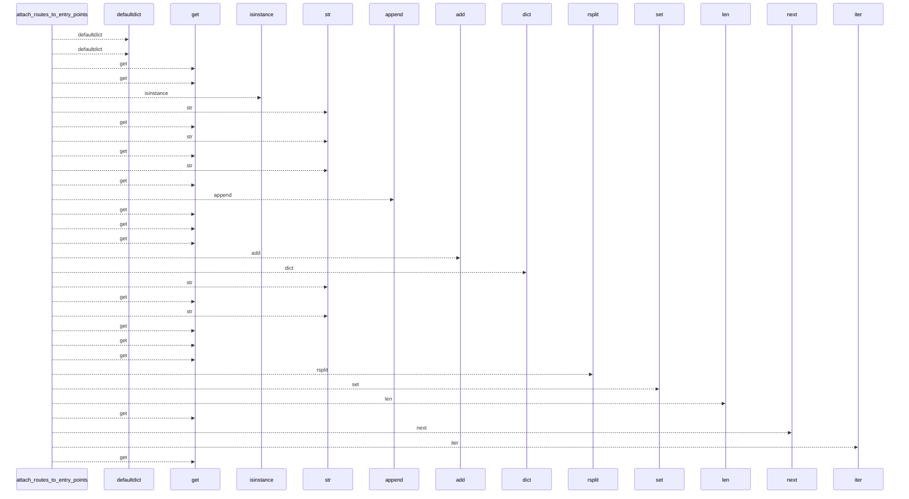
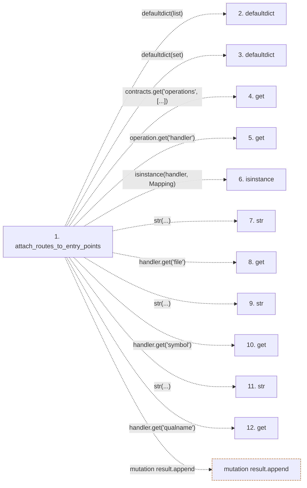

# attach_routes_to_entry_points

**Entry point:** `attach_routes_to_entry_points` (`api`)
**Source:** [api_contracts](../modules/api_contracts.md)
**Modules touched:** [api_contracts](../modules/api_contracts.md)

## Call sequence

<!-- Auto-generated from static call edges. Dashed arrows are external or unresolved calls. Reviewed runtime conditions and side effects belong in Behavior. -->

> Call sequence diagram shows 30 of 34 interactions; 4 omitted to keep the visualization within the 30-interaction and generated-diagram limits.

## Data flow

<!-- Auto-generated static analysis. Treat values and boundaries as best-effort hints, not runtime proof. -->

### Step data

| Step | Inputs | Reads | Writes | Returns |
|---|---|---|---|---|
| `attach_routes_to_entry_points` | `entry_points: Sequence[Mapping[str, Any]]`, `contracts: Mapping[str, Any]` | `Mapping` | `item[...]` | `result` |
| `defaultdict` | - | - | - | - |
| `defaultdict` | - | - | - | - |
| `get` | - | - | - | - |
| `get` | - | - | - | - |
| `isinstance` | - | - | - | - |
| `str` | - | - | - | - |
| `get` | - | - | - | - |
| `str` | - | - | - | - |
| `get` | - | - | - | - |
| `str` | - | - | - | - |
| `get` | - | - | - | - |

### Call data

| From | To | Line | Call |
|---|---|---:|---|
| attach_routes_to_entry_points | defaultdict | 1836 | `defaultdict(list)` |
| attach_routes_to_entry_points | defaultdict | 1837 | `defaultdict(set)` |
| attach_routes_to_entry_points | get | 1838 | `contracts.get('operations', [...])` |
| attach_routes_to_entry_points | get | 1839 | `operation.get('handler')` |
| attach_routes_to_entry_points | isinstance | 1840 | `isinstance(handler, Mapping)` |
| attach_routes_to_entry_points | str | 1842 | `str(...)` |
| attach_routes_to_entry_points | get | 1842 | `handler.get('file')` |
| attach_routes_to_entry_points | str | 1843 | `str(...)` |
| attach_routes_to_entry_points | get | 1843 | `handler.get('symbol')` |
| attach_routes_to_entry_points | str | 1844 | `str(...)` |
| attach_routes_to_entry_points | get | 1844 | `handler.get('qualname')` |

### Boundary effects

| Kind | Target | Step | Line |
|---|---|---|---:|
| mutation | `result.append` | `attach_routes_to_entry_points` | 1867 |

### Static analysis gaps

| Kind | Step | Target | Line |
|---|---|---|---:|
| external_call | `attach_routes_to_entry_points` | `defaultdict` | 1836 |
| external_call | `attach_routes_to_entry_points` | `defaultdict` | 1837 |
| unresolved_call | `attach_routes_to_entry_points` | `contracts.get` | 1838 |
| unresolved_call | `attach_routes_to_entry_points` | `operation.get` | 1839 |
| unresolved_call | `attach_routes_to_entry_points` | `isinstance` | 1840 |
| unresolved_call | `attach_routes_to_entry_points` | `handler.get` | 1842 |
| unresolved_call | `attach_routes_to_entry_points` | `handler.get` | 1843 |
| unresolved_call | `attach_routes_to_entry_points` | `handler.get` | 1844 |
| step_limit | `attach_routes_to_entry_points` | `first 12 steps` | 0 |

## Behavior

This flow starts at `attach_routes_to_entry_points` and is classified as `api`. The generated call and data-flow sections are bounded static projections; runtime conditions and side effects require source-level confirmation.
