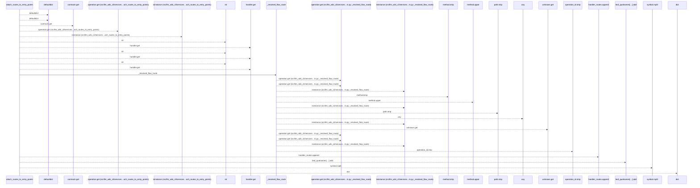
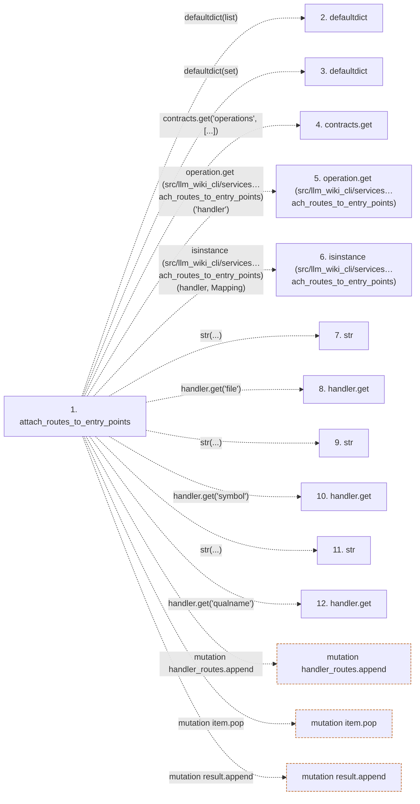

# attach_routes_to_entry_points

**Entry point:** `attach_routes_to_entry_points` (`api`)
**Source:** [api_contracts](../modules/api_contracts.md)
**Modules touched:** [api_contracts](../modules/api_contracts.md)

## Call sequence

<!-- Auto-generated from static call edges. Dashed arrows are external or unresolved calls. Reviewed runtime conditions and side effects belong in Behavior. -->

> Call sequence diagram shows 30 of 46 interactions; 16 omitted to keep the visualization within the 30-interaction and generated-diagram limits.

## Data flow

<!-- Auto-generated static analysis. Treat values and boundaries as best-effort hints, not runtime proof. -->

### Step data

| Step | Inputs | Reads | Writes | Returns |
|---|---|---|---|---|
| `attach_routes_to_entry_points` | `entry_points: Sequence[Mapping[str, Any]]`, `contracts: Mapping[str, Any]` | `Mapping` | `item[...]` | `result` |
| `defaultdict` | - | - | - | - |
| `defaultdict` | - | - | - | - |
| `contracts.get` | - | - | - | - |
| `operation.get (src/llm_wiki_cli/services…ach_routes_to_entry_points)` | - | - | - | - |
| `isinstance (src/llm_wiki_cli/services…ach_routes_to_entry_points)` | - | - | - | - |
| `str` | - | - | - | - |
| `handler.get` | - | - | - | - |
| `str` | - | - | - | - |
| `handler.get` | - | - | - | - |
| `str` | - | - | - | - |
| `handler.get` | - | - | - | - |

### Call data

| From | To | Line | Call |
|---|---|---:|---|
| attach_routes_to_entry_points | defaultdict | 1888 | `defaultdict(list)` |
| attach_routes_to_entry_points | defaultdict | 1889 | `defaultdict(set)` |
| attach_routes_to_entry_points | contracts.get | 1890 | `contracts.get('operations', [...])` |
| attach_routes_to_entry_points | operation.get (src/llm_wiki_cli/services…ach_routes_to_entry_points) | 1891 | `operation.get('handler')` |
| attach_routes_to_entry_points | isinstance (src/llm_wiki_cli/services…ach_routes_to_entry_points) | 1892 | `isinstance(handler, Mapping)` |
| attach_routes_to_entry_points | str | 1894 | `str(...)` |
| attach_routes_to_entry_points | handler.get | 1894 | `handler.get('file')` |
| attach_routes_to_entry_points | str | 1895 | `str(...)` |
| attach_routes_to_entry_points | handler.get | 1895 | `handler.get('symbol')` |
| attach_routes_to_entry_points | str | 1896 | `str(...)` |
| attach_routes_to_entry_points | handler.get | 1896 | `handler.get('qualname')` |

### Boundary effects

| Kind | Target | Step | Line |
|---|---|---|---:|
| mutation | `handler_routes.append` | `attach_routes_to_entry_points` | 1902 |
| mutation | `item.pop` | `attach_routes_to_entry_points` | 1915 |
| mutation | `result.append` | `attach_routes_to_entry_points` | 1920 |

### Static analysis gaps

| Kind | Step | Target | Line |
|---|---|---|---:|
| external_call | `attach_routes_to_entry_points` | `defaultdict` | 1888 |
| external_call | `attach_routes_to_entry_points` | `defaultdict` | 1889 |
| unresolved_call | `attach_routes_to_entry_points` | `contracts.get` | 1890 |
| unresolved_call | `attach_routes_to_entry_points` | `operation.get` | 1891 |
| external_call | `attach_routes_to_entry_points` | `isinstance` | 1892 |
| unresolved_call | `attach_routes_to_entry_points` | `handler.get` | 1894 |
| unresolved_call | `attach_routes_to_entry_points` | `handler.get` | 1895 |
| unresolved_call | `attach_routes_to_entry_points` | `handler.get` | 1896 |
| step_limit | `attach_routes_to_entry_points` | `first 12 steps` | 0 |

## Behavior

This flow starts at `attach_routes_to_entry_points` and is classified as `api`. The generated call and data-flow sections are bounded static projections; runtime conditions and side effects require source-level confirmation.
