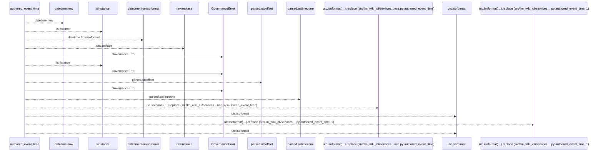
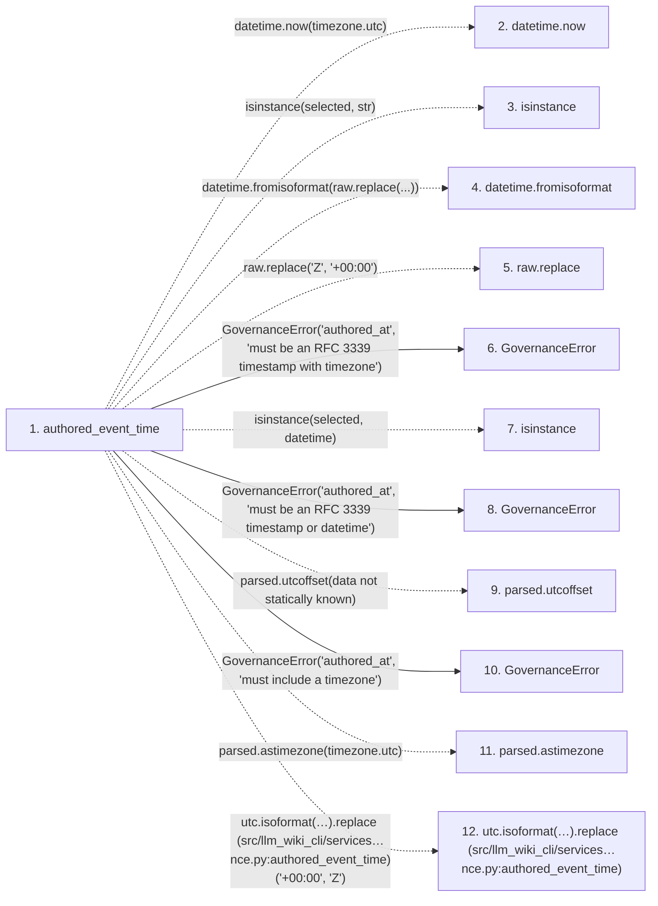

# authored_event_time

**Entry point:** `authored_event_time` (`api`)
**Source:** [knowledge_governance](../modules/knowledge_governance.md)
**Modules touched:** [knowledge_governance](../modules/knowledge_governance.md)

## Call sequence

<!-- Auto-generated from static call edges. Dashed arrows are external or unresolved calls. Reviewed runtime conditions and side effects belong in Behavior. -->

## Data flow

<!-- Auto-generated static analysis. Treat values and boundaries as best-effort hints, not runtime proof. -->

### Step data

| Step | Inputs | Reads | Writes | Returns |
|---|---|---|---|---|
| `authored_event_time` | `value: object` | `timezone`, `datetime`, `timezone` | - | `...`, `...` |
| `datetime.now` | - | - | - | - |
| `isinstance` | - | - | - | - |
| `datetime.fromisoformat` | - | - | - | - |
| `raw.replace` | - | - | - | - |
| `GovernanceError` | - | - | - | - |
| `isinstance` | - | - | - | - |
| `GovernanceError` | - | - | - | - |
| `parsed.utcoffset` | - | - | - | - |
| `GovernanceError` | - | - | - | - |
| `parsed.astimezone` | - | - | - | - |
| `utc.isoformat(…).replace (src/llm_wiki_cli/services…nce.py:authored_event_time)` | - | - | - | - |

### Call data

| From | To | Line | Call |
|---|---|---:|---|
| authored_event_time | datetime.now | 1414 | `datetime.now(timezone.utc)` |
| authored_event_time | isinstance | 1415 | `isinstance(selected, str)` |
| authored_event_time | datetime.fromisoformat | 1418 | `datetime.fromisoformat(raw.replace(...))` |
| authored_event_time | raw.replace | 1418 | `raw.replace('Z', '+00:00')` |
| authored_event_time | GovernanceError | 1420 | `GovernanceError('authored_at', 'must be an RFC 3339 timestamp with timezone')` |
| authored_event_time | isinstance | 1424 | `isinstance(selected, datetime)` |
| authored_event_time | GovernanceError | 1427 | `GovernanceError('authored_at', 'must be an RFC 3339 timestamp or datetime')` |
| authored_event_time | parsed.utcoffset | 1431 | `parsed.utcoffset(data not statically known)` |
| authored_event_time | GovernanceError | 1432 | `GovernanceError('authored_at', 'must include a timezone')` |
| authored_event_time | parsed.astimezone | 1433 | `parsed.astimezone(timezone.utc)` |
| authored_event_time | utc.isoformat(…).replace (src/llm_wiki_cli/services…nce.py:authored_event_time) | 1435 | `utc.isoformat(timespec='microseconds').replace('+00:00', 'Z')` |

### Boundary effects

*No boundary effects detected.*

### Static analysis gaps

| Kind | Step | Target | Line |
|---|---|---|---:|
| external_call | `authored_event_time` | `datetime.now` | 1414 |
| external_call | `authored_event_time` | `isinstance` | 1415 |
| external_call | `authored_event_time` | `datetime.fromisoformat` | 1418 |
| unresolved_call | `authored_event_time` | `raw.replace` | 1418 |
| external_call | `authored_event_time` | `isinstance` | 1424 |
| unresolved_call | `authored_event_time` | `parsed.utcoffset` | 1431 |
| unresolved_call | `authored_event_time` | `parsed.astimezone` | 1433 |
| unresolved_call | `authored_event_time` | `utc.isoformat(timespec='microseconds').replace` | 1435 |
| step_limit | `authored_event_time` | `first 12 steps` | 0 |

## Behavior

This flow starts at `authored_event_time` and is classified as `api`. The generated call and data-flow sections are bounded static projections; runtime conditions and side effects require source-level confirmation.
