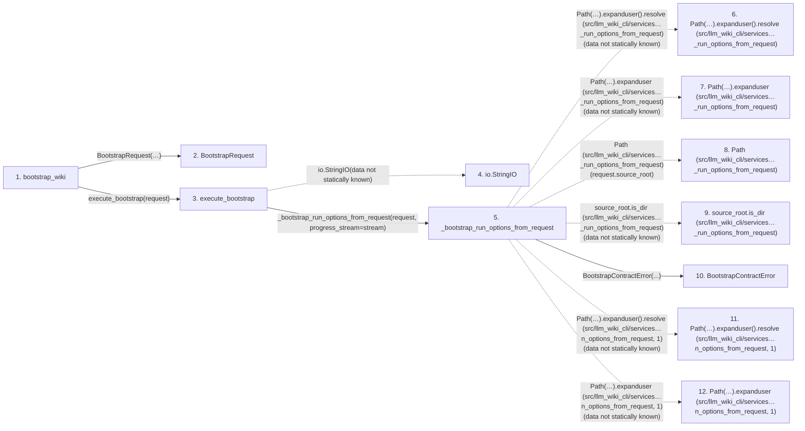

# bootstrap_wiki

**Entry point:** `bootstrap_wiki` (`api`)
**Source:** [api](../modules/api.md)
**Modules touched:** [api](../modules/api.md), [api_contracts](../modules/api_contracts.md), [bootstrap_runtime](../modules/bootstrap_runtime.md), [bootstrap_service](../modules/bootstrap_service.md), and 30 more

**Complete modules touched:**

- [api](../modules/api.md)
- [api_contracts](../modules/api_contracts.md)
- [bootstrap_runtime](../modules/bootstrap_runtime.md)
- [bootstrap_service](../modules/bootstrap_service.md)
- [common](../modules/common.md)
- [config](../modules/config.md)
- [data_flow](../modules/data_flow.md)
- [entrypoints](../modules/entrypoints.md)
- [extraction_service](../modules/extraction_service.md)
- [imports](../modules/imports.md)
- [infrastructure_inventory](../modules/infrastructure_inventory.md)
- [infrastructure_sync](../modules/infrastructure_sync.md)
- [io](../modules/io.md)
- [knowledge_envelope](../modules/knowledge_envelope.md)
- [knowledge_evidence](../modules/knowledge_evidence.md)
- [knowledge_governance](../modules/knowledge_governance.md)
- [knowledge_orchestration](../modules/knowledge_orchestration.md)
- [knowledge_reuse](../modules/knowledge_reuse.md)
- [markdown_sections](../modules/markdown_sections.md)
- [module_maps](../modules/module_maps.md)
- [paths](../modules/paths.md)
- [python_calls](../modules/python_calls.md)
- [python_imports](../modules/python_imports.md)
- [relationships](../modules/relationships.md)
- [services_dependencies](../modules/services_dependencies.md)
- [services_schema](../modules/services_schema.md)
- [source_selection](../modules/source_selection.md)
- [source_snapshot](../modules/source_snapshot.md)
- [sync_manifest](../modules/sync_manifest.md)
- [validation](../modules/validation.md)
- [wiki_lifecycle](../modules/wiki_lifecycle.md)
- [wiki_media](../modules/wiki_media.md)
- [wiki_surface](../modules/wiki_surface.md)
- [wiki_surface_index](../modules/wiki_surface_index.md)

## Call sequence

```mermaid
sequenceDiagram
    participant p0 as bootstrap_wiki
    participant p1 as BootstrapRequest
    participant p2 as execute_bootstrap
    participant p3 as io.StringIO
    participant p4 as _bootstrap_run_options_from_request
    participant p5 as Path(…).expanduser().resolve (src/llm_wiki_cli/services…_run_options_from_request)
    participant p6 as Path(…).expanduser (src/llm_wiki_cli/services…_run_options_from_request)
    participant p7 as Path (src/llm_wiki_cli/services…_run_options_from_request)
    participant p8 as source_root.is_dir (src/llm_wiki_cli/services…_run_options_from_request)
    participant p9 as BootstrapContractError
    participant p10 as Path(…).expanduser().resolve (src/llm_wiki_cli/services…n_options_from_request, 1)
    participant p11 as Path(…).expanduser (src/llm_wiki_cli/services…n_options_from_request, 1)
    participant p12 as BootstrapRequestError
    participant p13 as bool (src/llm_wiki_cli/services…_run_options_from_request)
    participant p14 as _BootstrapRunOptions
    participant p15 as str (src/llm_wiki_cli/services…_run_options_from_request)
    participant p16 as _execute_bootstrap_options
    participant p17 as _preflight_public_bootstrap
    participant p18 as _first_use_guidance
    participant p19 as classify_wiki_lifecycle
    participant p20 as Path (src/llm_wiki_cli/services…y:classify_wiki_lifecycle)
    participant p21 as manifest.exists
    participant p22 as manifest.is_symlink
    participant p23 as is_pristine_wiki_target
    participant p24 as root.is_dir
    participant p25 as index.is_file
    participant p26 as index.is_symlink
    p0->>p1: BootstrapRequest
    p0->>p2: execute_bootstrap
    p2-->>p3: io.StringIO
    p2->>p4: _bootstrap_run_options_from_request
    p4-->>p5: Path(…).expanduser().resolve (src/llm_wiki_cli/services…_run_options_from_request)
    p4-->>p6: Path(…).expanduser (src/llm_wiki_cli/services…_run_options_from_request)
    p4-->>p7: Path (src/llm_wiki_cli/services…_run_options_from_request)
    p4-->>p8: source_root.is_dir (src/llm_wiki_cli/services…_run_options_from_request)
    p4->>p9: BootstrapContractError
    p4-->>p10: Path(…).expanduser().resolve (src/llm_wiki_cli/services…n_options_from_request, 1)
    p4-->>p11: Path(…).expanduser (src/llm_wiki_cli/services…n_options_from_request, 1)
    p4-->>p7: Path (src/llm_wiki_cli/services…_run_options_from_request)
    p4->>p12: BootstrapRequestError
    p4->>p12: BootstrapRequestError
    p4-->>p13: bool (src/llm_wiki_cli/services…_run_options_from_request)
    p4->>p14: _BootstrapRunOptions
    p4-->>p15: str (src/llm_wiki_cli/services…_run_options_from_request)
    p4-->>p15: str (src/llm_wiki_cli/services…_run_options_from_request)
    p2->>p16: _execute_bootstrap_options
    p16->>p17: _preflight_public_bootstrap
    p17->>p12: BootstrapRequestError
    p17->>p18: _first_use_guidance
    p18->>p19: classify_wiki_lifecycle
    p19-->>p20: Path (src/llm_wiki_cli/services…y:classify_wiki_lifecycle)
    p19-->>p21: manifest.exists
    p19-->>p22: manifest.is_symlink
    p19->>p23: is_pristine_wiki_target
    p19-->>p24: root.is_dir
    p19-->>p25: index.is_file
    p19-->>p26: index.is_symlink
```

<!-- Auto-generated from static call edges. Dashed arrows are external or unresolved calls. Reviewed runtime conditions and side effects belong in Behavior. -->

> Call sequence diagram shows 30 of 2064 interactions; 2034 omitted to keep the visualization within the 30-interaction and generated-diagram limits.

> Trace truncated at the depth limit; deeper calls are omitted.

## Data flow

<!-- Auto-generated static analysis. Treat values and boundaries as best-effort hints, not runtime proof. -->

### Step data

| Step | Inputs | Reads | Writes | Returns |
|---|---|---|---|---|
| `bootstrap_wiki` | `source_root: str`, `wiki_root: str`, `depth: str`, `skip_workflows: bool`, `skip_flows: bool`, `skip_data_flow: bool`, `skip_dependencies: bool`, `api_contracts: bool` | `BootstrapRequestError`, `BootstrapContractError`, `BootstrapServiceError` | - | `bootstrap_cmd.execute_bootstrap(...)` |
| `BootstrapRequest` | - | - | - | - |
| `execute_bootstrap` | `request: BootstrapRequest`, `progress_stream: TextIO \| None` | - | - | `_execute_bootstrap_options(...)` |
| `io.StringIO` | - | - | - | - |
| `_bootstrap_run_options_from_request` | `request: BootstrapRequest`, `progress_stream: TextIO` | - | - | `_BootstrapRunOptions(...)` |
| `Path(…).expanduser().resolve (src/llm_wiki_cli/services…_run_options_from_request)` | - | - | - | - |
| `Path(…).expanduser (src/llm_wiki_cli/services…_run_options_from_request)` | - | - | - | - |
| `Path (src/llm_wiki_cli/services…_run_options_from_request)` | - | - | - | - |
| `source_root.is_dir (src/llm_wiki_cli/services…_run_options_from_request)` | - | - | - | - |
| `BootstrapContractError` | - | - | - | - |
| `Path(…).expanduser().resolve (src/llm_wiki_cli/services…n_options_from_request, 1)` | - | - | - | - |
| `Path(…).expanduser (src/llm_wiki_cli/services…n_options_from_request, 1)` | - | - | - | - |

### Call data

| From | To | Line | Call |
|---|---|---:|---|
| bootstrap_wiki | BootstrapRequest | 660 | `BootstrapRequest(source_root=source_root, wiki_root=wiki_root, depth=depth, skip_workflows=skip_workflows, skip_flows=skip_flows, skip_data_flow=skip_data_flow, skip_dependencies=skip_dependencies, api_contracts=api_contracts, openapi_file=openapi_file, dependency_graph_detail=dependency_graph_detail, overwrite=overwrite, source_adapter=True, helper_cache_dir=helper_cache_dir, include_tests=include_tests, trust_source_plugins=trust_source_plugins, source_selection=source_selection)` |
| bootstrap_wiki | execute_bootstrap | 679 | `bootstrap_cmd.execute_bootstrap(request)` |
| execute_bootstrap | io.StringIO | 6267 | `io.StringIO(data not statically known)` |
| execute_bootstrap | _bootstrap_run_options_from_request | 6268 | `_bootstrap_run_options_from_request(request, progress_stream=stream)` |
| _bootstrap_run_options_from_request | Path(…).expanduser().resolve (src/llm_wiki_cli/services…_run_options_from_request) | 4455 | `Path(request.source_root).expanduser().resolve(data not statically known)` |
| _bootstrap_run_options_from_request | Path(…).expanduser (src/llm_wiki_cli/services…_run_options_from_request) | 4455 | `Path(request.source_root).expanduser(data not statically known)` |
| _bootstrap_run_options_from_request | Path (src/llm_wiki_cli/services…_run_options_from_request) | 4455 | `Path(request.source_root)` |
| _bootstrap_run_options_from_request | source_root.is_dir (src/llm_wiki_cli/services…_run_options_from_request) | 4456 | `source_root.is_dir(data not statically known)` |
| _bootstrap_run_options_from_request | BootstrapContractError | 4457 | `BootstrapContractError(...)` |
| _bootstrap_run_options_from_request | Path(…).expanduser().resolve (src/llm_wiki_cli/services…n_options_from_request, 1) | 4460 | `Path(request.wiki_root).expanduser().resolve(data not statically known)` |
| _bootstrap_run_options_from_request | Path(…).expanduser (src/llm_wiki_cli/services…n_options_from_request, 1) | 4460 | `Path(request.wiki_root).expanduser(data not statically known)` |

### Boundary effects

*No boundary effects detected.*

### Static analysis gaps

| Kind | Step | Target | Line |
|---|---|---|---:|
| external_call | `execute_bootstrap` | `io.StringIO` | 6267 |
| unresolved_call | `_bootstrap_run_options_from_request` | `Path(request.source_root).expanduser().resolve` | 4455 |
| unresolved_call | `_bootstrap_run_options_from_request` | `Path(request.source_root).expanduser` | 4455 |
| unresolved_call | `_bootstrap_run_options_from_request` | `source_root.is_dir` | 4456 |
| unresolved_call | `_bootstrap_run_options_from_request` | `Path(request.wiki_root).expanduser().resolve` | 4460 |
| unresolved_call | `_bootstrap_run_options_from_request` | `Path(request.wiki_root).expanduser` | 4460 |
| step_limit | `bootstrap_wiki` | `first 12 steps` | 0 |
| truncated_flow | `bootstrap_wiki` | `depth limit` | 0 |

## Behavior

Creates a frozen `BootstrapRequest` and executes the same deterministic
first-use generator as the CLI. The library boundary always enables source-
adapter behavior, so it writes within the wiki target without installing agent
instructions in the source project. Request errors become
`InvalidRequestError`; target or service-state failures become
`WorkspaceStateError`; success returns a typed `BootstrapResult`.
