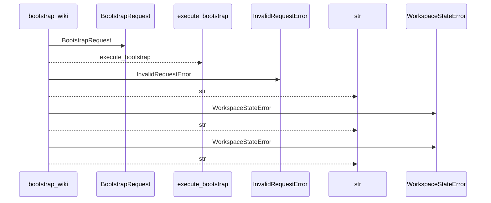
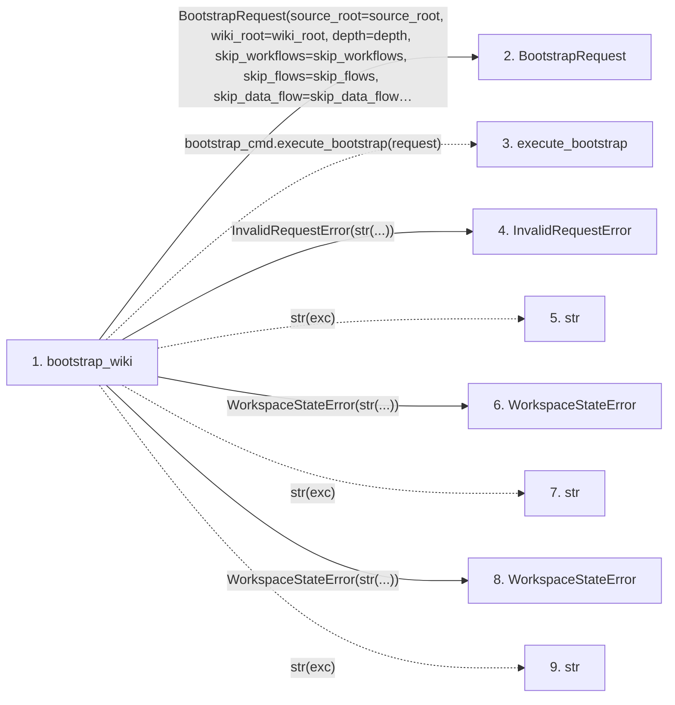

# bootstrap_wiki

**Entry point:** `bootstrap_wiki` (`api`)
**Source:** [api](../modules/api.md)
**Modules touched:** [api](../modules/api.md), [bootstrap_service](../modules/bootstrap_service.md)

## Call sequence

<!-- Auto-generated from static call edges. Dashed arrows are external or unresolved calls. Reviewed runtime conditions and side effects belong in Behavior. -->

## Data flow

<!-- Auto-generated static analysis. Treat values and boundaries as best-effort hints, not runtime proof. -->

### Step data

| Step | Inputs | Reads | Writes | Returns |
|---|---|---|---|---|
| `bootstrap_wiki` | `source_root: str`, `wiki_root: str`, `depth: str`, `skip_workflows: bool`, `skip_flows: bool`, `skip_data_flow: bool`, `skip_dependencies: bool`, `api_contracts: bool` | `BootstrapRequestError`, `BootstrapContractError`, `BootstrapServiceError` | - | `bootstrap_cmd.execute_bootstrap(...)` |
| `BootstrapRequest` | - | - | - | - |
| `execute_bootstrap` | - | - | - | - |
| `InvalidRequestError` | - | - | - | - |
| `str` | - | - | - | - |
| `WorkspaceStateError` | - | - | - | - |
| `str` | - | - | - | - |
| `WorkspaceStateError` | - | - | - | - |
| `str` | - | - | - | - |

### Call data

| From | To | Line | Call |
|---|---|---:|---|
| bootstrap_wiki | BootstrapRequest | 651 | `BootstrapRequest(source_root=source_root, wiki_root=wiki_root, depth=depth, skip_workflows=skip_workflows, skip_flows=skip_flows, skip_data_flow=skip_data_flow, skip_dependencies=skip_dependencies, api_contracts=api_contracts, openapi_file=openapi_file, dependency_graph_detail=dependency_graph_detail, overwrite=overwrite, source_adapter=True, helper_cache_dir=helper_cache_dir, include_tests=include_tests, trust_source_plugins=trust_source_plugins, source_selection=source_selection)` |
| bootstrap_wiki | execute_bootstrap | 670 | `bootstrap_cmd.execute_bootstrap(request)` |
| bootstrap_wiki | InvalidRequestError | 672 | `InvalidRequestError(str(...))` |
| bootstrap_wiki | str | 672 | `str(exc)` |
| bootstrap_wiki | WorkspaceStateError | 674 | `WorkspaceStateError(str(...))` |
| bootstrap_wiki | str | 674 | `str(exc)` |
| bootstrap_wiki | WorkspaceStateError | 676 | `WorkspaceStateError(str(...))` |
| bootstrap_wiki | str | 676 | `str(exc)` |

### Boundary effects

*No boundary effects detected.*

### Static analysis gaps

| Kind | Step | Target | Line |
|---|---|---|---:|
| external_call | `bootstrap_wiki` | `bootstrap_cmd.execute_bootstrap` | 670 |

## Behavior

Creates a frozen `BootstrapRequest` and executes the same deterministic
first-use generator as the CLI. The library boundary always enables source-
adapter behavior, so it writes within the wiki target without installing agent
instructions in the source project. Request errors become
`InvalidRequestError`; target or service-state failures become
`WorkspaceStateError`; success returns a typed `BootstrapResult`.
