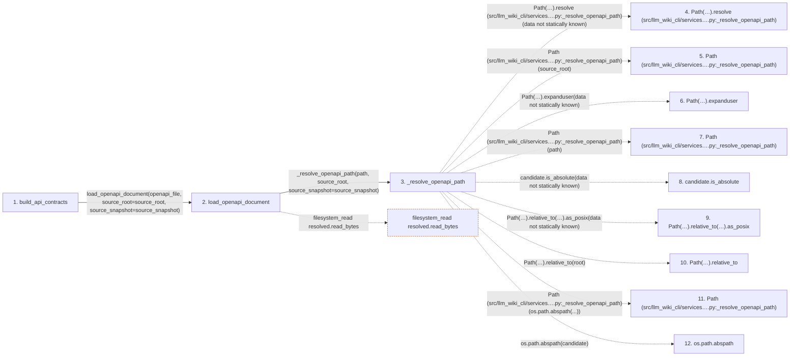

# build_api_contracts

**Entry point:** `build_api_contracts` (`api`)
**Source:** [api_contracts](../modules/api_contracts.md)
**Modules touched:** [api_contracts](../modules/api_contracts.md), [config](../modules/config.md), [imports](../modules/imports.md), [packages](../modules/packages.md), and 4 more

**Complete modules touched:**

- [api_contracts](../modules/api_contracts.md)
- [config](../modules/config.md)
- [imports](../modules/imports.md)
- [packages](../modules/packages.md)
- [paths](../modules/paths.md)
- [python_imports](../modules/python_imports.md)
- [source_selection](../modules/source_selection.md)
- [validation](../modules/validation.md)

## Call sequence

> Static overview in presentation order, not runtime execution order. Arrows retain captured callers; representative internal continuations and boundary examples precede repeated helper detail.

<!-- Auto-generated from static call edges. Dashed arrows are external or unresolved calls. Reviewed runtime conditions and side effects belong in Behavior. -->

```mermaid
sequenceDiagram
    participant p0 as build_api_contracts
    participant p1 as load_openapi_document
    participant p2 as build_static_api_contracts
    participant p3 as _reconcile_openapi
    participant p4 as _resolve_openapi_path
    participant p5 as _openapi_operations
    participant p6 as _operation_methods
    participant p7 as _declaration_nodes
    participant p8 as build_module_path_resolver
    participant p9 as _resolve_binding
    participant p10 as _parameter_contract
    participant p11 as _first_arg
    participant p12 as _schema_contract
    participant p13 as _display_value
    participant p14 as _canonical_imported_reference
    participant p15 as _kw_unknown
    participant p16 as ModulePathResolver.build
    participant p17 as _kw_value
    participant p18 as _dereference
    participant p19 as _import_bindings
    participant p20 as _display_call
    participant p21 as _openapi_parameter
    participant p22 as path_is_selected
    participant p23 as _path_contains_link_or_reparse
    participant p24 as _openapi_request_body
    participant p25 as _openapi_responses
    participant p26 as _selection_path
    participant p27 as path_is_link_or_reparse
    participant p28 as _record_value
    participant p29 as list (src/llm_wiki_cli/services…cts.py:_reconcile_openapi)
    participant p30 as resolved.suffix.lower
    p0->>p1: load_openapi_document
    p0->>p2: build_static_api_contracts
    p0->>p3: _reconcile_openapi
    p1->>p4: _resolve_openapi_path
    p3->>p5: _openapi_operations
    p2->>p6: _operation_methods
    p2->>p7: _declaration_nodes
    p2->>p8: build_module_path_resolver
    p2->>p9: _resolve_binding
    p3->>p10: _parameter_contract
    p2->>p11: _first_arg
    p3->>p12: _schema_contract
    p2->>p13: _display_value
    p2->>p14: _canonical_imported_reference
    p2->>p15: _kw_unknown
    p8->>p16: ModulePathResolver.build
    p6->>p17: _kw_value
    p5->>p18: _dereference
    p9->>p19: _import_bindings
    p13->>p20: _display_call
    p5->>p21: _openapi_parameter
    p4->>p22: path_is_selected
    p4->>p23: _path_contains_link_or_reparse
    p5->>p24: _openapi_request_body
    p5->>p25: _openapi_responses
    p22->>p26: _selection_path
    p23->>p27: path_is_link_or_reparse
    p17->>p28: _record_value
    p3-->>p29: list (src/llm_wiki_cli/services…cts.py:_reconcile_openapi)(static.get(...))
    p1-->>p30: resolved.suffix.lower
```

> Call sequence diagram shows 30 of 962 interactions; 932 omitted to keep the visualization within the 30-interaction and generated-diagram limits, with uncertain identities omitted rather than inferred.

> Captured boundary calls: external 1 of 353 (352 omitted); unresolved 1 of 421 (420 omitted). These counts cover the captured static trace.

Omitted captured detail, grouped by actual caller occurrence and target module:

| Caller | Parent step | Target module | Kind | Omitted interactions |
| --- | --- | --- | --- | --- |
| `src/llm_wiki_cli/services/api_contracts.py:_resolve_openapi_path` | 3 | - | unresolved | 10 |
| `src/llm_wiki_cli/services/api_contracts.py:_resolve_openapi_path` | 3 | - | external | 4 |
| `src/llm_wiki_cli/services/api_contracts.py:_resolve_openapi_path` | 3 | [src/llm_wiki_cli/services/api_contracts.py](../modules/api_contracts.md) | internal | 8 |
| `src/llm_wiki_cli/services/source_selection.py:_selection_path` | 21 | [src/llm_wiki_cli/services/source_selection.py](../modules/source_selection.md) | internal | 4 |
| `src/llm_wiki_cli/services/source_selection.py:_require_selection_path` | 22 | [src/llm_wiki_cli/services/validation.py](../modules/validation.md) | internal | 1 |
| `src/llm_wiki_cli/services/source_selection.py:_require_selection_path` | 22 | [src/llm_wiki_cli/services/source_selection.py](../modules/source_selection.md) | internal | 7 |
| `src/llm_wiki_cli/services/source_selection.py:_selection_path` | 21 | - | external | 2 |
| `src/llm_wiki_cli/services/source_selection.py:_selection_path` | 21 | - | unresolved | 1 |
> Omission summary shows 8 of 170 groups; 162 further groups are not expanded here. Counts above include all omitted interactions.
> Detailed flow queries retain their own coverage and limits; omitted paths may execute at runtime.

> Trace truncated at the depth limit; deeper calls are omitted.

## Data flow

<!-- Auto-generated static analysis. Treat values and boundaries as best-effort hints, not runtime proof. -->

### Analysis coverage

**Effect analysis partially available.** Flow assembly and source effect analysis are separate; empty observations do not prove an empty handler body.

Source steps: 189; effect analysis evaluated: 138, partial: 15, unavailable: 36. Counts include steps omitted from the displayed trace.

Collector observations for 153 source steps with known totals: observed: 1096, emitted: 1056, omitted: 40. Unavailable totals are excluded.

- Callable record unavailable for one or more source steps; those steps have no represented callable body.
- Effect collector omitted observations before flow assembly; displayed effects are partial.
- Effect collector totals unavailable; observed counts cover captured records only.

| Step | Callable record | Effect analysis | Collector totals | Observed | Emitted | Omitted |
|---|---|---|---|---:|---:|---:|
| `build_api_contracts` | `available` | `evaluated` | `available` | `6` | `6` | `0` |
| `load_openapi_document` | `available` | `evaluated` | `available` | `11` | `11` | `0` |
| `_resolve_openapi_path` | `available` | `evaluated` | `available` | `5` | `5` | `0` |
| `Path(…).resolve (src/llm_wiki_cli/services….py:_resolve_openapi_path)` | `not_applicable` | `not_applicable` | `not_applicable` | — | — | — |
| `Path (src/llm_wiki_cli/services….py:_resolve_openapi_path)` | `not_applicable` | `not_applicable` | `not_applicable` | — | — | — |
| `Path(…).expanduser` | `not_applicable` | `not_applicable` | `not_applicable` | — | — | — |
| `Path (src/llm_wiki_cli/services….py:_resolve_openapi_path)` | `not_applicable` | `not_applicable` | `not_applicable` | — | — | — |
| `candidate.is_absolute` | `not_applicable` | `not_applicable` | `not_applicable` | — | — | — |
| `Path(…).relative_to(…).as_posix` | `not_applicable` | `not_applicable` | `not_applicable` | — | — | — |
| `Path(…).relative_to` | `not_applicable` | `not_applicable` | `not_applicable` | — | — | — |
| `Path (src/llm_wiki_cli/services….py:_resolve_openapi_path)` | `not_applicable` | `not_applicable` | `not_applicable` | — | — | — |
| `os.path.abspath` | `not_applicable` | `not_applicable` | `not_applicable` | — | — | — |

```mermaid
flowchart LR
    s1["1. build_api_contracts"]
    s2["2. load_openapi_document"]
    s3["3. _resolve_openapi_path"]
    s4["4. Path(…).resolve (src/llm_wiki_cli/services….py:_resolve_openapi_path)"]
    s5["5. Path (src/llm_wiki_cli/services….py:_resolve_openapi_path)"]
    s6["6. Path(…).expanduser"]
    s7["7. Path (src/llm_wiki_cli/services….py:_resolve_openapi_path)"]
    s8["8. candidate.is_absolute"]
    s9["9. Path(…).relative_to(…).as_posix"]
    s10["10. Path(…).relative_to"]
    s11["11. Path (src/llm_wiki_cli/services….py:_resolve_openapi_path)"]
    s12["12. os.path.abspath"]
    s1 -->|"load_openapi_document(openapi_file, source_root=source_root, source_snapshot=source_snapshot)"| s2
    s2 -->|"_resolve_openapi_path(path, source_root, source_snapshot=source_snapshot)"| s3
    s3 -. "Path(…).resolve (src/llm_wiki_cli/services….py:_resolve_openapi_path)(data not statically known)" .-> s4
    s3 -. "Path (src/llm_wiki_cli/services….py:_resolve_openapi_path)(source_root)" .-> s5
    s3 -. "Path(…).expanduser(data not statically known)" .-> s6
    s3 -. "Path (src/llm_wiki_cli/services….py:_resolve_openapi_path)(path)" .-> s7
    s3 -. "candidate.is_absolute(data not statically known)" .-> s8
    s3 -. "Path(…).relative_to(…).as_posix(data not statically known)" .-> s9
    s3 -. "Path(…).relative_to(root)" .-> s10
    s3 -. "Path (src/llm_wiki_cli/services….py:_resolve_openapi_path)(os.path.abspath(...))" .-> s11
    s3 -. "os.path.abspath(candidate)" .-> s12
    b0["filesystem_read resolved.read_bytes"]
    s2 -. "filesystem_read resolved.read_bytes" .-> b0
    click s1 "../modules/api_contracts.md"
    click s2 "../modules/api_contracts.md"
    click s3 "../modules/api_contracts.md"
    classDef boundary stroke:#b45309,stroke-dasharray: 4 2
    class b0 boundary
```

### Step data

| Step | Inputs | Reads | Writes | Returns |
|---|---|---|---|---|
| `build_api_contracts` | `inventory: Mapping[str, Mapping[str, Any]]`, `openapi_file: str \| Path \| None`, `source_root: str \| Path`, `source_snapshot: SourceSnapshot \| None` | - | - | `static`, `_reconcile_openapi(...)` |
| `load_openapi_document` | `path: str \| Path`, `source_root: str \| Path`, `source_snapshot: SourceSnapshot \| None` | `_OPENAPI_INPUT_LIMIT`, `json`, `json`, `yaml`, `Mapping`, `Mapping` | - | `{...}` |
| `_resolve_openapi_path` | `path: str \| Path`, `source_root: str \| Path`, `source_snapshot: SourceSnapshot \| None` | `SourceSelectionError` | - | `(...)` |
| `Path(…).resolve (src/llm_wiki_cli/services….py:_resolve_openapi_path)` | - | - | - | - |
| `Path (src/llm_wiki_cli/services….py:_resolve_openapi_path)` | - | - | - | - |
| `Path(…).expanduser` | - | - | - | - |
| `Path (src/llm_wiki_cli/services….py:_resolve_openapi_path)` | - | - | - | - |
| `candidate.is_absolute` | - | - | - | - |
| `Path(…).relative_to(…).as_posix` | - | - | - | - |
| `Path(…).relative_to` | - | - | - | - |
| `Path (src/llm_wiki_cli/services….py:_resolve_openapi_path)` | - | - | - | - |
| `os.path.abspath` | - | - | - | - |

### Call data

| From | To | Line | Call |
|---|---|---:|---|
| build_api_contracts | load_openapi_document | 1854 | `load_openapi_document(openapi_file, source_root=source_root, source_snapshot=source_snapshot)` |
| load_openapi_document | _resolve_openapi_path | 1286 | `_resolve_openapi_path(path, source_root, source_snapshot=source_snapshot)` |
| _resolve_openapi_path | Path(…).resolve (src/llm_wiki_cli/services….py:_resolve_openapi_path) | 1214 | `Path(source_root).resolve(data not statically known)` |
| _resolve_openapi_path | Path (src/llm_wiki_cli/services….py:_resolve_openapi_path) | 1214 | `Path(source_root)` |
| _resolve_openapi_path | Path(…).expanduser | 1215 | `Path(path).expanduser(data not statically known)` |
| _resolve_openapi_path | Path (src/llm_wiki_cli/services….py:_resolve_openapi_path) | 1215 | `Path(path)` |
| _resolve_openapi_path | candidate.is_absolute | 1216 | `candidate.is_absolute(data not statically known)` |
| _resolve_openapi_path | Path(…).relative_to(…).as_posix | 1219 | `Path(os.path.abspath(candidate)).relative_to(root).as_posix(data not statically known)` |
| _resolve_openapi_path | Path(…).relative_to | 1219 | `Path(os.path.abspath(candidate)).relative_to(root)` |
| _resolve_openapi_path | Path (src/llm_wiki_cli/services….py:_resolve_openapi_path) | 1219 | `Path(os.path.abspath(...))` |
| _resolve_openapi_path | os.path.abspath | 1219 | `os.path.abspath(candidate)` |

### Boundary effects

| Kind | Target | Step | Line |
|---|---|---|---:|
| filesystem_read | `resolved.read_bytes` | `load_openapi_document` | 1293 |

### Static analysis gaps

| Kind | Step | Target | Line |
|---|---|---|---:|
| unresolved_call | `_resolve_openapi_path` | `Path(source_root).resolve` | 1214 |
| unresolved_call | `_resolve_openapi_path` | `Path(path).expanduser` | 1215 |
| unresolved_call | `_resolve_openapi_path` | `candidate.is_absolute` | 1216 |
| unresolved_call | `_resolve_openapi_path` | `Path(os.path.abspath(candidate)).relative_to(root).as_posix` | 1219 |
| unresolved_call | `_resolve_openapi_path` | `Path(os.path.abspath(candidate)).relative_to` | 1219 |
| external_call | `_resolve_openapi_path` | `os.path.abspath` | 1219 |
| step_limit | `build_api_contracts` | `first 12 steps` | 0 |
| truncated_flow | `build_api_contracts` | `depth limit` | 0 |

## Behavior

This flow starts at `build_api_contracts` and is classified as `api`. The generated call and data-flow sections are bounded static projections; runtime conditions and side effects require source-level confirmation.

Global Python response aliases are normalized through matching captured module bindings. Local dependency imports cannot supply unrelated global model aliases; static output is not runtime validation.
