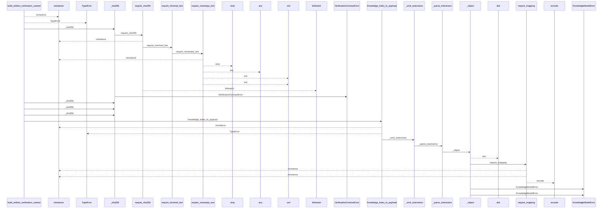
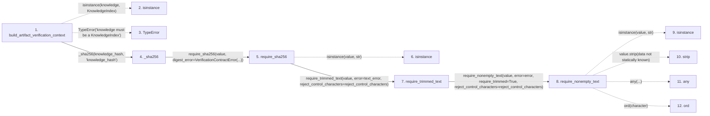

# build_artifact_verification_context

**Entry point:** `build_artifact_verification_context` (`api`)
**Source:** [verification_contracts](../modules/verification_contracts.md)
**Modules touched:** [concept_identity](../modules/concept_identity.md), [knowledge_evidence](../modules/knowledge_evidence.md), [knowledge_governance](../modules/knowledge_governance.md), and 8 more

**Complete modules touched:**

- [concept_identity](../modules/concept_identity.md)
- [knowledge_evidence](../modules/knowledge_evidence.md)
- [knowledge_governance](../modules/knowledge_governance.md)
- [knowledge_graph](../modules/knowledge_graph.md)
- [knowledge_model](../modules/knowledge_model.md)
- [markdown_sections](../modules/markdown_sections.md)
- [section_ownership](../modules/section_ownership.md)
- [validation](../modules/validation.md)
- [verification_contracts](../modules/verification_contracts.md)
- [wiki_media](../modules/wiki_media.md)
- [wiki_surface](../modules/wiki_surface.md)

## Call sequence

<!-- Auto-generated from static call edges. Dashed arrows are external or unresolved calls. Reviewed runtime conditions and side effects belong in Behavior. -->

> Call sequence diagram shows 30 of 1089 interactions; 1059 omitted to keep the visualization within the 30-interaction and generated-diagram limits.

> Trace truncated at the depth limit; deeper calls are omitted.

## Data flow

<!-- Auto-generated static analysis. Treat values and boundaries as best-effort hints, not runtime proof. -->

### Step data

| Step | Inputs | Reads | Writes | Returns |
|---|---|---|---|---|
| `build_artifact_verification_context` | `knowledge: KnowledgeIndex`, `knowledge_hash: str`, `surface_index_hash: str`, `evaluated_envelope_hash: str`, `governance_hash: str \| None`, `scope_locator: str \| None`, `artifact_integrity: bool`, `artifact_diagnostics: Sequence[VerificationDiagnostic]` | `KnowledgeIndex`, `Mapping`, `Mapping` | `evidence[...]`, `evaluated_snapshot[...]` | `VerificationContext(...)` |
| `isinstance` | - | - | - | - |
| `TypeError` | - | - | - | - |
| `_sha256` | `value: object`, `field_name: str` | - | - | `require_sha256(...)` |
| `require_sha256` | `value: object`, `digest_error: Exception`, `text_error: Exception \| None`, `reject_control_characters: bool`, `allow_empty: bool` | - | - | `parsed`, `parsed` |
| `isinstance` | - | - | - | - |
| `require_trimmed_text` | `value: object`, `error: Exception`, `reject_control_characters: bool` | - | - | `require_nonempty_text(...)` |
| `require_nonempty_text` | `value: object`, `error: Exception`, `trim_error: Exception \| None`, `normalize: bool`, `require_trimmed: bool`, `reject_control_characters: bool`, `reject_delete_character: bool` | - | - | `parsed` |
| `isinstance` | - | - | - | - |
| `strip` | - | - | - | - |
| `any` | - | - | - | - |
| `ord` | - | - | - | - |

### Call data

| From | To | Line | Call |
|---|---|---:|---|
| build_artifact_verification_context | isinstance | 339 | `isinstance(knowledge, KnowledgeIndex)` |
| build_artifact_verification_context | TypeError | 340 | `TypeError('knowledge must be a KnowledgeIndex')` |
| build_artifact_verification_context | _sha256 | 341 | `_sha256(knowledge_hash, 'knowledge_hash')` |
| _sha256 | require_sha256 | 1425 | `require_sha256(value, digest_error=VerificationContractError(...))` |
| require_sha256 | isinstance | 1100 | `isinstance(value, str)` |
| require_sha256 | require_trimmed_text | 1104 | `require_trimmed_text(value, error=text_error, reject_control_characters=reject_control_characters)` |
| require_trimmed_text | require_nonempty_text | 658 | `require_nonempty_text(value, error=error, require_trimmed=True, reject_control_characters=reject_control_characters)` |
| require_nonempty_text | isinstance | 574 | `isinstance(value, str)` |
| require_nonempty_text | strip | 576 | `value.strip(data not statically known)` |
| require_nonempty_text | any | 582 | `any(...)` |
| require_nonempty_text | ord | 583 | `ord(character)` |

### Boundary effects

*No boundary effects detected.*

### Static analysis gaps

| Kind | Step | Target | Line |
|---|---|---|---:|
| unresolved_call | `build_artifact_verification_context` | `isinstance` | 339 |
| unresolved_call | `build_artifact_verification_context` | `TypeError` | 340 |
| unresolved_call | `require_sha256` | `isinstance` | 1100 |
| unresolved_call | `require_nonempty_text` | `isinstance` | 574 |
| unresolved_call | `require_nonempty_text` | `value.strip` | 576 |
| unresolved_call | `require_nonempty_text` | `any` | 582 |
| unresolved_call | `require_nonempty_text` | `ord` | 583 |
| step_limit | `build_artifact_verification_context` | `first 12 steps` | 0 |
| truncated_flow | `build_artifact_verification_context` | `depth limit` | 0 |

## Behavior

This flow starts at `build_artifact_verification_context` and is classified as `api`. The generated call and data-flow sections are bounded static projections; runtime conditions and side effects require source-level confirmation.
