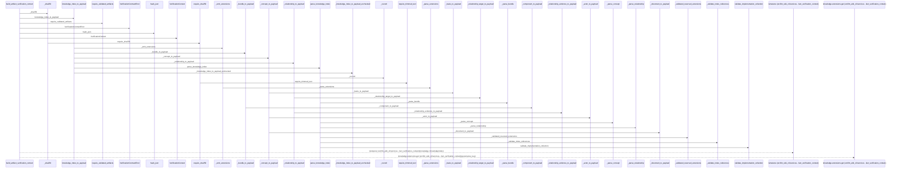
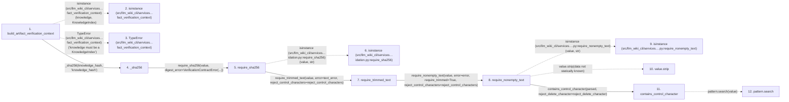

# build_artifact_verification_context

**Entry point:** `build_artifact_verification_context` (`api`)
**Source:** [verification_contracts](../modules/verification_contracts.md)
**Modules touched:** [analysis_compatibility](../modules/analysis_compatibility.md), [concept_identity](../modules/concept_identity.md), [implementation_evidence](../modules/implementation_evidence.md), and 18 more

**Complete modules touched:**

- [analysis_compatibility](../modules/analysis_compatibility.md)
- [concept_identity](../modules/concept_identity.md)
- [implementation_evidence](../modules/implementation_evidence.md)
- [knowledge_artifacts](../modules/knowledge_artifacts.md)
- [knowledge_evidence](../modules/knowledge_evidence.md)
- [knowledge_governance](../modules/knowledge_governance.md)
- [knowledge_graph](../modules/knowledge_graph.md)
- [knowledge_model](../modules/knowledge_model.md)
- [knowledge_reuse](../modules/knowledge_reuse.md)
- [knowledge_storage](../modules/knowledge_storage.md)
- [maintenance_evidence](../modules/maintenance_evidence.md)
- [maintenance_projection](../modules/maintenance_projection.md)
- [maintenance_shapes](../modules/maintenance_shapes.md)
- [maintenance_state](../modules/maintenance_state.md)
- [markdown_sections](../modules/markdown_sections.md)
- [python_implementation](../modules/python_implementation.md)
- [section_ownership](../modules/section_ownership.md)
- [validation](../modules/validation.md)
- [verification_contracts](../modules/verification_contracts.md)
- [wiki_media](../modules/wiki_media.md)
- [wiki_surface](../modules/wiki_surface.md)

## Call sequence

> Static overview in presentation order, not runtime execution order. Arrows retain captured callers; representative internal continuations and boundary examples precede repeated helper detail.

<!-- Auto-generated from static call edges. Dashed arrows are external or unresolved calls. Reviewed runtime conditions and side effects belong in Behavior. -->

```mermaid
sequenceDiagram
    participant p0 as build_artifact_verification_context
    participant p1 as _sha256
    participant p2 as knowledge_index_to_payload
    participant p3 as require_validated_artifacts
    participant p4 as VerificationContractError
    participant p5 as hash_json
    participant p6 as VerificationContext
    participant p7 as require_sha256
    participant p8 as _emit_extensions
    participant p9 as _bundle_to_payload
    participant p10 as _concept_to_payload
    participant p11 as _relationship_to_payload
    participant p12 as parse_knowledge_index
    participant p13 as _knowledge_index_to_payload_unchecked
    participant p14 as _record
    participant p15 as require_trimmed_text
    participant p16 as _parse_extensions
    participant p17 as _basis_to_payload
    participant p18 as _relationship_target_to_payload
    participant p19 as _parse_bundle
    participant p20 as _component_to_payload
    participant p21 as _relationship_evidence_to_payload
    participant p22 as _actor_to_payload
    participant p23 as _parse_concept
    participant p24 as _parse_relationship
    participant p25 as _document_to_payload
    participant p26 as _validated_reserved_extensions
    participant p27 as _validate_index_references
    participant p28 as validate_implementation_collection
    participant p29 as isinstance (src/llm_wiki_cli/services…fact_verification_context)
    participant p30 as knowledge.extensions.get (src/llm_wiki_cli/services…fact_verification_context)
    p0->>p1: _sha256
    p0->>p2: knowledge_index_to_payload
    p0->>p3: require_validated_artifacts
    p0->>p4: VerificationContractError
    p0->>p5: hash_json
    p0->>p6: VerificationContext
    p1->>p7: require_sha256
    p2->>p8: _emit_extensions
    p2->>p9: _bundle_to_payload
    p2->>p10: _concept_to_payload
    p2->>p11: _relationship_to_payload
    p2->>p12: parse_knowledge_index
    p2->>p13: _knowledge_index_to_payload_unchecked
    p12->>p14: _record
    p7->>p15: require_trimmed_text
    p8->>p16: _parse_extensions
    p10->>p17: _basis_to_payload
    p11->>p18: _relationship_target_to_payload
    p12->>p19: _parse_bundle
    p9->>p20: _component_to_payload
    p11->>p21: _relationship_evidence_to_payload
    p10->>p22: _actor_to_payload
    p12->>p23: _parse_concept
    p12->>p24: _parse_relationship
    p10->>p25: _document_to_payload
    p12->>p26: _validated_reserved_extensions
    p12->>p27: _validate_index_references
    p12->>p28: validate_implementation_collection
    p0-->>p29: isinstance (src/llm_wiki_cli/services…fact_verification_context)(knowledge, KnowledgeIndex)
    p0-->>p30: knowledge.extensions.get (src/llm_wiki_cli/services…fact_verification_context)(governance_key)
```

> Call sequence diagram shows 30 of 1298 interactions; 1268 omitted to keep the visualization within the 30-interaction and generated-diagram limits, with uncertain identities omitted rather than inferred.

> Captured boundary calls: external 1 of 341 (340 omitted); unresolved 1 of 193 (192 omitted). These counts cover the captured static trace.

Omitted captured detail, grouped by actual caller occurrence and target module:

| Caller | Parent step | Target module | Kind | Omitted interactions |
| --- | --- | --- | --- | --- |
| `src/llm_wiki_cli/services/verification_contracts.py:build_artifact_verification_context` | 1 | - | external | 8 |
| `src/llm_wiki_cli/services/validation.py:require_sha256` | 5 | - | external | 1 |
| `src/llm_wiki_cli/services/validation.py:require_trimmed_text` | 7 | [src/llm_wiki_cli/services/validation.py](../modules/validation.md) | internal | 1 |
| `src/llm_wiki_cli/services/validation.py:require_nonempty_text` | 8 | - | external | 1 |
| `src/llm_wiki_cli/services/validation.py:require_nonempty_text` | 8 | - | unresolved | 1 |
| `src/llm_wiki_cli/services/validation.py:require_nonempty_text` | 8 | [src/llm_wiki_cli/services/validation.py](../modules/validation.md) | internal | 1 |
| `src/llm_wiki_cli/services/validation.py:contains_control_character` | 11 | - | unresolved | 1 |
| `src/llm_wiki_cli/services/validation.py:require_sha256` | 5 | - | unresolved | 1 |
> Omission summary shows 8 of 302 groups; 294 further groups are not expanded here. Counts above include all omitted interactions.
> Detailed flow queries retain their own coverage and limits; omitted paths may execute at runtime.

> Trace truncated at the depth limit; deeper calls are omitted.

## Data flow

<!-- Auto-generated static analysis. Treat values and boundaries as best-effort hints, not runtime proof. -->

### Analysis coverage

**Effect analysis partially available.** Flow assembly and source effect analysis are separate; empty observations do not prove an empty handler body.

Source steps: 765; effect analysis evaluated: 492, partial: 12, unavailable: 261. Counts include steps omitted from the displayed trace.

Collector observations for 504 source steps with known totals: observed: 2385, emitted: 2244, omitted: 141. Unavailable totals are excluded.

- Callable record unavailable for one or more source steps; those steps have no represented callable body.
- Effect collector omitted observations before flow assembly; displayed effects are partial.
- Effect collector totals unavailable; observed counts cover captured records only.

| Step | Callable record | Effect analysis | Collector totals | Observed | Emitted | Omitted |
|---|---|---|---|---:|---:|---:|
| `build_artifact_verification_context` | `available` | `partial` | `available` | `15` | `14` | `1` |
| `isinstance (src/llm_wiki_cli/services…fact_verification_context)` | `not_applicable` | `not_applicable` | `not_applicable` | — | — | — |
| `TypeError (src/llm_wiki_cli/services…fact_verification_context)` | `not_applicable` | `not_applicable` | `not_applicable` | — | — | — |
| `_sha256` | `available` | `evaluated` | `available` | `3` | `3` | `0` |
| `require_sha256` | `available` | `evaluated` | `available` | `7` | `7` | `0` |
| `isinstance (src/llm_wiki_cli/services…idation.py:require_sha256)` | `not_applicable` | `not_applicable` | `not_applicable` | — | — | — |
| `require_trimmed_text` | `available` | `evaluated` | `available` | `4` | `4` | `0` |
| `require_nonempty_text` | `available` | `evaluated` | `available` | `8` | `8` | `0` |
| `isinstance (src/llm_wiki_cli/services….py:require_nonempty_text)` | `not_applicable` | `not_applicable` | `not_applicable` | — | — | — |
| `value.strip` | `not_applicable` | `not_applicable` | `not_applicable` | — | — | — |
| `contains_control_character` | `available` | `evaluated` | `available` | `5` | `5` | `0` |
| `pattern.search` | `not_applicable` | `not_applicable` | `not_applicable` | — | — | — |

```mermaid
flowchart LR
    s1["1. build_artifact_verification_context"]
    s2["2. isinstance (src/llm_wiki_cli/services…fact_verification_context)"]
    s3["3. TypeError (src/llm_wiki_cli/services…fact_verification_context)"]
    s4["4. _sha256"]
    s5["5. require_sha256"]
    s6["6. isinstance (src/llm_wiki_cli/services…idation.py:require_sha256)"]
    s7["7. require_trimmed_text"]
    s8["8. require_nonempty_text"]
    s9["9. isinstance (src/llm_wiki_cli/services….py:require_nonempty_text)"]
    s10["10. value.strip"]
    s11["11. contains_control_character"]
    s12["12. pattern.search"]
    s1 -. "isinstance (src/llm_wiki_cli/services…fact_verification_context)(knowledge, KnowledgeIndex)" .-> s2
    s1 -. "TypeError (src/llm_wiki_cli/services…fact_verification_context)('knowledge must be a KnowledgeIndex')" .-> s3
    s1 -->|"_sha256(knowledge_hash, 'knowledge_hash')"| s4
    s4 -->|"require_sha256(value, digest_error=VerificationContractError(...))"| s5
    s5 -. "isinstance (src/llm_wiki_cli/services…idation.py:require_sha256)(value, str)" .-> s6
    s5 -->|"require_trimmed_text(value, error=text_error, reject_control_characters=reject_control_characters)"| s7
    s7 -->|"require_nonempty_text(value, error=error, require_trimmed=True, reject_control_characters=reject_control_characters)"| s8
    s8 -. "isinstance (src/llm_wiki_cli/services….py:require_nonempty_text)(value, str)" .-> s9
    s8 -. "value.strip(data not statically known)" .-> s10
    s8 -->|"contains_control_character(parsed, reject_delete_character=reject_delete_character)"| s11
    s11 -. "pattern.search(value)" .-> s12
    click s1 "../modules/verification_contracts.md"
    click s4 "../modules/verification_contracts.md"
    click s5 "../modules/validation.md"
    click s7 "../modules/validation.md"
    click s8 "../modules/validation.md"
    click s11 "../modules/validation.md"
```

### Step data

| Step | Inputs | Reads | Writes | Returns |
|---|---|---|---|---|
| `build_artifact_verification_context` | `knowledge: KnowledgeIndex`, `knowledge_hash: str`, `surface_index_hash: str`, `evaluated_envelope_hash: str`, `governance_hash: str \| None`, `scope_locator: str \| None`, `artifact_integrity: bool`, `artifact_diagnostics: Sequence[VerificationDiagnostic]` | `KnowledgeIndex`, `Mapping`, `Mapping` | `evidence[...]`, `evaluated_snapshot[...]` | `VerificationContext(...)` |
| `isinstance (src/llm_wiki_cli/services…fact_verification_context)` | - | - | - | - |
| `TypeError (src/llm_wiki_cli/services…fact_verification_context)` | - | - | - | - |
| `_sha256` | `value: object`, `field_name: str` | - | - | `require_sha256(...)` |
| `require_sha256` | `value: object`, `digest_error: Exception`, `text_error: Exception \| None`, `reject_control_characters: bool`, `allow_empty: bool` | - | - | `parsed`, `parsed` |
| `isinstance (src/llm_wiki_cli/services…idation.py:require_sha256)` | - | - | - | - |
| `require_trimmed_text` | `value: object`, `error: Exception`, `reject_control_characters: bool` | - | - | `require_nonempty_text(...)` |
| `require_nonempty_text` | `value: object`, `error: Exception`, `trim_error: Exception \| None`, `normalize: bool`, `require_trimmed: bool`, `reject_control_characters: bool`, `reject_delete_character: bool` | - | - | `parsed` |
| `isinstance (src/llm_wiki_cli/services….py:require_nonempty_text)` | - | - | - | - |
| `value.strip` | - | - | - | - |
| `contains_control_character` | `value: str`, `reject_delete_character: bool` | `_ASCII_CONTROL_DELETE`, `_ASCII_CONTROL` | - | `...` |
| `pattern.search` | - | - | - | - |

### Call data

| From | To | Line | Call |
|---|---|---:|---|
| build_artifact_verification_context | isinstance (src/llm_wiki_cli/services…fact_verification_context) | 352 | `isinstance(knowledge, KnowledgeIndex)` |
| build_artifact_verification_context | TypeError (src/llm_wiki_cli/services…fact_verification_context) | 353 | `TypeError('knowledge must be a KnowledgeIndex')` |
| build_artifact_verification_context | _sha256 | 354 | `_sha256(knowledge_hash, 'knowledge_hash')` |
| _sha256 | require_sha256 | 1454 | `require_sha256(value, digest_error=VerificationContractError(...))` |
| require_sha256 | isinstance (src/llm_wiki_cli/services…idation.py:require_sha256) | 1146 | `isinstance(value, str)` |
| require_sha256 | require_trimmed_text | 1150 | `require_trimmed_text(value, error=text_error, reject_control_characters=reject_control_characters)` |
| require_trimmed_text | require_nonempty_text | 704 | `require_nonempty_text(value, error=error, require_trimmed=True, reject_control_characters=reject_control_characters)` |
| require_nonempty_text | isinstance (src/llm_wiki_cli/services….py:require_nonempty_text) | 631 | `isinstance(value, str)` |
| require_nonempty_text | value.strip | 633 | `value.strip(data not statically known)` |
| require_nonempty_text | contains_control_character | 639 | `contains_control_character(parsed, reject_delete_character=reject_delete_character)` |
| contains_control_character | pattern.search | 693 | `pattern.search(value)` |

### Boundary effects

*No boundary-effect observations were captured in this static trace.*

### Static analysis gaps

| Kind | Step | Target | Line |
|---|---|---|---:|
| external_call | `build_artifact_verification_context` | `isinstance` | 352 |
| external_call | `build_artifact_verification_context` | `TypeError` | 353 |
| external_call | `require_sha256` | `isinstance` | 1146 |
| external_call | `require_nonempty_text` | `isinstance` | 631 |
| unresolved_call | `require_nonempty_text` | `value.strip` | 633 |
| unresolved_call | `contains_control_character` | `pattern.search` | 693 |
| step_limit | `build_artifact_verification_context` | `first 12 steps` | 0 |
| truncated_flow | `build_artifact_verification_context` | `depth limit` | 0 |

## Behavior

This flow starts at `build_artifact_verification_context` and is classified as `api`. The generated call and data-flow sections are bounded static projections; runtime conditions and side effects require source-level confirmation.
