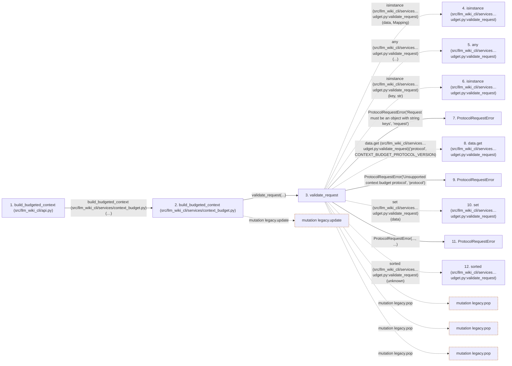

# build_budgeted_context

**Entry point:** `build_budgeted_context` (`api`)
**Source:** [api](../modules/api.md)
**Modules touched:** [api](../modules/api.md), [bootstrap_runtime](../modules/bootstrap_runtime.md), [change_selection](../modules/change_selection.md), [common](../modules/common.md), and 43 more

**Complete modules touched:**

- [api](../modules/api.md)
- [bootstrap_runtime](../modules/bootstrap_runtime.md)
- [change_selection](../modules/change_selection.md)
- [common](../modules/common.md)
- [config](../modules/config.md)
- [context_budget](../modules/context_budget.md)
- [context_packet](../modules/context_packet.md)
- [context_service](../modules/context_service.md)
- [data_flow](../modules/data_flow.md)
- [dependency_versions](../modules/dependency_versions.md)
- [documentation_queries](../modules/documentation_queries.md)
- [documentation_query_builder](../modules/documentation_query_builder.md)
- [entrypoints](../modules/entrypoints.md)
- [extraction_service](../modules/extraction_service.md)
- [filesystem_guard](../modules/filesystem_guard.md)
- [go_calls](../modules/go_calls.md)
- [imports](../modules/imports.md)
- [infrastructure_inventory](../modules/infrastructure_inventory.md)
- [infrastructure_sync](../modules/infrastructure_sync.md)
- [io](../modules/io.md)
- [knowledge_artifacts](../modules/knowledge_artifacts.md)
- [knowledge_consumption](../modules/knowledge_consumption.md)
- [knowledge_envelope](../modules/knowledge_envelope.md)
- [knowledge_evidence](../modules/knowledge_evidence.md)
- [knowledge_freshness](../modules/knowledge_freshness.md)
- [knowledge_generation](../modules/knowledge_generation.md)
- [knowledge_loader](../modules/knowledge_loader.md)
- [knowledge_model](../modules/knowledge_model.md)
- [knowledge_orchestration](../modules/knowledge_orchestration.md)
- [knowledge_storage](../modules/knowledge_storage.md)
- [knowledge_storage_io](../modules/knowledge_storage_io.md)
- [knowledge_verification](../modules/knowledge_verification.md)
- [manifest_storage](../modules/manifest_storage.md)
- [packages](../modules/packages.md)
- [plugins](../modules/plugins.md)
- [python_calls](../modules/python_calls.md)
- [python_imports](../modules/python_imports.md)
- [services_dependencies](../modules/services_dependencies.md)
- [source_selection](../modules/source_selection.md)
- [source_snapshot](../modules/source_snapshot.md)
- [sync_manifest](../modules/sync_manifest.md)
- [token_counting](../modules/token_counting.md)
- [validation](../modules/validation.md)
- [verification_contracts](../modules/verification_contracts.md)
- [wiki_media](../modules/wiki_media.md)
- [wiki_surface](../modules/wiki_surface.md)
- [wiki_surface_index](../modules/wiki_surface_index.md)

## Call sequence

```mermaid
sequenceDiagram
    participant p0 as build_budgeted_context (src/llm_wiki_cli/api.py)
    participant p1 as build_budgeted_context (src/llm_wiki_cli/services/context_budget.py)
    participant p2 as validate_request
    participant p3 as isinstance (src/llm_wiki_cli/services…udget.py:validate_request)
    participant p4 as any (src/llm_wiki_cli/services…udget.py:validate_request)
    participant p5 as ProtocolRequestError
    participant p6 as data.get (src/llm_wiki_cli/services…udget.py:validate_request)
    participant p7 as set (src/llm_wiki_cli/services…udget.py:validate_request)
    participant p8 as sorted (src/llm_wiki_cli/services…udget.py:validate_request)
    participant p9 as dict (src/llm_wiki_cli/services…udget.py:validate_request)
    participant p10 as legacy.pop
    participant p11 as _validate_protocol_request
    participant p12 as isinstance (src/llm_wiki_cli/services…validate_protocol_request)
    participant p13 as data.get (src/llm_wiki_cli/services…validate_protocol_request)
    participant p14 as _validate_protocol_request_impl
    participant p15 as isinstance (src/llm_wiki_cli/services…ate_protocol_request_impl)
    participant p16 as any (src/llm_wiki_cli/services…ate_protocol_request_impl)
    participant p17 as data.get (src/llm_wiki_cli/services…ate_protocol_request_impl)
    p0->>p1: build_budgeted_context (src/llm_wiki_cli/services/context_budget.py)
    p1->>p2: validate_request
    p2-->>p3: isinstance (src/llm_wiki_cli/services…udget.py:validate_request)
    p2-->>p4: any (src/llm_wiki_cli/services…udget.py:validate_request)
    p2-->>p3: isinstance (src/llm_wiki_cli/services…udget.py:validate_request)
    p2->>p5: ProtocolRequestError
    p2-->>p6: data.get (src/llm_wiki_cli/services…udget.py:validate_request)
    p2->>p5: ProtocolRequestError
    p2-->>p7: set (src/llm_wiki_cli/services…udget.py:validate_request)
    p2->>p5: ProtocolRequestError
    p2-->>p8: sorted (src/llm_wiki_cli/services…udget.py:validate_request)
    p2-->>p8: sorted (src/llm_wiki_cli/services…udget.py:validate_request)
    p2-->>p9: dict (src/llm_wiki_cli/services…udget.py:validate_request)
    p2-->>p6: data.get (src/llm_wiki_cli/services…udget.py:validate_request)
    p2-->>p6: data.get (src/llm_wiki_cli/services…udget.py:validate_request)
    p2-->>p6: data.get (src/llm_wiki_cli/services…udget.py:validate_request)
    p2-->>p10: legacy.pop
    p2-->>p10: legacy.pop
    p2-->>p10: legacy.pop
    p2->>p11: _validate_protocol_request
    p11-->>p12: isinstance (src/llm_wiki_cli/services…validate_protocol_request)
    p11-->>p13: data.get (src/llm_wiki_cli/services…validate_protocol_request)
    p11->>p14: _validate_protocol_request_impl
    p14-->>p15: isinstance (src/llm_wiki_cli/services…ate_protocol_request_impl)
    p14->>p5: ProtocolRequestError
    p14-->>p16: any (src/llm_wiki_cli/services…ate_protocol_request_impl)
    p14-->>p15: isinstance (src/llm_wiki_cli/services…ate_protocol_request_impl)
    p14->>p5: ProtocolRequestError
    p14-->>p17: data.get (src/llm_wiki_cli/services…ate_protocol_request_impl)
    p14->>p2: validate_request
```

<!-- Auto-generated from static call edges. Dashed arrows are external or unresolved calls. Reviewed runtime conditions and side effects belong in Behavior. -->

> Call sequence diagram shows 30 of 3004 interactions; 2974 omitted to keep the visualization within the 30-interaction and generated-diagram limits.

> Trace truncated at the depth limit; deeper calls are omitted.

## Data flow

<!-- Auto-generated static analysis. Treat values and boundaries as best-effort hints, not runtime proof. -->

### Step data

| Step | Inputs | Reads | Writes | Returns |
|---|---|---|---|---|
| `build_budgeted_context (src/llm_wiki_cli/api.py)` | `src_dir: str`, `wiki_dir: str`, `request: Mapping[str, Any] \| None`, `counter: TokenCounter \| None`, `allow_external_src: bool`, `source_selection: str \| Path \| None` | - | - | `build(...)` |
| `build_budgeted_context (src/llm_wiki_cli/services/context_budget.py)` | `src_dir`, `wiki_dir`, `request`, `counter: TokenCounter \| None`, `allow_external_src`, `source_selection` | `context`, `context` | `changes[...]` | `result` |
| `validate_request` | `data: Mapping[str, Any]` | `Mapping`, `CONTEXT_BUDGET_PROTOCOL_VERSION`, `context`, `context`, `CONTEXT_BUDGET_PROTOCOL_VERSION` | `legacy[...]`, `legacy[...]`, `legacy[...]` | `{...}` |
| `isinstance (src/llm_wiki_cli/services…udget.py:validate_request)` | - | - | - | - |
| `any (src/llm_wiki_cli/services…udget.py:validate_request)` | - | - | - | - |
| `isinstance (src/llm_wiki_cli/services…udget.py:validate_request)` | - | - | - | - |
| `ProtocolRequestError` | - | - | - | - |
| `data.get (src/llm_wiki_cli/services…udget.py:validate_request)` | - | - | - | - |
| `ProtocolRequestError` | - | - | - | - |
| `set (src/llm_wiki_cli/services…udget.py:validate_request)` | - | - | - | - |
| `ProtocolRequestError` | - | - | - | - |
| `sorted (src/llm_wiki_cli/services…udget.py:validate_request)` | - | - | - | - |

### Call data

| From | To | Line | Call |
|---|---|---:|---|
| build_budgeted_context (src/llm_wiki_cli/api.py) | build_budgeted_context (src/llm_wiki_cli/services/context_budget.py) | 1274 | `build(src_dir, wiki_dir, request, counter=counter, allow_external_src=allow_external_src, source_selection=source_selection)` |
| build_budgeted_context (src/llm_wiki_cli/services/context_budget.py) | validate_request | 208 | `validate_request(...)` |
| validate_request | isinstance (src/llm_wiki_cli/services…udget.py:validate_request) | 34 | `isinstance(data, Mapping)` |
| validate_request | any (src/llm_wiki_cli/services…udget.py:validate_request) | 34 | `any(...)` |
| validate_request | isinstance (src/llm_wiki_cli/services…udget.py:validate_request) | 34 | `isinstance(key, str)` |
| validate_request | ProtocolRequestError | 35 | `context.ProtocolRequestError('Request must be an object with string keys', 'request')` |
| validate_request | data.get (src/llm_wiki_cli/services…udget.py:validate_request) | 36 | `data.get('protocol', CONTEXT_BUDGET_PROTOCOL_VERSION)` |
| validate_request | ProtocolRequestError | 37 | `context.ProtocolRequestError('Unsupported context budget protocol', 'protocol')` |
| validate_request | set (src/llm_wiki_cli/services…udget.py:validate_request) | 39 | `set(data)` |
| validate_request | ProtocolRequestError | 41 | `context.ProtocolRequestError(..., ...)` |
| validate_request | sorted (src/llm_wiki_cli/services…udget.py:validate_request) | 42 | `sorted(unknown)` |

### Boundary effects

| Kind | Target | Step | Line |
|---|---|---|---:|
| mutation | `legacy.update` | `build_budgeted_context` | 249 |
| mutation | `legacy.pop` | `validate_request` | 50 |
| mutation | `legacy.pop` | `validate_request` | 51 |
| mutation | `legacy.pop` | `validate_request` | 52 |

### Static analysis gaps

| Kind | Step | Target | Line |
|---|---|---|---:|
| external_call | `validate_request` | `isinstance` | 34 |
| external_call | `validate_request` | `any` | 34 |
| unresolved_call | `validate_request` | `data.get` | 36 |
| external_call | `validate_request` | `sorted` | 42 |
| step_limit | `build_budgeted_context` | `first 12 steps` | 0 |
| truncated_flow | `build_budgeted_context` | `depth limit` | 0 |

## Behavior

This flow starts at `build_budgeted_context` and is classified as `api`. The generated call and data-flow sections are bounded static projections; runtime conditions and side effects require source-level confirmation.
