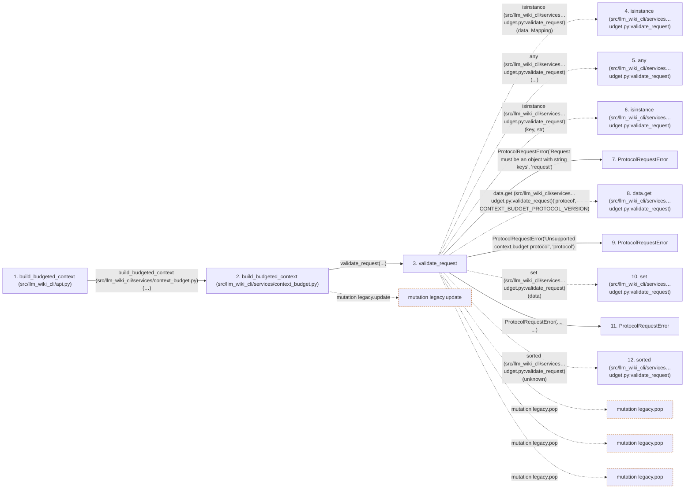

# build_budgeted_context

**Entry point:** `build_budgeted_context` (`api`)
**Source:** [api](../modules/api.md)
**Modules touched:** [analysis_capture](../modules/analysis_capture.md), [analysis_compatibility](../modules/analysis_compatibility.md), [api](../modules/api.md), [bootstrap_runtime](../modules/bootstrap_runtime.md), and 59 more

**Complete modules touched:**

- [analysis_capture](../modules/analysis_capture.md)
- [analysis_compatibility](../modules/analysis_compatibility.md)
- [api](../modules/api.md)
- [bootstrap_runtime](../modules/bootstrap_runtime.md)
- [change_selection](../modules/change_selection.md)
- [common](../modules/common.md)
- [config](../modules/config.md)
- [context_budget](../modules/context_budget.md)
- [context_packet](../modules/context_packet.md)
- [context_service](../modules/context_service.md)
- [data_flow](../modules/data_flow.md)
- [dependency_versions](../modules/dependency_versions.md)
- [documentation_queries](../modules/documentation_queries.md)
- [documentation_query_builder](../modules/documentation_query_builder.md)
- [entrypoints](../modules/entrypoints.md)
- [extraction_service](../modules/extraction_service.md)
- [filesystem_guard](../modules/filesystem_guard.md)
- [go_calls](../modules/go_calls.md)
- [immutable](../modules/immutable.md)
- [implementation_evidence](../modules/implementation_evidence.md)
- [imports](../modules/imports.md)
- [infrastructure_inventory](../modules/infrastructure_inventory.md)
- [infrastructure_sync](../modules/infrastructure_sync.md)
- [io](../modules/io.md)
- [knowledge_artifacts](../modules/knowledge_artifacts.md)
- [knowledge_consumption](../modules/knowledge_consumption.md)
- [knowledge_envelope](../modules/knowledge_envelope.md)
- [knowledge_evidence](../modules/knowledge_evidence.md)
- [knowledge_freshness](../modules/knowledge_freshness.md)
- [knowledge_generation](../modules/knowledge_generation.md)
- [knowledge_governance](../modules/knowledge_governance.md)
- [knowledge_loader](../modules/knowledge_loader.md)
- [knowledge_model](../modules/knowledge_model.md)
- [knowledge_orchestration](../modules/knowledge_orchestration.md)
- [knowledge_storage](../modules/knowledge_storage.md)
- [knowledge_storage_io](../modules/knowledge_storage_io.md)
- [knowledge_verification](../modules/knowledge_verification.md)
- [maintenance_evidence](../modules/maintenance_evidence.md)
- [maintenance_protocol](../modules/maintenance_protocol.md)
- [maintenance_service](../modules/maintenance_service.md)
- [maintenance_state](../modules/maintenance_state.md)
- [maintenance_status](../modules/maintenance_status.md)
- [manifest_storage](../modules/manifest_storage.md)
- [packages](../modules/packages.md)
- [packet_field_policy](../modules/packet_field_policy.md)
- [plugins](../modules/plugins.md)
- [python_bindings](../modules/python_bindings.md)
- [python_calls](../modules/python_calls.md)
- [python_implementation](../modules/python_implementation.md)
- [python_imports](../modules/python_imports.md)
- [services_dependencies](../modules/services_dependencies.md)
- [source_retirement](../modules/source_retirement.md)
- [source_selection](../modules/source_selection.md)
- [source_snapshot](../modules/source_snapshot.md)
- [sync_manifest](../modules/sync_manifest.md)
- [token_counting](../modules/token_counting.md)
- [validation](../modules/validation.md)
- [verification_contracts](../modules/verification_contracts.md)
- [wiki_media](../modules/wiki_media.md)
- [wiki_surface](../modules/wiki_surface.md)
- [wiki_surface_index](../modules/wiki_surface_index.md)
- [yaml_formats](../modules/yaml_formats.md)
- [yaml_syntax](../modules/yaml_syntax.md)

## Call sequence

> Static overview in presentation order, not runtime execution order. Arrows retain captured callers; representative internal continuations and boundary examples precede repeated helper detail.

<!-- Auto-generated from static call edges. Dashed arrows are external or unresolved calls. Reviewed runtime conditions and side effects belong in Behavior. -->

```mermaid
sequenceDiagram
    participant p0 as build_budgeted_context (src/llm_wiki_cli/api.py)
    participant p1 as build_budgeted_context (src/llm_wiki_cli/services/context_budget.py)
    participant p2 as validate_request
    participant p3 as capture_context_read
    participant p4 as select_changes
    participant p5 as affected_page_map
    participant p6 as build_context_from_captured_read
    participant p7 as fit_payload
    participant p8 as validate_budgeted_context
    participant p9 as _assert_selection_unchanged
    participant p10 as _normalized_request
    participant p11 as request_identity
    participant p12 as _build_legacy_context_from_captured_read
    participant p13 as _build_knowledge_context_from_captured_read
    participant p14 as build_module_page_map
    participant p15 as source_relative_paths
    participant p16 as build_entity_page_map
    participant p17 as validate_source_root
    participant p18 as _validate_protocol_request
    participant p19 as guard_maintenance_owner
    participant p20 as resolve_source_selection
    participant p21 as capture_source_selection_inputs
    participant p22 as validate_changes
    participant p23 as validate_live_query_source_selection
    participant p24 as build_source_snapshot
    participant p25 as validate_context_packet
    participant p26 as _guard_windows_inputs
    participant p27 as _assert_source_unchanged
    participant p28 as retained_empty_module_paths_from_wiki
    participant p29 as ValueError (src/llm_wiki_cli/services…py:build_budgeted_context)
    participant p30 as request.get (src/llm_wiki_cli/services…py:build_budgeted_context)
    p0->>p1: build_budgeted_context (src/llm_wiki_cli/services/context_budget.py)
    p1->>p2: validate_request
    p1->>p3: capture_context_read
    p1->>p4: select_changes
    p1->>p5: affected_page_map
    p1->>p6: build_context_from_captured_read
    p1->>p7: fit_payload
    p1->>p8: validate_budgeted_context
    p1->>p9: _assert_selection_unchanged
    p6->>p10: _normalized_request
    p7->>p11: request_identity
    p6->>p12: _build_legacy_context_from_captured_read
    p6->>p13: _build_knowledge_context_from_captured_read
    p5->>p14: build_module_page_map
    p4->>p15: source_relative_paths
    p5->>p16: build_entity_page_map
    p3->>p17: validate_source_root
    p2->>p18: _validate_protocol_request
    p3->>p19: guard_maintenance_owner
    p3->>p20: resolve_source_selection
    p3->>p21: capture_source_selection_inputs
    p2->>p22: validate_changes
    p3->>p23: validate_live_query_source_selection
    p3->>p24: build_source_snapshot
    p8->>p25: validate_context_packet
    p3->>p26: _guard_windows_inputs
    p3->>p27: _assert_source_unchanged
    p3->>p28: retained_empty_module_paths_from_wiki
    p1-->>p29: ValueError (src/llm_wiki_cli/services…py:build_budgeted_context)('Exact mode requires an explicit trusted counter or --tokenizer FILE')
    p1-->>p30: request.get (src/llm_wiki_cli/services…py:build_budgeted_context)('counter_id')
```

> Call sequence diagram shows 30 of 3580 interactions; 3550 omitted to keep the visualization within the 30-interaction and generated-diagram limits, with uncertain identities omitted rather than inferred.

> Captured boundary calls: external 1 of 1225 (1224 omitted); unresolved 1 of 1162 (1161 omitted). These counts cover the captured static trace.

Omitted captured detail, grouped by actual caller occurrence and target module:

| Caller | Parent step | Target module | Kind | Omitted interactions |
| --- | --- | --- | --- | --- |
| `src/llm_wiki_cli/services/context_budget.py:validate_request` | 3 | - | external | 10 |
| `src/llm_wiki_cli/services/context_budget.py:validate_request` | 3 | [src/llm_wiki_cli/services/context_service.py](../modules/context_service.md) | internal | 6 |
| `src/llm_wiki_cli/services/context_budget.py:validate_request` | 3 | - | unresolved | 10 |
| `src/llm_wiki_cli/services/context_service.py:_validate_protocol_request` | 21 | - | external | 2 |
| `src/llm_wiki_cli/services/context_service.py:_validate_protocol_request` | 21 | - | unresolved | 1 |
| `src/llm_wiki_cli/services/context_service.py:_validate_protocol_request` | 21 | [src/llm_wiki_cli/services/context_service.py](../modules/context_service.md) | internal | 1 |
| `src/llm_wiki_cli/services/context_service.py:_validate_protocol_request_impl` | 24 | - | external | 11 |
| `src/llm_wiki_cli/services/context_service.py:_validate_protocol_request_impl` | 24 | [src/llm_wiki_cli/services/context_service.py](../modules/context_service.md) | internal | 12 |
> Omission summary shows 8 of 863 groups; 855 further groups are not expanded here. Counts above include all omitted interactions.
> Detailed flow queries retain their own coverage and limits; omitted paths may execute at runtime.

> Trace truncated at the depth limit; deeper calls are omitted.

## Data flow

<!-- Auto-generated static analysis. Treat values and boundaries as best-effort hints, not runtime proof. -->

```mermaid
flowchart LR
    s1["1. build_budgeted_context (src/llm_wiki_cli/api.py)"]
    s2["2. build_budgeted_context (src/llm_wiki_cli/services/context_budget.py)"]
    s3["3. validate_request"]
    s4["4. isinstance (src/llm_wiki_cli/services…udget.py:validate_request)"]
    s5["5. any (src/llm_wiki_cli/services…udget.py:validate_request)"]
    s6["6. isinstance (src/llm_wiki_cli/services…udget.py:validate_request)"]
    s7["7. ProtocolRequestError"]
    s8["8. data.get (src/llm_wiki_cli/services…udget.py:validate_request)"]
    s9["9. ProtocolRequestError"]
    s10["10. set (src/llm_wiki_cli/services…udget.py:validate_request)"]
    s11["11. ProtocolRequestError"]
    s12["12. sorted (src/llm_wiki_cli/services…udget.py:validate_request)"]
    s1 -->|"build_budgeted_context (src/llm_wiki_cli/services/context_budget.py)(…)"| s2
    s2 -->|"validate_request(...)"| s3
    s3 -. "isinstance (src/llm_wiki_cli/services…udget.py:validate_request)(data, Mapping)" .-> s4
    s3 -. "any (src/llm_wiki_cli/services…udget.py:validate_request)(...)" .-> s5
    s3 -. "isinstance (src/llm_wiki_cli/services…udget.py:validate_request)(key, str)" .-> s6
    s3 -->|"ProtocolRequestError('Request must be an object with string keys', 'request')"| s7
    s3 -. "data.get (src/llm_wiki_cli/services…udget.py:validate_request)('protocol', CONTEXT_BUDGET_PROTOCOL_VERSION)" .-> s8
    s3 -->|"ProtocolRequestError('Unsupported context budget protocol', 'protocol')"| s9
    s3 -. "set (src/llm_wiki_cli/services…udget.py:validate_request)(data)" .-> s10
    s3 -->|"ProtocolRequestError(..., ...)"| s11
    s3 -. "sorted (src/llm_wiki_cli/services…udget.py:validate_request)(unknown)" .-> s12
    b0["mutation legacy.update"]
    s2 -. "mutation legacy.update" .-> b0
    b1["mutation legacy.pop"]
    s3 -. "mutation legacy.pop" .-> b1
    b2["mutation legacy.pop"]
    s3 -. "mutation legacy.pop" .-> b2
    b3["mutation legacy.pop"]
    s3 -. "mutation legacy.pop" .-> b3
    click s1 "../modules/api.md"
    click s2 "../modules/context_budget.md"
    click s3 "../modules/context_budget.md"
    click s7 "../modules/context_service.md"
    click s9 "../modules/context_service.md"
    click s11 "../modules/context_service.md"
    classDef boundary stroke:#b45309,stroke-dasharray: 4 2
    class b0 boundary
    class b1 boundary
    class b2 boundary
    class b3 boundary
```

### Step data

| Step | Inputs | Reads | Writes | Returns |
|---|---|---|---|---|
| `build_budgeted_context (src/llm_wiki_cli/api.py)` | `src_dir: str`, `wiki_dir: str`, `request: Mapping[str, Any] \| None`, `counter: TokenCounter \| None`, `allow_external_src: bool`, `source_selection: str \| Path \| None`, `comparison_policy: str \| None` | - | - | `build(...)` |
| `build_budgeted_context (src/llm_wiki_cli/services/context_budget.py)` | `src_dir`, `wiki_dir`, `request`, `counter: TokenCounter \| None`, `allow_external_src`, `source_selection` | `context`, `context` | `changes[...]` | `result` |
| `validate_request` | `data: Mapping[str, Any]` | `Mapping`, `CONTEXT_BUDGET_PROTOCOL_VERSION`, `context`, `context`, `CONTEXT_BUDGET_PROTOCOL_VERSION` | `legacy[...]`, `legacy[...]`, `legacy[...]` | `{...}` |
| `isinstance (src/llm_wiki_cli/services…udget.py:validate_request)` | - | - | - | - |
| `any (src/llm_wiki_cli/services…udget.py:validate_request)` | - | - | - | - |
| `isinstance (src/llm_wiki_cli/services…udget.py:validate_request)` | - | - | - | - |
| `ProtocolRequestError` | - | - | - | - |
| `data.get (src/llm_wiki_cli/services…udget.py:validate_request)` | - | - | - | - |
| `ProtocolRequestError` | - | - | - | - |
| `set (src/llm_wiki_cli/services…udget.py:validate_request)` | - | - | - | - |
| `ProtocolRequestError` | - | - | - | - |
| `sorted (src/llm_wiki_cli/services…udget.py:validate_request)` | - | - | - | - |

### Call data

| From | To | Line | Call |
|---|---|---:|---|
| build_budgeted_context (src/llm_wiki_cli/api.py) | build_budgeted_context (src/llm_wiki_cli/services/context_budget.py) | 1336 | `build(src_dir, wiki_dir, request, counter=counter, allow_external_src=allow_external_src, source_selection=source_selection)` |
| build_budgeted_context (src/llm_wiki_cli/services/context_budget.py) | validate_request | 230 | `validate_request(...)` |
| validate_request | isinstance (src/llm_wiki_cli/services…udget.py:validate_request) | 34 | `isinstance(data, Mapping)` |
| validate_request | any (src/llm_wiki_cli/services…udget.py:validate_request) | 34 | `any(...)` |
| validate_request | isinstance (src/llm_wiki_cli/services…udget.py:validate_request) | 34 | `isinstance(key, str)` |
| validate_request | ProtocolRequestError | 35 | `context.ProtocolRequestError('Request must be an object with string keys', 'request')` |
| validate_request | data.get (src/llm_wiki_cli/services…udget.py:validate_request) | 36 | `data.get('protocol', CONTEXT_BUDGET_PROTOCOL_VERSION)` |
| validate_request | ProtocolRequestError | 37 | `context.ProtocolRequestError('Unsupported context budget protocol', 'protocol')` |
| validate_request | set (src/llm_wiki_cli/services…udget.py:validate_request) | 39 | `set(data)` |
| validate_request | ProtocolRequestError | 41 | `context.ProtocolRequestError(..., ...)` |
| validate_request | sorted (src/llm_wiki_cli/services…udget.py:validate_request) | 42 | `sorted(unknown)` |

### Boundary effects

| Kind | Target | Step | Line |
|---|---|---|---:|
| mutation | `legacy.update` | `build_budgeted_context` | 271 |
| mutation | `legacy.pop` | `validate_request` | 50 |
| mutation | `legacy.pop` | `validate_request` | 51 |
| mutation | `legacy.pop` | `validate_request` | 52 |

### Static analysis gaps

| Kind | Step | Target | Line |
|---|---|---|---:|
| external_call | `validate_request` | `isinstance` | 34 |
| external_call | `validate_request` | `any` | 34 |
| unresolved_call | `validate_request` | `data.get` | 36 |
| external_call | `validate_request` | `sorted` | 42 |
| step_limit | `build_budgeted_context` | `first 12 steps` | 0 |
| truncated_flow | `build_budgeted_context` | `depth limit` | 0 |

## Behavior

This flow starts at `build_budgeted_context` and is classified as `api`. The generated call and data-flow sections are bounded static projections; runtime conditions and side effects require source-level confirmation.

Declared ordinary maintenance authority is required to remain coherent. A damaged owner or immutable marker produces a bounded `maintenance-authority-unavailable` refusal, with a safe original cause and an explicit matching committed-recovery template. No native packet or promoted fallback is returned, and no backup, identity, setup or repair is chosen by the read. The caller must preserve recovery preconditions and the original source/wiki boundaries.
