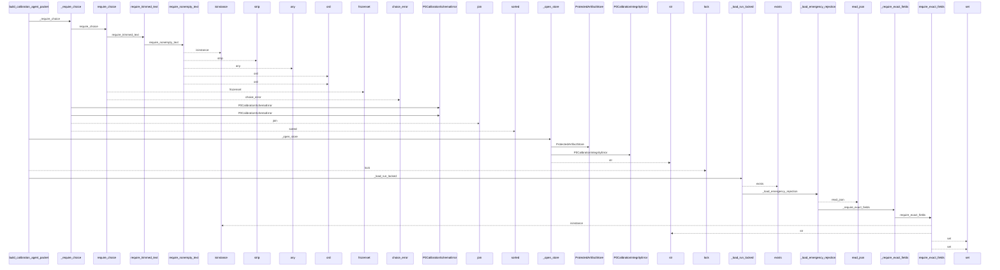
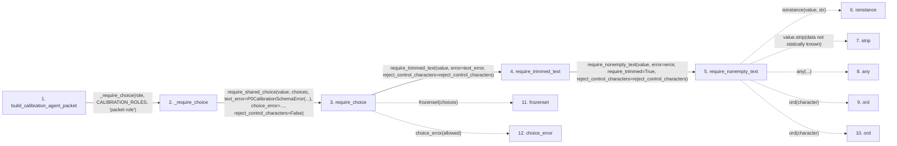

# build_calibration_agent_packet

**Entry point:** `build_calibration_agent_packet` (`api`)
**Source:** [controller](../modules/controller.md)
**Modules touched:** [calibration_contracts](../modules/calibration_contracts.md), [controller](../modules/controller.md), [documentation_policy](../modules/documentation_policy.md), and 4 more

**Complete modules touched:**

- [calibration_contracts](../modules/calibration_contracts.md)
- [controller](../modules/controller.md)
- [documentation_policy](../modules/documentation_policy.md)
- [filesystem_guard](../modules/filesystem_guard.md)
- [host_broker](../modules/host_broker.md)
- [protected_artifacts](../modules/protected_artifacts.md)
- [validation](../modules/validation.md)

## Call sequence

<!-- Auto-generated from static call edges. Dashed arrows are external or unresolved calls. Reviewed runtime conditions and side effects belong in Behavior. -->

> Call sequence diagram shows 30 of 1417 interactions; 1387 omitted to keep the visualization within the 30-interaction and generated-diagram limits.

> Trace truncated at the depth limit; deeper calls are omitted.

## Data flow

<!-- Auto-generated static analysis. Treat values and boundaries as best-effort hints, not runtime proof. -->

### Step data

| Step | Inputs | Reads | Writes | Returns |
|---|---|---|---|---|
| `build_calibration_agent_packet` | `root: str \| Path`, `role: str` | `CALIBRATION_ROLES`, `INTAKE_ROLES`, `CALIBRATION_ROLES`, `_MAX_BUNDLE_BYTES`, `P0_CALIBRATION_AGENT_PACKET_SCHEMA_VERSION`, `CALIBRATION_CONTROLLER_MAX_PACKET_BYTES` | `roles[...]`, `packet_artifacts[...]`, `artifacts[...]` | `packet`, `P0CalibrationAgentPacket.from_dict(...)` |
| `_require_choice` | `value: Any`, `choices: Iterable[str]`, `label: str` | - | - | `require_shared_choice(...)` |
| `require_choice` | `value: object`, `choices: Iterable[str]`, `text_error: Exception`, `choice_error: Callable[[frozenset[str]], Exception]`, `reject_control_characters: bool` | - | - | `parsed` |
| `require_trimmed_text` | `value: object`, `error: Exception`, `reject_control_characters: bool` | - | - | `require_nonempty_text(...)` |
| `require_nonempty_text` | `value: object`, `error: Exception`, `trim_error: Exception \| None`, `normalize: bool`, `require_trimmed: bool`, `reject_control_characters: bool`, `reject_delete_character: bool` | - | - | `parsed` |
| `isinstance` | - | - | - | - |
| `strip` | - | - | - | - |
| `any` | - | - | - | - |
| `ord` | - | - | - | - |
| `ord` | - | - | - | - |
| `frozenset` | - | - | - | - |
| `choice_error` | - | - | - | - |

### Call data

| From | To | Line | Call |
|---|---|---:|---|
| build_calibration_agent_packet | _require_choice | 1290 | `_require_choice(role, CALIBRATION_ROLES, 'packet role')` |
| _require_choice | require_choice | 6741 | `require_shared_choice(value, choices, text_error=P0CalibrationSchemaError(...), choice_error=..., reject_control_characters=False)` |
| require_choice | require_trimmed_text | 1035 | `require_trimmed_text(value, error=text_error, reject_control_characters=reject_control_characters)` |
| require_trimmed_text | require_nonempty_text | 658 | `require_nonempty_text(value, error=error, require_trimmed=True, reject_control_characters=reject_control_characters)` |
| require_nonempty_text | isinstance | 574 | `isinstance(value, str)` |
| require_nonempty_text | strip | 576 | `value.strip(data not statically known)` |
| require_nonempty_text | any | 582 | `any(...)` |
| require_nonempty_text | ord | 583 | `ord(character)` |
| require_nonempty_text | ord | 584 | `ord(character)` |
| require_choice | frozenset | 1040 | `frozenset(choices)` |
| require_choice | choice_error | 1042 | `choice_error(allowed)` |

### Boundary effects

*No boundary effects detected.*

### Static analysis gaps

| Kind | Step | Target | Line |
|---|---|---|---:|
| unresolved_call | `require_nonempty_text` | `isinstance` | 574 |
| unresolved_call | `require_nonempty_text` | `value.strip` | 576 |
| unresolved_call | `require_nonempty_text` | `any` | 582 |
| unresolved_call | `require_nonempty_text` | `ord` | 583 |
| unresolved_call | `require_nonempty_text` | `ord` | 584 |
| unresolved_call | `require_choice` | `frozenset` | 1040 |
| unresolved_call | `require_choice` | `choice_error` | 1042 |
| step_limit | `build_calibration_agent_packet` | `first 12 steps` | 0 |
| truncated_flow | `build_calibration_agent_packet` | `depth limit` | 0 |

## Behavior

This flow starts at `build_calibration_agent_packet` and is classified as `api`. The generated call and data-flow sections are bounded static projections; runtime conditions and side effects require source-level confirmation.
