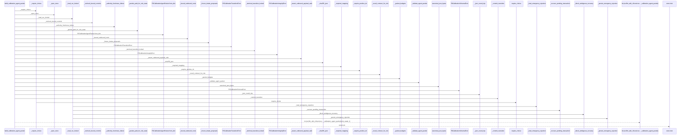
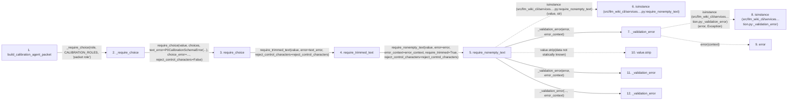

# build_calibration_agent_packet

**Entry point:** `build_calibration_agent_packet` (`api`)
**Source:** [controller](../modules/controller.md)
**Modules touched:** [calibration_contracts](../modules/calibration_contracts.md), [controller](../modules/controller.md), [documentation_policy](../modules/documentation_policy.md), and 4 more

**Complete modules touched:**

- [calibration_contracts](../modules/calibration_contracts.md)
- [controller](../modules/controller.md)
- [documentation_policy](../modules/documentation_policy.md)
- [filesystem_guard](../modules/filesystem_guard.md)
- [host_broker](../modules/host_broker.md)
- [protected_artifacts](../modules/protected_artifacts.md)
- [validation](../modules/validation.md)

## Call sequence

> Static overview in presentation order, not runtime execution order. Arrows retain captured callers; representative internal continuations and boundary examples precede repeated helper detail.

<!-- Auto-generated from static call edges. Dashed arrows are external or unresolved calls. Reviewed runtime conditions and side effects belong in Behavior. -->

```mermaid
sequenceDiagram
    participant p0 as build_calibration_agent_packet
    participant p1 as _require_choice
    participant p2 as _open_store
    participant p3 as _load_run_locked
    participant p4 as _recheck_bound_controls
    participant p5 as _authority_freshness_failure
    participant p6 as _packet_path_for_role_state
    participant p7 as P0CalibrationAgentPacket.from_dict
    participant p8 as _bound_outbound_roots
    participant p9 as _frozen_intake_proposals
    participant p10 as P0CalibrationTransitionError
    participant p11 as _terminal_transition_locked
    participant p12 as P0CalibrationIntegrityError
    participant p13 as _assert_outbound_payload_safe
    participant p14 as _sha256_json
    participant p15 as _required_mapping
    participant p16 as _require_positive_int
    participant p17 as _result_contract_for_role
    participant p18 as _packet_budgets
    participant p19 as _validate_agent_packet
    participant p20 as canonical_json_bytes
    participant p21 as P0CalibrationSchemaError
    participant p22 as _json_round_trip
    participant p23 as _commit_transition
    participant p24 as require_choice
    participant p25 as _load_emergency_rejection
    participant p26 as _recover_pending_transaction
    participant p27 as _block_ambiguous_recovery
    participant p28 as _persist_emergency_rejection
    participant p29 as int (src/llm_wiki_cli/services…_calibration_agent_packet)
    participant p30 as store.lock
    p0->>p1: _require_choice
    p0->>p2: _open_store
    p0->>p3: _load_run_locked
    p0->>p4: _recheck_bound_controls
    p0->>p5: _authority_freshness_failure
    p0->>p6: _packet_path_for_role_state
    p0->>p7: P0CalibrationAgentPacket.from_dict
    p0->>p8: _bound_outbound_roots
    p0->>p9: _frozen_intake_proposals
    p0->>p10: P0CalibrationTransitionError
    p0->>p11: _terminal_transition_locked
    p0->>p12: P0CalibrationIntegrityError
    p0->>p13: _assert_outbound_payload_safe
    p0->>p14: _sha256_json
    p0->>p15: _required_mapping
    p0->>p16: _require_positive_int
    p0->>p17: _result_contract_for_role
    p0->>p18: _packet_budgets
    p0->>p19: _validate_agent_packet
    p0->>p20: canonical_json_bytes
    p0->>p21: P0CalibrationSchemaError
    p0->>p22: _json_round_trip
    p0->>p23: _commit_transition
    p1->>p24: require_choice
    p3->>p25: _load_emergency_rejection
    p3->>p26: _recover_pending_transaction
    p3->>p27: _block_ambiguous_recovery
    p3->>p28: _persist_emergency_rejection
    p0-->>p29: int (src/llm_wiki_cli/services…_calibration_agent_packet)(role_state[...])
    p0-->>p30: store.lock
```

> Call sequence diagram shows 30 of 1437 interactions; 1407 omitted to keep the visualization within the 30-interaction and generated-diagram limits, with uncertain identities omitted rather than inferred.

> Captured boundary calls: external 1 of 314 (313 omitted); unresolved 1 of 501 (500 omitted). These counts cover the captured static trace.

Omitted captured detail, grouped by actual caller occurrence and target module:

| Caller | Parent step | Target module | Kind | Omitted interactions |
| --- | --- | --- | --- | --- |
| `src/llm_wiki_cli/services/validation.py:require_choice` | 3 | [src/llm_wiki_cli/services/validation.py](../modules/validation.md) | internal | 1 |
| `src/llm_wiki_cli/services/validation.py:require_trimmed_text` | 4 | [src/llm_wiki_cli/services/validation.py](../modules/validation.md) | internal | 1 |
| `src/llm_wiki_cli/services/validation.py:require_nonempty_text` | 5 | - | external | 1 |
| `src/llm_wiki_cli/services/validation.py:require_nonempty_text` | 5 | [src/llm_wiki_cli/services/validation.py](../modules/validation.md) | internal | 5 |
| `src/llm_wiki_cli/services/validation.py:_validation_error` | 7 | - | external | 1 |
| `src/llm_wiki_cli/services/validation.py:_validation_error` | 7 | - | unresolved | 1 |
| `src/llm_wiki_cli/services/validation.py:require_nonempty_text` | 5 | - | unresolved | 1 |
| `src/llm_wiki_cli/services/validation.py:contains_control_character` | 13 | - | unresolved | 1 |
> Omission summary shows 8 of 229 groups; 221 further groups are not expanded here. Counts above include all omitted interactions.
> Detailed flow queries retain their own coverage and limits; omitted paths may execute at runtime.

> Trace truncated at the depth limit; deeper calls are omitted.

## Data flow

<!-- Auto-generated static analysis. Treat values and boundaries as best-effort hints, not runtime proof. -->

### Analysis coverage

**Effect analysis partially available.** Flow assembly and source effect analysis are separate; empty observations do not prove an empty handler body.

Source steps: 623; effect analysis evaluated: 368, partial: 13, unavailable: 242. Counts include steps omitted from the displayed trace.

Collector observations for 381 source steps with known totals: observed: 1690, emitted: 1646, omitted: 44. Unavailable totals are excluded.

- Callable record unavailable for one or more source steps; those steps have no represented callable body.
- Effect collector omitted observations before flow assembly; displayed effects are partial.
- Effect collector totals unavailable; observed counts cover captured records only.

| Step | Callable record | Effect analysis | Collector totals | Observed | Emitted | Omitted |
|---|---|---|---|---:|---:|---:|
| `build_calibration_agent_packet` | `available` | `evaluated` | `available` | `13` | `13` | `0` |
| `_require_choice` | `available` | `evaluated` | `available` | `4` | `4` | `0` |
| `require_choice` | `available` | `evaluated` | `available` | `6` | `6` | `0` |
| `require_trimmed_text` | `available` | `evaluated` | `available` | `5` | `5` | `0` |
| `require_nonempty_text` | `available` | `evaluated` | `available` | `9` | `9` | `0` |
| `isinstance (src/llm_wiki_cli/services….py:require_nonempty_text)` | `not_applicable` | `not_applicable` | `not_applicable` | — | — | — |
| `_validation_error` | `available` | `evaluated` | `available` | `3` | `3` | `0` |
| `isinstance (src/llm_wiki_cli/services…tion.py:_validation_error)` | `not_applicable` | `not_applicable` | `not_applicable` | — | — | — |
| `error` | `not_applicable` | `not_applicable` | `not_applicable` | — | — | — |
| `value.strip` | `not_applicable` | `not_applicable` | `not_applicable` | — | — | — |
| `_validation_error` | `available` | `evaluated` | `available` | `3` | `3` | `0` |
| `_validation_error` | `available` | `evaluated` | `available` | `3` | `3` | `0` |

```mermaid
flowchart LR
    s1["1. build_calibration_agent_packet"]
    s2["2. _require_choice"]
    s3["3. require_choice"]
    s4["4. require_trimmed_text"]
    s5["5. require_nonempty_text"]
    s6["6. isinstance (src/llm_wiki_cli/services….py:require_nonempty_text)"]
    s7["7. _validation_error"]
    s8["8. isinstance (src/llm_wiki_cli/services…tion.py:_validation_error)"]
    s9["9. error"]
    s10["10. value.strip"]
    s11["11. _validation_error"]
    s12["12. _validation_error"]
    s1 -->|"_require_choice(role, CALIBRATION_ROLES, 'packet role')"| s2
    s2 -->|"require_choice(value, choices, text_error=P0CalibrationSchemaError(...), choice_error=..., reject_control_characters=False)"| s3
    s3 -->|"require_trimmed_text(value, error=text_error, reject_control_characters=reject_control_characters)"| s4
    s4 -->|"require_nonempty_text(value, error=error, error_context=error_context, require_trimmed=True, reject_control_characters=reject_control_characters)"| s5
    s5 -. "isinstance (src/llm_wiki_cli/services….py:require_nonempty_text)(value, str)" .-> s6
    s5 -->|"_validation_error(error, error_context)"| s7
    s7 -. "isinstance (src/llm_wiki_cli/services…tion.py:_validation_error)(error, Exception)" .-> s8
    s7 -. "error(context)" .-> s9
    s5 -. "value.strip(data not statically known)" .-> s10
    s5 -->|"_validation_error(error, error_context)"| s11
    s5 -->|"_validation_error(..., error_context)"| s12
    click s1 "../modules/controller.md"
    click s2 "../modules/controller.md"
    click s3 "../modules/validation.md"
    click s4 "../modules/validation.md"
    click s5 "../modules/validation.md"
    click s7 "../modules/validation.md"
    click s11 "../modules/validation.md"
    click s12 "../modules/validation.md"
```

### Step data

| Step | Inputs | Reads | Writes | Returns |
|---|---|---|---|---|
| `build_calibration_agent_packet` | `root: str \| Path`, `role: str` | `CALIBRATION_ROLES`, `INTAKE_ROLES`, `CALIBRATION_ROLES`, `_MAX_BUNDLE_BYTES`, `P0_CALIBRATION_AGENT_PACKET_SCHEMA_VERSION`, `CALIBRATION_CONTROLLER_MAX_PACKET_BYTES` | `roles[...]`, `packet_artifacts[...]`, `artifacts[...]` | `packet`, `P0CalibrationAgentPacket.from_dict(...)` |
| `_require_choice` | `value: Any`, `choices: Iterable[str]`, `label: str` | - | - | `require_shared_choice(...)` |
| `require_choice` | `value: object`, `choices: Iterable[str]`, `text_error: Exception`, `choice_error: Callable[[frozenset[str]], Exception]`, `reject_control_characters: bool` | - | - | `parsed` |
| `require_trimmed_text` | `value: object`, `error: _ValidationError`, `error_context: str`, `reject_control_characters: bool` | - | - | `require_nonempty_text(...)` |
| `require_nonempty_text` | `value: object`, `error: _ValidationError`, `trim_error: _ValidationError \| None`, `error_context: str`, `normalize: bool`, `require_trimmed: bool`, `reject_control_characters: bool`, `reject_delete_character: bool` | - | - | `parsed` |
| `isinstance (src/llm_wiki_cli/services….py:require_nonempty_text)` | - | - | - | - |
| `_validation_error` | `error: _ValidationError`, `context: str` | - | - | `...` |
| `isinstance (src/llm_wiki_cli/services…tion.py:_validation_error)` | - | - | - | - |
| `error` | - | - | - | - |
| `value.strip` | - | - | - | - |
| `_validation_error` | `error: _ValidationError`, `context: str` | - | - | `...` |
| `_validation_error` | `error: _ValidationError`, `context: str` | - | - | `...` |

### Call data

| From | To | Line | Call |
|---|---|---:|---|
| build_calibration_agent_packet | _require_choice | 1290 | `_require_choice(role, CALIBRATION_ROLES, 'packet role')` |
| _require_choice | require_choice | 6741 | `require_shared_choice(value, choices, text_error=P0CalibrationSchemaError(...), choice_error=..., reject_control_characters=False)` |
| require_choice | require_trimmed_text | 1093 | `require_trimmed_text(value, error=text_error, reject_control_characters=reject_control_characters)` |
| require_trimmed_text | require_nonempty_text | 711 | `require_nonempty_text(value, error=error, error_context=error_context, require_trimmed=True, reject_control_characters=reject_control_characters)` |
| require_nonempty_text | isinstance (src/llm_wiki_cli/services….py:require_nonempty_text) | 637 | `isinstance(value, str)` |
| require_nonempty_text | _validation_error | 638 | `_validation_error(error, error_context)` |
| _validation_error | isinstance (src/llm_wiki_cli/services…tion.py:_validation_error) | 95 | `isinstance(error, Exception)` |
| _validation_error | error | 95 | `error(context)` |
| require_nonempty_text | value.strip | 639 | `value.strip(data not statically known)` |
| require_nonempty_text | _validation_error | 642 | `_validation_error(error, error_context)` |
| require_nonempty_text | _validation_error | 644 | `_validation_error(..., error_context)` |

### Boundary effects

*No boundary-effect observations were captured in this static trace.*

### Static analysis gaps

| Kind | Step | Target | Line |
|---|---|---|---:|
| external_call | `require_nonempty_text` | `isinstance` | 637 |
| external_call | `_validation_error` | `isinstance` | 95 |
| unresolved_call | `_validation_error` | `error` | 95 |
| unresolved_call | `require_nonempty_text` | `value.strip` | 639 |
| step_limit | `build_calibration_agent_packet` | `first 12 steps` | 0 |
| truncated_flow | `build_calibration_agent_packet` | `depth limit` | 0 |

## Behavior

This flow starts at `build_calibration_agent_packet` and is classified as `api`. The generated call and data-flow sections are bounded static projections; runtime conditions and side effects require source-level confirmation.
