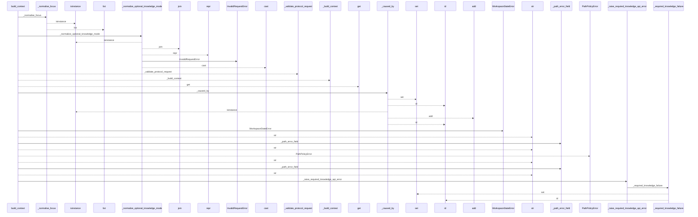
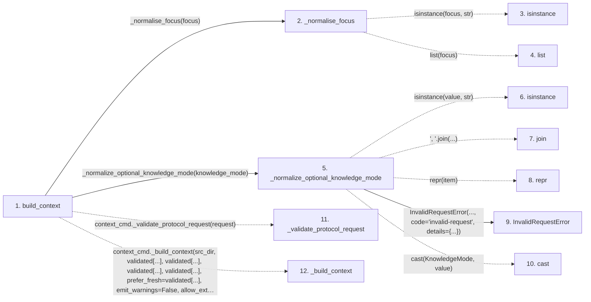

# build_context

**Entry point:** `build_context` (`api`)
**Source:** [api](../modules/api.md)
**Modules touched:** [api](../modules/api.md)

## Call sequence

<!-- Auto-generated from static call edges. Dashed arrows are external or unresolved calls. Reviewed runtime conditions and side effects belong in Behavior. -->

> Call sequence diagram shows 30 of 61 interactions; 31 omitted to keep the visualization within the 30-interaction and generated-diagram limits.

## Data flow

<!-- Auto-generated static analysis. Treat values and boundaries as best-effort hints, not runtime proof. -->

### Step data

| Step | Inputs | Reads | Writes | Returns |
|---|---|---|---|---|
| `build_context` | `src_dir: str`, `budget: int`, `format: str`, `focus: str \| list[str]`, `filters: dict[str, Any] \| None`, `wiki_dir: str`, `prefer_fresh: bool`, `allow_external_src: bool` | `context_cmd`, `CONTEXT_KNOWLEDGE_PROTOCOL_VERSION`, `KNOWLEDGE_MODE_REQUEST_FIELD`, `PathValidationError`, `context_cmd`, `context_cmd`, `MarkdownContextResult`, `ContextPayload` | `request[...]`, `result[...]` | `cast(...)`, `cast(...)` |
| `_normalise_focus` | `focus: str \| list[str]` | - | - | `[...]`, `[...]`, `[...]`, `list(...)` |
| `isinstance` | - | - | - | - |
| `list` | - | - | - | - |
| `_normalize_optional_knowledge_mode` | `value: object` | `KNOWLEDGE_MODE_VALUES`, `KNOWLEDGE_MODE_VALUES`, `KNOWLEDGE_MODE_REQUEST_FIELD`, `KnowledgeMode` | - | `None`, `cast(...)` |
| `isinstance` | - | - | - | - |
| `join` | - | - | - | - |
| `repr` | - | - | - | - |
| `InvalidRequestError` | - | - | - | - |
| `cast` | - | - | - | - |
| `_validate_protocol_request` | - | - | - | - |
| `_build_context` | - | - | - | - |

### Call data

| From | To | Line | Call |
|---|---|---:|---|
| build_context | _normalise_focus | 742 | `_normalise_focus(focus)` |
| _normalise_focus | isinstance | 2316 | `isinstance(focus, str)` |
| _normalise_focus | list | 2322 | `list(focus)` |
| build_context | _normalize_optional_knowledge_mode | 743 | `_normalize_optional_knowledge_mode(knowledge_mode)` |
| _normalize_optional_knowledge_mode | isinstance | 360 | `isinstance(value, str)` |
| _normalize_optional_knowledge_mode | join | 361 | `', '.join(...)` |
| _normalize_optional_knowledge_mode | repr | 361 | `repr(item)` |
| _normalize_optional_knowledge_mode | InvalidRequestError | 362 | `InvalidRequestError(..., code='invalid-request', details={...})` |
| _normalize_optional_knowledge_mode | cast | 367 | `cast(KnowledgeMode, value)` |
| build_context | _validate_protocol_request | 759 | `context_cmd._validate_protocol_request(request)` |
| build_context | _build_context | 760 | `context_cmd._build_context(src_dir, validated[...], validated[...], validated[...], validated[...], prefer_fresh=validated[...], emit_warnings=False, allow_external_src=allow_external_src, read_only=read_only, wiki_dir=wiki_dir, source_selection=source_selection, knowledge_mode=validated.get(...), include_plugins=True)` |

### Boundary effects

*No boundary effects detected.*

### Static analysis gaps

| Kind | Step | Target | Line |
|---|---|---|---:|
| unresolved_call | `_normalise_focus` | `isinstance` | 2316 |
| unresolved_call | `_normalize_optional_knowledge_mode` | `isinstance` | 360 |
| unresolved_call | `_normalize_optional_knowledge_mode` | `', '.join` | 361 |
| external_call | `_normalize_optional_knowledge_mode` | `cast` | 367 |
| external_call | `build_context` | `context_cmd._validate_protocol_request` | 759 |
| external_call | `build_context` | `context_cmd._build_context` | 760 |
| step_limit | `build_context` | `first 12 steps` | 0 |

## Behavior

Normalizes focus values, validates the versioned context request, and builds a
token-bounded response from the selected source and wiki. JSON mode returns the
payload with any warnings; Markdown mode returns rendered content alongside the
same payload and warnings. Path, workspace, and request failures remain
separate public API categories, and read-only mode is the default.
