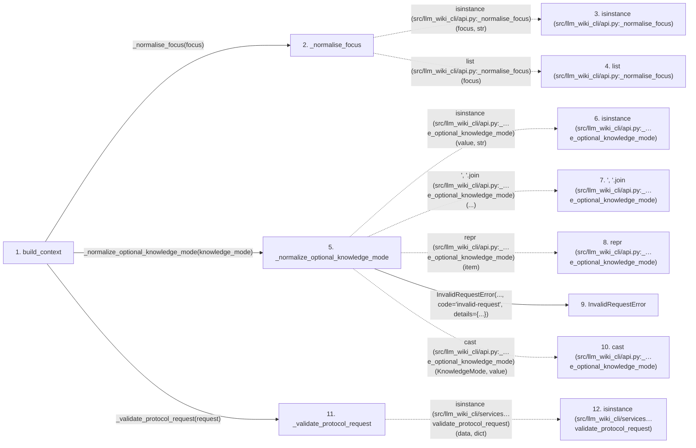

# build_context

**Entry point:** `build_context` (`api`)
**Source:** [api](../modules/api.md)
**Modules touched:** [api](../modules/api.md), [common](../modules/common.md), [config](../modules/config.md), [context_service](../modules/context_service.md), and 29 more

**Complete modules touched:**

- [api](../modules/api.md)
- [common](../modules/common.md)
- [config](../modules/config.md)
- [context_service](../modules/context_service.md)
- [data_flow](../modules/data_flow.md)
- [dependency_versions](../modules/dependency_versions.md)
- [documentation_queries](../modules/documentation_queries.md)
- [documentation_query_builder](../modules/documentation_query_builder.md)
- [entrypoints](../modules/entrypoints.md)
- [extraction_service](../modules/extraction_service.md)
- [filesystem_guard](../modules/filesystem_guard.md)
- [imports](../modules/imports.md)
- [infrastructure_inventory](../modules/infrastructure_inventory.md)
- [infrastructure_sync](../modules/infrastructure_sync.md)
- [io](../modules/io.md)
- [knowledge_consumption](../modules/knowledge_consumption.md)
- [knowledge_envelope](../modules/knowledge_envelope.md)
- [knowledge_freshness](../modules/knowledge_freshness.md)
- [knowledge_loader](../modules/knowledge_loader.md)
- [knowledge_observability](../modules/knowledge_observability.md)
- [knowledge_orchestration](../modules/knowledge_orchestration.md)
- [knowledge_verification](../modules/knowledge_verification.md)
- [plugins](../modules/plugins.md)
- [python_calls](../modules/python_calls.md)
- [python_imports](../modules/python_imports.md)
- [services_dependencies](../modules/services_dependencies.md)
- [source_selection](../modules/source_selection.md)
- [source_snapshot](../modules/source_snapshot.md)
- [sync_manifest](../modules/sync_manifest.md)
- [validation](../modules/validation.md)
- [wiki_media](../modules/wiki_media.md)
- [wiki_surface](../modules/wiki_surface.md)
- [wiki_surface_index](../modules/wiki_surface_index.md)

## Call sequence

```mermaid
sequenceDiagram
    participant p0 as build_context
    participant p1 as _normalise_focus
    participant p2 as isinstance (src/llm_wiki_cli/api.py:_normalise_focus)
    participant p3 as list (src/llm_wiki_cli/api.py:_normalise_focus)
    participant p4 as _normalize_optional_knowledge_mode
    participant p5 as isinstance (src/llm_wiki_cli/api.py:_…e_optional_knowledge_mode)
    participant p6 as ', '.join (src/llm_wiki_cli/api.py:_…e_optional_knowledge_mode)
    participant p7 as repr (src/llm_wiki_cli/api.py:_…e_optional_knowledge_mode)
    participant p8 as InvalidRequestError
    participant p9 as cast (src/llm_wiki_cli/api.py:_…e_optional_knowledge_mode)
    participant p10 as _validate_protocol_request
    participant p11 as isinstance (src/llm_wiki_cli/services…validate_protocol_request)
    participant p12 as data.get (src/llm_wiki_cli/services…validate_protocol_request)
    participant p13 as _validate_protocol_request_impl
    participant p14 as isinstance (src/llm_wiki_cli/services…ate_protocol_request_impl)
    participant p15 as ProtocolRequestError
    participant p16 as any (src/llm_wiki_cli/services…ate_protocol_request_impl)
    participant p17 as data.get (src/llm_wiki_cli/services…ate_protocol_request_impl)
    participant p18 as sorted (src/llm_wiki_cli/services…ate_protocol_request_impl)
    participant p19 as set (src/llm_wiki_cli/services…ate_protocol_request_impl)
    p0->>p1: _normalise_focus
    p1-->>p2: isinstance (src/llm_wiki_cli/api.py:_normalise_focus)
    p1-->>p3: list (src/llm_wiki_cli/api.py:_normalise_focus)
    p0->>p4: _normalize_optional_knowledge_mode
    p4-->>p5: isinstance (src/llm_wiki_cli/api.py:_…e_optional_knowledge_mode)
    p4-->>p6: ', '.join (src/llm_wiki_cli/api.py:_…e_optional_knowledge_mode)
    p4-->>p7: repr (src/llm_wiki_cli/api.py:_…e_optional_knowledge_mode)
    p4->>p8: InvalidRequestError
    p4-->>p9: cast (src/llm_wiki_cli/api.py:_…e_optional_knowledge_mode)
    p0->>p10: _validate_protocol_request
    p10-->>p11: isinstance (src/llm_wiki_cli/services…validate_protocol_request)
    p10-->>p12: data.get (src/llm_wiki_cli/services…validate_protocol_request)
    p10->>p13: _validate_protocol_request_impl
    p13-->>p14: isinstance (src/llm_wiki_cli/services…ate_protocol_request_impl)
    p13->>p15: ProtocolRequestError
    p13-->>p16: any (src/llm_wiki_cli/services…ate_protocol_request_impl)
    p13-->>p14: isinstance (src/llm_wiki_cli/services…ate_protocol_request_impl)
    p13->>p15: ProtocolRequestError
    p13-->>p17: data.get (src/llm_wiki_cli/services…ate_protocol_request_impl)
    p13->>p15: ProtocolRequestError
    p13-->>p18: sorted (src/llm_wiki_cli/services…ate_protocol_request_impl)
    p13-->>p19: set (src/llm_wiki_cli/services…ate_protocol_request_impl)
    p13->>p15: ProtocolRequestError
    p13->>p15: ProtocolRequestError
    p13-->>p14: isinstance (src/llm_wiki_cli/services…ate_protocol_request_impl)
    p13-->>p14: isinstance (src/llm_wiki_cli/services…ate_protocol_request_impl)
    p13->>p15: ProtocolRequestError
    p13-->>p17: data.get (src/llm_wiki_cli/services…ate_protocol_request_impl)
    p13-->>p14: isinstance (src/llm_wiki_cli/services…ate_protocol_request_impl)
    p13->>p15: ProtocolRequestError
```

<!-- Auto-generated from static call edges. Dashed arrows are external or unresolved calls. Reviewed runtime conditions and side effects belong in Behavior. -->

> Call sequence diagram shows 30 of 1997 interactions; 1967 omitted to keep the visualization within the 30-interaction and generated-diagram limits.

> Trace truncated at the depth limit; deeper calls are omitted.

## Data flow

<!-- Auto-generated static analysis. Treat values and boundaries as best-effort hints, not runtime proof. -->

### Step data

| Step | Inputs | Reads | Writes | Returns |
|---|---|---|---|---|
| `build_context` | `src_dir: str`, `budget: int`, `format: str`, `focus: str \| list[str]`, `filters: dict[str, Any] \| None`, `wiki_dir: str`, `prefer_fresh: bool`, `allow_external_src: bool` | `context_cmd`, `CONTEXT_KNOWLEDGE_PROTOCOL_VERSION`, `KNOWLEDGE_MODE_REQUEST_FIELD`, `PathValidationError`, `context_cmd`, `context_cmd`, `MarkdownContextResult`, `ContextPayload` | `request[...]`, `result[...]` | `cast(...)`, `cast(...)` |
| `_normalise_focus` | `focus: str \| list[str]` | - | - | `[...]`, `[...]`, `[...]`, `list(...)` |
| `isinstance (src/llm_wiki_cli/api.py:_normalise_focus)` | - | - | - | - |
| `list (src/llm_wiki_cli/api.py:_normalise_focus)` | - | - | - | - |
| `_normalize_optional_knowledge_mode` | `value: object` | `KNOWLEDGE_MODE_VALUES`, `KNOWLEDGE_MODE_VALUES`, `KNOWLEDGE_MODE_REQUEST_FIELD`, `KnowledgeMode` | - | `None`, `cast(...)` |
| `isinstance (src/llm_wiki_cli/api.py:_…e_optional_knowledge_mode)` | - | - | - | - |
| `', '.join (src/llm_wiki_cli/api.py:_…e_optional_knowledge_mode)` | - | - | - | - |
| `repr (src/llm_wiki_cli/api.py:_…e_optional_knowledge_mode)` | - | - | - | - |
| `InvalidRequestError` | - | - | - | - |
| `cast (src/llm_wiki_cli/api.py:_…e_optional_knowledge_mode)` | - | - | - | - |
| `_validate_protocol_request` | `data: object` | `PROTOCOL_VERSION`, `ProtocolRequestError`, `PROTOCOL_VERSION`, `KNOWLEDGE_PROTOCOL_VERSION` | `exc.protocol` | `_validate_protocol_request_impl(...)` |
| `isinstance (src/llm_wiki_cli/services…validate_protocol_request)` | - | - | - | - |

### Call data

| From | To | Line | Call |
|---|---|---:|---|
| build_context | _normalise_focus | 802 | `_normalise_focus(focus)` |
| _normalise_focus | isinstance (src/llm_wiki_cli/api.py:_normalise_focus) | 2376 | `isinstance(focus, str)` |
| _normalise_focus | list (src/llm_wiki_cli/api.py:_normalise_focus) | 2382 | `list(focus)` |
| build_context | _normalize_optional_knowledge_mode | 803 | `_normalize_optional_knowledge_mode(knowledge_mode)` |
| _normalize_optional_knowledge_mode | isinstance (src/llm_wiki_cli/api.py:_…e_optional_knowledge_mode) | 369 | `isinstance(value, str)` |
| _normalize_optional_knowledge_mode | ', '.join (src/llm_wiki_cli/api.py:_…e_optional_knowledge_mode) | 370 | `', '.join(...)` |
| _normalize_optional_knowledge_mode | repr (src/llm_wiki_cli/api.py:_…e_optional_knowledge_mode) | 370 | `repr(item)` |
| _normalize_optional_knowledge_mode | InvalidRequestError | 371 | `InvalidRequestError(..., code='invalid-request', details={...})` |
| _normalize_optional_knowledge_mode | cast (src/llm_wiki_cli/api.py:_…e_optional_knowledge_mode) | 376 | `cast(KnowledgeMode, value)` |
| build_context | _validate_protocol_request | 819 | `context_cmd._validate_protocol_request(request)` |
| _validate_protocol_request | isinstance (src/llm_wiki_cli/services…validate_protocol_request) | 1071 | `isinstance(data, dict)` |

### Boundary effects

*No boundary effects detected.*

### Static analysis gaps

| Kind | Step | Target | Line |
|---|---|---|---:|
| external_call | `_normalise_focus` | `isinstance` | 2376 |
| external_call | `_normalize_optional_knowledge_mode` | `isinstance` | 369 |
| unresolved_call | `_normalize_optional_knowledge_mode` | `', '.join` | 370 |
| external_call | `_normalize_optional_knowledge_mode` | `cast` | 376 |
| external_call | `_validate_protocol_request` | `isinstance` | 1071 |
| step_limit | `build_context` | `first 12 steps` | 0 |
| truncated_flow | `build_context` | `depth limit` | 0 |

## Behavior

Normalizes focus values, validates the versioned context request, and builds a
token-bounded response from the selected source and wiki. JSON mode returns the
payload with any warnings; Markdown mode returns rendered content alongside the
same payload and warnings. Path, workspace, and request failures remain
separate public API categories, and read-only mode is the default.
