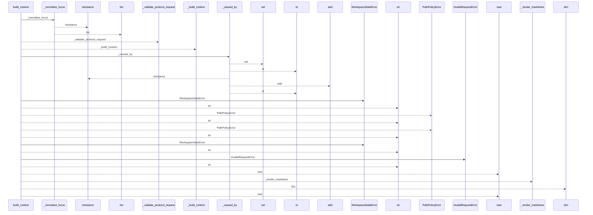
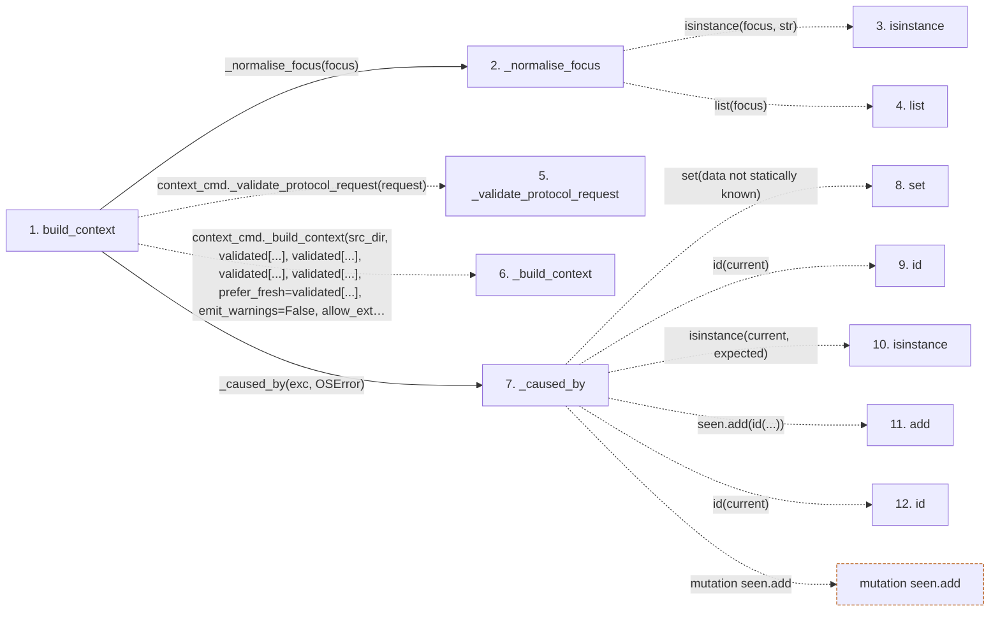

# build_context

**Entry point:** `build_context` (`api`)
**Source:** [api](../modules/api.md)
**Modules touched:** [api](../modules/api.md)

## Call sequence

<!-- Auto-generated from static call edges. Dashed arrows are external or unresolved calls. Reviewed runtime conditions and side effects belong in Behavior. -->

## Data flow

<!-- Auto-generated static analysis. Treat values and boundaries as best-effort hints, not runtime proof. -->

### Step data

| Step | Inputs | Reads | Writes | Returns |
|---|---|---|---|---|
| `build_context` | `src_dir: str`, `budget: int`, `format: str`, `focus: str \| list[str]`, `filters: dict[str, Any] \| None`, `wiki_dir: str`, `prefer_fresh: bool`, `allow_external_src: bool` | `context_cmd`, `PathValidationError`, `context_cmd`, `MarkdownContextResult`, `ContextPayload` | `result[...]` | `cast(...)`, `cast(...)` |
| `_normalise_focus` | `focus: str \| list[str]` | - | - | `[...]`, `[...]`, `[...]`, `list(...)` |
| `isinstance` | - | - | - | - |
| `list` | - | - | - | - |
| `_validate_protocol_request` | - | - | - | - |
| `_build_context` | - | - | - | - |
| `_caused_by` | `exc: BaseException`, `expected: type[BaseException]` | - | - | `True`, `False` |
| `set` | - | - | - | - |
| `id` | - | - | - | - |
| `isinstance` | - | - | - | - |
| `add` | - | - | - | - |
| `id` | - | - | - | - |

### Call data

| From | To | Line | Call |
|---|---|---:|---|
| build_context | _normalise_focus | 633 | `_normalise_focus(focus)` |
| _normalise_focus | isinstance | 1238 | `isinstance(focus, str)` |
| _normalise_focus | list | 1244 | `list(focus)` |
| build_context | _validate_protocol_request | 643 | `context_cmd._validate_protocol_request(request)` |
| build_context | _build_context | 644 | `context_cmd._build_context(src_dir, validated[...], validated[...], validated[...], validated[...], prefer_fresh=validated[...], emit_warnings=False, allow_external_src=allow_external_src, read_only=read_only, wiki_dir=wiki_dir, source_selection=source_selection)` |
| build_context | _caused_by | 658 | `_caused_by(exc, OSError)` |
| _caused_by | set | 382 | `set(data not statically known)` |
| _caused_by | id | 383 | `id(current)` |
| _caused_by | isinstance | 384 | `isinstance(current, expected)` |
| _caused_by | add | 386 | `seen.add(id(...))` |
| _caused_by | id | 386 | `id(current)` |

### Boundary effects

| Kind | Target | Step | Line |
|---|---|---|---:|
| mutation | `seen.add` | `_caused_by` | 386 |

### Static analysis gaps

| Kind | Step | Target | Line |
|---|---|---|---:|
| unresolved_call | `_normalise_focus` | `isinstance` | 1238 |
| external_call | `build_context` | `context_cmd._validate_protocol_request` | 643 |
| external_call | `build_context` | `context_cmd._build_context` | 644 |
| unresolved_call | `_caused_by` | `id` | 383 |
| unresolved_call | `_caused_by` | `isinstance` | 384 |
| step_limit | `build_context` | `first 12 steps` | 0 |

## Behavior

Normalizes focus values, validates the versioned context request, and builds a
token-bounded response from the selected source and wiki. JSON mode returns the
payload with any warnings; Markdown mode returns rendered content alongside the
same payload and warnings. Path, workspace, and request failures remain
separate public API categories, and read-only mode is the default.
