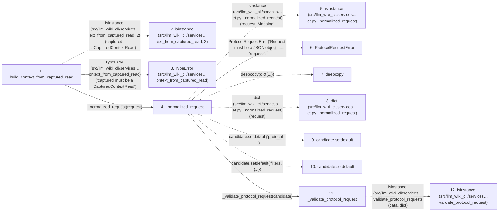

# build_context_from_captured_read

**Entry point:** `build_context_from_captured_read` (`api`)
**Source:** [context_packet](../modules/context_packet.md)
**Modules touched:** [context_packet](../modules/context_packet.md), [context_service](../modules/context_service.md), [documentation_queries](../modules/documentation_queries.md), and 3 more

**Complete modules touched:**

- [context_packet](../modules/context_packet.md)
- [context_service](../modules/context_service.md)
- [documentation_queries](../modules/documentation_queries.md)
- [knowledge_observability](../modules/knowledge_observability.md)
- [knowledge_verification](../modules/knowledge_verification.md)
- [wiki_surface](../modules/wiki_surface.md)

## Call sequence

```mermaid
sequenceDiagram
    participant p0 as build_context_from_captured_read
    participant p1 as isinstance (src/llm_wiki_cli/services…ext_from_captured_read, 2)
    participant p2 as TypeError (src/llm_wiki_cli/services…ontext_from_captured_read)
    participant p3 as _normalized_request
    participant p4 as isinstance (src/llm_wiki_cli/services…et.py:_normalized_request)
    participant p5 as ProtocolRequestError
    participant p6 as deepcopy
    participant p7 as dict (src/llm_wiki_cli/services…et.py:_normalized_request)
    participant p8 as candidate.setdefault
    participant p9 as _validate_protocol_request
    participant p10 as isinstance (src/llm_wiki_cli/services…validate_protocol_request)
    participant p11 as data.get (src/llm_wiki_cli/services…validate_protocol_request)
    participant p12 as _validate_protocol_request_impl
    participant p13 as isinstance (src/llm_wiki_cli/services…ate_protocol_request_impl)
    participant p14 as any (src/llm_wiki_cli/services…ate_protocol_request_impl)
    participant p15 as data.get (src/llm_wiki_cli/services…ate_protocol_request_impl)
    participant p16 as sorted (src/llm_wiki_cli/services…ate_protocol_request_impl)
    participant p17 as set (src/llm_wiki_cli/services…ate_protocol_request_impl)
    p0-->>p1: isinstance (src/llm_wiki_cli/services…ext_from_captured_read, 2)
    p0-->>p2: TypeError (src/llm_wiki_cli/services…ontext_from_captured_read)
    p0->>p3: _normalized_request
    p3-->>p4: isinstance (src/llm_wiki_cli/services…et.py:_normalized_request)
    p3->>p5: ProtocolRequestError
    p3-->>p6: deepcopy
    p3-->>p7: dict (src/llm_wiki_cli/services…et.py:_normalized_request)
    p3-->>p8: candidate.setdefault
    p3-->>p8: candidate.setdefault
    p3->>p9: _validate_protocol_request
    p9-->>p10: isinstance (src/llm_wiki_cli/services…validate_protocol_request)
    p9-->>p11: data.get (src/llm_wiki_cli/services…validate_protocol_request)
    p9->>p12: _validate_protocol_request_impl
    p12-->>p13: isinstance (src/llm_wiki_cli/services…ate_protocol_request_impl)
    p12->>p5: ProtocolRequestError
    p12-->>p14: any (src/llm_wiki_cli/services…ate_protocol_request_impl)
    p12-->>p13: isinstance (src/llm_wiki_cli/services…ate_protocol_request_impl)
    p12->>p5: ProtocolRequestError
    p12-->>p15: data.get (src/llm_wiki_cli/services…ate_protocol_request_impl)
    p12->>p5: ProtocolRequestError
    p12-->>p16: sorted (src/llm_wiki_cli/services…ate_protocol_request_impl)
    p12-->>p17: set (src/llm_wiki_cli/services…ate_protocol_request_impl)
    p12->>p5: ProtocolRequestError
    p12->>p5: ProtocolRequestError
    p12-->>p13: isinstance (src/llm_wiki_cli/services…ate_protocol_request_impl)
    p12-->>p13: isinstance (src/llm_wiki_cli/services…ate_protocol_request_impl)
    p12->>p5: ProtocolRequestError
    p12-->>p15: data.get (src/llm_wiki_cli/services…ate_protocol_request_impl)
    p12-->>p13: isinstance (src/llm_wiki_cli/services…ate_protocol_request_impl)
    p12->>p5: ProtocolRequestError
```

<!-- Auto-generated from static call edges. Dashed arrows are external or unresolved calls. Reviewed runtime conditions and side effects belong in Behavior. -->

> Call sequence diagram shows 30 of 598 interactions; 568 omitted to keep the visualization within the 30-interaction and generated-diagram limits.

> Trace truncated at the depth limit; deeper calls are omitted.

## Data flow

<!-- Auto-generated static analysis. Treat values and boundaries as best-effort hints, not runtime proof. -->

### Step data

| Step | Inputs | Reads | Writes | Returns |
|---|---|---|---|---|
| `build_context_from_captured_read` | `captured: CapturedContextRead`, `request: Mapping[str, Any]` | `CapturedContextRead`, `context_service` | - | `_build_legacy_context_from_captured_read(...)`, `_build_knowledge_context_from_captured_read(...)` |
| `isinstance (src/llm_wiki_cli/services…ext_from_captured_read, 2)` | - | - | - | - |
| `TypeError (src/llm_wiki_cli/services…ontext_from_captured_read)` | - | - | - | - |
| `_normalized_request` | `request: Mapping[str, Any]` | `Mapping`, `CONTEXT_KNOWLEDGE_PROTOCOL_VERSION`, `context_service` | - | `context_service._validate_protocol_request(...)` |
| `isinstance (src/llm_wiki_cli/services…et.py:_normalized_request)` | - | - | - | - |
| `ProtocolRequestError` | - | - | - | - |
| `deepcopy` | - | - | - | - |
| `dict (src/llm_wiki_cli/services…et.py:_normalized_request)` | - | - | - | - |
| `candidate.setdefault` | - | - | - | - |
| `candidate.setdefault` | - | - | - | - |
| `_validate_protocol_request` | `data: object` | `PROTOCOL_VERSION`, `ProtocolRequestError`, `PROTOCOL_VERSION`, `KNOWLEDGE_PROTOCOL_VERSION` | `exc.protocol` | `_validate_protocol_request_impl(...)` |
| `isinstance (src/llm_wiki_cli/services…validate_protocol_request)` | - | - | - | - |

### Call data

| From | To | Line | Call |
|---|---|---:|---|
| build_context_from_captured_read | isinstance (src/llm_wiki_cli/services…ext_from_captured_read, 2) | 859 | `isinstance(captured, CapturedContextRead)` |
| build_context_from_captured_read | TypeError (src/llm_wiki_cli/services…ontext_from_captured_read) | 860 | `TypeError('captured must be a CapturedContextRead')` |
| build_context_from_captured_read | _normalized_request | 861 | `_normalized_request(request)` |
| _normalized_request | isinstance (src/llm_wiki_cli/services…et.py:_normalized_request) | 1726 | `isinstance(request, Mapping)` |
| _normalized_request | ProtocolRequestError | 1727 | `context_service.ProtocolRequestError('Request must be a JSON object.', 'request')` |
| _normalized_request | deepcopy | 1731 | `deepcopy(dict(...))` |
| _normalized_request | dict (src/llm_wiki_cli/services…et.py:_normalized_request) | 1731 | `dict(request)` |
| _normalized_request | candidate.setdefault | 1732 | `candidate.setdefault('protocol', ...)` |
| _normalized_request | candidate.setdefault | 1740 | `candidate.setdefault('filters', {...})` |
| _normalized_request | _validate_protocol_request | 1741 | `context_service._validate_protocol_request(candidate)` |
| _validate_protocol_request | isinstance (src/llm_wiki_cli/services…validate_protocol_request) | 1071 | `isinstance(data, dict)` |

### Boundary effects

*No boundary effects detected.*

### Static analysis gaps

| Kind | Step | Target | Line |
|---|---|---|---:|
| external_call | `build_context_from_captured_read` | `isinstance` | 859 |
| external_call | `build_context_from_captured_read` | `TypeError` | 860 |
| external_call | `_normalized_request` | `isinstance` | 1726 |
| external_call | `_normalized_request` | `deepcopy` | 1731 |
| unresolved_call | `_normalized_request` | `candidate.setdefault` | 1732 |
| unresolved_call | `_normalized_request` | `candidate.setdefault` | 1740 |
| external_call | `_validate_protocol_request` | `isinstance` | 1071 |
| step_limit | `build_context_from_captured_read` | `first 12 steps` | 0 |
| truncated_flow | `build_context_from_captured_read` | `depth limit` | 0 |

## Behavior

This flow starts at `build_context_from_captured_read` and is classified as `api`. The generated call and data-flow sections are bounded static projections; runtime conditions and side effects require source-level confirmation.
