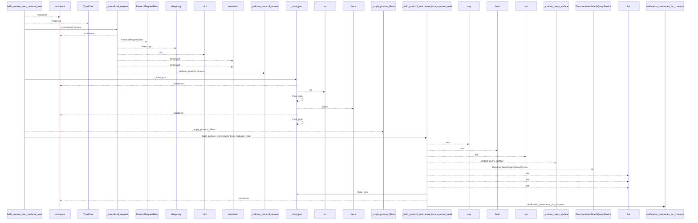
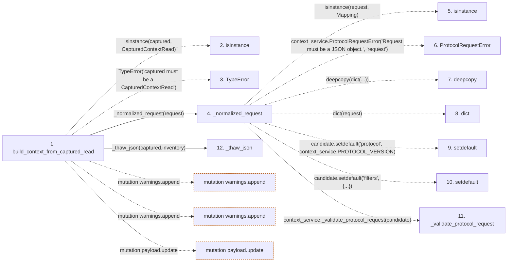

# build_context_from_captured_read

**Entry point:** `build_context_from_captured_read` (`api`)
**Source:** [context_packet](../modules/context_packet.md)
**Modules touched:** [context_packet](../modules/context_packet.md), [documentation_queries](../modules/documentation_queries.md), [knowledge_verification](../modules/knowledge_verification.md)

## Call sequence

<!-- Auto-generated from static call edges. Dashed arrows are external or unresolved calls. Reviewed runtime conditions and side effects belong in Behavior. -->

> Call sequence diagram shows 30 of 103 interactions; 73 omitted to keep the visualization within the 30-interaction and generated-diagram limits.

## Data flow

<!-- Auto-generated static analysis. Treat values and boundaries as best-effort hints, not runtime proof. -->

### Step data

| Step | Inputs | Reads | Writes | Returns |
|---|---|---|---|---|
| `build_context_from_captured_read` | `captured: CapturedContextRead`, `request: Mapping[str, Any]` | `CapturedContextRead` | `ranking_policy[...]`, `ranking_policy[...]` | `(...)` |
| `isinstance` | - | - | - | - |
| `TypeError` | - | - | - | - |
| `_normalized_request` | `request: Mapping[str, Any]` | `Mapping`, `context_service` | - | `context_service._validate_protocol_request(...)` |
| `isinstance` | - | - | - | - |
| `ProtocolRequestError` | - | - | - | - |
| `deepcopy` | - | - | - | - |
| `dict` | - | - | - | - |
| `setdefault` | - | - | - | - |
| `setdefault` | - | - | - | - |
| `_validate_protocol_request` | - | - | - | - |
| `_thaw_json` | `value: Any` | `Mapping` | - | `...`, `...`, `value` |

### Call data

| From | To | Line | Call |
|---|---|---:|---|
| build_context_from_captured_read | isinstance | 701 | `isinstance(captured, CapturedContextRead)` |
| build_context_from_captured_read | TypeError | 702 | `TypeError('captured must be a CapturedContextRead')` |
| build_context_from_captured_read | _normalized_request | 703 | `_normalized_request(request)` |
| _normalized_request | isinstance | 1098 | `isinstance(request, Mapping)` |
| _normalized_request | ProtocolRequestError | 1099 | `context_service.ProtocolRequestError('Request must be a JSON object.', 'request')` |
| _normalized_request | deepcopy | 1103 | `deepcopy(dict(...))` |
| _normalized_request | dict | 1103 | `dict(request)` |
| _normalized_request | setdefault | 1104 | `candidate.setdefault('protocol', context_service.PROTOCOL_VERSION)` |
| _normalized_request | setdefault | 1105 | `candidate.setdefault('filters', {...})` |
| _normalized_request | _validate_protocol_request | 1106 | `context_service._validate_protocol_request(candidate)` |
| build_context_from_captured_read | _thaw_json | 704 | `_thaw_json(captured.inventory)` |

### Boundary effects

| Kind | Target | Step | Line |
|---|---|---|---:|
| mutation | `warnings.append` | `build_context_from_captured_read` | 727 |
| mutation | `warnings.append` | `build_context_from_captured_read` | 733 |
| mutation | `payload.update` | `build_context_from_captured_read` | 790 |

### Static analysis gaps

| Kind | Step | Target | Line |
|---|---|---|---:|
| unresolved_call | `build_context_from_captured_read` | `isinstance` | 701 |
| unresolved_call | `build_context_from_captured_read` | `TypeError` | 702 |
| unresolved_call | `_normalized_request` | `isinstance` | 1098 |
| external_call | `_normalized_request` | `context_service.ProtocolRequestError` | 1099 |
| external_call | `_normalized_request` | `deepcopy` | 1103 |
| unresolved_call | `_normalized_request` | `candidate.setdefault` | 1104 |
| unresolved_call | `_normalized_request` | `candidate.setdefault` | 1105 |
| external_call | `_normalized_request` | `context_service._validate_protocol_request` | 1106 |
| step_limit | `build_context_from_captured_read` | `first 12 steps` | 0 |

## Behavior

This flow starts at `build_context_from_captured_read` and is classified as `api`. The generated call and data-flow sections are bounded static projections; runtime conditions and side effects require source-level confirmation.
