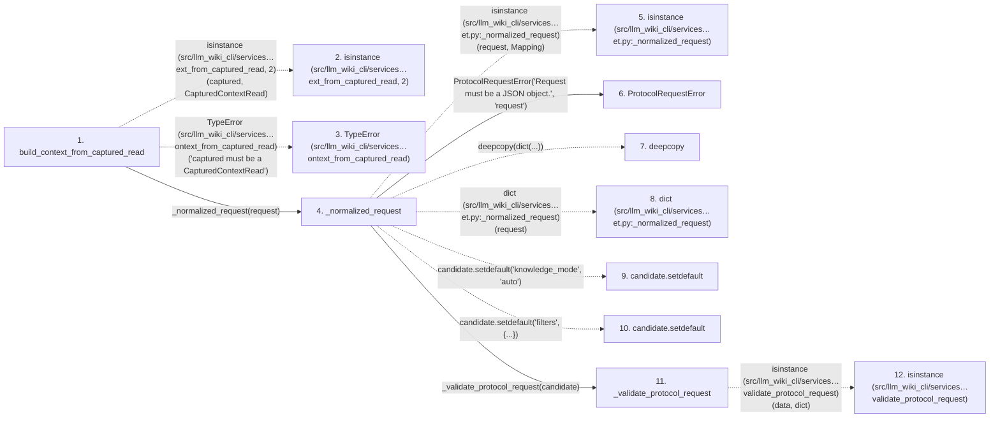

# build_context_from_captured_read

**Entry point:** `build_context_from_captured_read` (`api`)
**Source:** [context_packet](../modules/context_packet.md)
**Modules touched:** [change_selection](../modules/change_selection.md), [context_budget](../modules/context_budget.md), [context_packet](../modules/context_packet.md), [context_service](../modules/context_service.md), and 6 more

**Complete modules touched:**

- [change_selection](../modules/change_selection.md)
- [context_budget](../modules/context_budget.md)
- [context_packet](../modules/context_packet.md)
- [context_service](../modules/context_service.md)
- [documentation_queries](../modules/documentation_queries.md)
- [implementation_evidence](../modules/implementation_evidence.md)
- [knowledge_observability](../modules/knowledge_observability.md)
- [knowledge_verification](../modules/knowledge_verification.md)
- [maintenance_status](../modules/maintenance_status.md)
- [wiki_surface](../modules/wiki_surface.md)

## Call sequence

> Static overview in presentation order, not runtime execution order. Arrows retain captured callers; representative internal continuations and boundary examples precede repeated helper detail.

<!-- Auto-generated from static call edges. Dashed arrows are external or unresolved calls. Reviewed runtime conditions and side effects belong in Behavior. -->

```mermaid
sequenceDiagram
    participant p0 as build_context_from_captured_read
    participant p1 as _normalized_request
    participant p2 as _build_legacy_context_from_captured_read
    participant p3 as _build_knowledge_context_from_captured_read
    participant p4 as _thaw_json
    participant p5 as _apply_protocol_filters
    participant p6 as _build_protocol_enrichment_from_captured_read
    participant p7 as _captured_source_classification
    participant p8 as _validate_protocol_request
    participant p9 as _captured_query_service
    participant p10 as _build_import_graph
    participant p11 as _explicit_filter_enrichment_from_captured_read
    participant p12 as _build_context_payload_with_freshness_preference
    participant p13 as _captured_source_payload
    participant p14 as _build_explicit_knowledge_response
    participant p15 as _build_context_payload
    participant p16 as _empty_knowledge_bounds
    participant p17 as _validate_protocol_request_impl
    participant p18 as _matches_module_filter
    participant p19 as _context_query_surface
    participant p20 as verification_summaries_for_concepts
    participant p21 as _context_freshness_rank_by_source
    participant p22 as _compact_typed_graph_status
    participant p23 as _symbol_pages_payload
    participant p24 as _fit_explicit_knowledge_response
    participant p25 as _surface_filter_payload
    participant p26 as _append_knowledge_context_warning
    participant p27 as validate_request
    participant p28 as _entry_tokens
    participant p29 as isinstance (src/llm_wiki_cli/services…ext_from_captured_read, 2)
    participant p30 as warnings.append (src/llm_wiki_cli/services…ontext_from_captured_read)
    p0->>p1: _normalized_request
    p0->>p2: _build_legacy_context_from_captured_read
    p0->>p3: _build_knowledge_context_from_captured_read
    p2->>p4: _thaw_json
    p2->>p5: _apply_protocol_filters
    p2->>p6: _build_protocol_enrichment_from_captured_read
    p3->>p7: _captured_source_classification
    p1->>p8: _validate_protocol_request
    p3->>p9: _captured_query_service
    p2->>p10: _build_import_graph
    p3->>p11: _explicit_filter_enrichment_from_captured_read
    p2->>p12: _build_context_payload_with_freshness_preference
    p3->>p13: _captured_source_payload
    p3->>p14: _build_explicit_knowledge_response
    p12->>p15: _build_context_payload
    p14->>p16: _empty_knowledge_bounds
    p8->>p17: _validate_protocol_request_impl
    p5->>p18: _matches_module_filter
    p6->>p19: _context_query_surface
    p6->>p20: verification_summaries_for_concepts
    p6->>p21: _context_freshness_rank_by_source
    p6->>p22: _compact_typed_graph_status
    p6->>p23: _symbol_pages_payload
    p14->>p24: _fit_explicit_knowledge_response
    p6->>p25: _surface_filter_payload
    p6->>p26: _append_knowledge_context_warning
    p17->>p27: validate_request
    p15->>p28: _entry_tokens
    p0-->>p29: isinstance (src/llm_wiki_cli/services…ext_from_captured_read, 2)(captured, CapturedContextRead)
    p2-->>p30: warnings.append (src/llm_wiki_cli/services…ontext_from_captured_read)('Could not get changed files from git. Treating all files as high priority.')
```

> Call sequence diagram shows 30 of 672 interactions; 642 omitted to keep the visualization within the 30-interaction and generated-diagram limits, with uncertain identities omitted rather than inferred.

> Captured boundary calls: external 1 of 285 (284 omitted); unresolved 1 of 224 (223 omitted). These counts cover the captured static trace.

Omitted captured detail, grouped by actual caller occurrence and target module:

| Caller | Parent step | Target module | Kind | Omitted interactions |
| --- | --- | --- | --- | --- |
| `src/llm_wiki_cli/services/context_packet.py:build_context_from_captured_read` | 1 | - | external | 1 |
| `src/llm_wiki_cli/services/context_packet.py:_normalized_request` | 4 | - | external | 3 |
| `src/llm_wiki_cli/services/context_packet.py:_normalized_request` | 4 | [src/llm_wiki_cli/services/context_service.py](../modules/context_service.md) | internal | 1 |
| `src/llm_wiki_cli/services/context_packet.py:_normalized_request` | 4 | - | unresolved | 2 |
| `src/llm_wiki_cli/services/context_service.py:_validate_protocol_request` | 11 | - | external | 2 |
| `src/llm_wiki_cli/services/context_service.py:_validate_protocol_request` | 11 | - | unresolved | 1 |
| `src/llm_wiki_cli/services/context_service.py:_validate_protocol_request_impl` | 14 | - | external | 11 |
| `src/llm_wiki_cli/services/context_service.py:_validate_protocol_request_impl` | 14 | [src/llm_wiki_cli/services/context_service.py](../modules/context_service.md) | internal | 12 |
> Omission summary shows 8 of 163 groups; 155 further groups are not expanded here. Counts above include all omitted interactions.
> Detailed flow queries retain their own coverage and limits; omitted paths may execute at runtime.

> Trace truncated at the depth limit; deeper calls are omitted.

## Data flow

<!-- Auto-generated static analysis. Treat values and boundaries as best-effort hints, not runtime proof. -->

### Analysis coverage

**Effect analysis partially available.** Flow assembly and source effect analysis are separate; empty observations do not prove an empty handler body.

Source steps: 164; effect analysis evaluated: 123, partial: 3, unavailable: 38. Counts include steps omitted from the displayed trace.

Collector observations for 126 source steps with known totals: observed: 794, emitted: 789, omitted: 5. Unavailable totals are excluded.

- Callable record unavailable for one or more source steps; those steps have no represented callable body.
- Effect collector omitted observations before flow assembly; displayed effects are partial.
- Effect collector totals unavailable; observed counts cover captured records only.

| Step | Callable record | Effect analysis | Collector totals | Observed | Emitted | Omitted |
|---|---|---|---|---:|---:|---:|
| `build_context_from_captured_read` | `available` | `evaluated` | `available` | `7` | `7` | `0` |
| `isinstance (src/llm_wiki_cli/services…ext_from_captured_read, 2)` | `not_applicable` | `not_applicable` | `not_applicable` | — | — | — |
| `TypeError (src/llm_wiki_cli/services…ontext_from_captured_read)` | `not_applicable` | `not_applicable` | `not_applicable` | — | — | — |
| `_normalized_request` | `available` | `evaluated` | `available` | `5` | `5` | `0` |
| `isinstance (src/llm_wiki_cli/services…et.py:_normalized_request)` | `not_applicable` | `not_applicable` | `not_applicable` | — | — | — |
| `ProtocolRequestError` | `unavailable` | `unavailable` | `unavailable` | — | — | — |
| `deepcopy` | `not_applicable` | `not_applicable` | `not_applicable` | — | — | — |
| `dict (src/llm_wiki_cli/services…et.py:_normalized_request)` | `not_applicable` | `not_applicable` | `not_applicable` | — | — | — |
| `candidate.setdefault` | `not_applicable` | `not_applicable` | `not_applicable` | — | — | — |
| `candidate.setdefault` | `not_applicable` | `not_applicable` | `not_applicable` | — | — | — |
| `_validate_protocol_request` | `available` | `evaluated` | `available` | `7` | `7` | `0` |
| `isinstance (src/llm_wiki_cli/services…validate_protocol_request)` | `not_applicable` | `not_applicable` | `not_applicable` | — | — | — |

```mermaid
flowchart LR
    s1["1. build_context_from_captured_read"]
    s2["2. isinstance (src/llm_wiki_cli/services…ext_from_captured_read, 2)"]
    s3["3. TypeError (src/llm_wiki_cli/services…ontext_from_captured_read)"]
    s4["4. _normalized_request"]
    s5["5. isinstance (src/llm_wiki_cli/services…et.py:_normalized_request)"]
    s6["6. ProtocolRequestError"]
    s7["7. deepcopy"]
    s8["8. dict (src/llm_wiki_cli/services…et.py:_normalized_request)"]
    s9["9. candidate.setdefault"]
    s10["10. candidate.setdefault"]
    s11["11. _validate_protocol_request"]
    s12["12. isinstance (src/llm_wiki_cli/services…validate_protocol_request)"]
    s1 -. "isinstance (src/llm_wiki_cli/services…ext_from_captured_read, 2)(captured, CapturedContextRead)" .-> s2
    s1 -. "TypeError (src/llm_wiki_cli/services…ontext_from_captured_read)('captured must be a CapturedContextRead')" .-> s3
    s1 -->|"_normalized_request(request)"| s4
    s4 -. "isinstance (src/llm_wiki_cli/services…et.py:_normalized_request)(request, Mapping)" .-> s5
    s4 -->|"ProtocolRequestError('Request must be a JSON object.', 'request')"| s6
    s4 -. "deepcopy(dict(...))" .-> s7
    s4 -. "dict (src/llm_wiki_cli/services…et.py:_normalized_request)(request)" .-> s8
    s4 -. "candidate.setdefault('knowledge_mode', 'auto')" .-> s9
    s4 -. "candidate.setdefault('filters', {...})" .-> s10
    s4 -->|"_validate_protocol_request(candidate)"| s11
    s11 -. "isinstance (src/llm_wiki_cli/services…validate_protocol_request)(data, dict)" .-> s12
    click s1 "../modules/context_packet.md"
    click s4 "../modules/context_packet.md"
    click s6 "../modules/context_service.md"
    click s11 "../modules/context_service.md"
```

### Step data

| Step | Inputs | Reads | Writes | Returns |
|---|---|---|---|---|
| `build_context_from_captured_read` | `captured: CapturedContextRead`, `request: Mapping[str, Any]`, `freshness_ranking_out: dict[str, int] \| None` | `CapturedContextRead`, `context_service` | - | `_build_legacy_context_from_captured_read(...)`, `_build_knowledge_context_from_captured_read(...)` |
| `isinstance (src/llm_wiki_cli/services…ext_from_captured_read, 2)` | - | - | - | - |
| `TypeError (src/llm_wiki_cli/services…ontext_from_captured_read)` | - | - | - | - |
| `_normalized_request` | `request: Mapping[str, Any]` | `Mapping`, `CONTEXT_KNOWLEDGE_PROTOCOL_VERSION` | `candidate[...]` | `context_service._validate_protocol_request(...)` |
| `isinstance (src/llm_wiki_cli/services…et.py:_normalized_request)` | - | - | - | - |
| `ProtocolRequestError` | - | - | - | - |
| `deepcopy` | - | - | - | - |
| `dict (src/llm_wiki_cli/services…et.py:_normalized_request)` | - | - | - | - |
| `candidate.setdefault` | - | - | - | - |
| `candidate.setdefault` | - | - | - | - |
| `_validate_protocol_request` | `data: object` | `PROTOCOL_VERSION`, `ProtocolRequestError`, `PROTOCOL_VERSION`, `KNOWLEDGE_PROTOCOL_VERSION` | `exc.protocol` | `_validate_protocol_request_impl(...)` |
| `isinstance (src/llm_wiki_cli/services…validate_protocol_request)` | - | - | - | - |

### Call data

| From | To | Line | Call |
|---|---|---:|---|
| build_context_from_captured_read | isinstance (src/llm_wiki_cli/services…ext_from_captured_read, 2) | 1104 | `isinstance(captured, CapturedContextRead)` |
| build_context_from_captured_read | TypeError (src/llm_wiki_cli/services…ontext_from_captured_read) | 1105 | `TypeError('captured must be a CapturedContextRead')` |
| build_context_from_captured_read | _normalized_request | 1106 | `_normalized_request(request)` |
| _normalized_request | isinstance (src/llm_wiki_cli/services…et.py:_normalized_request) | 2017 | `isinstance(request, Mapping)` |
| _normalized_request | ProtocolRequestError | 2018 | `context_service.ProtocolRequestError('Request must be a JSON object.', 'request')` |
| _normalized_request | deepcopy | 2022 | `deepcopy(dict(...))` |
| _normalized_request | dict (src/llm_wiki_cli/services…et.py:_normalized_request) | 2022 | `dict(request)` |
| _normalized_request | candidate.setdefault | 2025 | `candidate.setdefault('knowledge_mode', 'auto')` |
| _normalized_request | candidate.setdefault | 2026 | `candidate.setdefault('filters', {...})` |
| _normalized_request | _validate_protocol_request | 2027 | `context_service._validate_protocol_request(candidate)` |
| _validate_protocol_request | isinstance (src/llm_wiki_cli/services…validate_protocol_request) | 1114 | `isinstance(data, dict)` |

### Boundary effects

*No boundary-effect observations were captured in this static trace.*

### Static analysis gaps

| Kind | Step | Target | Line |
|---|---|---|---:|
| external_call | `build_context_from_captured_read` | `isinstance` | 1104 |
| external_call | `build_context_from_captured_read` | `TypeError` | 1105 |
| external_call | `_normalized_request` | `isinstance` | 2017 |
| external_call | `_normalized_request` | `deepcopy` | 2022 |
| unresolved_call | `_normalized_request` | `candidate.setdefault` | 2025 |
| unresolved_call | `_normalized_request` | `candidate.setdefault` | 2026 |
| external_call | `_validate_protocol_request` | `isinstance` | 1114 |
| step_limit | `build_context_from_captured_read` | `first 12 steps` | 0 |
| truncated_flow | `build_context_from_captured_read` | `depth limit` | 0 |

## Behavior

This flow starts at `build_context_from_captured_read` and is classified as `api`. The generated call and data-flow sections are bounded static projections; runtime conditions and side effects require source-level confirmation.
