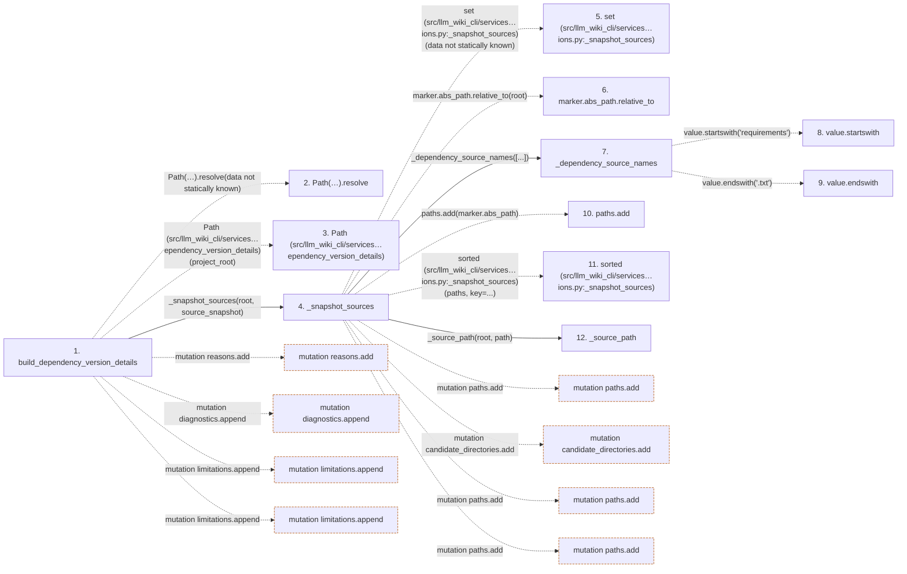

# build_dependency_version_details

**Entry point:** `build_dependency_version_details` (`api`)
**Source:** [dependency_versions](../modules/dependency_versions.md)
**Modules touched:** [config](../modules/config.md), [dependency_versions](../modules/dependency_versions.md)

## Call sequence

```mermaid
sequenceDiagram
    participant p0 as build_dependency_version_details
    participant p1 as Path(…).resolve
    participant p2 as Path (src/llm_wiki_cli/services…ependency_version_details)
    participant p3 as _snapshot_sources
    participant p4 as set (src/llm_wiki_cli/services…ions.py:_snapshot_sources)
    participant p5 as marker.abs_path.relative_to
    participant p6 as _dependency_source_names
    participant p7 as value.startswith
    participant p8 as value.endswith
    participant p9 as paths.add
    participant p10 as sorted (src/llm_wiki_cli/services…ions.py:_snapshot_sources)
    participant p11 as _source_path
    participant p12 as path.relative_to(…).as_posix
    participant p13 as path.relative_to
    participant p14 as snapshot.files_by_language.get
    participant p15 as candidate_directories.add
    participant p16 as cargo.is_file
    participant p17 as list
    participant p18 as manifest.name.startswith
    participant p19 as sibling.is_file
    participant p20 as _walk_sources
    participant p21 as os.walk
    participant p22 as Path (src/llm_wiki_cli/services…versions.py:_walk_sources)
    participant p23 as is_agent_worktree_path
    participant p24 as _normalized_rel_parts
    participant p25 as isinstance (src/llm_wiki_cli/config.py:_normalized_rel_parts)
    participant p26 as path.as_posix
    p0-->>p1: Path(…).resolve
    p0-->>p2: Path (src/llm_wiki_cli/services…ependency_version_details)
    p0->>p3: _snapshot_sources
    p3-->>p4: set (src/llm_wiki_cli/services…ions.py:_snapshot_sources)
    p3-->>p5: marker.abs_path.relative_to
    p3->>p6: _dependency_source_names
    p6-->>p7: value.startswith
    p6-->>p8: value.endswith
    p3-->>p9: paths.add
    p3-->>p10: sorted (src/llm_wiki_cli/services…ions.py:_snapshot_sources)
    p3->>p11: _source_path
    p11-->>p12: path.relative_to(…).as_posix
    p11-->>p13: path.relative_to
    p3-->>p14: snapshot.files_by_language.get
    p3-->>p15: candidate_directories.add
    p3-->>p16: cargo.is_file
    p3-->>p9: paths.add
    p3-->>p17: list
    p3-->>p18: manifest.name.startswith
    p3-->>p19: sibling.is_file
    p3-->>p9: paths.add
    p3-->>p10: sorted (src/llm_wiki_cli/services…ions.py:_snapshot_sources)
    p3->>p11: _source_path
    p0->>p20: _walk_sources
    p20-->>p21: os.walk
    p20-->>p22: Path (src/llm_wiki_cli/services…versions.py:_walk_sources)
    p20->>p23: is_agent_worktree_path
    p23->>p24: _normalized_rel_parts
    p24-->>p25: isinstance (src/llm_wiki_cli/config.py:_normalized_rel_parts)
    p24-->>p26: path.as_posix
```

<!-- Auto-generated from static call edges. Dashed arrows are external or unresolved calls. Reviewed runtime conditions and side effects belong in Behavior. -->

> Call sequence diagram shows 30 of 119 interactions; 89 omitted to keep the visualization within the 30-interaction and generated-diagram limits.

## Data flow

<!-- Auto-generated static analysis. Treat values and boundaries as best-effort hints, not runtime proof. -->

### Step data

| Step | Inputs | Reads | Writes | Returns |
|---|---|---|---|---|
| `build_dependency_version_details` | `project_root: str \| Path`, `source_snapshot: SourceSnapshot \| None` | `DEPENDENCY_VERSION_DETAILS_SCHEMA_VERSION` | - | `{...}` |
| `Path(…).resolve` | - | - | - | - |
| `Path (src/llm_wiki_cli/services…ependency_version_details)` | - | - | - | - |
| `_snapshot_sources` | `root: Path`, `snapshot: SourceSnapshot` | - | - | `sorted(...)`, `sorted(...)` |
| `set (src/llm_wiki_cli/services…ions.py:_snapshot_sources)` | - | - | - | - |
| `marker.abs_path.relative_to` | - | - | - | - |
| `_dependency_source_names` | `files: Iterable[str]` | `_SOURCE_NAMES` | - | `...` |
| `value.startswith` | - | - | - | - |
| `value.endswith` | - | - | - | - |
| `paths.add` | - | - | - | - |
| `sorted (src/llm_wiki_cli/services…ions.py:_snapshot_sources)` | - | - | - | - |
| `_source_path` | `root: Path`, `path: Path` | - | - | `...` |

### Call data

| From | To | Line | Call |
|---|---|---:|---|
| build_dependency_version_details | Path(…).resolve | 1437 | `Path(project_root).resolve(data not statically known)` |
| build_dependency_version_details | Path (src/llm_wiki_cli/services…ependency_version_details) | 1437 | `Path(project_root)` |
| build_dependency_version_details | _snapshot_sources | 1439 | `_snapshot_sources(root, source_snapshot)` |
| _snapshot_sources | set (src/llm_wiki_cli/services…ions.py:_snapshot_sources) | 161 | `set(data not statically known)` |
| _snapshot_sources | marker.abs_path.relative_to | 164 | `marker.abs_path.relative_to(root)` |
| _snapshot_sources | _dependency_source_names | 167 | `_dependency_source_names([...])` |
| _dependency_source_names | value.startswith | 156 | `value.startswith('requirements')` |
| _dependency_source_names | value.endswith | 156 | `value.endswith('.txt')` |
| _snapshot_sources | paths.add | 170 | `paths.add(marker.abs_path)` |
| _snapshot_sources | sorted (src/llm_wiki_cli/services…ions.py:_snapshot_sources) | 173 | `sorted(paths, key=...)` |
| _snapshot_sources | _source_path | 173 | `_source_path(root, path)` |

### Boundary effects

| Kind | Target | Step | Line |
|---|---|---|---:|
| mutation | `reasons.add` | `build_dependency_version_details` | 1521 |
| mutation | `diagnostics.append` | `build_dependency_version_details` | 1523 |
| mutation | `limitations.append` | `build_dependency_version_details` | 1541 |
| mutation | `limitations.append` | `build_dependency_version_details` | 1553 |
| mutation | `paths.add` | `_snapshot_sources` | 170 |
| mutation | `candidate_directories.add` | `_snapshot_sources` | 180 |
| mutation | `paths.add` | `_snapshot_sources` | 187 |
| mutation | `paths.add` | `_snapshot_sources` | 206 |

### Static analysis gaps

| Kind | Step | Target | Line |
|---|---|---|---:|
| unresolved_call | `build_dependency_version_details` | `Path(project_root).resolve` | 1437 |
| unresolved_call | `_snapshot_sources` | `marker.abs_path.relative_to` | 164 |
| unresolved_call | `_dependency_source_names` | `value.startswith` | 156 |
| unresolved_call | `_dependency_source_names` | `value.endswith` | 156 |
| external_call | `_snapshot_sources` | `sorted` | 173 |
| step_limit | `build_dependency_version_details` | `first 12 steps` | 0 |

## Behavior

This flow starts at `build_dependency_version_details` and is classified as `api`. The generated call and data-flow sections are bounded static projections; runtime conditions and side effects require source-level confirmation.
