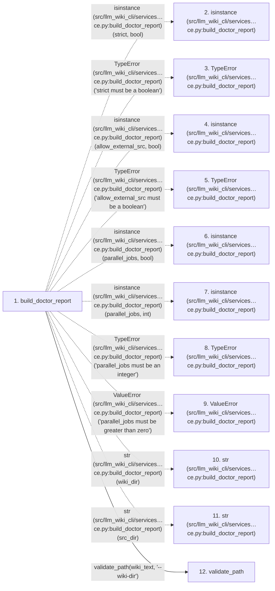

# build_doctor_report

**Entry point:** `build_doctor_report` (`api`)
**Source:** [doctor_service](../modules/doctor_service.md)
**Modules touched:** [bootstrap_runtime](../modules/bootstrap_runtime.md), [canonical_pages](../modules/canonical_pages.md), [common](../modules/common.md), [config](../modules/config.md), and 45 more

**Complete modules touched:**

- [bootstrap_runtime](../modules/bootstrap_runtime.md)
- [canonical_pages](../modules/canonical_pages.md)
- [common](../modules/common.md)
- [config](../modules/config.md)
- [data_flow](../modules/data_flow.md)
- [dependency_versions](../modules/dependency_versions.md)
- [doctor_service](../modules/doctor_service.md)
- [entrypoints](../modules/entrypoints.md)
- [extraction_jobs](../modules/extraction_jobs.md)
- [extraction_service](../modules/extraction_service.md)
- [filesystem_guard](../modules/filesystem_guard.md)
- [immutable](../modules/immutable.md)
- [imports](../modules/imports.md)
- [infrastructure_inventory](../modules/infrastructure_inventory.md)
- [infrastructure_sync](../modules/infrastructure_sync.md)
- [inventory_cache](../modules/inventory_cache.md)
- [io](../modules/io.md)
- [knowledge_artifacts](../modules/knowledge_artifacts.md)
- [knowledge_consumption](../modules/knowledge_consumption.md)
- [knowledge_envelope](../modules/knowledge_envelope.md)
- [knowledge_evidence](../modules/knowledge_evidence.md)
- [knowledge_freshness](../modules/knowledge_freshness.md)
- [knowledge_generation](../modules/knowledge_generation.md)
- [knowledge_governance](../modules/knowledge_governance.md)
- [knowledge_loader](../modules/knowledge_loader.md)
- [knowledge_model](../modules/knowledge_model.md)
- [knowledge_observability](../modules/knowledge_observability.md)
- [knowledge_orchestration](../modules/knowledge_orchestration.md)
- [knowledge_verification](../modules/knowledge_verification.md)
- [lint_service](../modules/lint_service.md)
- [packages](../modules/packages.md)
- [plugins](../modules/plugins.md)
- [progress](../modules/progress.md)
- [python_calls](../modules/python_calls.md)
- [python_contracts](../modules/python_contracts.md)
- [python_imports](../modules/python_imports.md)
- [python_observations](../modules/python_observations.md)
- [runtime_output](../modules/runtime_output.md)
- [services_dependencies](../modules/services_dependencies.md)
- [source_selection](../modules/source_selection.md)
- [source_snapshot](../modules/source_snapshot.md)
- [sync_analysis](../modules/sync_analysis.md)
- [sync_manifest](../modules/sync_manifest.md)
- [team](../modules/team.md)
- [validation](../modules/validation.md)
- [verification_contracts](../modules/verification_contracts.md)
- [wiki_lifecycle](../modules/wiki_lifecycle.md)
- [wiki_media](../modules/wiki_media.md)
- [wiki_surface](../modules/wiki_surface.md)

## Call sequence

```mermaid
sequenceDiagram
    participant p0 as build_doctor_report
    participant p1 as isinstance (src/llm_wiki_cli/services…ce.py:build_doctor_report)
    participant p2 as TypeError (src/llm_wiki_cli/services…ce.py:build_doctor_report)
    participant p3 as ValueError (src/llm_wiki_cli/services…ce.py:build_doctor_report)
    participant p4 as str (src/llm_wiki_cli/services…ce.py:build_doctor_report)
    participant p5 as validate_path
    participant p6 as PathValidationError
    participant p7 as (…).resolve (src/llm_wiki_cli/config.py:validate_path)
    participant p8 as Path.cwd (src/llm_wiki_cli/config.py:validate_path)
    participant p9 as Path.cwd().resolve (src/llm_wiki_cli/config.py:validate_path)
    participant p10 as resolved.relative_to (src/llm_wiki_cli/config.py:validate_path)
    participant p11 as validate_source_root
    participant p12 as Path(…).expanduser (src/llm_wiki_cli/config.py:validate_source_root)
    participant p13 as Path (src/llm_wiki_cli/config.py:validate_source_root)
    participant p14 as candidate.is_absolute
    participant p15 as Path.cwd (src/llm_wiki_cli/config.py:validate_source_root)
    participant p16 as candidate.resolve (src/llm_wiki_cli/config.py:validate_source_root)
    participant p17 as resolved.is_dir
    participant p18 as os.path.abspath (src/llm_wiki_cli/config.py:validate_source_root)
    p0-->>p1: isinstance (src/llm_wiki_cli/services…ce.py:build_doctor_report)
    p0-->>p2: TypeError (src/llm_wiki_cli/services…ce.py:build_doctor_report)
    p0-->>p1: isinstance (src/llm_wiki_cli/services…ce.py:build_doctor_report)
    p0-->>p2: TypeError (src/llm_wiki_cli/services…ce.py:build_doctor_report)
    p0-->>p1: isinstance (src/llm_wiki_cli/services…ce.py:build_doctor_report)
    p0-->>p1: isinstance (src/llm_wiki_cli/services…ce.py:build_doctor_report)
    p0-->>p2: TypeError (src/llm_wiki_cli/services…ce.py:build_doctor_report)
    p0-->>p3: ValueError (src/llm_wiki_cli/services…ce.py:build_doctor_report)
    p0-->>p4: str (src/llm_wiki_cli/services…ce.py:build_doctor_report)
    p0-->>p4: str (src/llm_wiki_cli/services…ce.py:build_doctor_report)
    p0->>p5: validate_path
    p5->>p6: PathValidationError
    p5-->>p7: (…).resolve (src/llm_wiki_cli/config.py:validate_path)
    p5-->>p8: Path.cwd (src/llm_wiki_cli/config.py:validate_path)
    p5-->>p9: Path.cwd().resolve (src/llm_wiki_cli/config.py:validate_path)
    p5-->>p8: Path.cwd (src/llm_wiki_cli/config.py:validate_path)
    p5-->>p10: resolved.relative_to (src/llm_wiki_cli/config.py:validate_path)
    p5->>p6: PathValidationError
    p0->>p11: validate_source_root
    p11->>p5: validate_path
    p11-->>p12: Path(…).expanduser (src/llm_wiki_cli/config.py:validate_source_root)
    p11-->>p13: Path (src/llm_wiki_cli/config.py:validate_source_root)
    p11-->>p14: candidate.is_absolute
    p11-->>p15: Path.cwd (src/llm_wiki_cli/config.py:validate_source_root)
    p11-->>p16: candidate.resolve (src/llm_wiki_cli/config.py:validate_source_root)
    p11->>p6: PathValidationError
    p11-->>p17: resolved.is_dir
    p11->>p6: PathValidationError
    p11-->>p13: Path (src/llm_wiki_cli/config.py:validate_source_root)
    p11-->>p18: os.path.abspath (src/llm_wiki_cli/config.py:validate_source_root)
```

<!-- Auto-generated from static call edges. Dashed arrows are external or unresolved calls. Reviewed runtime conditions and side effects belong in Behavior. -->

> Call sequence diagram shows 30 of 2695 interactions; 2665 omitted to keep the visualization within the 30-interaction and generated-diagram limits.

> Trace truncated at the depth limit; deeper calls are omitted.

## Data flow

<!-- Auto-generated static analysis. Treat values and boundaries as best-effort hints, not runtime proof. -->

### Step data

| Step | Inputs | Reads | Writes | Returns |
|---|---|---|---|---|
| `build_doctor_report` | `wiki_dir: str \| Path`, `src_dir: str \| Path`, `strict: bool`, `allow_external_src: bool`, `helper_cache_dir: str \| Path \| None`, `include_tests: Iterable[str] \| None`, `parallel_jobs: int`, `job_request: ExtractionJobRequest \| None` | - | - | `compose_doctor_report(...)` |
| `isinstance (src/llm_wiki_cli/services…ce.py:build_doctor_report)` | - | - | - | - |
| `TypeError (src/llm_wiki_cli/services…ce.py:build_doctor_report)` | - | - | - | - |
| `isinstance (src/llm_wiki_cli/services…ce.py:build_doctor_report)` | - | - | - | - |
| `TypeError (src/llm_wiki_cli/services…ce.py:build_doctor_report)` | - | - | - | - |
| `isinstance (src/llm_wiki_cli/services…ce.py:build_doctor_report)` | - | - | - | - |
| `isinstance (src/llm_wiki_cli/services…ce.py:build_doctor_report)` | - | - | - | - |
| `TypeError (src/llm_wiki_cli/services…ce.py:build_doctor_report)` | - | - | - | - |
| `ValueError (src/llm_wiki_cli/services…ce.py:build_doctor_report)` | - | - | - | - |
| `str (src/llm_wiki_cli/services…ce.py:build_doctor_report)` | - | - | - | - |
| `str (src/llm_wiki_cli/services…ce.py:build_doctor_report)` | - | - | - | - |
| `validate_path` | `path: str`, `label: str` | - | - | `resolved` |

### Call data

| From | To | Line | Call |
|---|---|---:|---|
| build_doctor_report | isinstance (src/llm_wiki_cli/services…ce.py:build_doctor_report) | 124 | `isinstance(strict, bool)` |
| build_doctor_report | TypeError (src/llm_wiki_cli/services…ce.py:build_doctor_report) | 125 | `TypeError('strict must be a boolean')` |
| build_doctor_report | isinstance (src/llm_wiki_cli/services…ce.py:build_doctor_report) | 126 | `isinstance(allow_external_src, bool)` |
| build_doctor_report | TypeError (src/llm_wiki_cli/services…ce.py:build_doctor_report) | 127 | `TypeError('allow_external_src must be a boolean')` |
| build_doctor_report | isinstance (src/llm_wiki_cli/services…ce.py:build_doctor_report) | 128 | `isinstance(parallel_jobs, bool)` |
| build_doctor_report | isinstance (src/llm_wiki_cli/services…ce.py:build_doctor_report) | 128 | `isinstance(parallel_jobs, int)` |
| build_doctor_report | TypeError (src/llm_wiki_cli/services…ce.py:build_doctor_report) | 129 | `TypeError('parallel_jobs must be an integer')` |
| build_doctor_report | ValueError (src/llm_wiki_cli/services…ce.py:build_doctor_report) | 131 | `ValueError('parallel_jobs must be greater than zero')` |
| build_doctor_report | str (src/llm_wiki_cli/services…ce.py:build_doctor_report) | 133 | `str(wiki_dir)` |
| build_doctor_report | str (src/llm_wiki_cli/services…ce.py:build_doctor_report) | 134 | `str(src_dir)` |
| build_doctor_report | validate_path | 135 | `validate_path(wiki_text, '--wiki-dir')` |

### Boundary effects

*No boundary effects detected.*

### Static analysis gaps

| Kind | Step | Target | Line |
|---|---|---|---:|
| external_call | `build_doctor_report` | `isinstance` | 124 |
| external_call | `build_doctor_report` | `TypeError` | 125 |
| external_call | `build_doctor_report` | `isinstance` | 126 |
| external_call | `build_doctor_report` | `TypeError` | 127 |
| external_call | `build_doctor_report` | `isinstance` | 128 |
| external_call | `build_doctor_report` | `TypeError` | 129 |
| external_call | `build_doctor_report` | `ValueError` | 131 |
| step_limit | `build_doctor_report` | `first 12 steps` | 0 |
| truncated_flow | `build_doctor_report` | `depth limit` | 0 |

## Behavior

This flow starts at `build_doctor_report` and is classified as `api`. The generated call and data-flow sections are bounded static projections; runtime conditions and side effects require source-level confirmation.
