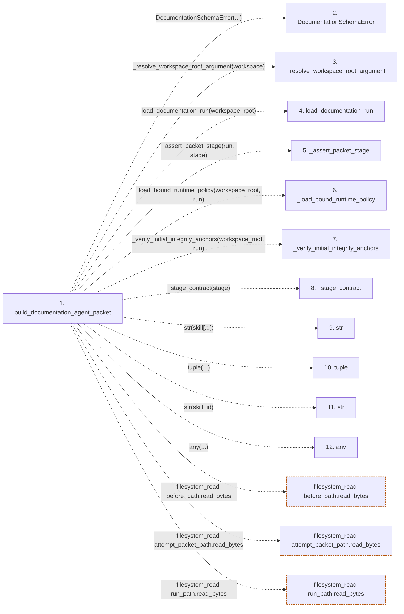

# build_documentation_agent_packet

**Entry point:** `build_documentation_agent_packet` (`api`)
**Source:** [packet](../modules/packet.md)
**Modules touched:** [packet](../modules/packet.md)

## Call sequence

```mermaid
sequenceDiagram
    participant p0 as build_documentation_agent_packet
    participant p1 as DocumentationSchemaError
    participant p2 as _resolve_workspace_root_argument
    participant p3 as load_documentation_run
    participant p4 as _assert_packet_stage
    participant p5 as _load_bound_runtime_policy
    participant p6 as _verify_initial_integrity_anchors
    participant p7 as _stage_contract
    participant p8 as str
    participant p9 as tuple
    participant p10 as any
    participant p11 as DocumentationIntegrityError
    participant p12 as DocumentationTransitionError
    participant p13 as transition_documentation_run
    participant p14 as _read_json
    participant p15 as _workspace_path
    participant p16 as _validated_worklist_counts
    participant p17 as run.stage_attempts.get
    participant p18 as capture_tree_baseline
    participant p19 as capture_generated_ownership
    participant p20 as _capture_control_integrity_snapshot
    participant p21 as _sha256_json
    participant p22 as _write_json
    participant p23 as before.to_dict
    participant p24 as _utc_now
    participant p25 as before_path.relative_to(…).as_posix
    participant p26 as before_path.relative_to
    participant p27 as hash_bytes
    p0-->>p1: DocumentationSchemaError
    p0-->>p2: _resolve_workspace_root_argument
    p0-->>p3: load_documentation_run
    p0-->>p4: _assert_packet_stage
    p0-->>p5: _load_bound_runtime_policy
    p0-->>p6: _verify_initial_integrity_anchors
    p0-->>p7: _stage_contract
    p0-->>p8: str
    p0-->>p9: tuple
    p0-->>p8: str
    p0-->>p10: any
    p0-->>p11: DocumentationIntegrityError
    p0-->>p12: DocumentationTransitionError
    p0-->>p13: transition_documentation_run
    p0-->>p14: _read_json
    p0-->>p15: _workspace_path
    p0-->>p14: _read_json
    p0-->>p15: _workspace_path
    p0-->>p16: _validated_worklist_counts
    p0-->>p17: run.stage_attempts.get
    p0-->>p18: capture_tree_baseline
    p0-->>p19: capture_generated_ownership
    p0-->>p20: _capture_control_integrity_snapshot
    p0-->>p21: _sha256_json
    p0-->>p22: _write_json
    p0-->>p23: before.to_dict
    p0-->>p24: _utc_now
    p0-->>p25: before_path.relative_to(…).as_posix
    p0-->>p26: before_path.relative_to
    p0-->>p27: hash_bytes
```

<!-- Auto-generated from static call edges. Dashed arrows are external or unresolved calls. Reviewed runtime conditions and side effects belong in Behavior. -->

> Call sequence diagram shows 30 of 68 interactions; 38 omitted to keep the visualization within the 30-interaction and generated-diagram limits.

## Data flow

<!-- Auto-generated static analysis. Treat values and boundaries as best-effort hints, not runtime proof. -->

### Step data

| Step | Inputs | Reads | Writes | Returns |
|---|---|---|---|---|
| `build_documentation_agent_packet` | `workspace: str \| Path`, `stage: str` | - | `run.current_stage`, `run.stage_attempts[...]` | `packet` |
| `DocumentationSchemaError` | - | - | - | - |
| `_resolve_workspace_root_argument` | - | - | - | - |
| `load_documentation_run` | - | - | - | - |
| `_assert_packet_stage` | - | - | - | - |
| `_load_bound_runtime_policy` | - | - | - | - |
| `_verify_initial_integrity_anchors` | - | - | - | - |
| `_stage_contract` | - | - | - | - |
| `str` | - | - | - | - |
| `tuple` | - | - | - | - |
| `str` | - | - | - | - |
| `any` | - | - | - | - |

### Call data

| From | To | Line | Call |
|---|---|---:|---|
| build_documentation_agent_packet | DocumentationSchemaError | 95 | `DocumentationSchemaError(...)` |
| build_documentation_agent_packet | _resolve_workspace_root_argument | 96 | `_resolve_workspace_root_argument(workspace)` |
| build_documentation_agent_packet | load_documentation_run | 97 | `load_documentation_run(workspace_root)` |
| build_documentation_agent_packet | _assert_packet_stage | 98 | `_assert_packet_stage(run, stage)` |
| build_documentation_agent_packet | _load_bound_runtime_policy | 99 | `_load_bound_runtime_policy(workspace_root, run)` |
| build_documentation_agent_packet | _verify_initial_integrity_anchors | 100 | `_verify_initial_integrity_anchors(workspace_root, run)` |
| build_documentation_agent_packet | _stage_contract | 101 | `_stage_contract(stage)` |
| build_documentation_agent_packet | str | 102 | `str(skill[...])` |
| build_documentation_agent_packet | tuple | 103 | `tuple(...)` |
| build_documentation_agent_packet | str | 103 | `str(skill_id)` |
| build_documentation_agent_packet | any | 106 | `any(...)` |

### Boundary effects

| Kind | Target | Step | Line |
|---|---|---|---:|
| filesystem_read | `before_path.read_bytes` | `build_documentation_agent_packet` | 166 |
| filesystem_read | `attempt_packet_path.read_bytes` | `build_documentation_agent_packet` | 295 |
| filesystem_read | `run_path.read_bytes` | `build_documentation_agent_packet` | 299 |

### Static analysis gaps

| Kind | Step | Target | Line |
|---|---|---|---:|
| unresolved_call | `build_documentation_agent_packet` | `DocumentationSchemaError` | 95 |
| unresolved_call | `build_documentation_agent_packet` | `_resolve_workspace_root_argument` | 96 |
| unresolved_call | `build_documentation_agent_packet` | `load_documentation_run` | 97 |
| unresolved_call | `build_documentation_agent_packet` | `_assert_packet_stage` | 98 |
| unresolved_call | `build_documentation_agent_packet` | `_load_bound_runtime_policy` | 99 |
| unresolved_call | `build_documentation_agent_packet` | `_verify_initial_integrity_anchors` | 100 |
| unresolved_call | `build_documentation_agent_packet` | `_stage_contract` | 101 |
| unresolved_call | `build_documentation_agent_packet` | `any` | 106 |
| step_limit | `build_documentation_agent_packet` | `first 12 steps` | 0 |

## Behavior

This flow starts at `build_documentation_agent_packet` and is classified as `api`. The generated call and data-flow sections are bounded static projections; runtime conditions and side effects require source-level confirmation.
