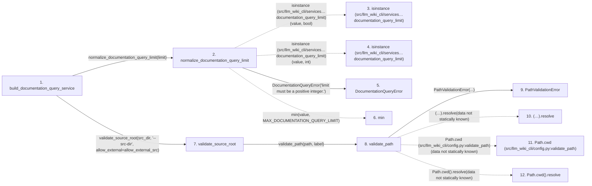

# build_documentation_query_service

**Entry point:** `build_documentation_query_service` (`api`)
**Source:** [api](../modules/api.md)
**Modules touched:** [api](../modules/api.md), [common](../modules/common.md), [config](../modules/config.md), [documentation_queries](../modules/documentation_queries.md), and 7 more

**Complete modules touched:**

- [api](../modules/api.md)
- [common](../modules/common.md)
- [config](../modules/config.md)
- [documentation_queries](../modules/documentation_queries.md)
- [documentation_query_builder](../modules/documentation_query_builder.md)
- [filesystem_guard](../modules/filesystem_guard.md)
- [io](../modules/io.md)
- [source_selection](../modules/source_selection.md)
- [source_snapshot](../modules/source_snapshot.md)
- [sync_manifest](../modules/sync_manifest.md)
- [validation](../modules/validation.md)

## Call sequence

```mermaid
sequenceDiagram
    participant p0 as build_documentation_query_service
    participant p1 as normalize_documentation_query_limit
    participant p2 as isinstance (src/llm_wiki_cli/services…documentation_query_limit)
    participant p3 as DocumentationQueryError
    participant p4 as min
    participant p5 as validate_source_root
    participant p6 as validate_path
    participant p7 as PathValidationError
    participant p8 as (…).resolve
    participant p9 as Path.cwd (src/llm_wiki_cli/config.py:validate_path)
    participant p10 as Path.cwd().resolve
    participant p11 as resolved.relative_to
    participant p12 as Path(…).expanduser
    participant p13 as Path (src/llm_wiki_cli/config.py:validate_source_root)
    participant p14 as candidate.is_absolute
    participant p15 as Path.cwd (src/llm_wiki_cli/config.py:validate_source_root)
    participant p16 as candidate.resolve
    participant p17 as resolved.is_dir
    participant p18 as os.path.abspath (src/llm_wiki_cli/config.py:validate_source_root)
    participant p19 as windows_current_user_sid
    participant p20 as WindowsSecurityGuardError
    participant p21 as _current_windows_user_sid
    participant p22 as ctypes.WinDLL (src/llm_wiki_cli/services…_current_windows_user_sid)
    participant p23 as ctypes.POINTER (src/llm_wiki_cli/services…_current_windows_user_sid)
    p0->>p1: normalize_documentation_query_limit
    p1-->>p2: isinstance (src/llm_wiki_cli/services…documentation_query_limit)
    p1-->>p2: isinstance (src/llm_wiki_cli/services…documentation_query_limit)
    p1->>p3: DocumentationQueryError
    p1-->>p4: min
    p0->>p5: validate_source_root
    p5->>p6: validate_path
    p6->>p7: PathValidationError
    p6-->>p8: (…).resolve
    p6-->>p9: Path.cwd (src/llm_wiki_cli/config.py:validate_path)
    p6-->>p10: Path.cwd().resolve
    p6-->>p9: Path.cwd (src/llm_wiki_cli/config.py:validate_path)
    p6-->>p11: resolved.relative_to
    p6->>p7: PathValidationError
    p5-->>p12: Path(…).expanduser
    p5-->>p13: Path (src/llm_wiki_cli/config.py:validate_source_root)
    p5-->>p14: candidate.is_absolute
    p5-->>p15: Path.cwd (src/llm_wiki_cli/config.py:validate_source_root)
    p5-->>p16: candidate.resolve
    p5->>p7: PathValidationError
    p5-->>p17: resolved.is_dir
    p5->>p7: PathValidationError
    p5-->>p13: Path (src/llm_wiki_cli/config.py:validate_source_root)
    p5-->>p18: os.path.abspath (src/llm_wiki_cli/config.py:validate_source_root)
    p5->>p19: windows_current_user_sid
    p19->>p20: WindowsSecurityGuardError
    p19->>p21: _current_windows_user_sid
    p21-->>p22: ctypes.WinDLL (src/llm_wiki_cli/services…_current_windows_user_sid)
    p21-->>p22: ctypes.WinDLL (src/llm_wiki_cli/services…_current_windows_user_sid)
    p21-->>p23: ctypes.POINTER (src/llm_wiki_cli/services…_current_windows_user_sid)
```

<!-- Auto-generated from static call edges. Dashed arrows are external or unresolved calls. Reviewed runtime conditions and side effects belong in Behavior. -->

> Call sequence diagram shows 30 of 728 interactions; 698 omitted to keep the visualization within the 30-interaction and generated-diagram limits.

> Trace truncated at the depth limit; deeper calls are omitted.

## Data flow

<!-- Auto-generated static analysis. Treat values and boundaries as best-effort hints, not runtime proof. -->

### Step data

| Step | Inputs | Reads | Writes | Returns |
|---|---|---|---|---|
| `build_documentation_query_service` | `src_dir: str`, `wiki_dir: str`, `limit: int`, `allow_external_src: bool`, `read_only: bool`, `source_selection: str \| Path \| None` | `extract_cmd`, `extract_cmd`, `extract_cmd`, `build_flow`, `evaluate_surface_index`, `context_cmd`, `context_cmd`, `analyze_dependencies` | - | `build_live_documentation_query_service(...)` |
| `normalize_documentation_query_limit` | `value: object` | `MAX_DOCUMENTATION_QUERY_LIMIT` | - | `min(...)` |
| `isinstance (src/llm_wiki_cli/services…documentation_query_limit)` | - | - | - | - |
| `isinstance (src/llm_wiki_cli/services…documentation_query_limit)` | - | - | - | - |
| `DocumentationQueryError` | - | - | - | - |
| `min` | - | - | - | - |
| `validate_source_root` | `path: str`, `label: str`, `allow_external: bool` | `sys`, `os`, `WindowsSecurityGuardError`, `sys` | - | `validate_path(...)`, `resolved` |
| `validate_path` | `path: str`, `label: str` | - | - | `resolved` |
| `PathValidationError` | - | - | - | - |
| `(…).resolve` | - | - | - | - |
| `Path.cwd (src/llm_wiki_cli/config.py:validate_path)` | - | - | - | - |
| `Path.cwd().resolve` | - | - | - | - |

### Call data

| From | To | Line | Call |
|---|---|---:|---|
| build_documentation_query_service | normalize_documentation_query_limit | 1136 | `normalize_documentation_query_limit(limit)` |
| normalize_documentation_query_limit | isinstance (src/llm_wiki_cli/services…documentation_query_limit) | 52 | `isinstance(value, bool)` |
| normalize_documentation_query_limit | isinstance (src/llm_wiki_cli/services…documentation_query_limit) | 52 | `isinstance(value, int)` |
| normalize_documentation_query_limit | DocumentationQueryError | 53 | `DocumentationQueryError('limit must be a positive integer.')` |
| normalize_documentation_query_limit | min | 54 | `min(value, MAX_DOCUMENTATION_QUERY_LIMIT)` |
| build_documentation_query_service | validate_source_root | 1137 | `validate_source_root(src_dir, '--src-dir', allow_external=allow_external_src)` |
| validate_source_root | validate_path | 158 | `validate_path(path, label)` |
| validate_path | PathValidationError | 132 | `PathValidationError(...)` |
| validate_path | (…).resolve | 133 | `(Path.cwd() / path).resolve(data not statically known)` |
| validate_path | Path.cwd (src/llm_wiki_cli/config.py:validate_path) | 133 | `Path.cwd(data not statically known)` |
| validate_path | Path.cwd().resolve | 134 | `Path.cwd().resolve(data not statically known)` |

### Boundary effects

*No boundary effects detected.*

### Static analysis gaps

| Kind | Step | Target | Line |
|---|---|---|---:|
| external_call | `normalize_documentation_query_limit` | `isinstance` | 52 |
| external_call | `normalize_documentation_query_limit` | `min` | 54 |
| unresolved_call | `validate_path` | `(Path.cwd() / path).resolve` | 133 |
| external_call | `validate_path` | `Path.cwd` | 133 |
| unresolved_call | `validate_path` | `Path.cwd().resolve` | 134 |
| step_limit | `build_documentation_query_service` | `first 12 steps` | 0 |
| truncated_flow | `build_documentation_query_service` | `depth limit` | 0 |

## Behavior

This flow starts at `build_documentation_query_service` and is classified as `api`. The generated call and data-flow sections are bounded static projections; runtime conditions and side effects require source-level confirmation.
