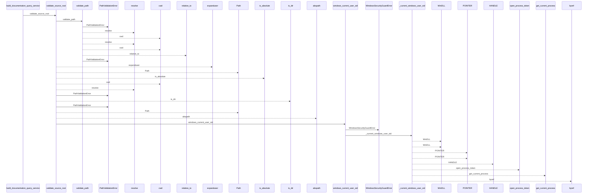
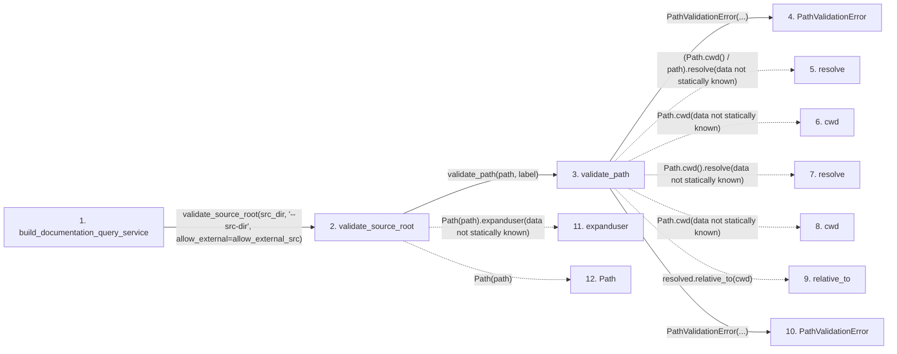

# build_documentation_query_service

**Entry point:** `build_documentation_query_service` (`api`)
**Source:** [api](../modules/api.md)
**Modules touched:** [api](../modules/api.md), [common](../modules/common.md), [config](../modules/config.md), [documentation_queries](../modules/documentation_queries.md), and 6 more

**Complete modules touched:**

- [api](../modules/api.md)
- [common](../modules/common.md)
- [config](../modules/config.md)
- [documentation_queries](../modules/documentation_queries.md)
- [documentation_query_builder](../modules/documentation_query_builder.md)
- [filesystem_guard](../modules/filesystem_guard.md)
- [io](../modules/io.md)
- [source_selection](../modules/source_selection.md)
- [source_snapshot](../modules/source_snapshot.md)
- [validation](../modules/validation.md)

## Call sequence

<!-- Auto-generated from static call edges. Dashed arrows are external or unresolved calls. Reviewed runtime conditions and side effects belong in Behavior. -->

> Call sequence diagram shows 30 of 481 interactions; 451 omitted to keep the visualization within the 30-interaction and generated-diagram limits.

> Trace truncated at the depth limit; deeper calls are omitted.

## Data flow

<!-- Auto-generated static analysis. Treat values and boundaries as best-effort hints, not runtime proof. -->

### Step data

| Step | Inputs | Reads | Writes | Returns |
|---|---|---|---|---|
| `build_documentation_query_service` | `src_dir: str`, `wiki_dir: str`, `limit: int`, `allow_external_src: bool`, `read_only: bool`, `source_selection: str \| Path \| None` | `extract_cmd`, `extract_cmd`, `extract_cmd`, `build_flow`, `evaluate_surface_index`, `context_cmd`, `context_cmd`, `analyze_dependencies` | - | `build_live_documentation_query_service(...)` |
| `validate_source_root` | `path: str`, `label: str`, `allow_external: bool` | `sys`, `os`, `WindowsSecurityGuardError`, `sys` | - | `validate_path(...)`, `resolved` |
| `validate_path` | `path: str`, `label: str` | - | - | `resolved` |
| `PathValidationError` | - | - | - | - |
| `resolve` | - | - | - | - |
| `cwd` | - | - | - | - |
| `resolve` | - | - | - | - |
| `cwd` | - | - | - | - |
| `relative_to` | - | - | - | - |
| `PathValidationError` | - | - | - | - |
| `expanduser` | - | - | - | - |
| `Path` | - | - | - | - |

### Call data

| From | To | Line | Call |
|---|---|---:|---|
| build_documentation_query_service | validate_source_root | 858 | `validate_source_root(src_dir, '--src-dir', allow_external=allow_external_src)` |
| validate_source_root | validate_path | 156 | `validate_path(path, label)` |
| validate_path | PathValidationError | 128 | `PathValidationError(...)` |
| validate_path | resolve | 131 | `(Path.cwd() / path).resolve(data not statically known)` |
| validate_path | cwd | 131 | `Path.cwd(data not statically known)` |
| validate_path | resolve | 132 | `Path.cwd().resolve(data not statically known)` |
| validate_path | cwd | 132 | `Path.cwd(data not statically known)` |
| validate_path | relative_to | 134 | `resolved.relative_to(cwd)` |
| validate_path | PathValidationError | 136 | `PathValidationError(...)` |
| validate_source_root | expanduser | 159 | `Path(path).expanduser(data not statically known)` |
| validate_source_root | Path | 159 | `Path(path)` |

### Boundary effects

*No boundary effects detected.*

### Static analysis gaps

| Kind | Step | Target | Line |
|---|---|---|---:|
| unresolved_call | `validate_path` | `(Path.cwd() / path).resolve` | 131 |
| external_call | `validate_path` | `Path.cwd` | 131 |
| external_call | `validate_path` | `Path.cwd().resolve` | 132 |
| external_call | `validate_path` | `Path.cwd` | 132 |
| unresolved_call | `validate_path` | `resolved.relative_to` | 134 |
| unresolved_call | `validate_source_root` | `Path(path).expanduser` | 159 |
| step_limit | `build_documentation_query_service` | `first 12 steps` | 0 |
| truncated_flow | `build_documentation_query_service` | `depth limit` | 0 |

## Behavior

This flow starts at `build_documentation_query_service` and is classified as `api`. The generated call and data-flow sections are bounded static projections; runtime conditions and side effects require source-level confirmation.
