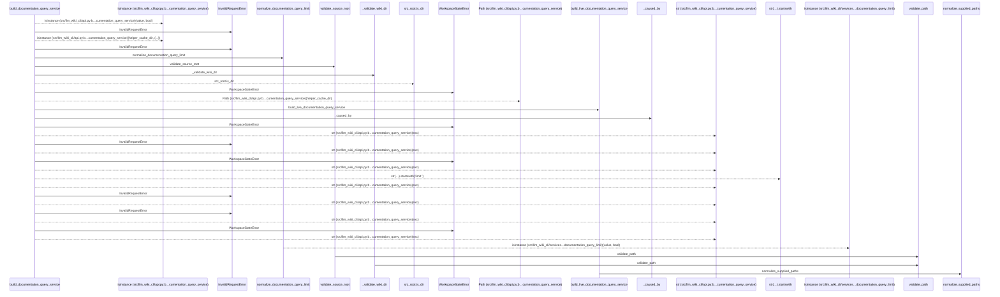
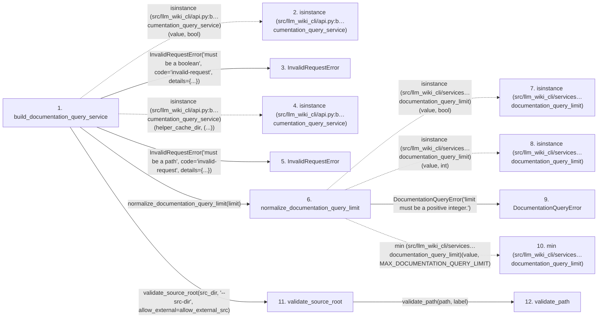

# build_documentation_query_service

**Entry point:** `build_documentation_query_service` (`api`)
**Source:** [api](../modules/api.md)
**Modules touched:** [api](../modules/api.md), [common](../modules/common.md), [config](../modules/config.md), [context_packet](../modules/context_packet.md), and 21 more

**Complete modules touched:**

- [api](../modules/api.md)
- [common](../modules/common.md)
- [config](../modules/config.md)
- [context_packet](../modules/context_packet.md)
- [documentation_queries](../modules/documentation_queries.md)
- [documentation_query_builder](../modules/documentation_query_builder.md)
- [filesystem_guard](../modules/filesystem_guard.md)
- [implementation_evidence](../modules/implementation_evidence.md)
- [io](../modules/io.md)
- [knowledge_consumption](../modules/knowledge_consumption.md)
- [knowledge_evidence](../modules/knowledge_evidence.md)
- [knowledge_storage](../modules/knowledge_storage.md)
- [knowledge_storage_io](../modules/knowledge_storage_io.md)
- [maintenance_evidence](../modules/maintenance_evidence.md)
- [maintenance_shapes](../modules/maintenance_shapes.md)
- [maintenance_state](../modules/maintenance_state.md)
- [maintenance_status](../modules/maintenance_status.md)
- [manifest_storage](../modules/manifest_storage.md)
- [markdown_sections](../modules/markdown_sections.md)
- [python_implementation](../modules/python_implementation.md)
- [section_ownership](../modules/section_ownership.md)
- [source_selection](../modules/source_selection.md)
- [source_snapshot](../modules/source_snapshot.md)
- [sync_manifest](../modules/sync_manifest.md)
- [validation](../modules/validation.md)

## Call sequence

> Static overview in presentation order, not runtime execution order. Arrows retain captured callers; siblings are shown before deeper helper detail.

<!-- Auto-generated from static call edges. Dashed arrows are external or unresolved calls. Reviewed runtime conditions and side effects belong in Behavior. -->

```mermaid
sequenceDiagram
    participant p0 as build_documentation_query_service
    participant p1 as isinstance (src/llm_wiki_cli/api.py:b…cumentation_query_service)
    participant p2 as InvalidRequestError
    participant p3 as normalize_documentation_query_limit
    participant p4 as validate_source_root
    participant p5 as _validate_wiki_dir
    participant p6 as src_root.is_dir
    participant p7 as WorkspaceStateError
    participant p8 as Path (src/llm_wiki_cli/api.py:b…cumentation_query_service)
    participant p9 as build_live_documentation_query_service
    participant p10 as _caused_by
    participant p11 as str (src/llm_wiki_cli/api.py:b…cumentation_query_service)
    participant p12 as str(…).startswith
    participant p13 as isinstance (src/llm_wiki_cli/services…documentation_query_limit)
    participant p14 as validate_path
    participant p15 as normalize_supplied_paths
    p0-->>p1: isinstance (src/llm_wiki_cli/api.py:b…cumentation_query_service)(value, bool)
    p0->>p2: InvalidRequestError
    p0-->>p1: isinstance (src/llm_wiki_cli/api.py:b…cumentation_query_service)(helper_cache_dir, (...))
    p0->>p2: InvalidRequestError
    p0->>p3: normalize_documentation_query_limit
    p0->>p4: validate_source_root
    p0->>p5: _validate_wiki_dir
    p0-->>p6: src_root.is_dir
    p0->>p7: WorkspaceStateError
    p0-->>p8: Path (src/llm_wiki_cli/api.py:b…cumentation_query_service)(helper_cache_dir)
    p0->>p9: build_live_documentation_query_service
    p0->>p10: _caused_by
    p0->>p7: WorkspaceStateError
    p0-->>p11: str (src/llm_wiki_cli/api.py:b…cumentation_query_service)(exc)
    p0->>p2: InvalidRequestError
    p0-->>p11: str (src/llm_wiki_cli/api.py:b…cumentation_query_service)(exc)
    p0->>p7: WorkspaceStateError
    p0-->>p11: str (src/llm_wiki_cli/api.py:b…cumentation_query_service)(exc)
    p0-->>p12: str(…).startswith('limit ')
    p0-->>p11: str (src/llm_wiki_cli/api.py:b…cumentation_query_service)(exc)
    p0->>p2: InvalidRequestError
    p0-->>p11: str (src/llm_wiki_cli/api.py:b…cumentation_query_service)(exc)
    p0->>p2: InvalidRequestError
    p0-->>p11: str (src/llm_wiki_cli/api.py:b…cumentation_query_service)(exc)
    p0->>p7: WorkspaceStateError
    p0-->>p11: str (src/llm_wiki_cli/api.py:b…cumentation_query_service)(exc)
    p3-->>p13: isinstance (src/llm_wiki_cli/services…documentation_query_limit)(value, bool)
    p4->>p14: validate_path
    p5->>p14: validate_path
    p9->>p15: normalize_supplied_paths
```

> Call sequence diagram shows 30 of 1795 interactions; 1765 omitted to keep the visualization within the 30-interaction and generated-diagram limits, with uncertain identities omitted rather than inferred.

> Captured boundary calls: external 11 of 650 (639 omitted); unresolved 2 of 468 (466 omitted). These counts cover the captured static trace.

Omitted captured detail, grouped by actual caller occurrence and target module:

| Caller | Parent step | Target module | Kind | Omitted interactions |
| --- | --- | --- | --- | --- |
| `src/llm_wiki_cli/services/documentation_query_builder.py:normalize_documentation_query_limit` | 6 | - | external | 2 |
| `src/llm_wiki_cli/services/documentation_query_builder.py:normalize_documentation_query_limit` | 6 | [src/llm_wiki_cli/services/documentation_queries.py](../modules/documentation_queries.md) | internal | 1 |
| `src/llm_wiki_cli/config.py:validate_path` | 12 | [src/llm_wiki_cli/config.py](../modules/config.md) | internal | 2 |
| `src/llm_wiki_cli/config.py:validate_path` | 12 | - | unresolved | 3 |
| `src/llm_wiki_cli/config.py:validate_path` | 12 | - | external | 2 |
| `src/llm_wiki_cli/config.py:validate_source_root` | 11 | - | unresolved | 5 |
| `src/llm_wiki_cli/config.py:validate_source_root` | 11 | - | external | 11 |
| `src/llm_wiki_cli/config.py:validate_source_root` | 11 | [src/llm_wiki_cli/config.py](../modules/config.md) | internal | 6 |
> Omission summary shows 8 of 433 groups; 425 further groups are not expanded here. Counts above include all omitted interactions.
> Detailed flow queries retain their own coverage and limits; omitted paths may execute at runtime.

> Trace truncated at the depth limit; deeper calls are omitted.

## Data flow

<!-- Auto-generated static analysis. Treat values and boundaries as best-effort hints, not runtime proof. -->

```mermaid
flowchart LR
    s1["1. build_documentation_query_service"]
    s2["2. isinstance (src/llm_wiki_cli/api.py:b…cumentation_query_service)"]
    s3["3. InvalidRequestError"]
    s4["4. isinstance (src/llm_wiki_cli/api.py:b…cumentation_query_service)"]
    s5["5. InvalidRequestError"]
    s6["6. normalize_documentation_query_limit"]
    s7["7. isinstance (src/llm_wiki_cli/services…documentation_query_limit)"]
    s8["8. isinstance (src/llm_wiki_cli/services…documentation_query_limit)"]
    s9["9. DocumentationQueryError"]
    s10["10. min (src/llm_wiki_cli/services…documentation_query_limit)"]
    s11["11. validate_source_root"]
    s12["12. validate_path"]
    s1 -. "isinstance (src/llm_wiki_cli/api.py:b…cumentation_query_service)(value, bool)" .-> s2
    s1 -->|"InvalidRequestError('must be a boolean', code='invalid-request', details={...})"| s3
    s1 -. "isinstance (src/llm_wiki_cli/api.py:b…cumentation_query_service)(helper_cache_dir, (...))" .-> s4
    s1 -->|"InvalidRequestError('must be a path', code='invalid-request', details={...})"| s5
    s1 -->|"normalize_documentation_query_limit(limit)"| s6
    s6 -. "isinstance (src/llm_wiki_cli/services…documentation_query_limit)(value, bool)" .-> s7
    s6 -. "isinstance (src/llm_wiki_cli/services…documentation_query_limit)(value, int)" .-> s8
    s6 -->|"DocumentationQueryError('limit must be a positive integer.')"| s9
    s6 -. "min (src/llm_wiki_cli/services…documentation_query_limit)(value, MAX_DOCUMENTATION_QUERY_LIMIT)" .-> s10
    s1 -->|"validate_source_root(src_dir, '--src-dir', allow_external=allow_external_src)"| s11
    s11 -->|"validate_path(path, label)"| s12
    click s1 "../modules/api.md"
    click s3 "../modules/api.md"
    click s5 "../modules/api.md"
    click s6 "../modules/documentation_query_builder.md"
    click s9 "../modules/documentation_queries.md"
    click s11 "../modules/config.md"
    click s12 "../modules/config.md"
```

### Step data

| Step | Inputs | Reads | Writes | Returns |
|---|---|---|---|---|
| `build_documentation_query_service` | `src_dir: str`, `wiki_dir: str`, `limit: int`, `allow_external_src: bool`, `read_only: bool`, `source_selection: str \| Path \| None`, `helper_cache_dir: str \| Path \| None`, `comparison_policy: str \| None` | `Path`, `extract_cmd`, `extract_cmd`, `extract_cmd`, `build_flow`, `evaluate_surface_index`, `context_cmd`, `context_cmd` | - | `build_live_documentation_query_service(...)` |
| `isinstance (src/llm_wiki_cli/api.py:b…cumentation_query_service)` | - | - | - | - |
| `InvalidRequestError` | - | - | - | - |
| `isinstance (src/llm_wiki_cli/api.py:b…cumentation_query_service)` | - | - | - | - |
| `InvalidRequestError` | - | - | - | - |
| `normalize_documentation_query_limit` | `value: object` | `MAX_DOCUMENTATION_QUERY_LIMIT` | - | `min(...)` |
| `isinstance (src/llm_wiki_cli/services…documentation_query_limit)` | - | - | - | - |
| `isinstance (src/llm_wiki_cli/services…documentation_query_limit)` | - | - | - | - |
| `DocumentationQueryError` | - | - | - | - |
| `min (src/llm_wiki_cli/services…documentation_query_limit)` | - | - | - | - |
| `validate_source_root` | `path: str`, `label: str`, `allow_external: bool` | `sys`, `os`, `WindowsSecurityGuardError`, `sys` | - | `validate_path(...)`, `resolved` |
| `validate_path` | `path: str`, `label: str` | - | - | `resolved` |

### Call data

| From | To | Line | Call |
|---|---|---:|---|
| build_documentation_query_service | isinstance (src/llm_wiki_cli/api.py:b…cumentation_query_service) | 1900 | `isinstance(value, bool)` |
| build_documentation_query_service | InvalidRequestError | 1901 | `InvalidRequestError('must be a boolean', code='invalid-request', details={...})` |
| build_documentation_query_service | isinstance (src/llm_wiki_cli/api.py:b…cumentation_query_service) | 1906 | `isinstance(helper_cache_dir, (...))` |
| build_documentation_query_service | InvalidRequestError | 1909 | `InvalidRequestError('must be a path', code='invalid-request', details={...})` |
| build_documentation_query_service | normalize_documentation_query_limit | 1914 | `normalize_documentation_query_limit(limit)` |
| normalize_documentation_query_limit | isinstance (src/llm_wiki_cli/services…documentation_query_limit) | 56 | `isinstance(value, bool)` |
| normalize_documentation_query_limit | isinstance (src/llm_wiki_cli/services…documentation_query_limit) | 56 | `isinstance(value, int)` |
| normalize_documentation_query_limit | DocumentationQueryError | 57 | `DocumentationQueryError('limit must be a positive integer.')` |
| normalize_documentation_query_limit | min (src/llm_wiki_cli/services…documentation_query_limit) | 58 | `min(value, MAX_DOCUMENTATION_QUERY_LIMIT)` |
| build_documentation_query_service | validate_source_root | 1915 | `validate_source_root(src_dir, '--src-dir', allow_external=allow_external_src)` |
| validate_source_root | validate_path | 160 | `validate_path(path, label)` |

### Boundary effects

*No boundary effects detected.*

### Static analysis gaps

| Kind | Step | Target | Line |
|---|---|---|---:|
| external_call | `build_documentation_query_service` | `isinstance` | 1900 |
| external_call | `build_documentation_query_service` | `isinstance` | 1906 |
| external_call | `normalize_documentation_query_limit` | `isinstance` | 56 |
| external_call | `normalize_documentation_query_limit` | `min` | 58 |
| step_limit | `build_documentation_query_service` | `first 12 steps` | 0 |
| truncated_flow | `build_documentation_query_service` | `depth limit` | 0 |

## Behavior

This flow starts at `build_documentation_query_service` and is classified as `api`. The generated call and data-flow sections are bounded static projections; runtime conditions and side effects require source-level confirmation.
