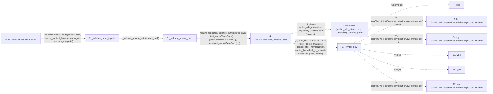

# build_entity_observation_basis

**Entry point:** `build_entity_observation_basis` (`api`)
**Source:** [knowledge_evidence](../modules/knowledge_evidence.md)
**Modules touched:** [knowledge_evidence](../modules/knowledge_evidence.md), [validation](../modules/validation.md)

## Call sequence

> Static overview in presentation order, not runtime execution order. Arrows retain captured callers; representative internal continuations and boundary examples precede repeated helper detail.

<!-- Auto-generated from static call edges. Dashed arrows are external or unresolved calls. Reviewed runtime conditions and side effects belong in Behavior. -->

```mermaid
sequenceDiagram
    participant p0 as build_entity_observation_basis
    participant p1 as _validate_basis_inputs
    participant p2 as _validate_entity_coordinate
    participant p3 as _unknown_basis
    participant p4 as _normalize_entity_observation
    participant p5 as hash_json
    participant p6 as ConceptObservationBasis
    participant p7 as _validate_source_path
    participant p8 as _inventory_language
    participant p9 as _validate_hash
    participant p10 as canonical_json_bytes
    participant p11 as _validate_extractor_ref
    participant p12 as require_positive_int
    participant p13 as _record_array
    participant p14 as _validate_inventory_complete
    participant p15 as _record_name
    participant p16 as _validate_entity_record
    participant p17 as _structural_copy
    participant p18 as require_repository_relative_path
    participant p19 as require_sha256
    participant p20 as require_nonnegative_int
    participant p21 as _validate_module_entity_record
    participant p22 as _optional_record_array
    participant p23 as _validate_optional_json_array
    participant p24 as _validate_optional_mapping
    participant p25 as _validate_optional_record_array
    participant p26 as _validate_optional_booleans
    participant p27 as _validate_callable_record
    participant p28 as require_mapping_list
    participant p29 as ValueError (src/llm_wiki_cli/services…alidate_entity_coordinate)
    participant p30 as sha256_bytes
    participant p31 as hashlib.sha256(…).hexdigest
    p0->>p1: _validate_basis_inputs
    p0->>p2: _validate_entity_coordinate
    p0->>p3: _unknown_basis
    p0->>p4: _normalize_entity_observation
    p0->>p5: hash_json
    p0->>p6: ConceptObservationBasis
    p1->>p7: _validate_source_path
    p4->>p8: _inventory_language
    p1->>p9: _validate_hash
    p5->>p10: canonical_json_bytes
    p1->>p11: _validate_extractor_ref
    p2->>p12: require_positive_int
    p4->>p13: _record_array
    p1->>p14: _validate_inventory_complete
    p4->>p15: _record_name
    p4->>p16: _validate_entity_record
    p4->>p17: _structural_copy
    p7->>p18: require_repository_relative_path
    p9->>p19: require_sha256
    p12->>p20: require_nonnegative_int
    p16->>p21: _validate_module_entity_record
    p16->>p22: _optional_record_array
    p16->>p23: _validate_optional_json_array
    p16->>p24: _validate_optional_mapping
    p16->>p25: _validate_optional_record_array
    p16->>p26: _validate_optional_booleans
    p16->>p27: _validate_callable_record
    p22->>p28: require_mapping_list
    p2-->>p29: ValueError (src/llm_wiki_cli/services…alidate_entity_coordinate)('entity_name must be a non-empty string')
    p30-->>p31: hashlib.sha256(…).hexdigest
```

> Call sequence diagram shows 30 of 214 interactions; 184 omitted to keep the visualization within the 30-interaction and generated-diagram limits, with uncertain identities omitted rather than inferred.

> Captured boundary calls: external 1 of 60 (59 omitted); unresolved 1 of 38 (37 omitted). These counts cover the captured static trace.

Omitted captured detail, grouped by actual caller occurrence and target module:

| Caller | Parent step | Target module | Kind | Omitted interactions |
| --- | --- | --- | --- | --- |
| `src/llm_wiki_cli/services/validation.py:require_repository_relative_path` | 4 | - | external | 7 |
| `src/llm_wiki_cli/services/validation.py:require_repository_relative_path` | 4 | [src/llm_wiki_cli/services/validation.py](../modules/validation.md) | internal | 4 |
| `src/llm_wiki_cli/services/validation.py:_syntax_key` | 6 | - | external | 6 |
| `src/llm_wiki_cli/services/validation.py:_known_syntax` | 13 | - | unresolved | 2 |
| `src/llm_wiki_cli/services/validation.py:require_repository_relative_path` | 4 | - | unresolved | 5 |
| `src/llm_wiki_cli/services/validation.py:require_portable_relative_path` | 27 | - | external | 4 |
| `src/llm_wiki_cli/services/validation.py:require_portable_relative_path` | 27 | [src/llm_wiki_cli/services/validation.py](../modules/validation.md) | internal | 13 |
| `src/llm_wiki_cli/services/validation.py:_default_path_error` | 29 | [src/llm_wiki_cli/services/validation.py](../modules/validation.md) | internal | 1 |
> Omission summary shows 8 of 78 groups; 70 further groups are not expanded here. Counts above include all omitted interactions.
> Detailed flow queries retain their own coverage and limits; omitted paths may execute at runtime.

> Trace truncated at the depth limit; deeper calls are omitted.

## Data flow

<!-- Auto-generated static analysis. Treat values and boundaries as best-effort hints, not runtime proof. -->

```mermaid
flowchart LR
    s1["1. build_entity_observation_basis"]
    s2["2. _validate_basis_inputs"]
    s3["3. _validate_source_path"]
    s4["4. require_repository_relative_path"]
    s5["5. isinstance (src/llm_wiki_cli/services…_repository_relative_path)"]
    s6["6. _syntax_key"]
    s7["7. type"]
    s8["8. len (src/llm_wiki_cli/services/validation.py:_syntax_key)"]
    s9["9. any (src/llm_wiki_cli/services/validation.py:_syntax_key)"]
    s10["10. type"]
    s11["11. type"]
    s12["12. len (src/llm_wiki_cli/services/validation.py:_syntax_key)"]
    s1 -->|"_validate_basis_inputs(source_path, source_content_hash, extractor_ref, inventory_complete)"| s2
    s2 -->|"_validate_source_path(source_path)"| s3
    s3 -->|"require_repository_relative_path(source_path, text_error=ValueError(...), posix_error=ValueError(...), normalized_error=ValueError(...))"| s4
    s4 -. "isinstance (src/llm_wiki_cli/services…_repository_relative_path)(value, str)" .-> s5
    s4 -->|"_syntax_key('repository', value, reject_delete_character, control_after_normalization, leading_backslash_is_absolute, normalize_posix_spelling)"| s6
    s6 -. "type(value)" .-> s7
    s6 -. "len (src/llm_wiki_cli/services/validation.py:_syntax_key)(value)" .-> s8
    s6 -. "any (src/llm_wiki_cli/services/validation.py:_syntax_key)(...)" .-> s9
    s6 -. "type(v)" .-> s10
    s6 -. "type(v)" .-> s11
    s6 -. "len (src/llm_wiki_cli/services/validation.py:_syntax_key)(v)" .-> s12
    click s1 "../modules/knowledge_evidence.md"
    click s2 "../modules/knowledge_evidence.md"
    click s3 "../modules/knowledge_evidence.md"
    click s4 "../modules/validation.md"
    click s6 "../modules/validation.md"
```

### Step data

| Step | Inputs | Reads | Writes | Returns |
|---|---|---|---|---|
| `build_entity_observation_basis` | `source_path: str`, `file_data: Mapping[str, Any] \| None`, `entity_name: str`, `occurrence: int`, `source_content_hash: str`, `extractor_ref: str`, `inventory_complete: bool` | `ENTITY_OBSERVATION_SCOPE`, `UNKNOWN_INSUFFICIENT_INVENTORY`, `_InventoryNormalizationError`, `ENTITY_OBSERVATION_SCOPE`, `ENTITY_OBSERVATION_SCOPE`, `UNKNOWN_INVALID_INVENTORY`, `ENTITY_OBSERVATION_SCOPE` | - | `_unknown_basis(...)`, `_unknown_basis(...)`, `_unknown_basis(...)`, `ConceptObservationBasis(...)` |
| `_validate_basis_inputs` | `source_path: object`, `source_content_hash: object`, `extractor_ref: object`, `inventory_complete: object` | - | - | - |
| `_validate_source_path` | `source_path: object` | - | - | - |
| `require_repository_relative_path` | `value: object`, `text_error: Exception`, `posix_error: Exception`, `normalized_error: Exception`, `absolute_error: Exception \| None`, `separator_error: Exception \| None`, `control_error: Exception \| None`, `reject_delete_character: bool` | - | - | `cached`, `_remember_syntax(...)` |
| `isinstance (src/llm_wiki_cli/services…_repository_relative_path)` | - | - | - | - |
| `_syntax_key` | `kind`, `value`, `options` | - | - | `None`, `(...)` |
| `type` | - | - | - | - |
| `len (src/llm_wiki_cli/services/validation.py:_syntax_key)` | - | - | - | - |
| `any (src/llm_wiki_cli/services/validation.py:_syntax_key)` | - | - | - | - |
| `type` | - | - | - | - |
| `type` | - | - | - | - |
| `len (src/llm_wiki_cli/services/validation.py:_syntax_key)` | - | - | - | - |

### Call data

| From | To | Line | Call |
|---|---|---:|---|
| build_entity_observation_basis | _validate_basis_inputs | 353 | `_validate_basis_inputs(source_path, source_content_hash, extractor_ref, inventory_complete)` |
| _validate_basis_inputs | _validate_source_path | 862 | `_validate_source_path(source_path)` |
| _validate_source_path | require_repository_relative_path | 890 | `require_repository_relative_path(source_path, text_error=ValueError(...), posix_error=ValueError(...), normalized_error=ValueError(...))` |
| require_repository_relative_path | isinstance (src/llm_wiki_cli/services…_repository_relative_path) | 299 | `isinstance(value, str)` |
| require_repository_relative_path | _syntax_key | 301 | `_syntax_key('repository', value, reject_delete_character, control_after_normalization, leading_backslash_is_absolute, normalize_posix_spelling)` |
| _syntax_key | type | 54 | `type(value)` |
| _syntax_key | len (src/llm_wiki_cli/services/validation.py:_syntax_key) | 54 | `len(value)` |
| _syntax_key | any (src/llm_wiki_cli/services/validation.py:_syntax_key) | 55 | `any(...)` |
| _syntax_key | type | 55 | `type(v)` |
| _syntax_key | type | 55 | `type(v)` |
| _syntax_key | len (src/llm_wiki_cli/services/validation.py:_syntax_key) | 55 | `len(v)` |

### Boundary effects

*No boundary effects detected.*

### Static analysis gaps

| Kind | Step | Target | Line |
|---|---|---|---:|
| external_call | `require_repository_relative_path` | `isinstance` | 299 |
| external_call | `_syntax_key` | `type` | 54 |
| external_call | `_syntax_key` | `any` | 55 |
| external_call | `_syntax_key` | `type` | 55 |
| step_limit | `build_entity_observation_basis` | `first 12 steps` | 0 |
| truncated_flow | `build_entity_observation_basis` | `depth limit` | 0 |

## Behavior

This flow starts at `build_entity_observation_basis` and is classified as `api`. The generated call and data-flow sections are bounded static projections; runtime conditions and side effects require source-level confirmation.
