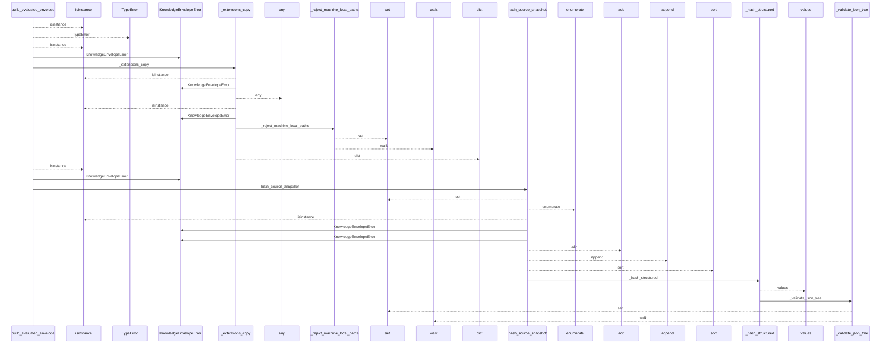
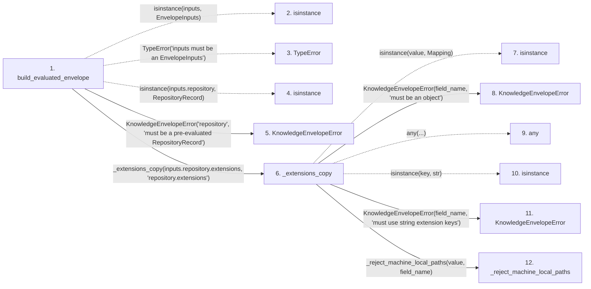

# build_evaluated_envelope

**Entry point:** `build_evaluated_envelope` (`api`)
**Source:** [knowledge_envelope](../modules/knowledge_envelope.md)
**Modules touched:** [knowledge_envelope](../modules/knowledge_envelope.md), [knowledge_evidence](../modules/knowledge_evidence.md), [knowledge_governance](../modules/knowledge_governance.md), and 4 more

**Complete modules touched:**

- [knowledge_envelope](../modules/knowledge_envelope.md)
- [knowledge_evidence](../modules/knowledge_evidence.md)
- [knowledge_governance](../modules/knowledge_governance.md)
- [knowledge_graph](../modules/knowledge_graph.md)
- [knowledge_model](../modules/knowledge_model.md)
- [section_ownership](../modules/section_ownership.md)
- [validation](../modules/validation.md)

## Call sequence

<!-- Auto-generated from static call edges. Dashed arrows are external or unresolved calls. Reviewed runtime conditions and side effects belong in Behavior. -->

> Call sequence diagram shows 30 of 490 interactions; 460 omitted to keep the visualization within the 30-interaction and generated-diagram limits.

> Trace truncated at the depth limit; deeper calls are omitted.

## Data flow

<!-- Auto-generated static analysis. Treat values and boundaries as best-effort hints, not runtime proof. -->

### Step data

| Step | Inputs | Reads | Writes | Returns |
|---|---|---|---|---|
| `build_evaluated_envelope` | `inputs: EnvelopeInputs` | `EnvelopeInputs`, `RepositoryRecord`, `INVENTORY_HASH_EXTENSION`, `INVENTORY_HASH_EXTENSION` | `snapshot_extensions[...]` | `envelope` |
| `isinstance` | - | - | - | - |
| `TypeError` | - | - | - | - |
| `isinstance` | - | - | - | - |
| `KnowledgeEnvelopeError` | - | - | - | - |
| `_extensions_copy` | `value: Mapping[str, Any]`, `field_name: str` | `Mapping` | - | `dict(...)` |
| `isinstance` | - | - | - | - |
| `KnowledgeEnvelopeError` | - | - | - | - |
| `any` | - | - | - | - |
| `isinstance` | - | - | - | - |
| `KnowledgeEnvelopeError` | - | - | - | - |
| `_reject_machine_local_paths` | `value: object`, `field_name: str` | - | - | - |

### Call data

| From | To | Line | Call |
|---|---|---:|---|
| build_evaluated_envelope | isinstance | 892 | `isinstance(inputs, EnvelopeInputs)` |
| build_evaluated_envelope | TypeError | 893 | `TypeError('inputs must be an EnvelopeInputs')` |
| build_evaluated_envelope | isinstance | 894 | `isinstance(inputs.repository, RepositoryRecord)` |
| build_evaluated_envelope | KnowledgeEnvelopeError | 895 | `KnowledgeEnvelopeError('repository', 'must be a pre-evaluated RepositoryRecord')` |
| build_evaluated_envelope | _extensions_copy | 899 | `_extensions_copy(inputs.repository.extensions, 'repository.extensions')` |
| _extensions_copy | isinstance | 1755 | `isinstance(value, Mapping)` |
| _extensions_copy | KnowledgeEnvelopeError | 1756 | `KnowledgeEnvelopeError(field_name, 'must be an object')` |
| _extensions_copy | any | 1757 | `any(...)` |
| _extensions_copy | isinstance | 1757 | `isinstance(key, str)` |
| _extensions_copy | KnowledgeEnvelopeError | 1758 | `KnowledgeEnvelopeError(field_name, 'must use string extension keys')` |
| _extensions_copy | _reject_machine_local_paths | 1759 | `_reject_machine_local_paths(value, field_name)` |

### Boundary effects

*No boundary effects detected.*

### Static analysis gaps

| Kind | Step | Target | Line |
|---|---|---|---:|
| unresolved_call | `build_evaluated_envelope` | `isinstance` | 892 |
| unresolved_call | `build_evaluated_envelope` | `TypeError` | 893 |
| unresolved_call | `build_evaluated_envelope` | `isinstance` | 894 |
| unresolved_call | `_extensions_copy` | `isinstance` | 1755 |
| unresolved_call | `_extensions_copy` | `any` | 1757 |
| unresolved_call | `_extensions_copy` | `isinstance` | 1757 |
| step_limit | `build_evaluated_envelope` | `first 12 steps` | 0 |
| truncated_flow | `build_evaluated_envelope` | `depth limit` | 0 |

## Behavior

This flow starts at `build_evaluated_envelope` and is classified as `api`. The generated call and data-flow sections are bounded static projections; runtime conditions and side effects require source-level confirmation.
