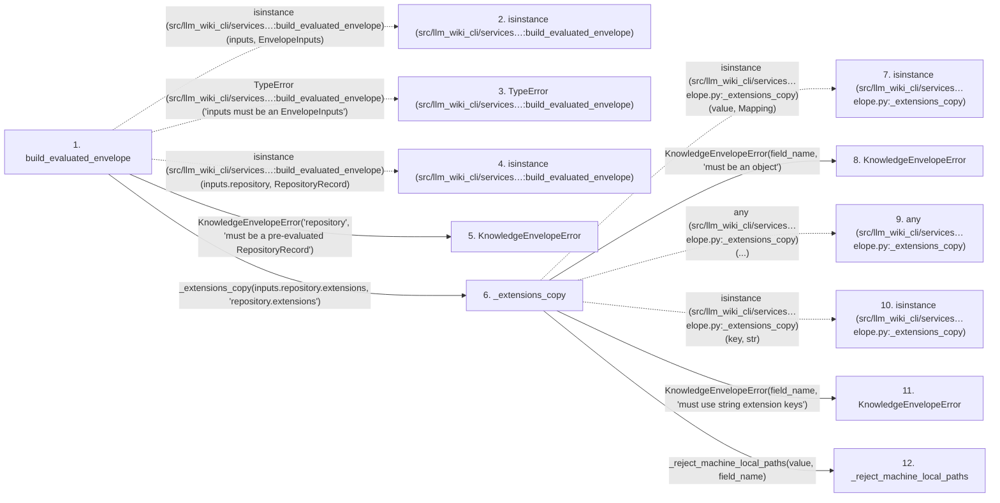

# build_evaluated_envelope

**Entry point:** `build_evaluated_envelope` (`api`)
**Source:** [knowledge_envelope](../modules/knowledge_envelope.md)
**Modules touched:** [knowledge_envelope](../modules/knowledge_envelope.md), [knowledge_evidence](../modules/knowledge_evidence.md), [knowledge_governance](../modules/knowledge_governance.md), and 6 more

**Complete modules touched:**

- [knowledge_envelope](../modules/knowledge_envelope.md)
- [knowledge_evidence](../modules/knowledge_evidence.md)
- [knowledge_governance](../modules/knowledge_governance.md)
- [knowledge_graph](../modules/knowledge_graph.md)
- [knowledge_model](../modules/knowledge_model.md)
- [knowledge_reuse](../modules/knowledge_reuse.md)
- [section_ownership](../modules/section_ownership.md)
- [validation](../modules/validation.md)
- [wiki_surface](../modules/wiki_surface.md)

## Call sequence

```mermaid
sequenceDiagram
    participant p0 as build_evaluated_envelope
    participant p1 as isinstance (src/llm_wiki_cli/services…:build_evaluated_envelope)
    participant p2 as TypeError (src/llm_wiki_cli/services…:build_evaluated_envelope)
    participant p3 as KnowledgeEnvelopeError
    participant p4 as _extensions_copy
    participant p5 as isinstance (src/llm_wiki_cli/services…elope.py:_extensions_copy)
    participant p6 as any (src/llm_wiki_cli/services…elope.py:_extensions_copy)
    participant p7 as _reject_machine_local_paths
    participant p8 as set (src/llm_wiki_cli/services…eject_machine_local_paths)
    participant p9 as walk (src/llm_wiki_cli/services…eject_machine_local_paths)
    participant p10 as dict (src/llm_wiki_cli/services…elope.py:_extensions_copy)
    participant p11 as hash_source_snapshot
    participant p12 as set (src/llm_wiki_cli/services…e.py:hash_source_snapshot)
    participant p13 as enumerate (src/llm_wiki_cli/services…e.py:hash_source_snapshot)
    participant p14 as isinstance (src/llm_wiki_cli/services…e.py:hash_source_snapshot)
    participant p15 as seen_paths.add
    participant p16 as records.append (src/llm_wiki_cli/services…e.py:hash_source_snapshot)
    participant p17 as records.sort (src/llm_wiki_cli/services…e.py:hash_source_snapshot)
    participant p18 as _hash_structured
    participant p19 as payload.values
    participant p20 as _validate_json_tree
    participant p21 as set (src/llm_wiki_cli/services…pe.py:_validate_json_tree)
    participant p22 as walk (src/llm_wiki_cli/services…pe.py:_validate_json_tree)
    p0-->>p1: isinstance (src/llm_wiki_cli/services…:build_evaluated_envelope)
    p0-->>p2: TypeError (src/llm_wiki_cli/services…:build_evaluated_envelope)
    p0-->>p1: isinstance (src/llm_wiki_cli/services…:build_evaluated_envelope)
    p0->>p3: KnowledgeEnvelopeError
    p0->>p4: _extensions_copy
    p4-->>p5: isinstance (src/llm_wiki_cli/services…elope.py:_extensions_copy)
    p4->>p3: KnowledgeEnvelopeError
    p4-->>p6: any (src/llm_wiki_cli/services…elope.py:_extensions_copy)
    p4-->>p5: isinstance (src/llm_wiki_cli/services…elope.py:_extensions_copy)
    p4->>p3: KnowledgeEnvelopeError
    p4->>p7: _reject_machine_local_paths
    p7-->>p8: set (src/llm_wiki_cli/services…eject_machine_local_paths)
    p7-->>p9: walk (src/llm_wiki_cli/services…eject_machine_local_paths)
    p4-->>p10: dict (src/llm_wiki_cli/services…elope.py:_extensions_copy)
    p0-->>p1: isinstance (src/llm_wiki_cli/services…:build_evaluated_envelope)
    p0->>p3: KnowledgeEnvelopeError
    p0->>p11: hash_source_snapshot
    p11-->>p12: set (src/llm_wiki_cli/services…e.py:hash_source_snapshot)
    p11-->>p13: enumerate (src/llm_wiki_cli/services…e.py:hash_source_snapshot)
    p11-->>p14: isinstance (src/llm_wiki_cli/services…e.py:hash_source_snapshot)
    p11->>p3: KnowledgeEnvelopeError
    p11->>p3: KnowledgeEnvelopeError
    p11-->>p15: seen_paths.add
    p11-->>p16: records.append (src/llm_wiki_cli/services…e.py:hash_source_snapshot)
    p11-->>p17: records.sort (src/llm_wiki_cli/services…e.py:hash_source_snapshot)
    p11->>p18: _hash_structured
    p18-->>p19: payload.values
    p18->>p20: _validate_json_tree
    p20-->>p21: set (src/llm_wiki_cli/services…pe.py:_validate_json_tree)
    p20-->>p22: walk (src/llm_wiki_cli/services…pe.py:_validate_json_tree)
```

<!-- Auto-generated from static call edges. Dashed arrows are external or unresolved calls. Reviewed runtime conditions and side effects belong in Behavior. -->

> Call sequence diagram shows 30 of 494 interactions; 464 omitted to keep the visualization within the 30-interaction and generated-diagram limits.

> Trace truncated at the depth limit; deeper calls are omitted.

## Data flow

<!-- Auto-generated static analysis. Treat values and boundaries as best-effort hints, not runtime proof. -->

### Step data

| Step | Inputs | Reads | Writes | Returns |
|---|---|---|---|---|
| `build_evaluated_envelope` | `inputs: EnvelopeInputs` | `EnvelopeInputs`, `RepositoryRecord`, `INVENTORY_HASH_EXTENSION`, `INVENTORY_HASH_EXTENSION` | `snapshot_extensions[...]` | `envelope` |
| `isinstance (src/llm_wiki_cli/services…:build_evaluated_envelope)` | - | - | - | - |
| `TypeError (src/llm_wiki_cli/services…:build_evaluated_envelope)` | - | - | - | - |
| `isinstance (src/llm_wiki_cli/services…:build_evaluated_envelope)` | - | - | - | - |
| `KnowledgeEnvelopeError` | - | - | - | - |
| `_extensions_copy` | `value: Mapping[str, Any]`, `field_name: str` | `Mapping` | - | `dict(...)` |
| `isinstance (src/llm_wiki_cli/services…elope.py:_extensions_copy)` | - | - | - | - |
| `KnowledgeEnvelopeError` | - | - | - | - |
| `any (src/llm_wiki_cli/services…elope.py:_extensions_copy)` | - | - | - | - |
| `isinstance (src/llm_wiki_cli/services…elope.py:_extensions_copy)` | - | - | - | - |
| `KnowledgeEnvelopeError` | - | - | - | - |
| `_reject_machine_local_paths` | `value: object`, `field_name: str` | - | - | - |

### Call data

| From | To | Line | Call |
|---|---|---:|---|
| build_evaluated_envelope | isinstance (src/llm_wiki_cli/services…:build_evaluated_envelope) | 895 | `isinstance(inputs, EnvelopeInputs)` |
| build_evaluated_envelope | TypeError (src/llm_wiki_cli/services…:build_evaluated_envelope) | 896 | `TypeError('inputs must be an EnvelopeInputs')` |
| build_evaluated_envelope | isinstance (src/llm_wiki_cli/services…:build_evaluated_envelope) | 897 | `isinstance(inputs.repository, RepositoryRecord)` |
| build_evaluated_envelope | KnowledgeEnvelopeError | 898 | `KnowledgeEnvelopeError('repository', 'must be a pre-evaluated RepositoryRecord')` |
| build_evaluated_envelope | _extensions_copy | 902 | `_extensions_copy(inputs.repository.extensions, 'repository.extensions')` |
| _extensions_copy | isinstance (src/llm_wiki_cli/services…elope.py:_extensions_copy) | 1770 | `isinstance(value, Mapping)` |
| _extensions_copy | KnowledgeEnvelopeError | 1771 | `KnowledgeEnvelopeError(field_name, 'must be an object')` |
| _extensions_copy | any (src/llm_wiki_cli/services…elope.py:_extensions_copy) | 1772 | `any(...)` |
| _extensions_copy | isinstance (src/llm_wiki_cli/services…elope.py:_extensions_copy) | 1772 | `isinstance(key, str)` |
| _extensions_copy | KnowledgeEnvelopeError | 1773 | `KnowledgeEnvelopeError(field_name, 'must use string extension keys')` |
| _extensions_copy | _reject_machine_local_paths | 1774 | `_reject_machine_local_paths(value, field_name)` |

### Boundary effects

*No boundary effects detected.*

### Static analysis gaps

| Kind | Step | Target | Line |
|---|---|---|---:|
| external_call | `build_evaluated_envelope` | `isinstance` | 895 |
| external_call | `build_evaluated_envelope` | `TypeError` | 896 |
| external_call | `build_evaluated_envelope` | `isinstance` | 897 |
| external_call | `_extensions_copy` | `isinstance` | 1770 |
| external_call | `_extensions_copy` | `any` | 1772 |
| external_call | `_extensions_copy` | `isinstance` | 1772 |
| step_limit | `build_evaluated_envelope` | `first 12 steps` | 0 |
| truncated_flow | `build_evaluated_envelope` | `depth limit` | 0 |

## Behavior

This flow starts at `build_evaluated_envelope` and is classified as `api`. The generated call and data-flow sections are bounded static projections; runtime conditions and side effects require source-level confirmation.
