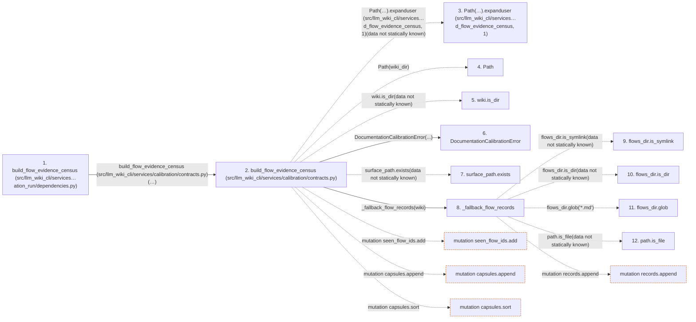

# build_flow_evidence_census

**Entry point:** `build_flow_evidence_census` (`api`)
**Source:** [documentation_run_dependencies](../modules/documentation_run_dependencies.md)
**Modules touched:** [calibration_contracts](../modules/calibration_contracts.md), [documentation_run_dependencies](../modules/documentation_run_dependencies.md), [validation](../modules/validation.md), and 1 more

**Complete modules touched:**

- [calibration_contracts](../modules/calibration_contracts.md)
- [documentation_run_dependencies](../modules/documentation_run_dependencies.md)
- [validation](../modules/validation.md)
- [wiki_surface](../modules/wiki_surface.md)

## Call sequence

```mermaid
sequenceDiagram
    participant p0 as build_flow_evidence_census (src/llm_wiki_cli/services…ation_run/dependencies.py)
    participant p1 as build_flow_evidence_census (src/llm_wiki_cli/services/calibration/contracts.py)
    participant p2 as Path(…).expanduser (src/llm_wiki_cli/services…d_flow_evidence_census, 1)
    participant p3 as Path
    participant p4 as wiki.is_dir
    participant p5 as DocumentationCalibrationError
    participant p6 as surface_path.exists
    participant p7 as _fallback_flow_records
    participant p8 as flows_dir.is_symlink
    participant p9 as flows_dir.is_dir
    participant p10 as flows_dir.glob
    participant p11 as path.is_file
    participant p12 as path.is_symlink
    participant p13 as is_safe_page_id
    participant p14 as isinstance (src/llm_wiki_cli/services…urface.py:is_safe_page_id)
    participant p15 as bool (src/llm_wiki_cli/services…urface.py:is_safe_page_id)
    participant p16 as page_id.startswith
    participant p17 as _PAGE_ID_RE.fullmatch
    participant p18 as is_portable_path_component
    participant p19 as require_portable_path_component
    participant p20 as component.encode
    participant p21 as SharedValidationError
    participant p22 as unicodedata.normalize (src/llm_wiki_cli/services…e_portable_path_component)
    participant p23 as any (src/llm_wiki_cli/services…e_portable_path_component)
    participant p24 as ord
    participant p25 as component.endswith
    p0->>p1: build_flow_evidence_census (src/llm_wiki_cli/services/calibration/contracts.py)
    p1-->>p2: Path(…).expanduser (src/llm_wiki_cli/services…d_flow_evidence_census, 1)
    p1-->>p3: Path
    p1-->>p4: wiki.is_dir
    p1->>p5: DocumentationCalibrationError
    p1-->>p6: surface_path.exists
    p1->>p7: _fallback_flow_records
    p7-->>p8: flows_dir.is_symlink
    p7-->>p9: flows_dir.is_dir
    p7-->>p10: flows_dir.glob
    p7-->>p11: path.is_file
    p7-->>p12: path.is_symlink
    p7->>p13: is_safe_page_id
    p13-->>p14: isinstance (src/llm_wiki_cli/services…urface.py:is_safe_page_id)
    p13-->>p15: bool (src/llm_wiki_cli/services…urface.py:is_safe_page_id)
    p13-->>p16: page_id.startswith
    p13-->>p15: bool (src/llm_wiki_cli/services…urface.py:is_safe_page_id)
    p13-->>p17: _PAGE_ID_RE.fullmatch
    p13->>p18: is_portable_path_component
    p18->>p19: require_portable_path_component
    p19-->>p20: component.encode
    p19->>p21: SharedValidationError
    p19-->>p22: unicodedata.normalize (src/llm_wiki_cli/services…e_portable_path_component)
    p19->>p21: SharedValidationError
    p19-->>p23: any (src/llm_wiki_cli/services…e_portable_path_component)
    p19-->>p24: ord
    p19-->>p24: ord
    p19->>p21: SharedValidationError
    p19-->>p25: component.endswith
    p19-->>p23: any (src/llm_wiki_cli/services…e_portable_path_component)
```

<!-- Auto-generated from static call edges. Dashed arrows are external or unresolved calls. Reviewed runtime conditions and side effects belong in Behavior. -->

> Call sequence diagram shows 30 of 405 interactions; 375 omitted to keep the visualization within the 30-interaction and generated-diagram limits.

> Trace truncated at the depth limit; deeper calls are omitted.

## Data flow

<!-- Auto-generated static analysis. Treat values and boundaries as best-effort hints, not runtime proof. -->

### Step data

| Step | Inputs | Reads | Writes | Returns |
|---|---|---|---|---|
| `build_flow_evidence_census (src/llm_wiki_cli/services…ation_run/dependencies.py)` | `wiki_dir: str`, `source_root: Optional[str]`, `source_revision: str`, `source_fingerprint: str`, `dependency_evidence: Optional[Mapping[str, Any]]`, `tool_revision: str`, `allow_surface_fallback: bool` | - | - | `implementation(...)` |
| `build_flow_evidence_census (src/llm_wiki_cli/services/calibration/contracts.py)` | `wiki_dir: str`, `source_root: Optional[str]`, `source_revision: str`, `source_fingerprint: str`, `dependency_evidence: Optional[Mapping[str, Any]]`, `tool_revision: str`, `allow_surface_fallback: bool` | `SURFACE_INDEX_FILENAME`, `Mapping`, `P0_FLOW_CENSUS_SCHEMA_VERSION` | `family_basis[...]` | `payload` |
| `Path(…).expanduser (src/llm_wiki_cli/services…d_flow_evidence_census, 1)` | - | - | - | - |
| `Path` | - | - | - | - |
| `wiki.is_dir` | - | - | - | - |
| `DocumentationCalibrationError` | - | - | - | - |
| `surface_path.exists` | - | - | - | - |
| `_fallback_flow_records` | `wiki: Path` | - | - | `[...]`, `sorted(...)` |
| `flows_dir.is_symlink` | - | - | - | - |
| `flows_dir.is_dir` | - | - | - | - |
| `flows_dir.glob` | - | - | - | - |
| `path.is_file` | - | - | - | - |

### Call data

| From | To | Line | Call |
|---|---|---:|---|
| build_flow_evidence_census (src/llm_wiki_cli/services…ation_run/dependencies.py) | build_flow_evidence_census (src/llm_wiki_cli/services/calibration/contracts.py) | 143 | `implementation(wiki_dir, source_root=source_root, source_revision=source_revision, source_fingerprint=source_fingerprint, dependency_evidence=dependency_evidence, tool_revision=tool_revision, allow_surface_fallback=allow_surface_fallback)` |
| build_flow_evidence_census (src/llm_wiki_cli/services/calibration/contracts.py) | Path(…).expanduser (src/llm_wiki_cli/services…d_flow_evidence_census, 1) | 125 | `Path(wiki_dir).expanduser(data not statically known)` |
| build_flow_evidence_census (src/llm_wiki_cli/services/calibration/contracts.py) | Path | 125 | `Path(wiki_dir)` |
| build_flow_evidence_census (src/llm_wiki_cli/services/calibration/contracts.py) | wiki.is_dir | 126 | `wiki.is_dir(data not statically known)` |
| build_flow_evidence_census (src/llm_wiki_cli/services/calibration/contracts.py) | DocumentationCalibrationError | 127 | `DocumentationCalibrationError(...)` |
| build_flow_evidence_census (src/llm_wiki_cli/services/calibration/contracts.py) | surface_path.exists | 131 | `surface_path.exists(data not statically known)` |
| build_flow_evidence_census (src/llm_wiki_cli/services/calibration/contracts.py) | _fallback_flow_records | 132 | `_fallback_flow_records(wiki)` |
| _fallback_flow_records | flows_dir.is_symlink | 936 | `flows_dir.is_symlink(data not statically known)` |
| _fallback_flow_records | flows_dir.is_dir | 936 | `flows_dir.is_dir(data not statically known)` |
| _fallback_flow_records | flows_dir.glob | 939 | `flows_dir.glob('*.md')` |
| _fallback_flow_records | path.is_file | 941 | `path.is_file(data not statically known)` |

### Boundary effects

| Kind | Target | Step | Line |
|---|---|---|---:|
| mutation | `seen_flow_ids.add` | `build_flow_evidence_census` | 155 |
| mutation | `capsules.append` | `build_flow_evidence_census` | 156 |
| mutation | `capsules.sort` | `build_flow_evidence_census` | 165 |
| mutation | `records.append` | `_fallback_flow_records` | 942 |

### Static analysis gaps

| Kind | Step | Target | Line |
|---|---|---|---:|
| unresolved_call | `build_flow_evidence_census` | `Path(wiki_dir).expanduser` | 125 |
| unresolved_call | `build_flow_evidence_census` | `wiki.is_dir` | 126 |
| unresolved_call | `build_flow_evidence_census` | `surface_path.exists` | 131 |
| unresolved_call | `_fallback_flow_records` | `flows_dir.is_symlink` | 936 |
| unresolved_call | `_fallback_flow_records` | `flows_dir.is_dir` | 936 |
| unresolved_call | `_fallback_flow_records` | `flows_dir.glob` | 939 |
| unresolved_call | `_fallback_flow_records` | `path.is_file` | 941 |
| step_limit | `build_flow_evidence_census` | `first 12 steps` | 0 |
| truncated_flow | `build_flow_evidence_census` | `depth limit` | 0 |

## Behavior

This flow starts at `build_flow_evidence_census` and is classified as `api`. The generated call and data-flow sections are bounded static projections; runtime conditions and side effects require source-level confirmation.
