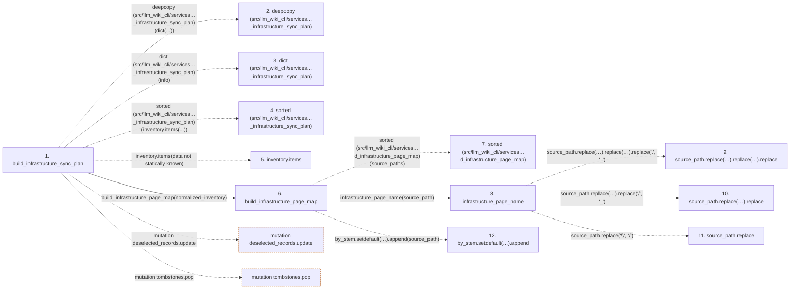

# build_infrastructure_sync_plan

**Entry point:** `build_infrastructure_sync_plan` (`api`)
**Source:** [infrastructure_sync](../modules/infrastructure_sync.md)
**Modules touched:** [infrastructure_inventory](../modules/infrastructure_inventory.md), [infrastructure_sync](../modules/infrastructure_sync.md), [knowledge_evidence](../modules/knowledge_evidence.md), and 1 more

**Complete modules touched:**

- [infrastructure_inventory](../modules/infrastructure_inventory.md)
- [infrastructure_sync](../modules/infrastructure_sync.md)
- [knowledge_evidence](../modules/knowledge_evidence.md)
- [validation](../modules/validation.md)

## Call sequence

```mermaid
sequenceDiagram
    participant p0 as build_infrastructure_sync_plan
    participant p1 as deepcopy (src/llm_wiki_cli/services…_infrastructure_sync_plan)
    participant p2 as dict (src/llm_wiki_cli/services…_infrastructure_sync_plan)
    participant p3 as sorted (src/llm_wiki_cli/services…_infrastructure_sync_plan)
    participant p4 as inventory.items
    participant p5 as build_infrastructure_page_map
    participant p6 as sorted (src/llm_wiki_cli/services…d_infrastructure_page_map)
    participant p7 as infrastructure_page_name
    participant p8 as source_path.replace(…).replace(…).replace
    participant p9 as source_path.replace(…).replace
    participant p10 as source_path.replace
    participant p11 as by_stem.setdefault(…).append
    participant p12 as by_stem.setdefault
    participant p13 as by_stem.items
    participant p14 as len (src/llm_wiki_cli/services…d_infrastructure_page_map)
    participant p15 as hash_json(…).removeprefix
    participant p16 as hash_json
    participant p17 as sha256_bytes
    participant p18 as hashlib.sha256(…).hexdigest
    participant p19 as hashlib.sha256
    participant p20 as canonical_json_bytes
    participant p21 as canonical_json_text(…).encode
    participant p22 as canonical_json_text
    participant p23 as json.dumps
    participant p24 as _prior_infrastructure_state
    participant p25 as isinstance (src/llm_wiki_cli/services…rior_infrastructure_state)
    participant p26 as InfrastructureSyncError
    participant p27 as value.get
    p0-->>p1: deepcopy (src/llm_wiki_cli/services…_infrastructure_sync_plan)
    p0-->>p2: dict (src/llm_wiki_cli/services…_infrastructure_sync_plan)
    p0-->>p3: sorted (src/llm_wiki_cli/services…_infrastructure_sync_plan)
    p0-->>p4: inventory.items
    p0->>p5: build_infrastructure_page_map
    p5-->>p6: sorted (src/llm_wiki_cli/services…d_infrastructure_page_map)
    p5->>p7: infrastructure_page_name
    p7-->>p8: source_path.replace(…).replace(…).replace
    p7-->>p9: source_path.replace(…).replace
    p7-->>p10: source_path.replace
    p5-->>p11: by_stem.setdefault(…).append
    p5-->>p12: by_stem.setdefault
    p5-->>p6: sorted (src/llm_wiki_cli/services…d_infrastructure_page_map)
    p5-->>p13: by_stem.items
    p5-->>p14: len (src/llm_wiki_cli/services…d_infrastructure_page_map)
    p5-->>p15: hash_json(…).removeprefix
    p5->>p16: hash_json
    p16->>p17: sha256_bytes
    p17-->>p18: hashlib.sha256(…).hexdigest
    p17-->>p19: hashlib.sha256
    p16->>p20: canonical_json_bytes
    p20-->>p21: canonical_json_text(…).encode
    p20->>p22: canonical_json_text
    p22-->>p23: json.dumps
    p0->>p24: _prior_infrastructure_state
    p24-->>p25: isinstance (src/llm_wiki_cli/services…rior_infrastructure_state)
    p24-->>p25: isinstance (src/llm_wiki_cli/services…rior_infrastructure_state)
    p24->>p26: InfrastructureSyncError
    p24-->>p27: value.get
    p24->>p26: InfrastructureSyncError
```

<!-- Auto-generated from static call edges. Dashed arrows are external or unresolved calls. Reviewed runtime conditions and side effects belong in Behavior. -->

> Call sequence diagram shows 30 of 270 interactions; 240 omitted to keep the visualization within the 30-interaction and generated-diagram limits.

## Data flow

<!-- Auto-generated static analysis. Treat values and boundaries as best-effort hints, not runtime proof. -->

### Step data

| Step | Inputs | Reads | Writes | Returns |
|---|---|---|---|---|
| `build_infrastructure_sync_plan` | `snapshot: SourceSnapshot`, `inventory: Mapping[str, Mapping[str, object]]`, `generation_inputs: Mapping[str, object] \| None` | `INFRASTRUCTURE_SYNC_SCHEMA_VERSION` | `tombstones[...]`, `tombstones[...]` | `InfrastructureSyncPlan(...)` |
| `deepcopy (src/llm_wiki_cli/services…_infrastructure_sync_plan)` | - | - | - | - |
| `dict (src/llm_wiki_cli/services…_infrastructure_sync_plan)` | - | - | - | - |
| `sorted (src/llm_wiki_cli/services…_infrastructure_sync_plan)` | - | - | - | - |
| `inventory.items` | - | - | - | - |
| `build_infrastructure_page_map` | `source_paths: Mapping[str, object] \| tuple[str, ...] \| list[str] \| set[str]` | - | `result[...]` | `result` |
| `sorted (src/llm_wiki_cli/services…d_infrastructure_page_map)` | - | - | - | - |
| `infrastructure_page_name` | `source_path: str` | - | - | `...` |
| `source_path.replace(…).replace(…).replace` | - | - | - | - |
| `source_path.replace(…).replace` | - | - | - | - |
| `source_path.replace` | - | - | - | - |
| `by_stem.setdefault(…).append` | - | - | - | - |

### Call data

| From | To | Line | Call |
|---|---|---:|---|
| build_infrastructure_sync_plan | deepcopy (src/llm_wiki_cli/services…_infrastructure_sync_plan) | 628 | `deepcopy(dict(...))` |
| build_infrastructure_sync_plan | dict (src/llm_wiki_cli/services…_infrastructure_sync_plan) | 628 | `dict(info)` |
| build_infrastructure_sync_plan | sorted (src/llm_wiki_cli/services…_infrastructure_sync_plan) | 629 | `sorted(inventory.items(...))` |
| build_infrastructure_sync_plan | inventory.items | 629 | `inventory.items(data not statically known)` |
| build_infrastructure_sync_plan | build_infrastructure_page_map | 631 | `build_infrastructure_page_map(normalized_inventory)` |
| build_infrastructure_page_map | sorted (src/llm_wiki_cli/services…d_infrastructure_page_map) | 42 | `sorted(source_paths)` |
| build_infrastructure_page_map | infrastructure_page_name | 45 | `infrastructure_page_name(source_path)` |
| infrastructure_page_name | source_path.replace(…).replace(…).replace | 28 | `source_path.replace('\\', '/').replace('/', '_').replace('.', '_')` |
| infrastructure_page_name | source_path.replace(…).replace | 28 | `source_path.replace('\\', '/').replace('/', '_')` |
| infrastructure_page_name | source_path.replace | 28 | `source_path.replace('\\', '/')` |
| build_infrastructure_page_map | by_stem.setdefault(…).append | 46 | `by_stem.setdefault(stem, []).append(source_path)` |

### Boundary effects

| Kind | Target | Step | Line |
|---|---|---|---:|
| mutation | `deselected_records.update` | `build_infrastructure_sync_plan` | 655 |
| mutation | `tombstones.pop` | `build_infrastructure_sync_plan` | 697 |

### Static analysis gaps

| Kind | Step | Target | Line |
|---|---|---|---:|
| external_call | `build_infrastructure_sync_plan` | `deepcopy` | 628 |
| external_call | `build_infrastructure_sync_plan` | `sorted` | 629 |
| unresolved_call | `build_infrastructure_sync_plan` | `inventory.items` | 629 |
| external_call | `build_infrastructure_page_map` | `sorted` | 42 |
| unresolved_call | `infrastructure_page_name` | `source_path.replace('\\', '/').replace('/', '_').replace` | 28 |
| unresolved_call | `infrastructure_page_name` | `source_path.replace('\\', '/').replace` | 28 |
| unresolved_call | `infrastructure_page_name` | `source_path.replace` | 28 |
| unresolved_call | `build_infrastructure_page_map` | `by_stem.setdefault(stem, []).append` | 46 |
| step_limit | `build_infrastructure_sync_plan` | `first 12 steps` | 0 |

## Behavior

This flow starts at `build_infrastructure_sync_plan` and is classified as `api`. The generated call and data-flow sections are bounded static projections; runtime conditions and side effects require source-level confirmation.
