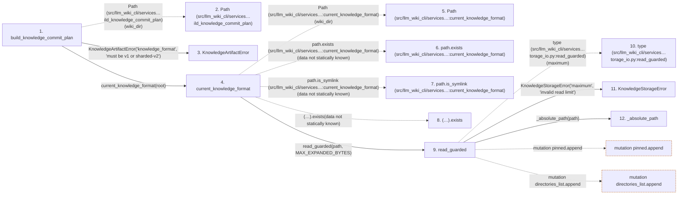

# build_knowledge_commit_plan

**Entry point:** `build_knowledge_commit_plan` (`api`)
**Source:** [knowledge_artifacts](../modules/knowledge_artifacts.md)
**Modules touched:** [common](../modules/common.md), [concept_identity](../modules/concept_identity.md), [filesystem_guard](../modules/filesystem_guard.md), [immutable](../modules/immutable.md), and 19 more

**Complete modules touched:**

- [common](../modules/common.md)
- [concept_identity](../modules/concept_identity.md)
- [filesystem_guard](../modules/filesystem_guard.md)
- [immutable](../modules/immutable.md)
- [infrastructure_sync](../modules/infrastructure_sync.md)
- [io](../modules/io.md)
- [knowledge_artifacts](../modules/knowledge_artifacts.md)
- [knowledge_envelope](../modules/knowledge_envelope.md)
- [knowledge_evidence](../modules/knowledge_evidence.md)
- [knowledge_governance](../modules/knowledge_governance.md)
- [knowledge_graph](../modules/knowledge_graph.md)
- [knowledge_index](../modules/knowledge_index.md)
- [knowledge_links](../modules/knowledge_links.md)
- [knowledge_model](../modules/knowledge_model.md)
- [knowledge_reuse](../modules/knowledge_reuse.md)
- [knowledge_storage](../modules/knowledge_storage.md)
- [knowledge_storage_io](../modules/knowledge_storage_io.md)
- [progress](../modules/progress.md)
- [section_ownership](../modules/section_ownership.md)
- [sync_manifest](../modules/sync_manifest.md)
- [validation](../modules/validation.md)
- [wiki_media](../modules/wiki_media.md)
- [wiki_surface](../modules/wiki_surface.md)

## Call sequence

```mermaid
sequenceDiagram
    participant p0 as build_knowledge_commit_plan
    participant p1 as Path (src/llm_wiki_cli/services…ild_knowledge_commit_plan)
    participant p2 as KnowledgeArtifactError
    participant p3 as current_knowledge_format
    participant p4 as Path (src/llm_wiki_cli/services…:current_knowledge_format)
    participant p5 as path.exists (src/llm_wiki_cli/services…:current_knowledge_format)
    participant p6 as path.is_symlink (src/llm_wiki_cli/services…:current_knowledge_format)
    participant p7 as (…).exists
    participant p8 as read_guarded
    participant p9 as type (src/llm_wiki_cli/services…torage_io.py:read_guarded)
    participant p10 as KnowledgeStorageError
    participant p11 as _absolute_path
    participant p12 as Path (src/llm_wiki_cli/services…rage_io.py:_absolute_path)
    participant p13 as os.path.abspath (src/llm_wiki_cli/services…rage_io.py:_absolute_path)
    participant p14 as first_unsafe_path_component
    participant p15 as Path (src/llm_wiki_cli/services…rst_unsafe_path_component)
    participant p16 as os.fspath (src/llm_wiki_cli/services…rst_unsafe_path_component)
    participant p17 as os.path.abspath (src/llm_wiki_cli/services…rst_unsafe_path_component)
    participant p18 as lexical.is_absolute
    participant p19 as Path.cwd
    participant p20 as list (src/llm_wiki_cli/services…rst_unsafe_path_component)
    participant p21 as pending_parts.pop
    participant p22 as current.lstat
    participant p23 as getattr (src/llm_wiki_cli/services…rst_unsafe_path_component)
    participant p24 as stat.S_ISLNK
    participant p25 as bool
    p0-->>p1: Path (src/llm_wiki_cli/services…ild_knowledge_commit_plan)
    p0->>p2: KnowledgeArtifactError
    p0->>p3: current_knowledge_format
    p3-->>p4: Path (src/llm_wiki_cli/services…:current_knowledge_format)
    p3-->>p5: path.exists (src/llm_wiki_cli/services…:current_knowledge_format)
    p3-->>p6: path.is_symlink (src/llm_wiki_cli/services…:current_knowledge_format)
    p3-->>p7: (…).exists
    p3->>p8: read_guarded
    p8-->>p9: type (src/llm_wiki_cli/services…torage_io.py:read_guarded)
    p8->>p10: KnowledgeStorageError
    p8->>p11: _absolute_path
    p11-->>p12: Path (src/llm_wiki_cli/services…rage_io.py:_absolute_path)
    p11-->>p13: os.path.abspath (src/llm_wiki_cli/services…rage_io.py:_absolute_path)
    p11->>p14: first_unsafe_path_component
    p14-->>p15: Path (src/llm_wiki_cli/services…rst_unsafe_path_component)
    p14-->>p16: os.fspath (src/llm_wiki_cli/services…rst_unsafe_path_component)
    p14-->>p15: Path (src/llm_wiki_cli/services…rst_unsafe_path_component)
    p14-->>p17: os.path.abspath (src/llm_wiki_cli/services…rst_unsafe_path_component)
    p14-->>p18: lexical.is_absolute
    p14-->>p19: Path.cwd
    p14-->>p15: Path (src/llm_wiki_cli/services…rst_unsafe_path_component)
    p14-->>p20: list (src/llm_wiki_cli/services…rst_unsafe_path_component)
    p14-->>p21: pending_parts.pop
    p14-->>p22: current.lstat
    p14-->>p23: getattr (src/llm_wiki_cli/services…rst_unsafe_path_component)
    p14-->>p23: getattr (src/llm_wiki_cli/services…rst_unsafe_path_component)
    p14-->>p24: stat.S_ISLNK
    p14-->>p25: bool
    p14-->>p25: bool
    p14-->>p23: getattr (src/llm_wiki_cli/services…rst_unsafe_path_component)
```

<!-- Auto-generated from static call edges. Dashed arrows are external or unresolved calls. Reviewed runtime conditions and side effects belong in Behavior. -->

> Call sequence diagram shows 30 of 2431 interactions; 2401 omitted to keep the visualization within the 30-interaction and generated-diagram limits.

> Trace truncated at the depth limit; deeper calls are omitted.

## Data flow

<!-- Auto-generated static analysis. Treat values and boundaries as best-effort hints, not runtime proof. -->

### Step data

| Step | Inputs | Reads | Writes | Returns |
|---|---|---|---|---|
| `build_knowledge_commit_plan` | `wiki_dir: str \| Path`, `surface_index_bytes: bytes`, `knowledge_index_bytes: bytes \| None`, `manifest: SyncManifest`, `knowledge_format: str \| None`, `knowledge_index: KnowledgeIndex \| None` | `KnowledgeStorageError`, `KnowledgeStorageError`, `SyncManifest`, `SURFACE_INDEX_FILENAME`, `SURFACE_INDEX_FILENAME`, `KNOWLEDGE_INDEX_FILENAME`, `KNOWLEDGE_INDEX_FILENAME`, `MANIFEST_FILENAME` | - | `KnowledgeCommitPlan(...)` |
| `Path (src/llm_wiki_cli/services…ild_knowledge_commit_plan)` | - | - | - | - |
| `KnowledgeArtifactError` | - | - | - | - |
| `current_knowledge_format` | `wiki_dir: str \| Path` | `KNOWLEDGE_INDEX_FILENAME`, `MAX_EXPANDED_BYTES`, `KnowledgeArtifactError`, `STORE_SCHEMA`, `KNOWLEDGE_SCHEMA_VERSION`, `KnowledgeStorageError` | - | `...`, `...`, `'sharded-v2'`, `'v1'` |
| `Path (src/llm_wiki_cli/services…:current_knowledge_format)` | - | - | - | - |
| `path.exists (src/llm_wiki_cli/services…:current_knowledge_format)` | - | - | - | - |
| `path.is_symlink (src/llm_wiki_cli/services…:current_knowledge_format)` | - | - | - | - |
| `(…).exists` | - | - | - | - |
| `read_guarded` | `path: Path`, `maximum: int` | `MAX_EXPANDED_BYTES`, `os`, `os`, `os`, `os`, `os`, `os`, `KnowledgeStorageError` | - | `ReadObservation(...)` |
| `type (src/llm_wiki_cli/services…torage_io.py:read_guarded)` | - | - | - | - |
| `KnowledgeStorageError` | - | - | - | - |
| `_absolute_path` | `path: Path` | - | - | `path` |

### Call data

| From | To | Line | Call |
|---|---|---:|---|
| build_knowledge_commit_plan | Path (src/llm_wiki_cli/services…ild_knowledge_commit_plan) | 465 | `Path(wiki_dir)` |
| build_knowledge_commit_plan | KnowledgeArtifactError | 467 | `KnowledgeArtifactError('knowledge_format', 'must be v1 or sharded-v2')` |
| build_knowledge_commit_plan | current_knowledge_format | 469 | `current_knowledge_format(root)` |
| current_knowledge_format | Path (src/llm_wiki_cli/services…:current_knowledge_format) | 647 | `Path(wiki_dir)` |
| current_knowledge_format | path.exists (src/llm_wiki_cli/services…:current_knowledge_format) | 648 | `path.exists(data not statically known)` |
| current_knowledge_format | path.is_symlink (src/llm_wiki_cli/services…:current_knowledge_format) | 648 | `path.is_symlink(data not statically known)` |
| current_knowledge_format | (…).exists | 649 | `(path.parent / '.llm-wiki-knowledge').exists(data not statically known)` |
| current_knowledge_format | read_guarded | 651 | `read_guarded(path, MAX_EXPANDED_BYTES)` |
| read_guarded | type (src/llm_wiki_cli/services…torage_io.py:read_guarded) | 50 | `type(maximum)` |
| read_guarded | KnowledgeStorageError | 51 | `KnowledgeStorageError('maximum', 'invalid read limit')` |
| read_guarded | _absolute_path | 52 | `_absolute_path(path)` |

### Boundary effects

| Kind | Target | Step | Line |
|---|---|---|---:|
| mutation | `pinned.append` | `read_guarded` | 77 |
| mutation | `directories_list.append` | `read_guarded` | 79 |

### Static analysis gaps

| Kind | Step | Target | Line |
|---|---|---|---:|
| unresolved_call | `current_knowledge_format` | `path.exists` | 648 |
| unresolved_call | `current_knowledge_format` | `path.is_symlink` | 648 |
| unresolved_call | `current_knowledge_format` | `(path.parent / '.llm-wiki-knowledge').exists` | 649 |
| external_call | `read_guarded` | `type` | 50 |
| step_limit | `build_knowledge_commit_plan` | `first 12 steps` | 0 |
| truncated_flow | `build_knowledge_commit_plan` | `depth limit` | 0 |

## Behavior

This flow starts at `build_knowledge_commit_plan` and is classified as `api`. The generated call and data-flow sections are bounded static projections; runtime conditions and side effects require source-level confirmation.
