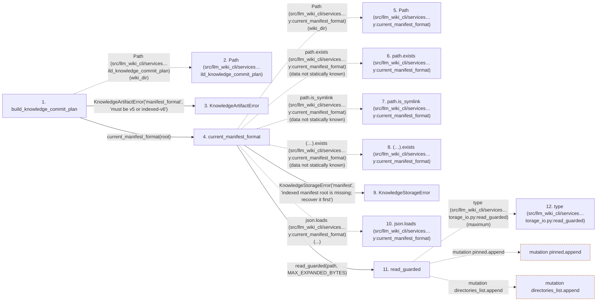

# build_knowledge_commit_plan

**Entry point:** `build_knowledge_commit_plan` (`api`)
**Source:** [knowledge_artifacts](../modules/knowledge_artifacts.md)
**Modules touched:** [canonical_json](../modules/canonical_json.md), [common](../modules/common.md), [concept_identity](../modules/concept_identity.md), [filesystem_guard](../modules/filesystem_guard.md), and 23 more

**Complete modules touched:**

- [canonical_json](../modules/canonical_json.md)
- [common](../modules/common.md)
- [concept_identity](../modules/concept_identity.md)
- [filesystem_guard](../modules/filesystem_guard.md)
- [immutable](../modules/immutable.md)
- [infrastructure_sync](../modules/infrastructure_sync.md)
- [io](../modules/io.md)
- [knowledge_artifacts](../modules/knowledge_artifacts.md)
- [knowledge_envelope](../modules/knowledge_envelope.md)
- [knowledge_evidence](../modules/knowledge_evidence.md)
- [knowledge_governance](../modules/knowledge_governance.md)
- [knowledge_graph](../modules/knowledge_graph.md)
- [knowledge_index](../modules/knowledge_index.md)
- [knowledge_links](../modules/knowledge_links.md)
- [knowledge_model](../modules/knowledge_model.md)
- [knowledge_packs](../modules/knowledge_packs.md)
- [knowledge_reuse](../modules/knowledge_reuse.md)
- [knowledge_storage](../modules/knowledge_storage.md)
- [knowledge_storage_io](../modules/knowledge_storage_io.md)
- [manifest_storage](../modules/manifest_storage.md)
- [progress](../modules/progress.md)
- [section_ownership](../modules/section_ownership.md)
- [storage_spool](../modules/storage_spool.md)
- [sync_manifest](../modules/sync_manifest.md)
- [validation](../modules/validation.md)
- [wiki_media](../modules/wiki_media.md)
- [wiki_surface](../modules/wiki_surface.md)

## Call sequence

```mermaid
sequenceDiagram
    participant p0 as build_knowledge_commit_plan
    participant p1 as Path (src/llm_wiki_cli/services…ild_knowledge_commit_plan)
    participant p2 as KnowledgeArtifactError
    participant p3 as current_manifest_format
    participant p4 as Path (src/llm_wiki_cli/services…y:current_manifest_format)
    participant p5 as path.exists (src/llm_wiki_cli/services…y:current_manifest_format)
    participant p6 as path.is_symlink (src/llm_wiki_cli/services…y:current_manifest_format)
    participant p7 as (…).exists (src/llm_wiki_cli/services…y:current_manifest_format)
    participant p8 as KnowledgeStorageError
    participant p9 as json.loads (src/llm_wiki_cli/services…y:current_manifest_format)
    participant p10 as read_guarded
    participant p11 as type (src/llm_wiki_cli/services…torage_io.py:read_guarded)
    participant p12 as _absolute_path
    participant p13 as Path (src/llm_wiki_cli/services…rage_io.py:_absolute_path)
    participant p14 as os.path.abspath (src/llm_wiki_cli/services…rage_io.py:_absolute_path)
    participant p15 as first_unsafe_path_component
    participant p16 as Path (src/llm_wiki_cli/services…rst_unsafe_path_component)
    participant p17 as os.fspath (src/llm_wiki_cli/services…rst_unsafe_path_component)
    participant p18 as os.path.abspath (src/llm_wiki_cli/services…rst_unsafe_path_component)
    participant p19 as lexical.is_absolute
    participant p20 as Path.cwd
    participant p21 as list (src/llm_wiki_cli/services…rst_unsafe_path_component)
    participant p22 as pending_parts.pop
    participant p23 as current.lstat
    p0-->>p1: Path (src/llm_wiki_cli/services…ild_knowledge_commit_plan)
    p0->>p2: KnowledgeArtifactError
    p0->>p3: current_manifest_format
    p3-->>p4: Path (src/llm_wiki_cli/services…y:current_manifest_format)
    p3-->>p5: path.exists (src/llm_wiki_cli/services…y:current_manifest_format)
    p3-->>p6: path.is_symlink (src/llm_wiki_cli/services…y:current_manifest_format)
    p3-->>p7: (…).exists (src/llm_wiki_cli/services…y:current_manifest_format)
    p3->>p8: KnowledgeStorageError
    p3-->>p9: json.loads (src/llm_wiki_cli/services…y:current_manifest_format)
    p3->>p10: read_guarded
    p10-->>p11: type (src/llm_wiki_cli/services…torage_io.py:read_guarded)
    p10->>p8: KnowledgeStorageError
    p10-->>p11: type (src/llm_wiki_cli/services…torage_io.py:read_guarded)
    p10-->>p11: type (src/llm_wiki_cli/services…torage_io.py:read_guarded)
    p10-->>p11: type (src/llm_wiki_cli/services…torage_io.py:read_guarded)
    p10->>p8: KnowledgeStorageError
    p10->>p12: _absolute_path
    p12-->>p13: Path (src/llm_wiki_cli/services…rage_io.py:_absolute_path)
    p12-->>p14: os.path.abspath (src/llm_wiki_cli/services…rage_io.py:_absolute_path)
    p12->>p15: first_unsafe_path_component
    p15-->>p16: Path (src/llm_wiki_cli/services…rst_unsafe_path_component)
    p15-->>p17: os.fspath (src/llm_wiki_cli/services…rst_unsafe_path_component)
    p15-->>p16: Path (src/llm_wiki_cli/services…rst_unsafe_path_component)
    p15-->>p18: os.path.abspath (src/llm_wiki_cli/services…rst_unsafe_path_component)
    p15-->>p19: lexical.is_absolute
    p15-->>p20: Path.cwd
    p15-->>p16: Path (src/llm_wiki_cli/services…rst_unsafe_path_component)
    p15-->>p21: list (src/llm_wiki_cli/services…rst_unsafe_path_component)
    p15-->>p22: pending_parts.pop
    p15-->>p23: current.lstat
```

<!-- Auto-generated from static call edges. Dashed arrows are external or unresolved calls. Reviewed runtime conditions and side effects belong in Behavior. -->

> Call sequence diagram shows 30 of 2454 interactions; 2424 omitted to keep the visualization within the 30-interaction and generated-diagram limits.

> Trace truncated at the depth limit; deeper calls are omitted.

## Data flow

<!-- Auto-generated static analysis. Treat values and boundaries as best-effort hints, not runtime proof. -->

### Step data

| Step | Inputs | Reads | Writes | Returns |
|---|---|---|---|---|
| `build_knowledge_commit_plan` | `wiki_dir: str \| Path`, `surface_index_bytes: bytes`, `knowledge_index_bytes: bytes \| None`, `manifest: SyncManifest`, `knowledge_format: str \| None`, `knowledge_index: KnowledgeIndex \| None`, `manifest_format: str \| None`, `prior: ValidatedKnowledgeArtifacts \| None` | `PACKED_FORMATS`, `KnowledgeStorageError`, `KnowledgeStorageError`, `SyncManifest`, `SURFACE_INDEX_FILENAME`, `SURFACE_INDEX_FILENAME`, `KNOWLEDGE_INDEX_FILENAME`, `KNOWLEDGE_INDEX_FILENAME` | `committed_manifest.storage_version`, `committed_manifest.storage_objects`, `committed_manifest.storage_version`, `committed_manifest.storage_objects` | `KnowledgeCommitPlan(...)` |
| `Path (src/llm_wiki_cli/services…ild_knowledge_commit_plan)` | - | - | - | - |
| `KnowledgeArtifactError` | - | - | - | - |
| `current_manifest_format` | `wiki_dir: str \| Path` | `MAX_EXPANDED_BYTES`, `VERSION` | - | `'v5'`, `'v5'`, `'v5'`, `'indexed-v6'` |
| `Path (src/llm_wiki_cli/services…y:current_manifest_format)` | - | - | - | - |
| `path.exists (src/llm_wiki_cli/services…y:current_manifest_format)` | - | - | - | - |
| `path.is_symlink (src/llm_wiki_cli/services…y:current_manifest_format)` | - | - | - | - |
| `(…).exists (src/llm_wiki_cli/services…y:current_manifest_format)` | - | - | - | - |
| `KnowledgeStorageError` | - | - | - | - |
| `json.loads (src/llm_wiki_cli/services…y:current_manifest_format)` | - | - | - | - |
| `read_guarded` | `path: Path`, `maximum: int`, `offset: int`, `length: int \| None`, `file_bytes: int \| None` | `MAX_EXPANDED_BYTES`, `MAX_EXPANDED_BYTES`, `os`, `os`, `os`, `os`, `os`, `os` | - | `ReadObservation(...)` |
| `type (src/llm_wiki_cli/services…torage_io.py:read_guarded)` | - | - | - | - |

### Call data

| From | To | Line | Call |
|---|---|---:|---|
| build_knowledge_commit_plan | Path (src/llm_wiki_cli/services…ild_knowledge_commit_plan) | 500 | `Path(wiki_dir)` |
| build_knowledge_commit_plan | KnowledgeArtifactError | 503 | `KnowledgeArtifactError('manifest_format', 'must be v5 or indexed-v6')` |
| build_knowledge_commit_plan | current_manifest_format | 504 | `current_manifest_format(root)` |
| current_manifest_format | Path (src/llm_wiki_cli/services…y:current_manifest_format) | 239 | `Path(wiki_dir)` |
| current_manifest_format | path.exists (src/llm_wiki_cli/services…y:current_manifest_format) | 240 | `path.exists(data not statically known)` |
| current_manifest_format | path.is_symlink (src/llm_wiki_cli/services…y:current_manifest_format) | 240 | `path.is_symlink(data not statically known)` |
| current_manifest_format | (…).exists (src/llm_wiki_cli/services…y:current_manifest_format) | 241 | `(path.parent / '.llm-wiki-manifest').exists(data not statically known)` |
| current_manifest_format | KnowledgeStorageError | 242 | `KnowledgeStorageError('manifest', 'indexed manifest root is missing; recover it first')` |
| current_manifest_format | json.loads (src/llm_wiki_cli/services…y:current_manifest_format) | 245 | `json.loads(...)` |
| current_manifest_format | read_guarded | 245 | `read_guarded(path, MAX_EXPANDED_BYTES)` |
| read_guarded | type (src/llm_wiki_cli/services…torage_io.py:read_guarded) | 66 | `type(maximum)` |

### Boundary effects

| Kind | Target | Step | Line |
|---|---|---|---:|
| mutation | `pinned.append` | `read_guarded` | 117 |
| mutation | `directories_list.append` | `read_guarded` | 119 |

### Static analysis gaps

| Kind | Step | Target | Line |
|---|---|---|---:|
| unresolved_call | `current_manifest_format` | `path.exists` | 240 |
| unresolved_call | `current_manifest_format` | `path.is_symlink` | 240 |
| unresolved_call | `current_manifest_format` | `(path.parent / '.llm-wiki-manifest').exists` | 241 |
| external_call | `current_manifest_format` | `json.loads` | 245 |
| external_call | `read_guarded` | `type` | 66 |
| step_limit | `build_knowledge_commit_plan` | `first 12 steps` | 0 |
| truncated_flow | `build_knowledge_commit_plan` | `depth limit` | 0 |

## Behavior

This flow starts at `build_knowledge_commit_plan` and is classified as `api`. The generated call and data-flow sections are bounded static projections; runtime conditions and side effects require source-level confirmation.
