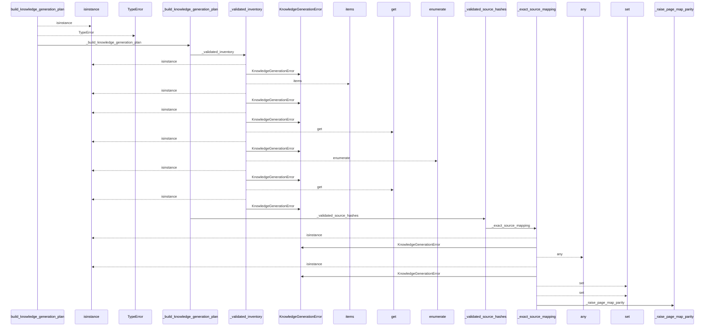
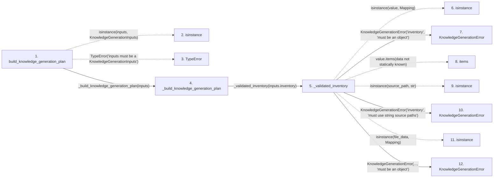

# build_knowledge_generation_plan

**Entry point:** `build_knowledge_generation_plan` (`api`)
**Source:** [knowledge_generation](../modules/knowledge_generation.md)
**Modules touched:** [concept_identity](../modules/concept_identity.md), [infrastructure_sync](../modules/infrastructure_sync.md), [knowledge_artifacts](../modules/knowledge_artifacts.md), and 14 more

**Complete modules touched:**

- [concept_identity](../modules/concept_identity.md)
- [infrastructure_sync](../modules/infrastructure_sync.md)
- [knowledge_artifacts](../modules/knowledge_artifacts.md)
- [knowledge_envelope](../modules/knowledge_envelope.md)
- [knowledge_evidence](../modules/knowledge_evidence.md)
- [knowledge_generation](../modules/knowledge_generation.md)
- [knowledge_governance](../modules/knowledge_governance.md)
- [knowledge_graph](../modules/knowledge_graph.md)
- [knowledge_index](../modules/knowledge_index.md)
- [knowledge_links](../modules/knowledge_links.md)
- [knowledge_model](../modules/knowledge_model.md)
- [markdown_sections](../modules/markdown_sections.md)
- [section_ownership](../modules/section_ownership.md)
- [sync_manifest](../modules/sync_manifest.md)
- [validation](../modules/validation.md)
- [wiki_media](../modules/wiki_media.md)
- [wiki_surface](../modules/wiki_surface.md)

## Call sequence

<!-- Auto-generated from static call edges. Dashed arrows are external or unresolved calls. Reviewed runtime conditions and side effects belong in Behavior. -->

> Call sequence diagram shows 30 of 2948 interactions; 2918 omitted to keep the visualization within the 30-interaction and generated-diagram limits.

> Trace truncated at the depth limit; deeper calls are omitted.

## Data flow

<!-- Auto-generated static analysis. Treat values and boundaries as best-effort hints, not runtime proof. -->

### Step data

| Step | Inputs | Reads | Writes | Returns |
|---|---|---|---|---|
| `build_knowledge_generation_plan` | `inputs: KnowledgeGenerationInputs` | `KnowledgeGenerationInputs`, `KnowledgeGenerationError`, `KnowledgeArtifactError`, `KnowledgeEnvelopeError`, `KnowledgeGraphError`, `KnowledgeIndexBuildError`, `KnowledgeLinkError`, `SyncManifestError` | - | `_build_knowledge_generation_plan(...)` |
| `isinstance` | - | - | - | - |
| `TypeError` | - | - | - | - |
| `_build_knowledge_generation_plan` | `inputs: KnowledgeGenerationInputs` | `SyncManifest`, `SyncManifest`, `InfrastructureSyncError` | `unknown_baselines[...]` | `build_knowledge_commit_plan(...)` |
| `_validated_inventory` | `value: object` | `Mapping`, `Mapping`, `Mapping` | `result[...]` | `result` |
| `isinstance` | - | - | - | - |
| `KnowledgeGenerationError` | - | - | - | - |
| `items` | - | - | - | - |
| `isinstance` | - | - | - | - |
| `KnowledgeGenerationError` | - | - | - | - |
| `isinstance` | - | - | - | - |
| `KnowledgeGenerationError` | - | - | - | - |

### Call data

| From | To | Line | Call |
|---|---|---:|---|
| build_knowledge_generation_plan | isinstance | 170 | `isinstance(inputs, KnowledgeGenerationInputs)` |
| build_knowledge_generation_plan | TypeError | 171 | `TypeError('inputs must be a KnowledgeGenerationInputs')` |
| build_knowledge_generation_plan | _build_knowledge_generation_plan | 173 | `_build_knowledge_generation_plan(inputs)` |
| _build_knowledge_generation_plan | _validated_inventory | 190 | `_validated_inventory(inputs.inventory)` |
| _validated_inventory | isinstance | 866 | `isinstance(value, Mapping)` |
| _validated_inventory | KnowledgeGenerationError | 867 | `KnowledgeGenerationError('inventory', 'must be an object')` |
| _validated_inventory | items | 869 | `value.items(data not statically known)` |
| _validated_inventory | isinstance | 870 | `isinstance(source_path, str)` |
| _validated_inventory | KnowledgeGenerationError | 871 | `KnowledgeGenerationError('inventory', 'must use string source paths')` |
| _validated_inventory | isinstance | 875 | `isinstance(file_data, Mapping)` |
| _validated_inventory | KnowledgeGenerationError | 876 | `KnowledgeGenerationError(..., 'must be an object')` |

### Boundary effects

*No boundary effects detected.*

### Static analysis gaps

| Kind | Step | Target | Line |
|---|---|---|---:|
| unresolved_call | `build_knowledge_generation_plan` | `isinstance` | 170 |
| unresolved_call | `build_knowledge_generation_plan` | `TypeError` | 171 |
| unresolved_call | `_validated_inventory` | `isinstance` | 866 |
| unresolved_call | `_validated_inventory` | `value.items` | 869 |
| unresolved_call | `_validated_inventory` | `isinstance` | 870 |
| unresolved_call | `_validated_inventory` | `isinstance` | 875 |
| step_limit | `build_knowledge_generation_plan` | `first 12 steps` | 0 |
| truncated_flow | `build_knowledge_generation_plan` | `depth limit` | 0 |

## Behavior

This flow starts at `build_knowledge_generation_plan` and is classified as `api`. The generated call and data-flow sections are bounded static projections; runtime conditions and side effects require source-level confirmation.
