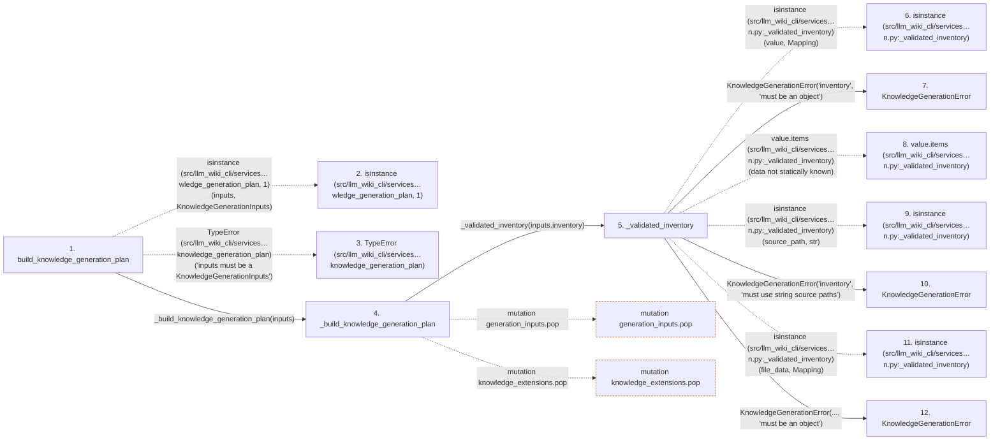

# build_knowledge_generation_plan

**Entry point:** `build_knowledge_generation_plan` (`api`)
**Source:** [knowledge_generation](../modules/knowledge_generation.md)
**Modules touched:** [common](../modules/common.md), [concept_identity](../modules/concept_identity.md), [immutable](../modules/immutable.md), [infrastructure_sync](../modules/infrastructure_sync.md), and 17 more

**Complete modules touched:**

- [common](../modules/common.md)
- [concept_identity](../modules/concept_identity.md)
- [immutable](../modules/immutable.md)
- [infrastructure_sync](../modules/infrastructure_sync.md)
- [knowledge_artifacts](../modules/knowledge_artifacts.md)
- [knowledge_envelope](../modules/knowledge_envelope.md)
- [knowledge_evidence](../modules/knowledge_evidence.md)
- [knowledge_generation](../modules/knowledge_generation.md)
- [knowledge_governance](../modules/knowledge_governance.md)
- [knowledge_graph](../modules/knowledge_graph.md)
- [knowledge_index](../modules/knowledge_index.md)
- [knowledge_links](../modules/knowledge_links.md)
- [knowledge_model](../modules/knowledge_model.md)
- [knowledge_reuse](../modules/knowledge_reuse.md)
- [markdown_sections](../modules/markdown_sections.md)
- [progress](../modules/progress.md)
- [section_ownership](../modules/section_ownership.md)
- [sync_manifest](../modules/sync_manifest.md)
- [validation](../modules/validation.md)
- [wiki_media](../modules/wiki_media.md)
- [wiki_surface](../modules/wiki_surface.md)

## Call sequence

```mermaid
sequenceDiagram
    participant p0 as build_knowledge_generation_plan
    participant p1 as isinstance (src/llm_wiki_cli/services…wledge_generation_plan, 1)
    participant p2 as TypeError (src/llm_wiki_cli/services…knowledge_generation_plan)
    participant p3 as _build_knowledge_generation_plan
    participant p4 as _validated_inventory
    participant p5 as isinstance (src/llm_wiki_cli/services…n.py:_validated_inventory)
    participant p6 as KnowledgeGenerationError
    participant p7 as value.items (src/llm_wiki_cli/services…n.py:_validated_inventory)
    participant p8 as file_data.get (src/llm_wiki_cli/services…n.py:_validated_inventory)
    participant p9 as enumerate (src/llm_wiki_cli/services…n.py:_validated_inventory)
    participant p10 as entity.get
    participant p11 as _validated_source_hashes
    participant p12 as _exact_source_mapping
    participant p13 as isinstance (src/llm_wiki_cli/services….py:_exact_source_mapping)
    participant p14 as any (src/llm_wiki_cli/services….py:_exact_source_mapping)
    participant p15 as set (src/llm_wiki_cli/services….py:_exact_source_mapping)
    participant p16 as _raise_page_map_parity
    p0-->>p1: isinstance (src/llm_wiki_cli/services…wledge_generation_plan, 1)
    p0-->>p2: TypeError (src/llm_wiki_cli/services…knowledge_generation_plan)
    p0->>p3: _build_knowledge_generation_plan
    p3->>p4: _validated_inventory
    p4-->>p5: isinstance (src/llm_wiki_cli/services…n.py:_validated_inventory)
    p4->>p6: KnowledgeGenerationError
    p4-->>p7: value.items (src/llm_wiki_cli/services…n.py:_validated_inventory)
    p4-->>p5: isinstance (src/llm_wiki_cli/services…n.py:_validated_inventory)
    p4->>p6: KnowledgeGenerationError
    p4-->>p5: isinstance (src/llm_wiki_cli/services…n.py:_validated_inventory)
    p4->>p6: KnowledgeGenerationError
    p4-->>p8: file_data.get (src/llm_wiki_cli/services…n.py:_validated_inventory)
    p4-->>p5: isinstance (src/llm_wiki_cli/services…n.py:_validated_inventory)
    p4->>p6: KnowledgeGenerationError
    p4-->>p9: enumerate (src/llm_wiki_cli/services…n.py:_validated_inventory)
    p4-->>p5: isinstance (src/llm_wiki_cli/services…n.py:_validated_inventory)
    p4->>p6: KnowledgeGenerationError
    p4-->>p10: entity.get
    p4-->>p5: isinstance (src/llm_wiki_cli/services…n.py:_validated_inventory)
    p4->>p6: KnowledgeGenerationError
    p3->>p11: _validated_source_hashes
    p11->>p12: _exact_source_mapping
    p12-->>p13: isinstance (src/llm_wiki_cli/services….py:_exact_source_mapping)
    p12->>p6: KnowledgeGenerationError
    p12-->>p14: any (src/llm_wiki_cli/services….py:_exact_source_mapping)
    p12-->>p13: isinstance (src/llm_wiki_cli/services….py:_exact_source_mapping)
    p12->>p6: KnowledgeGenerationError
    p12-->>p15: set (src/llm_wiki_cli/services….py:_exact_source_mapping)
    p12-->>p15: set (src/llm_wiki_cli/services….py:_exact_source_mapping)
    p12->>p16: _raise_page_map_parity
```

<!-- Auto-generated from static call edges. Dashed arrows are external or unresolved calls. Reviewed runtime conditions and side effects belong in Behavior. -->

> Call sequence diagram shows 30 of 3231 interactions; 3201 omitted to keep the visualization within the 30-interaction and generated-diagram limits.

> Trace truncated at the depth limit; deeper calls are omitted.

## Data flow

<!-- Auto-generated static analysis. Treat values and boundaries as best-effort hints, not runtime proof. -->

### Step data

| Step | Inputs | Reads | Writes | Returns |
|---|---|---|---|---|
| `build_knowledge_generation_plan` | `inputs: KnowledgeGenerationInputs` | `KnowledgeGenerationInputs`, `KnowledgeGenerationError`, `KnowledgeArtifactError`, `KnowledgeEnvelopeError`, `KnowledgeGraphError`, `KnowledgeIndexBuildError`, `KnowledgeLinkError`, `SyncManifestError` | - | `_build_knowledge_generation_plan(...)` |
| `isinstance (src/llm_wiki_cli/services…wledge_generation_plan, 1)` | - | - | - | - |
| `TypeError (src/llm_wiki_cli/services…knowledge_generation_plan)` | - | - | - | - |
| `_build_knowledge_generation_plan` | `inputs: KnowledgeGenerationInputs` | `SyncManifest`, `SyncManifest`, `InfrastructureSyncError` | `unknown_baselines[...]`, `generation_inputs[...]`, `knowledge_extensions[...]` | `build_knowledge_commit_plan(...)` |
| `_validated_inventory` | `value: object` | `Mapping`, `Mapping`, `Mapping` | `result[...]` | `result` |
| `isinstance (src/llm_wiki_cli/services…n.py:_validated_inventory)` | - | - | - | - |
| `KnowledgeGenerationError` | - | - | - | - |
| `value.items (src/llm_wiki_cli/services…n.py:_validated_inventory)` | - | - | - | - |
| `isinstance (src/llm_wiki_cli/services…n.py:_validated_inventory)` | - | - | - | - |
| `KnowledgeGenerationError` | - | - | - | - |
| `isinstance (src/llm_wiki_cli/services…n.py:_validated_inventory)` | - | - | - | - |
| `KnowledgeGenerationError` | - | - | - | - |

### Call data

| From | To | Line | Call |
|---|---|---:|---|
| build_knowledge_generation_plan | isinstance (src/llm_wiki_cli/services…wledge_generation_plan, 1) | 169 | `isinstance(inputs, KnowledgeGenerationInputs)` |
| build_knowledge_generation_plan | TypeError (src/llm_wiki_cli/services…knowledge_generation_plan) | 170 | `TypeError('inputs must be a KnowledgeGenerationInputs')` |
| build_knowledge_generation_plan | _build_knowledge_generation_plan | 172 | `_build_knowledge_generation_plan(inputs)` |
| _build_knowledge_generation_plan | _validated_inventory | 189 | `_validated_inventory(inputs.inventory)` |
| _validated_inventory | isinstance (src/llm_wiki_cli/services…n.py:_validated_inventory) | 887 | `isinstance(value, Mapping)` |
| _validated_inventory | KnowledgeGenerationError | 888 | `KnowledgeGenerationError('inventory', 'must be an object')` |
| _validated_inventory | value.items (src/llm_wiki_cli/services…n.py:_validated_inventory) | 890 | `value.items(data not statically known)` |
| _validated_inventory | isinstance (src/llm_wiki_cli/services…n.py:_validated_inventory) | 891 | `isinstance(source_path, str)` |
| _validated_inventory | KnowledgeGenerationError | 892 | `KnowledgeGenerationError('inventory', 'must use string source paths')` |
| _validated_inventory | isinstance (src/llm_wiki_cli/services…n.py:_validated_inventory) | 896 | `isinstance(file_data, Mapping)` |
| _validated_inventory | KnowledgeGenerationError | 897 | `KnowledgeGenerationError(..., 'must be an object')` |

### Boundary effects

| Kind | Target | Step | Line |
|---|---|---|---:|
| mutation | `generation_inputs.pop` | `_build_knowledge_generation_plan` | 376 |
| mutation | `knowledge_extensions.pop` | `_build_knowledge_generation_plan` | 380 |

### Static analysis gaps

| Kind | Step | Target | Line |
|---|---|---|---:|
| external_call | `build_knowledge_generation_plan` | `isinstance` | 169 |
| external_call | `build_knowledge_generation_plan` | `TypeError` | 170 |
| external_call | `_validated_inventory` | `isinstance` | 887 |
| unresolved_call | `_validated_inventory` | `value.items` | 890 |
| external_call | `_validated_inventory` | `isinstance` | 891 |
| external_call | `_validated_inventory` | `isinstance` | 896 |
| step_limit | `build_knowledge_generation_plan` | `first 12 steps` | 0 |
| truncated_flow | `build_knowledge_generation_plan` | `depth limit` | 0 |

## Behavior

This flow starts at `build_knowledge_generation_plan` and is classified as `api`. The generated call and data-flow sections are bounded static projections; runtime conditions and side effects require source-level confirmation.
