# build_knowledge_index

**Entry point:** `build_knowledge_index` (`api`)
**Source:** [knowledge_index](../modules/knowledge_index.md)
**Modules touched:** [knowledge_envelope](../modules/knowledge_envelope.md), [knowledge_evidence](../modules/knowledge_evidence.md), [knowledge_index](../modules/knowledge_index.md), and 6 more

**Complete modules touched:**

- [knowledge_envelope](../modules/knowledge_envelope.md)
- [knowledge_evidence](../modules/knowledge_evidence.md)
- [knowledge_index](../modules/knowledge_index.md)
- [knowledge_links](../modules/knowledge_links.md)
- [knowledge_model](../modules/knowledge_model.md)
- [progress](../modules/progress.md)
- [validation](../modules/validation.md)
- [wiki_media](../modules/wiki_media.md)
- [wiki_surface](../modules/wiki_surface.md)

## Call sequence

```mermaid
sequenceDiagram
    participant p0 as build_knowledge_index
    participant p1 as _validate_and_join_inputs
    participant p2 as isinstance (src/llm_wiki_cli/services…_validate_and_join_inputs)
    participant p3 as TypeError (src/llm_wiki_cli/services…_validate_and_join_inputs)
    participant p4 as _validated_bundle
    participant p5 as isinstance (src/llm_wiki_cli/services…ndex.py:_validated_bundle)
    participant p6 as KnowledgeIndexBuildError
    participant p7 as evaluated_envelope_to_payload
    participant p8 as isinstance (src/llm_wiki_cli/services…uated_envelope_to_payload)
    participant p9 as TypeError (src/llm_wiki_cli/services…uated_envelope_to_payload)
    participant p10 as KnowledgeEnvelopeError
    participant p11 as _validated_bundle_payload
    participant p12 as dict
    participant p13 as snapshot_extensions.pop
    participant p14 as replace
    participant p15 as knowledge_index_to_payload
    participant p16 as isinstance (src/llm_wiki_cli/services…nowledge_index_to_payload)
    participant p17 as TypeError (src/llm_wiki_cli/services…nowledge_index_to_payload)
    participant p18 as _emit_extensions
    participant p19 as _bundle_to_payload
    participant p20 as _concept_to_payload
    participant p21 as _relationship_to_payload
    participant p22 as KnowledgeModelError
    participant p23 as parse_knowledge_index
    participant p24 as _knowledge_index_to_payload_unchecked
    participant p25 as KnowledgeIndex
    participant p26 as bundle_payload[…].get(…).get
    participant p27 as bundle_payload[…].get
    participant p28 as is_valid_sha256
    p0->>p1: _validate_and_join_inputs
    p1-->>p2: isinstance (src/llm_wiki_cli/services…_validate_and_join_inputs)
    p1-->>p3: TypeError (src/llm_wiki_cli/services…_validate_and_join_inputs)
    p1->>p4: _validated_bundle
    p4-->>p5: isinstance (src/llm_wiki_cli/services…ndex.py:_validated_bundle)
    p4->>p6: KnowledgeIndexBuildError
    p4->>p7: evaluated_envelope_to_payload
    p7-->>p8: isinstance (src/llm_wiki_cli/services…uated_envelope_to_payload)
    p7-->>p9: TypeError (src/llm_wiki_cli/services…uated_envelope_to_payload)
    p7->>p10: KnowledgeEnvelopeError
    p7->>p11: _validated_bundle_payload
    p11-->>p12: dict
    p11-->>p13: snapshot_extensions.pop
    p11-->>p14: replace
    p11-->>p14: replace
    p11->>p15: knowledge_index_to_payload
    p15-->>p16: isinstance (src/llm_wiki_cli/services…nowledge_index_to_payload)
    p15-->>p17: TypeError (src/llm_wiki_cli/services…nowledge_index_to_payload)
    p15->>p18: _emit_extensions
    p15->>p19: _bundle_to_payload
    p15->>p20: _concept_to_payload
    p15->>p21: _relationship_to_payload
    p15->>p22: KnowledgeModelError
    p15->>p23: parse_knowledge_index
    p15->>p24: _knowledge_index_to_payload_unchecked
    p11->>p25: KnowledgeIndex
    p11->>p10: KnowledgeEnvelopeError
    p7-->>p26: bundle_payload[…].get(…).get
    p7-->>p27: bundle_payload[…].get
    p7->>p28: is_valid_sha256
```

<!-- Auto-generated from static call edges. Dashed arrows are external or unresolved calls. Reviewed runtime conditions and side effects belong in Behavior. -->

> Call sequence diagram shows 30 of 599 interactions; 569 omitted to keep the visualization within the 30-interaction and generated-diagram limits.

> Trace truncated at the depth limit; deeper calls are omitted.

## Data flow

```mermaid
flowchart LR
    s1["1. build_knowledge_index"]
    s2["2. _validate_and_join_inputs"]
    s3["3. isinstance (src/llm_wiki_cli/services…_validate_and_join_inputs)"]
    s4["4. TypeError (src/llm_wiki_cli/services…_validate_and_join_inputs)"]
    s5["5. _validated_bundle"]
    s6["6. isinstance (src/llm_wiki_cli/services…ndex.py:_validated_bundle)"]
    s7["7. KnowledgeIndexBuildError"]
    s8["8. evaluated_envelope_to_payload"]
    s9["9. isinstance (src/llm_wiki_cli/services…uated_envelope_to_payload)"]
    s10["10. TypeError (src/llm_wiki_cli/services…uated_envelope_to_payload)"]
    s11["11. KnowledgeEnvelopeError"]
    s12["12. _validated_bundle_payload"]
    s1 -->|"_validate_and_join_inputs(inputs)"| s2
    s2 -. "isinstance (src/llm_wiki_cli/services…_validate_and_join_inputs)(inputs, KnowledgeIndexInputs)" .-> s3
    s2 -. "TypeError (src/llm_wiki_cli/services…_validate_and_join_inputs)('inputs must be a KnowledgeIndexInputs')" .-> s4
    s2 -->|"_validated_bundle(inputs.envelope)"| s5
    s5 -. "isinstance (src/llm_wiki_cli/services…ndex.py:_validated_bundle)(envelope, EvaluatedEnvelope)" .-> s6
    s5 -->|"KnowledgeIndexBuildError('envelope', 'must be an already evaluated envelope')"| s7
    s5 -->|"evaluated_envelope_to_payload(envelope)"| s8
    s8 -. "isinstance (src/llm_wiki_cli/services…uated_envelope_to_payload)(envelope, EvaluatedEnvelope)" .-> s9
    s8 -. "TypeError (src/llm_wiki_cli/services…uated_envelope_to_payload)('envelope must be an EvaluatedEnvelope')" .-> s10
    s8 -->|"KnowledgeEnvelopeError('schema_version', ...)"| s11
    s8 -->|"_validated_bundle_payload(envelope.bundle)"| s12
    b0["mutation relationships.extend"]
    s1 -. "mutation relationships.extend" .-> b0
    b1["mutation joined.append"]
    s2 -. "mutation joined.append" .-> b1
    b2["mutation joined.sort"]
    s2 -. "mutation joined.sort" .-> b2
    b3["mutation snapshot_extensions.pop"]
    s12 -. "mutation snapshot_extensions.pop" .-> b3
    click s1 "../modules/knowledge_index.md"
    click s2 "../modules/knowledge_index.md"
    click s5 "../modules/knowledge_index.md"
    click s7 "../modules/knowledge_index.md"
    click s8 "../modules/knowledge_envelope.md"
    click s11 "../modules/knowledge_envelope.md"
    click s12 "../modules/knowledge_envelope.md"
    classDef boundary stroke:#b45309,stroke-dasharray: 4 2
    class b0 boundary
    class b1 boundary
    class b2 boundary
    class b3 boundary
```

<!-- Auto-generated static analysis. Treat values and boundaries as best-effort hints, not runtime proof. -->

### Step data

| Step | Inputs | Reads | Writes | Returns |
|---|---|---|---|---|
| `build_knowledge_index` | `inputs: KnowledgeIndexInputs` | `KNOWLEDGE_SCHEMA_VERSION`, `KnowledgeModelError` | - | `validate_knowledge_index(...)` |
| `_validate_and_join_inputs` | `inputs: KnowledgeIndexInputs` | `KnowledgeIndexInputs`, `ManifestPageSource`, `ManifestEvidenceBaseline`, `ManifestTombstone`, `ConceptObservationBasis`, `_MANIFEST_STRUCTURAL_PAGE_KINDS`, `PageKind` | - | `_BuildContext(...)` |
| `isinstance (src/llm_wiki_cli/services…_validate_and_join_inputs)` | - | - | - | - |
| `TypeError (src/llm_wiki_cli/services…_validate_and_join_inputs)` | - | - | - | - |
| `_validated_bundle` | `envelope: object` | `EvaluatedEnvelope`, `KnowledgeEnvelopeError` | - | `envelope.bundle` |
| `isinstance (src/llm_wiki_cli/services…ndex.py:_validated_bundle)` | - | - | - | - |
| `KnowledgeIndexBuildError` | - | - | - | - |
| `evaluated_envelope_to_payload` | `envelope: EvaluatedEnvelope` | `EvaluatedEnvelope`, `EVALUATED_ENVELOPE_VERSION`, `EVALUATED_ENVELOPE_VERSION`, `INVENTORY_HASH_EXTENSION`, `INVENTORY_HASH_EXTENSION` | - | `{...}` |
| `isinstance (src/llm_wiki_cli/services…uated_envelope_to_payload)` | - | - | - | - |
| `TypeError (src/llm_wiki_cli/services…uated_envelope_to_payload)` | - | - | - | - |
| `KnowledgeEnvelopeError` | - | - | - | - |
| `_validated_bundle_payload` | `bundle: BundleRecord` | `GOVERNANCE_HASH_EXTENSION_KEY`, `KNOWLEDGE_SCHEMA_VERSION`, `KnowledgeModelError` | - | `payload[...]` |

### Call data

| From | To | Line | Call |
|---|---|---:|---|
| build_knowledge_index | _validate_and_join_inputs | 218 | `_validate_and_join_inputs(inputs)` |
| _validate_and_join_inputs | isinstance (src/llm_wiki_cli/services…_validate_and_join_inputs) | 321 | `isinstance(inputs, KnowledgeIndexInputs)` |
| _validate_and_join_inputs | TypeError (src/llm_wiki_cli/services…_validate_and_join_inputs) | 322 | `TypeError('inputs must be a KnowledgeIndexInputs')` |
| _validate_and_join_inputs | _validated_bundle | 323 | `_validated_bundle(inputs.envelope)` |
| _validated_bundle | isinstance (src/llm_wiki_cli/services…ndex.py:_validated_bundle) | 422 | `isinstance(envelope, EvaluatedEnvelope)` |
| _validated_bundle | KnowledgeIndexBuildError | 423 | `KnowledgeIndexBuildError('envelope', 'must be an already evaluated envelope')` |
| _validated_bundle | evaluated_envelope_to_payload | 428 | `evaluated_envelope_to_payload(envelope)` |
| evaluated_envelope_to_payload | isinstance (src/llm_wiki_cli/services…uated_envelope_to_payload) | 1141 | `isinstance(envelope, EvaluatedEnvelope)` |
| evaluated_envelope_to_payload | TypeError (src/llm_wiki_cli/services…uated_envelope_to_payload) | 1142 | `TypeError('envelope must be an EvaluatedEnvelope')` |
| evaluated_envelope_to_payload | KnowledgeEnvelopeError | 1144 | `KnowledgeEnvelopeError('schema_version', ...)` |
| evaluated_envelope_to_payload | _validated_bundle_payload | 1148 | `_validated_bundle_payload(envelope.bundle)` |

### Boundary effects

| Kind | Target | Step | Line |
|---|---|---|---:|
| mutation | `relationships.extend` | `build_knowledge_index` | 225 |
| mutation | `joined.append` | `_validate_and_join_inputs` | 380 |
| mutation | `joined.sort` | `_validate_and_join_inputs` | 401 |
| mutation | `snapshot_extensions.pop` | `_validated_bundle_payload` | 1943 |

### Static analysis gaps

| Kind | Step | Target | Line |
|---|---|---|---:|
| external_call | `_validate_and_join_inputs` | `isinstance` | 321 |
| external_call | `_validate_and_join_inputs` | `TypeError` | 322 |
| external_call | `_validated_bundle` | `isinstance` | 422 |
| external_call | `evaluated_envelope_to_payload` | `isinstance` | 1141 |
| external_call | `evaluated_envelope_to_payload` | `TypeError` | 1142 |
| step_limit | `build_knowledge_index` | `first 12 steps` | 0 |
| truncated_flow | `build_knowledge_index` | `depth limit` | 0 |

## Behavior

This flow starts at `build_knowledge_index` and is classified as `api`. The generated call and data-flow sections are bounded static projections; runtime conditions and side effects require source-level confirmation.
