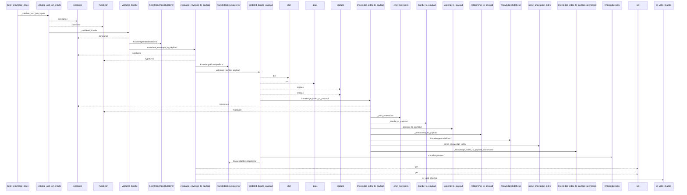
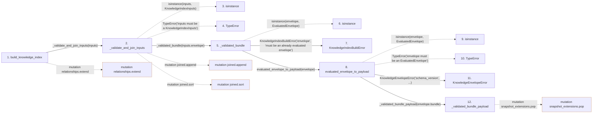

# build_knowledge_index

**Entry point:** `build_knowledge_index` (`api`)
**Source:** [knowledge_index](../modules/knowledge_index.md)
**Modules touched:** [knowledge_envelope](../modules/knowledge_envelope.md), [knowledge_evidence](../modules/knowledge_evidence.md), [knowledge_index](../modules/knowledge_index.md), and 5 more

**Complete modules touched:**

- [knowledge_envelope](../modules/knowledge_envelope.md)
- [knowledge_evidence](../modules/knowledge_evidence.md)
- [knowledge_index](../modules/knowledge_index.md)
- [knowledge_links](../modules/knowledge_links.md)
- [knowledge_model](../modules/knowledge_model.md)
- [validation](../modules/validation.md)
- [wiki_media](../modules/wiki_media.md)
- [wiki_surface](../modules/wiki_surface.md)

## Call sequence

<!-- Auto-generated from static call edges. Dashed arrows are external or unresolved calls. Reviewed runtime conditions and side effects belong in Behavior. -->

> Call sequence diagram shows 30 of 590 interactions; 560 omitted to keep the visualization within the 30-interaction and generated-diagram limits.

> Trace truncated at the depth limit; deeper calls are omitted.

## Data flow

<!-- Auto-generated static analysis. Treat values and boundaries as best-effort hints, not runtime proof. -->

### Step data

| Step | Inputs | Reads | Writes | Returns |
|---|---|---|---|---|
| `build_knowledge_index` | `inputs: KnowledgeIndexInputs` | `KNOWLEDGE_SCHEMA_VERSION`, `KnowledgeModelError` | - | `validate_knowledge_index(...)` |
| `_validate_and_join_inputs` | `inputs: KnowledgeIndexInputs` | `KnowledgeIndexInputs`, `ManifestPageSource`, `ManifestEvidenceBaseline`, `ManifestTombstone`, `ConceptObservationBasis`, `_MANIFEST_STRUCTURAL_PAGE_KINDS`, `PageKind` | - | `_BuildContext(...)` |
| `isinstance` | - | - | - | - |
| `TypeError` | - | - | - | - |
| `_validated_bundle` | `envelope: object` | `EvaluatedEnvelope`, `KnowledgeEnvelopeError` | - | `envelope.bundle` |
| `isinstance` | - | - | - | - |
| `KnowledgeIndexBuildError` | - | - | - | - |
| `evaluated_envelope_to_payload` | `envelope: EvaluatedEnvelope` | `EvaluatedEnvelope`, `EVALUATED_ENVELOPE_VERSION`, `EVALUATED_ENVELOPE_VERSION`, `INVENTORY_HASH_EXTENSION`, `INVENTORY_HASH_EXTENSION` | - | `{...}` |
| `isinstance` | - | - | - | - |
| `TypeError` | - | - | - | - |
| `KnowledgeEnvelopeError` | - | - | - | - |
| `_validated_bundle_payload` | `bundle: BundleRecord` | `GOVERNANCE_HASH_EXTENSION_KEY`, `KNOWLEDGE_SCHEMA_VERSION`, `KnowledgeModelError` | - | `payload[...]` |

### Call data

| From | To | Line | Call |
|---|---|---:|---|
| build_knowledge_index | _validate_and_join_inputs | 218 | `_validate_and_join_inputs(inputs)` |
| _validate_and_join_inputs | isinstance | 286 | `isinstance(inputs, KnowledgeIndexInputs)` |
| _validate_and_join_inputs | TypeError | 287 | `TypeError('inputs must be a KnowledgeIndexInputs')` |
| _validate_and_join_inputs | _validated_bundle | 288 | `_validated_bundle(inputs.envelope)` |
| _validated_bundle | isinstance | 387 | `isinstance(envelope, EvaluatedEnvelope)` |
| _validated_bundle | KnowledgeIndexBuildError | 388 | `KnowledgeIndexBuildError('envelope', 'must be an already evaluated envelope')` |
| _validated_bundle | evaluated_envelope_to_payload | 393 | `evaluated_envelope_to_payload(envelope)` |
| evaluated_envelope_to_payload | isinstance | 1131 | `isinstance(envelope, EvaluatedEnvelope)` |
| evaluated_envelope_to_payload | TypeError | 1132 | `TypeError('envelope must be an EvaluatedEnvelope')` |
| evaluated_envelope_to_payload | KnowledgeEnvelopeError | 1134 | `KnowledgeEnvelopeError('schema_version', ...)` |
| evaluated_envelope_to_payload | _validated_bundle_payload | 1138 | `_validated_bundle_payload(envelope.bundle)` |

### Boundary effects

| Kind | Target | Step | Line |
|---|---|---|---:|
| mutation | `relationships.extend` | `build_knowledge_index` | 225 |
| mutation | `joined.append` | `_validate_and_join_inputs` | 345 |
| mutation | `joined.sort` | `_validate_and_join_inputs` | 366 |
| mutation | `snapshot_extensions.pop` | `_validated_bundle_payload` | 1823 |

### Static analysis gaps

| Kind | Step | Target | Line |
|---|---|---|---:|
| unresolved_call | `_validate_and_join_inputs` | `isinstance` | 286 |
| unresolved_call | `_validate_and_join_inputs` | `TypeError` | 287 |
| unresolved_call | `_validated_bundle` | `isinstance` | 387 |
| unresolved_call | `evaluated_envelope_to_payload` | `isinstance` | 1131 |
| unresolved_call | `evaluated_envelope_to_payload` | `TypeError` | 1132 |
| step_limit | `build_knowledge_index` | `first 12 steps` | 0 |
| truncated_flow | `build_knowledge_index` | `depth limit` | 0 |

## Behavior

This flow starts at `build_knowledge_index` and is classified as `api`. The generated call and data-flow sections are bounded static projections; runtime conditions and side effects require source-level confirmation.
