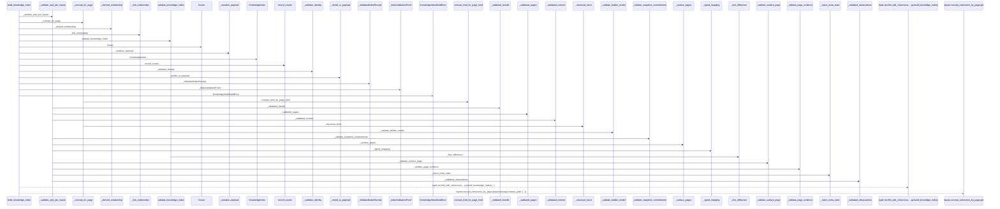
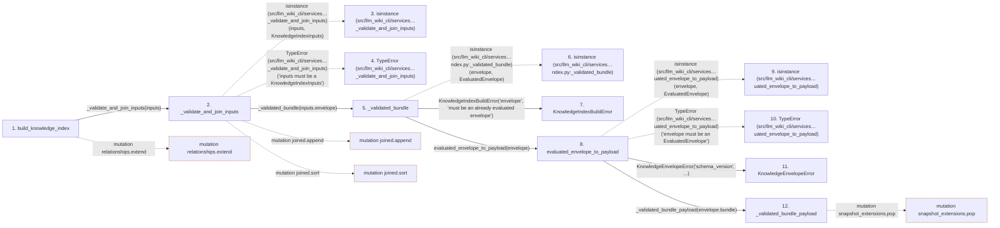

# build_knowledge_index

**Entry point:** `build_knowledge_index` (`api`)
**Source:** [knowledge_index](../modules/knowledge_index.md)
**Modules touched:** [immutable](../modules/immutable.md), [knowledge_envelope](../modules/knowledge_envelope.md), [knowledge_evidence](../modules/knowledge_evidence.md), [knowledge_index](../modules/knowledge_index.md), and 6 more

**Complete modules touched:**

- [immutable](../modules/immutable.md)
- [knowledge_envelope](../modules/knowledge_envelope.md)
- [knowledge_evidence](../modules/knowledge_evidence.md)
- [knowledge_index](../modules/knowledge_index.md)
- [knowledge_links](../modules/knowledge_links.md)
- [knowledge_model](../modules/knowledge_model.md)
- [progress](../modules/progress.md)
- [validation](../modules/validation.md)
- [wiki_media](../modules/wiki_media.md)
- [wiki_surface](../modules/wiki_surface.md)

## Call sequence

> Static overview in presentation order, not runtime execution order. Arrows retain captured callers; representative internal continuations and boundary examples precede repeated helper detail.

<!-- Auto-generated from static call edges. Dashed arrows are external or unresolved calls. Reviewed runtime conditions and side effects belong in Behavior. -->

```mermaid
sequenceDiagram
    participant p0 as build_knowledge_index
    participant p1 as _validate_and_join_inputs
    participant p2 as _concept_for_page
    participant p3 as _derived_relationship
    participant p4 as _link_relationship
    participant p5 as validate_knowledge_index
    participant p6 as freeze
    participant p7 as _serialize_payload
    participant p8 as KnowledgeIndex
    participant p9 as record_counts
    participant p10 as _validator_identity
    participant p11 as _model_to_payload
    participant p12 as _ValidatedIndexReceipt
    participant p13 as _IndexValidationProof
    participant p14 as KnowledgeIndexBuildError
    participant p15 as concept_kind_for_page_kind
    participant p16 as _validated_bundle
    participant p17 as _validated_pages
    participant p18 as _validated_content
    participant p19 as _structural_facet
    participant p20 as _validate_builder_model
    participant p21 as _validate_snapshot_commitments
    participant p22 as _surface_pages
    participant p23 as _typed_mapping
    participant p24 as _first_difference
    participant p25 as _validate_surface_page
    participant p26 as _validate_page_evidence
    participant p27 as _reject_extra_state
    participant p28 as _validated_observations
    participant p29 as tuple (src/llm_wiki_cli/services….py:build_knowledge_index)
    participant p30 as inputs.concept_extensions_by_page.get
    p0->>p1: _validate_and_join_inputs
    p0->>p2: _concept_for_page
    p0->>p3: _derived_relationship
    p0->>p4: _link_relationship
    p0->>p5: validate_knowledge_index
    p0->>p6: freeze
    p0->>p7: _serialize_payload
    p0->>p8: KnowledgeIndex
    p0->>p9: record_counts
    p0->>p10: _validator_identity
    p0->>p11: _model_to_payload
    p0->>p12: _ValidatedIndexReceipt
    p0->>p13: _IndexValidationProof
    p0->>p14: KnowledgeIndexBuildError
    p2->>p15: concept_kind_for_page_kind
    p1->>p16: _validated_bundle
    p1->>p17: _validated_pages
    p1->>p18: _validated_content
    p2->>p19: _structural_facet
    p5->>p20: _validate_builder_model
    p1->>p21: _validate_snapshot_commitments
    p1->>p22: _surface_pages
    p1->>p23: _typed_mapping
    p5->>p24: _first_difference
    p1->>p25: _validate_surface_page
    p1->>p26: _validate_page_evidence
    p1->>p27: _reject_extra_state
    p1->>p28: _validated_observations
    p0-->>p29: tuple (src/llm_wiki_cli/services….py:build_knowledge_index)(...)
    p0-->>p30: inputs.concept_extensions_by_page.get(joined.page.relative_path, {...})
```

> Call sequence diagram shows 30 of 640 interactions; 610 omitted to keep the visualization within the 30-interaction and generated-diagram limits, with uncertain identities omitted rather than inferred.

> Captured boundary calls: external 1 of 171 (170 omitted); unresolved 1 of 127 (126 omitted). These counts cover the captured static trace.

Omitted captured detail, grouped by actual caller occurrence and target module:

| Caller | Parent step | Target module | Kind | Omitted interactions |
| --- | --- | --- | --- | --- |
| `src/llm_wiki_cli/services/knowledge_index.py:_validate_and_join_inputs` | 2 | - | external | 6 |
| `src/llm_wiki_cli/services/knowledge_index.py:_validated_bundle` | 5 | - | external | 1 |
| `src/llm_wiki_cli/services/knowledge_index.py:_validated_bundle` | 5 | [src/llm_wiki_cli/services/knowledge_index.py](../modules/knowledge_index.md) | internal | 2 |
| `src/llm_wiki_cli/services/knowledge_index.py:_validated_bundle` | 5 | [src/llm_wiki_cli/services/knowledge_envelope.py](../modules/knowledge_envelope.md) | internal | 1 |
| `src/llm_wiki_cli/services/knowledge_envelope.py:evaluated_envelope_to_payload` | 8 | - | external | 2 |
| `src/llm_wiki_cli/services/knowledge_envelope.py:evaluated_envelope_to_payload` | 8 | [src/llm_wiki_cli/services/knowledge_envelope.py](../modules/knowledge_envelope.md) | internal | 3 |
| `src/llm_wiki_cli/services/knowledge_envelope.py:_validated_bundle_payload` | 12 | - | external | 3 |
| `src/llm_wiki_cli/services/knowledge_envelope.py:_validated_bundle_payload` | 12 | - | unresolved | 1 |
> Omission summary shows 8 of 173 groups; 165 further groups are not expanded here. Counts above include all omitted interactions.
> Detailed flow queries retain their own coverage and limits; omitted paths may execute at runtime.

> Trace truncated at the depth limit; deeper calls are omitted.

## Data flow

<!-- Auto-generated static analysis. Treat values and boundaries as best-effort hints, not runtime proof. -->

### Analysis coverage

**Effect analysis partially available.** Flow assembly and source effect analysis are separate; empty observations do not prove an empty handler body.

Source steps: 343; effect analysis evaluated: 129, partial: 11, unavailable: 203. Counts include steps omitted from the displayed trace.

Collector observations for 140 source steps with known totals: observed: 813, emitted: 723, omitted: 90. Unavailable totals are excluded.

- Callable record unavailable for one or more source steps; those steps have no represented callable body.
- Effect collector omitted observations before flow assembly; displayed effects are partial.
- Effect collector totals unavailable; observed counts cover captured records only.

| Step | Callable record | Effect analysis | Collector totals | Observed | Emitted | Omitted |
|---|---|---|---|---:|---:|---:|
| `build_knowledge_index` | `available` | `evaluated` | `available` | `6` | `6` | `0` |
| `_validate_and_join_inputs` | `available` | `evaluated` | `available` | `11` | `11` | `0` |
| `isinstance (src/llm_wiki_cli/services…_validate_and_join_inputs)` | `not_applicable` | `not_applicable` | `not_applicable` | — | — | — |
| `TypeError (src/llm_wiki_cli/services…_validate_and_join_inputs)` | `not_applicable` | `not_applicable` | `not_applicable` | — | — | — |
| `_validated_bundle` | `available` | `evaluated` | `available` | `4` | `4` | `0` |
| `isinstance (src/llm_wiki_cli/services…ndex.py:_validated_bundle)` | `not_applicable` | `not_applicable` | `not_applicable` | — | — | — |
| `KnowledgeIndexBuildError` | `unavailable` | `unavailable` | `unavailable` | — | — | — |
| `evaluated_envelope_to_payload` | `available` | `evaluated` | `available` | `7` | `7` | `0` |
| `isinstance (src/llm_wiki_cli/services…uated_envelope_to_payload)` | `not_applicable` | `not_applicable` | `not_applicable` | — | — | — |
| `TypeError (src/llm_wiki_cli/services…uated_envelope_to_payload)` | `not_applicable` | `not_applicable` | `not_applicable` | — | — | — |
| `KnowledgeEnvelopeError` | `unavailable` | `unavailable` | `unavailable` | — | — | — |
| `_validated_bundle_payload` | `available` | `evaluated` | `available` | `6` | `6` | `0` |

```mermaid
flowchart LR
    s1["1. build_knowledge_index"]
    s2["2. _validate_and_join_inputs"]
    s3["3. isinstance (src/llm_wiki_cli/services…_validate_and_join_inputs)"]
    s4["4. TypeError (src/llm_wiki_cli/services…_validate_and_join_inputs)"]
    s5["5. _validated_bundle"]
    s6["6. isinstance (src/llm_wiki_cli/services…ndex.py:_validated_bundle)"]
    s7["7. KnowledgeIndexBuildError"]
    s8["8. evaluated_envelope_to_payload"]
    s9["9. isinstance (src/llm_wiki_cli/services…uated_envelope_to_payload)"]
    s10["10. TypeError (src/llm_wiki_cli/services…uated_envelope_to_payload)"]
    s11["11. KnowledgeEnvelopeError"]
    s12["12. _validated_bundle_payload"]
    s1 -->|"_validate_and_join_inputs(inputs)"| s2
    s2 -. "isinstance (src/llm_wiki_cli/services…_validate_and_join_inputs)(inputs, KnowledgeIndexInputs)" .-> s3
    s2 -. "TypeError (src/llm_wiki_cli/services…_validate_and_join_inputs)('inputs must be a KnowledgeIndexInputs')" .-> s4
    s2 -->|"_validated_bundle(inputs.envelope)"| s5
    s5 -. "isinstance (src/llm_wiki_cli/services…ndex.py:_validated_bundle)(envelope, EvaluatedEnvelope)" .-> s6
    s5 -->|"KnowledgeIndexBuildError('envelope', 'must be an already evaluated envelope')"| s7
    s5 -->|"evaluated_envelope_to_payload(envelope)"| s8
    s8 -. "isinstance (src/llm_wiki_cli/services…uated_envelope_to_payload)(envelope, EvaluatedEnvelope)" .-> s9
    s8 -. "TypeError (src/llm_wiki_cli/services…uated_envelope_to_payload)('envelope must be an EvaluatedEnvelope')" .-> s10
    s8 -->|"KnowledgeEnvelopeError('schema_version', ...)"| s11
    s8 -->|"_validated_bundle_payload(envelope.bundle)"| s12
    b0["mutation relationships.extend"]
    s1 -. "mutation relationships.extend" .-> b0
    b1["mutation joined.append"]
    s2 -. "mutation joined.append" .-> b1
    b2["mutation joined.sort"]
    s2 -. "mutation joined.sort" .-> b2
    b3["mutation snapshot_extensions.pop"]
    s12 -. "mutation snapshot_extensions.pop" .-> b3
    click s1 "../modules/knowledge_index.md"
    click s2 "../modules/knowledge_index.md"
    click s5 "../modules/knowledge_index.md"
    click s7 "../modules/knowledge_index.md"
    click s8 "../modules/knowledge_envelope.md"
    click s11 "../modules/knowledge_envelope.md"
    click s12 "../modules/knowledge_envelope.md"
    classDef boundary stroke:#b45309,stroke-dasharray: 4 2
    class b0 boundary
    class b1 boundary
    class b2 boundary
    class b3 boundary
```

### Step data

| Step | Inputs | Reads | Writes | Returns |
|---|---|---|---|---|
| `build_knowledge_index` | `inputs: KnowledgeIndexInputs` | `KNOWLEDGE_SCHEMA_VERSION`, `_INDEX_RECEIPT_ISSUER`, `KnowledgeModelError` | - | `validated` |
| `_validate_and_join_inputs` | `inputs: KnowledgeIndexInputs` | `KnowledgeIndexInputs`, `ManifestPageSource`, `ManifestEvidenceBaseline`, `ManifestTombstone`, `ConceptObservationBasis`, `_MANIFEST_STRUCTURAL_PAGE_KINDS`, `PageKind` | - | `_BuildContext(...)` |
| `isinstance (src/llm_wiki_cli/services…_validate_and_join_inputs)` | - | - | - | - |
| `TypeError (src/llm_wiki_cli/services…_validate_and_join_inputs)` | - | - | - | - |
| `_validated_bundle` | `envelope: object` | `EvaluatedEnvelope`, `KnowledgeEnvelopeError` | - | `envelope.bundle` |
| `isinstance (src/llm_wiki_cli/services…ndex.py:_validated_bundle)` | - | - | - | - |
| `KnowledgeIndexBuildError` | - | - | - | - |
| `evaluated_envelope_to_payload` | `envelope: EvaluatedEnvelope` | `EvaluatedEnvelope`, `EVALUATED_ENVELOPE_VERSION`, `EVALUATED_ENVELOPE_VERSION`, `INVENTORY_HASH_EXTENSION`, `INVENTORY_HASH_EXTENSION` | - | `{...}` |
| `isinstance (src/llm_wiki_cli/services…uated_envelope_to_payload)` | - | - | - | - |
| `TypeError (src/llm_wiki_cli/services…uated_envelope_to_payload)` | - | - | - | - |
| `KnowledgeEnvelopeError` | - | - | - | - |
| `_validated_bundle_payload` | `bundle: BundleRecord` | `GOVERNANCE_HASH_EXTENSION_KEY`, `KNOWLEDGE_SCHEMA_VERSION`, `KnowledgeModelError` | - | `payload[...]` |

### Call data

| From | To | Line | Call |
|---|---|---:|---|
| build_knowledge_index | _validate_and_join_inputs | 222 | `_validate_and_join_inputs(inputs)` |
| _validate_and_join_inputs | isinstance (src/llm_wiki_cli/services…_validate_and_join_inputs) | 462 | `isinstance(inputs, KnowledgeIndexInputs)` |
| _validate_and_join_inputs | TypeError (src/llm_wiki_cli/services…_validate_and_join_inputs) | 463 | `TypeError('inputs must be a KnowledgeIndexInputs')` |
| _validate_and_join_inputs | _validated_bundle | 464 | `_validated_bundle(inputs.envelope)` |
| _validated_bundle | isinstance (src/llm_wiki_cli/services…ndex.py:_validated_bundle) | 563 | `isinstance(envelope, EvaluatedEnvelope)` |
| _validated_bundle | KnowledgeIndexBuildError | 564 | `KnowledgeIndexBuildError('envelope', 'must be an already evaluated envelope')` |
| _validated_bundle | evaluated_envelope_to_payload | 569 | `evaluated_envelope_to_payload(envelope)` |
| evaluated_envelope_to_payload | isinstance (src/llm_wiki_cli/services…uated_envelope_to_payload) | 1141 | `isinstance(envelope, EvaluatedEnvelope)` |
| evaluated_envelope_to_payload | TypeError (src/llm_wiki_cli/services…uated_envelope_to_payload) | 1142 | `TypeError('envelope must be an EvaluatedEnvelope')` |
| evaluated_envelope_to_payload | KnowledgeEnvelopeError | 1144 | `KnowledgeEnvelopeError('schema_version', ...)` |
| evaluated_envelope_to_payload | _validated_bundle_payload | 1148 | `_validated_bundle_payload(envelope.bundle)` |

### Boundary effects

| Kind | Target | Step | Line |
|---|---|---|---:|
| mutation | `relationships.extend` | `build_knowledge_index` | 229 |
| mutation | `joined.append` | `_validate_and_join_inputs` | 521 |
| mutation | `joined.sort` | `_validate_and_join_inputs` | 542 |
| mutation | `snapshot_extensions.pop` | `_validated_bundle_payload` | 1947 |

### Static analysis gaps

| Kind | Step | Target | Line |
|---|---|---|---:|
| external_call | `_validate_and_join_inputs` | `isinstance` | 462 |
| external_call | `_validate_and_join_inputs` | `TypeError` | 463 |
| external_call | `_validated_bundle` | `isinstance` | 563 |
| external_call | `evaluated_envelope_to_payload` | `isinstance` | 1141 |
| external_call | `evaluated_envelope_to_payload` | `TypeError` | 1142 |
| step_limit | `build_knowledge_index` | `first 12 steps` | 0 |
| truncated_flow | `build_knowledge_index` | `depth limit` | 0 |

## Behavior

This flow starts at `build_knowledge_index` and is classified as `api`. The generated call and data-flow sections are bounded static projections; runtime conditions and side effects require source-level confirmation.
