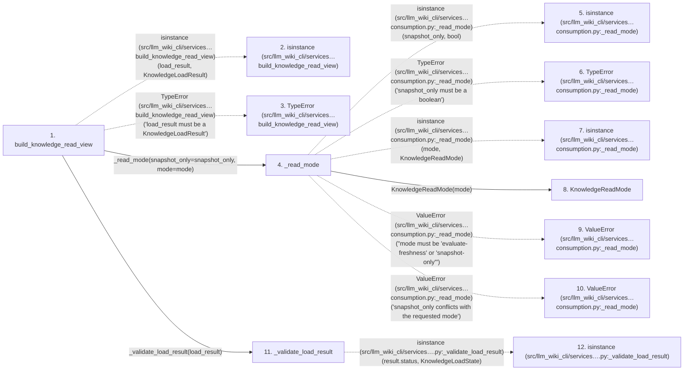

# build_knowledge_read_view

**Entry point:** `build_knowledge_read_view` (`api`)
**Source:** [knowledge_consumption](../modules/knowledge_consumption.md)
**Modules touched:** [concept_identity](../modules/concept_identity.md), [knowledge_artifacts](../modules/knowledge_artifacts.md), [knowledge_consumption](../modules/knowledge_consumption.md), and 9 more

**Complete modules touched:**

- [concept_identity](../modules/concept_identity.md)
- [knowledge_artifacts](../modules/knowledge_artifacts.md)
- [knowledge_consumption](../modules/knowledge_consumption.md)
- [knowledge_evidence](../modules/knowledge_evidence.md)
- [knowledge_freshness](../modules/knowledge_freshness.md)
- [knowledge_governance](../modules/knowledge_governance.md)
- [knowledge_graph](../modules/knowledge_graph.md)
- [knowledge_model](../modules/knowledge_model.md)
- [knowledge_reuse](../modules/knowledge_reuse.md)
- [section_ownership](../modules/section_ownership.md)
- [validation](../modules/validation.md)
- [wiki_surface](../modules/wiki_surface.md)

## Call sequence

```mermaid
sequenceDiagram
    participant p0 as build_knowledge_read_view
    participant p1 as isinstance (src/llm_wiki_cli/services…build_knowledge_read_view)
    participant p2 as TypeError (src/llm_wiki_cli/services…build_knowledge_read_view)
    participant p3 as _read_mode
    participant p4 as isinstance (src/llm_wiki_cli/services…consumption.py:_read_mode)
    participant p5 as TypeError (src/llm_wiki_cli/services…consumption.py:_read_mode)
    participant p6 as KnowledgeReadMode
    participant p7 as ValueError (src/llm_wiki_cli/services…consumption.py:_read_mode)
    participant p8 as _validate_load_result
    participant p9 as isinstance (src/llm_wiki_cli/services….py:_validate_load_result)
    participant p10 as TypeError (src/llm_wiki_cli/services….py:_validate_load_result)
    participant p11 as any (src/llm_wiki_cli/services….py:_validate_load_result)
    participant p12 as ValueError (src/llm_wiki_cli/services….py:_validate_load_result)
    participant p13 as _unsupported_reason
    participant p14 as _UNSUPPORTED_REASON_BY_ISSUE.get
    p0-->>p1: isinstance (src/llm_wiki_cli/services…build_knowledge_read_view)
    p0-->>p2: TypeError (src/llm_wiki_cli/services…build_knowledge_read_view)
    p0->>p3: _read_mode
    p3-->>p4: isinstance (src/llm_wiki_cli/services…consumption.py:_read_mode)
    p3-->>p5: TypeError (src/llm_wiki_cli/services…consumption.py:_read_mode)
    p3-->>p4: isinstance (src/llm_wiki_cli/services…consumption.py:_read_mode)
    p3->>p6: KnowledgeReadMode
    p3-->>p7: ValueError (src/llm_wiki_cli/services…consumption.py:_read_mode)
    p3-->>p7: ValueError (src/llm_wiki_cli/services…consumption.py:_read_mode)
    p0->>p8: _validate_load_result
    p8-->>p9: isinstance (src/llm_wiki_cli/services….py:_validate_load_result)
    p8-->>p10: TypeError (src/llm_wiki_cli/services….py:_validate_load_result)
    p8-->>p9: isinstance (src/llm_wiki_cli/services….py:_validate_load_result)
    p8-->>p10: TypeError (src/llm_wiki_cli/services….py:_validate_load_result)
    p8-->>p9: isinstance (src/llm_wiki_cli/services….py:_validate_load_result)
    p8-->>p11: any (src/llm_wiki_cli/services….py:_validate_load_result)
    p8-->>p9: isinstance (src/llm_wiki_cli/services….py:_validate_load_result)
    p8-->>p10: TypeError (src/llm_wiki_cli/services….py:_validate_load_result)
    p8-->>p9: isinstance (src/llm_wiki_cli/services….py:_validate_load_result)
    p8-->>p9: isinstance (src/llm_wiki_cli/services….py:_validate_load_result)
    p8-->>p9: isinstance (src/llm_wiki_cli/services….py:_validate_load_result)
    p8-->>p12: ValueError (src/llm_wiki_cli/services….py:_validate_load_result)
    p8-->>p9: isinstance (src/llm_wiki_cli/services….py:_validate_load_result)
    p8-->>p9: isinstance (src/llm_wiki_cli/services….py:_validate_load_result)
    p8-->>p12: ValueError (src/llm_wiki_cli/services….py:_validate_load_result)
    p8-->>p9: isinstance (src/llm_wiki_cli/services….py:_validate_load_result)
    p8-->>p12: ValueError (src/llm_wiki_cli/services….py:_validate_load_result)
    p8->>p13: _unsupported_reason
    p13-->>p14: _UNSUPPORTED_REASON_BY_ISSUE.get
    p8-->>p12: ValueError (src/llm_wiki_cli/services….py:_validate_load_result)
```

<!-- Auto-generated from static call edges. Dashed arrows are external or unresolved calls. Reviewed runtime conditions and side effects belong in Behavior. -->

> Call sequence diagram shows 30 of 845 interactions; 815 omitted to keep the visualization within the 30-interaction and generated-diagram limits.

> Trace truncated at the depth limit; deeper calls are omitted.

## Data flow

<!-- Auto-generated static analysis. Treat values and boundaries as best-effort hints, not runtime proof. -->

### Step data

| Step | Inputs | Reads | Writes | Returns |
|---|---|---|---|---|
| `build_knowledge_read_view` | `load_result: KnowledgeLoadResult`, `live_evaluation: LiveKnowledgeEvaluation \| None`, `snapshot_only: bool`, `mode: KnowledgeReadMode \| str \| None` | `KnowledgeLoadResult`, `KnowledgeLoadState`, `KnowledgeLoadState`, `KnowledgeReadMode`, `KnowledgeAvailability`, `KnowledgeReadReason`, `KnowledgeLoadState`, `KnowledgeAvailability` | - | `KnowledgeReadView(...)`, `KnowledgeReadView(...)`, `KnowledgeReadView(...)` |
| `isinstance (src/llm_wiki_cli/services…build_knowledge_read_view)` | - | - | - | - |
| `TypeError (src/llm_wiki_cli/services…build_knowledge_read_view)` | - | - | - | - |
| `_read_mode` | `snapshot_only: bool`, `mode: KnowledgeReadMode \| str \| None` | `KnowledgeReadMode`, `KnowledgeReadMode`, `KnowledgeReadMode`, `KnowledgeReadMode` | - | `...`, `selected` |
| `isinstance (src/llm_wiki_cli/services…consumption.py:_read_mode)` | - | - | - | - |
| `TypeError (src/llm_wiki_cli/services…consumption.py:_read_mode)` | - | - | - | - |
| `isinstance (src/llm_wiki_cli/services…consumption.py:_read_mode)` | - | - | - | - |
| `KnowledgeReadMode` | - | - | - | - |
| `ValueError (src/llm_wiki_cli/services…consumption.py:_read_mode)` | - | - | - | - |
| `ValueError (src/llm_wiki_cli/services…consumption.py:_read_mode)` | - | - | - | - |
| `_validate_load_result` | `result: KnowledgeLoadResult` | `KnowledgeLoadState`, `KnowledgeLoadState`, `KnowledgeLoadIssue`, `KnowledgeLoadState`, `Mapping`, `KnowledgeIndex`, `SyncManifest`, `KnowledgeLoadState` | - | `none`, `none`, `none`, `none` |
| `isinstance (src/llm_wiki_cli/services….py:_validate_load_result)` | - | - | - | - |

### Call data

| From | To | Line | Call |
|---|---|---:|---|
| build_knowledge_read_view | isinstance (src/llm_wiki_cli/services…build_knowledge_read_view) | 574 | `isinstance(load_result, KnowledgeLoadResult)` |
| build_knowledge_read_view | TypeError (src/llm_wiki_cli/services…build_knowledge_read_view) | 575 | `TypeError('load_result must be a KnowledgeLoadResult')` |
| build_knowledge_read_view | _read_mode | 576 | `_read_mode(snapshot_only=snapshot_only, mode=mode)` |
| _read_mode | isinstance (src/llm_wiki_cli/services…consumption.py:_read_mode) | 713 | `isinstance(snapshot_only, bool)` |
| _read_mode | TypeError (src/llm_wiki_cli/services…consumption.py:_read_mode) | 714 | `TypeError('snapshot_only must be a boolean')` |
| _read_mode | isinstance (src/llm_wiki_cli/services…consumption.py:_read_mode) | 724 | `isinstance(mode, KnowledgeReadMode)` |
| _read_mode | KnowledgeReadMode | 725 | `KnowledgeReadMode(mode)` |
| _read_mode | ValueError (src/llm_wiki_cli/services…consumption.py:_read_mode) | 728 | `ValueError("mode must be 'evaluate-freshness' or 'snapshot-only'")` |
| _read_mode | ValueError (src/llm_wiki_cli/services…consumption.py:_read_mode) | 732 | `ValueError('snapshot_only conflicts with the requested mode')` |
| build_knowledge_read_view | _validate_load_result | 577 | `_validate_load_result(load_result)` |
| _validate_load_result | isinstance (src/llm_wiki_cli/services….py:_validate_load_result) | 749 | `isinstance(result.status, KnowledgeLoadState)` |

### Boundary effects

*No boundary effects detected.*

### Static analysis gaps

| Kind | Step | Target | Line |
|---|---|---|---:|
| external_call | `build_knowledge_read_view` | `isinstance` | 574 |
| external_call | `build_knowledge_read_view` | `TypeError` | 575 |
| external_call | `_read_mode` | `isinstance` | 713 |
| external_call | `_read_mode` | `TypeError` | 714 |
| external_call | `_read_mode` | `isinstance` | 724 |
| external_call | `_read_mode` | `ValueError` | 728 |
| external_call | `_read_mode` | `ValueError` | 732 |
| external_call | `_validate_load_result` | `isinstance` | 749 |
| step_limit | `build_knowledge_read_view` | `first 12 steps` | 0 |
| truncated_flow | `build_knowledge_read_view` | `depth limit` | 0 |

## Behavior

This flow starts at `build_knowledge_read_view` and is classified as `api`. The generated call and data-flow sections are bounded static projections; runtime conditions and side effects require source-level confirmation.
