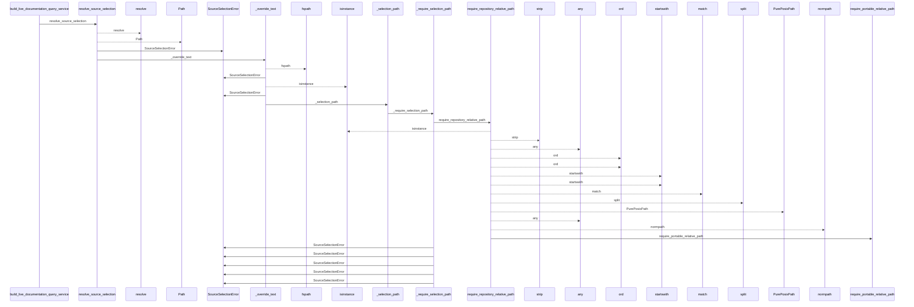
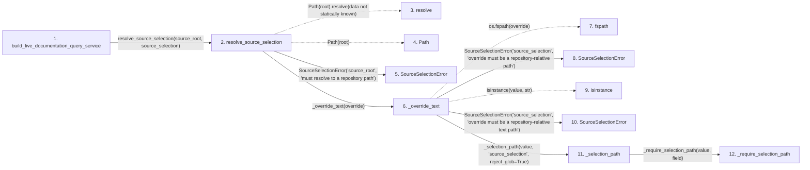

# build_live_documentation_query_service

**Entry point:** `build_live_documentation_query_service` (`api`)
**Source:** [documentation_query_builder](../modules/documentation_query_builder.md)
**Modules touched:** [common](../modules/common.md), [config](../modules/config.md), [documentation_queries](../modules/documentation_queries.md), [documentation_query_builder](../modules/documentation_query_builder.md), and 3 more

**Complete modules touched:**

- [common](../modules/common.md)
- [config](../modules/config.md)
- [documentation_queries](../modules/documentation_queries.md)
- [documentation_query_builder](../modules/documentation_query_builder.md)
- [source_selection](../modules/source_selection.md)
- [source_snapshot](../modules/source_snapshot.md)
- [validation](../modules/validation.md)

## Call sequence

<!-- Auto-generated from static call edges. Dashed arrows are external or unresolved calls. Reviewed runtime conditions and side effects belong in Behavior. -->

> Call sequence diagram shows 30 of 384 interactions; 354 omitted to keep the visualization within the 30-interaction and generated-diagram limits.

> Trace truncated at the depth limit; deeper calls are omitted.

## Data flow

<!-- Auto-generated static analysis. Treat values and boundaries as best-effort hints, not runtime proof. -->

### Step data

| Step | Inputs | Reads | Writes | Returns |
|---|---|---|---|---|
| `build_live_documentation_query_service` | `source_root: Path`, `wiki_root: Path`, `limit: int`, `read_only: bool`, `helper_cache_dir: Path \| None`, `include_plugins: bool`, `source_plugins_only: bool`, `require_live_freshness: bool` | `build_source_snapshot`, `SourceSelectionError`, `SourceSelectionError`, `KnowledgeReadView`, `KnowledgeReadView` | `extract_options[...]`, `extract_options[...]`, `extract_options[...]`, `extract_options[...]`, `extract_options[...]` | `assemble_documentation_query_service(...)` |
| `resolve_source_selection` | `root: str \| Path`, `override: str \| Path \| None` | `SOURCE_SELECTION_PATH` | - | `None`, `None`, `policy` |
| `resolve` | - | - | - | - |
| `Path` | - | - | - | - |
| `SourceSelectionError` | - | - | - | - |
| `_override_text` | `override: str \| Path` | - | - | `_selection_path(...)` |
| `fspath` | - | - | - | - |
| `SourceSelectionError` | - | - | - | - |
| `isinstance` | - | - | - | - |
| `SourceSelectionError` | - | - | - | - |
| `_selection_path` | `value: object`, `field: str`, `reject_glob: bool` | `SourceSelectionError`, `_MAX_PATH_BYTES`, `_MAX_PATH_BYTES`, `_GLOB_CHARACTERS` | - | `path` |
| `_require_selection_path` | `value: object`, `field: str` | - | - | `require_repository_relative_path(...)` |

### Call data

| From | To | Line | Call |
|---|---|---:|---|
| build_live_documentation_query_service | resolve_source_selection | 255 | `resolve_source_selection(source_root, source_selection)` |
| resolve_source_selection | resolve | 606 | `Path(root).resolve(data not statically known)` |
| resolve_source_selection | Path | 606 | `Path(root)` |
| resolve_source_selection | SourceSelectionError | 608 | `SourceSelectionError('source_root', 'must resolve to a repository path')` |
| resolve_source_selection | _override_text | 615 | `_override_text(override)` |
| _override_text | fspath | 583 | `os.fspath(override)` |
| _override_text | SourceSelectionError | 585 | `SourceSelectionError('source_selection', 'override must be a repository-relative path')` |
| _override_text | isinstance | 588 | `isinstance(value, str)` |
| _override_text | SourceSelectionError | 589 | `SourceSelectionError('source_selection', 'override must be a repository-relative text path')` |
| _override_text | _selection_path | 592 | `_selection_path(value, 'source_selection', reject_glob=True)` |
| _selection_path | _require_selection_path | 81 | `_require_selection_path(value, field)` |

### Boundary effects

*No boundary effects detected.*

### Static analysis gaps

| Kind | Step | Target | Line |
|---|---|---|---:|
| unresolved_call | `resolve_source_selection` | `Path(root).resolve` | 606 |
| external_call | `_override_text` | `os.fspath` | 583 |
| unresolved_call | `_override_text` | `isinstance` | 588 |
| step_limit | `build_live_documentation_query_service` | `first 12 steps` | 0 |
| truncated_flow | `build_live_documentation_query_service` | `depth limit` | 0 |

## Behavior

This flow starts at `build_live_documentation_query_service` and is classified as `api`. The generated call and data-flow sections are bounded static projections; runtime conditions and side effects require source-level confirmation.
