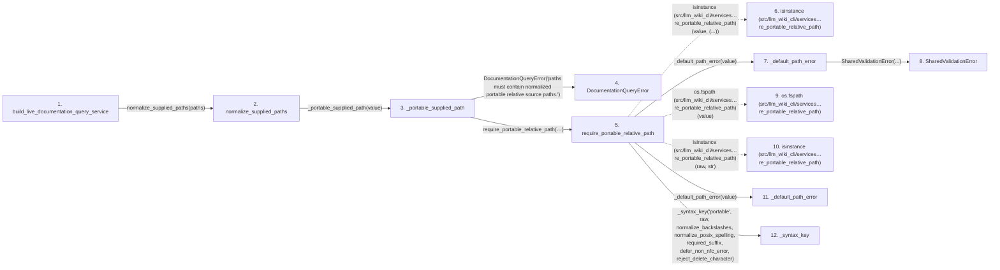

# build_live_documentation_query_service

**Entry point:** `build_live_documentation_query_service` (`api`)
**Source:** [documentation_query_builder](../modules/documentation_query_builder.md)
**Modules touched:** [common](../modules/common.md), [config](../modules/config.md), [context_packet](../modules/context_packet.md), [documentation_queries](../modules/documentation_queries.md), and 9 more

**Complete modules touched:**

- [common](../modules/common.md)
- [config](../modules/config.md)
- [context_packet](../modules/context_packet.md)
- [documentation_queries](../modules/documentation_queries.md)
- [documentation_query_builder](../modules/documentation_query_builder.md)
- [knowledge_evidence](../modules/knowledge_evidence.md)
- [knowledge_storage](../modules/knowledge_storage.md)
- [knowledge_storage_io](../modules/knowledge_storage_io.md)
- [manifest_storage](../modules/manifest_storage.md)
- [source_selection](../modules/source_selection.md)
- [source_snapshot](../modules/source_snapshot.md)
- [sync_manifest](../modules/sync_manifest.md)
- [validation](../modules/validation.md)

## Call sequence

```mermaid
sequenceDiagram
    participant p0 as build_live_documentation_query_service
    participant p1 as normalize_supplied_paths
    participant p2 as _portable_supplied_path
    participant p3 as DocumentationQueryError
    participant p4 as require_portable_relative_path
    participant p5 as isinstance (src/llm_wiki_cli/services…re_portable_relative_path)
    participant p6 as _default_path_error
    participant p7 as SharedValidationError
    participant p8 as os.fspath (src/llm_wiki_cli/services…re_portable_relative_path)
    participant p9 as _syntax_key
    participant p10 as type (src/llm_wiki_cli/services/validation.py:_syntax_key)
    participant p11 as len (src/llm_wiki_cli/services/validation.py:_syntax_key)
    participant p12 as any (src/llm_wiki_cli/services/validation.py:_syntax_key)
    participant p13 as _known_syntax
    participant p14 as _PATH_SYNTAX.get
    participant p15 as _PATH_SYNTAX.move_to_end (src/llm_wiki_cli/services…lidation.py:_known_syntax)
    participant p16 as _check_path_collision
    participant p17 as portable_path_key
    participant p18 as unicodedata.normalize(…).casefold
    participant p19 as unicodedata.normalize (src/llm_wiki_cli/services…tion.py:portable_path_key)
    participant p20 as collision_seen.setdefault
    participant p21 as collision_error
    participant p22 as raw.encode
    p0->>p1: normalize_supplied_paths
    p1->>p2: _portable_supplied_path
    p2->>p3: DocumentationQueryError
    p2->>p4: require_portable_relative_path
    p4-->>p5: isinstance (src/llm_wiki_cli/services…re_portable_relative_path)
    p4->>p6: _default_path_error
    p6->>p7: SharedValidationError
    p4-->>p8: os.fspath (src/llm_wiki_cli/services…re_portable_relative_path)
    p4-->>p5: isinstance (src/llm_wiki_cli/services…re_portable_relative_path)
    p4->>p6: _default_path_error
    p4->>p9: _syntax_key
    p9-->>p10: type (src/llm_wiki_cli/services/validation.py:_syntax_key)
    p9-->>p11: len (src/llm_wiki_cli/services/validation.py:_syntax_key)
    p9-->>p12: any (src/llm_wiki_cli/services/validation.py:_syntax_key)
    p9-->>p10: type (src/llm_wiki_cli/services/validation.py:_syntax_key)
    p9-->>p10: type (src/llm_wiki_cli/services/validation.py:_syntax_key)
    p9-->>p11: len (src/llm_wiki_cli/services/validation.py:_syntax_key)
    p4->>p13: _known_syntax
    p13-->>p14: _PATH_SYNTAX.get
    p13-->>p15: _PATH_SYNTAX.move_to_end (src/llm_wiki_cli/services…lidation.py:_known_syntax)
    p4->>p16: _check_path_collision
    p16->>p17: portable_path_key
    p17-->>p18: unicodedata.normalize(…).casefold
    p17-->>p19: unicodedata.normalize (src/llm_wiki_cli/services…tion.py:portable_path_key)
    p16-->>p20: collision_seen.setdefault
    p16->>p7: SharedValidationError
    p16-->>p21: collision_error
    p4-->>p22: raw.encode
    p4->>p6: _default_path_error
    p4->>p6: _default_path_error
```

<!-- Auto-generated from static call edges. Dashed arrows are external or unresolved calls. Reviewed runtime conditions and side effects belong in Behavior. -->

> Call sequence diagram shows 30 of 1012 interactions; 982 omitted to keep the visualization within the 30-interaction and generated-diagram limits.

> Trace truncated at the depth limit; deeper calls are omitted.

## Data flow

<!-- Auto-generated static analysis. Treat values and boundaries as best-effort hints, not runtime proof. -->

### Step data

| Step | Inputs | Reads | Writes | Returns |
|---|---|---|---|---|
| `build_live_documentation_query_service` | `source_root: Path`, `wiki_root: Path`, `limit: int`, `read_only: bool`, `helper_cache_dir: Path \| None`, `include_plugins: bool`, `source_plugins_only: bool`, `require_live_freshness: bool` | `build_source_snapshot`, `SourceSelectionError`, `SourceSnapshot`, `SourceSelectionError`, `KnowledgeReadView`, `KnowledgeReadView`, `KnowledgeReadView`, `Mapping` | `stage_ns[...]`, `snapshot_options[...]`, `stage_ns[...]`, `extract_options[...]`, `extract_options[...]`, `extract_options[...]`, `extract_options[...]`, `extract_options[...]` | `service` |
| `normalize_supplied_paths` | `values: object` | - | - | `tuple(...)` |
| `_portable_supplied_path` | `value: object` | - | - | `require_portable_relative_path(...)` |
| `DocumentationQueryError` | - | - | - | - |
| `require_portable_relative_path` | `value: object`, `normalize_backslashes: bool`, `normalize_posix_spelling: bool`, `required_suffix: str \| None`, `defer_non_nfc_error: bool`, `reject_delete_character: bool`, `text_error: Exception \| None`, `relative_error: Exception \| None` | `os` | - | `cached`, `_remember_syntax(...)` |
| `isinstance (src/llm_wiki_cli/services…re_portable_relative_path)` | - | - | - | - |
| `_default_path_error` | `value: object` | - | - | `SharedValidationError(...)` |
| `SharedValidationError` | - | - | - | - |
| `os.fspath (src/llm_wiki_cli/services…re_portable_relative_path)` | - | - | - | - |
| `isinstance (src/llm_wiki_cli/services…re_portable_relative_path)` | - | - | - | - |
| `_default_path_error` | `value: object` | - | - | `SharedValidationError(...)` |
| `_syntax_key` | `kind`, `value`, `options` | - | - | `None`, `(...)` |

### Call data

| From | To | Line | Call |
|---|---|---:|---|
| build_live_documentation_query_service | normalize_supplied_paths | 487 | `normalize_supplied_paths(paths)` |
| normalize_supplied_paths | _portable_supplied_path | 135 | `_portable_supplied_path(value)` |
| _portable_supplied_path | DocumentationQueryError | 113 | `DocumentationQueryError('paths must contain normalized portable relative source paths.')` |
| _portable_supplied_path | require_portable_relative_path | 116 | `require_portable_relative_path(value, text_error=error, relative_error=error, escape_error=error, traversal_error=error, separator_error=error, utf8_error=error, control_error=error, non_nfc_error=error, nonportable_error=error, reserved_error=error)` |
| require_portable_relative_path | isinstance (src/llm_wiki_cli/services…re_portable_relative_path) | 216 | `isinstance(value, (...))` |
| require_portable_relative_path | _default_path_error | 217 | `_default_path_error(value)` |
| _default_path_error | SharedValidationError | 113 | `SharedValidationError(...)` |
| require_portable_relative_path | os.fspath (src/llm_wiki_cli/services…re_portable_relative_path) | 218 | `os.fspath(value)` |
| require_portable_relative_path | isinstance (src/llm_wiki_cli/services…re_portable_relative_path) | 219 | `isinstance(raw, str)` |
| require_portable_relative_path | _default_path_error | 220 | `_default_path_error(value)` |
| require_portable_relative_path | _syntax_key | 221 | `_syntax_key('portable', raw, normalize_backslashes, normalize_posix_spelling, required_suffix, defer_non_nfc_error, reject_delete_character)` |

### Boundary effects

*No boundary effects detected.*

### Static analysis gaps

| Kind | Step | Target | Line |
|---|---|---|---:|
| external_call | `require_portable_relative_path` | `isinstance` | 216 |
| external_call | `require_portable_relative_path` | `os.fspath` | 218 |
| external_call | `require_portable_relative_path` | `isinstance` | 219 |
| step_limit | `build_live_documentation_query_service` | `first 12 steps` | 0 |
| truncated_flow | `build_live_documentation_query_service` | `depth limit` | 0 |

## Behavior

This flow starts at `build_live_documentation_query_service` and is classified as `api`. The generated call and data-flow sections are bounded static projections; runtime conditions and side effects require source-level confirmation.
