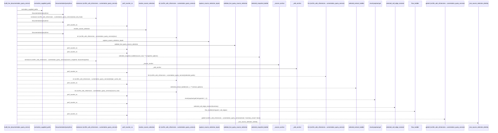
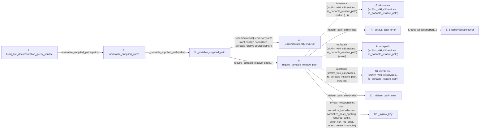

# build_live_documentation_query_service

**Entry point:** `build_live_documentation_query_service` (`api`)
**Source:** [documentation_query_builder](../modules/documentation_query_builder.md)
**Modules touched:** [analysis_compatibility](../modules/analysis_compatibility.md), [common](../modules/common.md), [config](../modules/config.md), [context_packet](../modules/context_packet.md), and 22 more

**Complete modules touched:**

- [analysis_compatibility](../modules/analysis_compatibility.md)
- [common](../modules/common.md)
- [config](../modules/config.md)
- [context_packet](../modules/context_packet.md)
- [documentation_queries](../modules/documentation_queries.md)
- [documentation_query_builder](../modules/documentation_query_builder.md)
- [filesystem_guard](../modules/filesystem_guard.md)
- [implementation_evidence](../modules/implementation_evidence.md)
- [io](../modules/io.md)
- [knowledge_consumption](../modules/knowledge_consumption.md)
- [knowledge_evidence](../modules/knowledge_evidence.md)
- [knowledge_storage](../modules/knowledge_storage.md)
- [knowledge_storage_io](../modules/knowledge_storage_io.md)
- [maintenance_evidence](../modules/maintenance_evidence.md)
- [maintenance_shapes](../modules/maintenance_shapes.md)
- [maintenance_state](../modules/maintenance_state.md)
- [maintenance_status](../modules/maintenance_status.md)
- [manifest_storage](../modules/manifest_storage.md)
- [markdown_sections](../modules/markdown_sections.md)
- [python_implementation](../modules/python_implementation.md)
- [section_ownership](../modules/section_ownership.md)
- [source_selection](../modules/source_selection.md)
- [source_snapshot](../modules/source_snapshot.md)
- [sync_manifest](../modules/sync_manifest.md)
- [validation](../modules/validation.md)
- [wiki_surface](../modules/wiki_surface.md)

## Call sequence

> Static overview in presentation order, not runtime execution order. Arrows retain captured callers; siblings are shown before deeper helper detail.

<!-- Auto-generated from static call edges. Dashed arrows are external or unresolved calls. Reviewed runtime conditions and side effects belong in Behavior. -->

```mermaid
sequenceDiagram
    participant p0 as build_live_documentation_query_service
    participant p1 as normalize_supplied_paths
    participant p2 as DocumentationQueryError
    participant p3 as isinstance (src/llm_wiki_cli/services…cumentation_query_service)
    participant p4 as perf_counter_ns
    participant p5 as resolve_source_selection
    participant p6 as str (src/llm_wiki_cli/services…cumentation_query_service)
    participant p7 as capture_source_selection_inputs
    participant p8 as validate_live_query_source_selection
    participant p9 as selected_snapshot_builder
    participant p10 as _source_anchor
    participant p11 as _wiki_anchor
    participant p12 as list (src/llm_wiki_cli/services…cumentation_query_service)
    participant p13 as selected_extract_builder
    participant p14 as result.payload.get
    participant p15 as selected_call_edge_resolver
    participant p16 as flow_builder
    participant p17 as getattr (src/llm_wiki_cli/services…cumentation_query_service)
    participant p18 as _live_source_selection_identity
    p0->>p1: normalize_supplied_paths
    p0->>p2: DocumentationQueryError
    p0-->>p3: isinstance (src/llm_wiki_cli/services…cumentation_query_service)(read_only, bool)
    p0->>p2: DocumentationQueryError
    p0-->>p4: perf_counter_ns
    p0->>p5: resolve_source_selection
    p0->>p2: DocumentationQueryError
    p0-->>p6: str (src/llm_wiki_cli/services…cumentation_query_service)(exc)
    p0->>p7: capture_source_selection_inputs
    p0->>p8: validate_live_query_source_selection
    p0-->>p4: perf_counter_ns
    p0-->>p4: perf_counter_ns
    p0-->>p9: selected_snapshot_builder(source_root, **=snapshot_options)
    p0-->>p3: isinstance (src/llm_wiki_cli/services…cumentation_query_service)(source_snapshot, SourceSnapshot)
    p0->>p10: _source_anchor
    p0->>p11: _wiki_anchor
    p0-->>p4: perf_counter_ns
    p0-->>p12: list (src/llm_wiki_cli/services…cumentation_query_service)(selected_paths)
    p0-->>p6: str (src/llm_wiki_cli/services…cumentation_query_service)(helper_cache_dir)
    p0-->>p4: perf_counter_ns
    p0-->>p13: selected_extract_builder(str(...), **=extract_options)
    p0-->>p6: str (src/llm_wiki_cli/services…cumentation_query_service)(source_root)
    p0-->>p4: perf_counter_ns
    p0-->>p14: result.payload.get('entrypoints', [...])
    p0-->>p4: perf_counter_ns
    p0-->>p15: selected_call_edge_resolver(inventory)
    p0-->>p16: flow_builder(entrypoint, call_edges)
    p0-->>p4: perf_counter_ns
    p0-->>p17: getattr (src/llm_wiki_cli/services…cumentation_query_service)(result, 'inventory_result', None)
    p0->>p18: _live_source_selection_identity
```

> Call sequence diagram shows 30 of 1886 interactions; 1856 omitted to keep the visualization within the 30-interaction and generated-diagram limits, with uncertain identities omitted rather than inferred.

> Captured boundary calls: external 15 of 643 (628 omitted); unresolved 5 of 500 (495 omitted). These counts cover the captured static trace.

Omitted captured detail, grouped by actual caller occurrence and target module:

| Caller | Parent step | Target module | Kind | Omitted interactions |
| --- | --- | --- | --- | --- |
| `src/llm_wiki_cli/services/documentation_query_builder.py:normalize_supplied_paths` | 2 | [src/llm_wiki_cli/services/documentation_query_builder.py](../modules/documentation_query_builder.md) | internal | 2 |
| `src/llm_wiki_cli/services/documentation_query_builder.py:_portable_supplied_path` | 3 | [src/llm_wiki_cli/services/documentation_queries.py](../modules/documentation_queries.md) | internal | 1 |
| `src/llm_wiki_cli/services/documentation_query_builder.py:_portable_supplied_path` | 3 | [src/llm_wiki_cli/services/validation.py](../modules/validation.md) | internal | 1 |
| `src/llm_wiki_cli/services/validation.py:require_portable_relative_path` | 5 | - | external | 4 |
| `src/llm_wiki_cli/services/validation.py:require_portable_relative_path` | 5 | [src/llm_wiki_cli/services/validation.py](../modules/validation.md) | internal | 13 |
| `src/llm_wiki_cli/services/validation.py:_default_path_error` | 7 | [src/llm_wiki_cli/services/validation.py](../modules/validation.md) | internal | 1 |
| `src/llm_wiki_cli/services/validation.py:_syntax_key` | 12 | - | external | 6 |
| `src/llm_wiki_cli/services/validation.py:_known_syntax` | 19 | - | unresolved | 2 |
> Omission summary shows 8 of 483 groups; 475 further groups are not expanded here. Counts above include all omitted interactions.
> Detailed flow queries retain their own coverage and limits; omitted paths may execute at runtime.

> Trace truncated at the depth limit; deeper calls are omitted.

## Data flow

<!-- Auto-generated static analysis. Treat values and boundaries as best-effort hints, not runtime proof. -->

```mermaid
flowchart LR
    s1["1. build_live_documentation_query_service"]
    s2["2. normalize_supplied_paths"]
    s3["3. _portable_supplied_path"]
    s4["4. DocumentationQueryError"]
    s5["5. require_portable_relative_path"]
    s6["6. isinstance (src/llm_wiki_cli/services…re_portable_relative_path)"]
    s7["7. _default_path_error"]
    s8["8. SharedValidationError"]
    s9["9. os.fspath (src/llm_wiki_cli/services…re_portable_relative_path)"]
    s10["10. isinstance (src/llm_wiki_cli/services…re_portable_relative_path)"]
    s11["11. _default_path_error"]
    s12["12. _syntax_key"]
    s1 -->|"normalize_supplied_paths(paths)"| s2
    s2 -->|"_portable_supplied_path(value)"| s3
    s3 -->|"DocumentationQueryError('paths must contain normalized portable relative source paths.')"| s4
    s3 -->|"require_portable_relative_path(…)"| s5
    s5 -. "isinstance (src/llm_wiki_cli/services…re_portable_relative_path)(value, (...))" .-> s6
    s5 -->|"_default_path_error(value)"| s7
    s7 -->|"SharedValidationError(...)"| s8
    s5 -. "os.fspath (src/llm_wiki_cli/services…re_portable_relative_path)(value)" .-> s9
    s5 -. "isinstance (src/llm_wiki_cli/services…re_portable_relative_path)(raw, str)" .-> s10
    s5 -->|"_default_path_error(value)"| s11
    s5 -->|"_syntax_key('portable', raw, normalize_backslashes, normalize_posix_spelling, required_suffix, defer_non_nfc_error, reject_delete_character)"| s12
    click s1 "../modules/documentation_query_builder.md"
    click s2 "../modules/documentation_query_builder.md"
    click s3 "../modules/documentation_query_builder.md"
    click s4 "../modules/documentation_queries.md"
    click s5 "../modules/validation.md"
    click s7 "../modules/validation.md"
    click s8 "../modules/validation.md"
    click s11 "../modules/validation.md"
    click s12 "../modules/validation.md"
```

### Step data

| Step | Inputs | Reads | Writes | Returns |
|---|---|---|---|---|
| `build_live_documentation_query_service` | `source_root: Path`, `wiki_root: Path`, `limit: int`, `read_only: bool`, `helper_cache_dir: Path \| None`, `include_plugins: bool`, `source_plugins_only: bool`, `require_live_freshness: bool` | `build_source_snapshot`, `SourceSelectionError`, `SourceSnapshot`, `SourceSelectionError`, `KnowledgeReadView`, `KnowledgeReadView`, `SourceSnapshot`, `SourceSnapshot` | `stage_ns[...]`, `snapshot_options[...]`, `stage_ns[...]`, `extract_options[...]`, `extract_options[...]`, `extract_options[...]`, `extract_options[...]`, `extract_options[...]` | `service` |
| `normalize_supplied_paths` | `values: object` | - | - | `tuple(...)` |
| `_portable_supplied_path` | `value: object` | - | - | `require_portable_relative_path(...)` |
| `DocumentationQueryError` | - | - | - | - |
| `require_portable_relative_path` | `value: object`, `normalize_backslashes: bool`, `normalize_posix_spelling: bool`, `required_suffix: str \| None`, `defer_non_nfc_error: bool`, `reject_delete_character: bool`, `text_error: Exception \| None`, `relative_error: Exception \| None` | `os` | - | `cached`, `_remember_syntax(...)` |
| `isinstance (src/llm_wiki_cli/services…re_portable_relative_path)` | - | - | - | - |
| `_default_path_error` | `value: object` | - | - | `SharedValidationError(...)` |
| `SharedValidationError` | - | - | - | - |
| `os.fspath (src/llm_wiki_cli/services…re_portable_relative_path)` | - | - | - | - |
| `isinstance (src/llm_wiki_cli/services…re_portable_relative_path)` | - | - | - | - |
| `_default_path_error` | `value: object` | - | - | `SharedValidationError(...)` |
| `_syntax_key` | `kind`, `value`, `options` | - | - | `None`, `(...)` |

### Call data

| From | To | Line | Call |
|---|---|---:|---|
| build_live_documentation_query_service | normalize_supplied_paths | 505 | `normalize_supplied_paths(paths)` |
| normalize_supplied_paths | _portable_supplied_path | 139 | `_portable_supplied_path(value)` |
| _portable_supplied_path | DocumentationQueryError | 117 | `DocumentationQueryError('paths must contain normalized portable relative source paths.')` |
| _portable_supplied_path | require_portable_relative_path | 120 | `require_portable_relative_path(value, text_error=error, relative_error=error, escape_error=error, traversal_error=error, separator_error=error, utf8_error=error, control_error=error, non_nfc_error=error, nonportable_error=error, reserved_error=error)` |
| require_portable_relative_path | isinstance (src/llm_wiki_cli/services…re_portable_relative_path) | 216 | `isinstance(value, (...))` |
| require_portable_relative_path | _default_path_error | 217 | `_default_path_error(value)` |
| _default_path_error | SharedValidationError | 113 | `SharedValidationError(...)` |
| require_portable_relative_path | os.fspath (src/llm_wiki_cli/services…re_portable_relative_path) | 218 | `os.fspath(value)` |
| require_portable_relative_path | isinstance (src/llm_wiki_cli/services…re_portable_relative_path) | 219 | `isinstance(raw, str)` |
| require_portable_relative_path | _default_path_error | 220 | `_default_path_error(value)` |
| require_portable_relative_path | _syntax_key | 221 | `_syntax_key('portable', raw, normalize_backslashes, normalize_posix_spelling, required_suffix, defer_non_nfc_error, reject_delete_character)` |

### Boundary effects

*No boundary effects detected.*

### Static analysis gaps

| Kind | Step | Target | Line |
|---|---|---|---:|
| external_call | `require_portable_relative_path` | `isinstance` | 216 |
| external_call | `require_portable_relative_path` | `os.fspath` | 218 |
| external_call | `require_portable_relative_path` | `isinstance` | 219 |
| step_limit | `build_live_documentation_query_service` | `first 12 steps` | 0 |
| truncated_flow | `build_live_documentation_query_service` | `depth limit` | 0 |

## Behavior

This flow starts at `build_live_documentation_query_service` and is classified as `api`. The generated call and data-flow sections are bounded static projections; runtime conditions and side effects require source-level confirmation.
