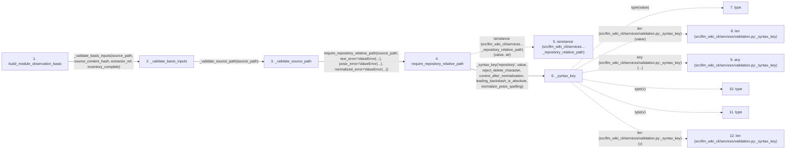

# build_module_observation_basis

**Entry point:** `build_module_observation_basis` (`api`)
**Source:** [knowledge_evidence](../modules/knowledge_evidence.md)
**Modules touched:** [knowledge_evidence](../modules/knowledge_evidence.md), [validation](../modules/validation.md)

## Call sequence

```mermaid
sequenceDiagram
    participant p0 as build_module_observation_basis
    participant p1 as _validate_basis_inputs
    participant p2 as _validate_source_path
    participant p3 as require_repository_relative_path
    participant p4 as isinstance (src/llm_wiki_cli/services…_repository_relative_path)
    participant p5 as _syntax_key
    participant p6 as type
    participant p7 as len (src/llm_wiki_cli/services/validation.py:_syntax_key)
    participant p8 as any (src/llm_wiki_cli/services/validation.py:_syntax_key)
    participant p9 as _known_syntax
    participant p10 as _PATH_SYNTAX.get
    participant p11 as _PATH_SYNTAX.move_to_end (src/llm_wiki_cli/services…lidation.py:_known_syntax)
    participant p12 as value.strip (src/llm_wiki_cli/services…_repository_relative_path)
    participant p13 as any (src/llm_wiki_cli/services…_repository_relative_path)
    participant p14 as ord (src/llm_wiki_cli/services…_repository_relative_path)
    participant p15 as value.startswith
    participant p16 as _WINDOWS_DRIVE_PREFIX_RE.match
    participant p17 as value.split
    participant p18 as PurePosixPath (src/llm_wiki_cli/services…_repository_relative_path)
    participant p19 as posixpath.normpath
    participant p20 as require_portable_relative_path
    participant p21 as isinstance (src/llm_wiki_cli/services…re_portable_relative_path)
    participant p22 as _default_path_error
    participant p23 as SharedValidationError
    participant p24 as os.fspath
    p0->>p1: _validate_basis_inputs
    p1->>p2: _validate_source_path
    p2->>p3: require_repository_relative_path
    p3-->>p4: isinstance (src/llm_wiki_cli/services…_repository_relative_path)
    p3->>p5: _syntax_key
    p5-->>p6: type
    p5-->>p7: len (src/llm_wiki_cli/services/validation.py:_syntax_key)
    p5-->>p8: any (src/llm_wiki_cli/services/validation.py:_syntax_key)
    p5-->>p6: type
    p5-->>p6: type
    p5-->>p7: len (src/llm_wiki_cli/services/validation.py:_syntax_key)
    p3->>p9: _known_syntax
    p9-->>p10: _PATH_SYNTAX.get
    p9-->>p11: _PATH_SYNTAX.move_to_end (src/llm_wiki_cli/services…lidation.py:_known_syntax)
    p3-->>p12: value.strip (src/llm_wiki_cli/services…_repository_relative_path)
    p3-->>p13: any (src/llm_wiki_cli/services…_repository_relative_path)
    p3-->>p14: ord (src/llm_wiki_cli/services…_repository_relative_path)
    p3-->>p14: ord (src/llm_wiki_cli/services…_repository_relative_path)
    p3-->>p15: value.startswith
    p3-->>p15: value.startswith
    p3-->>p16: _WINDOWS_DRIVE_PREFIX_RE.match
    p3-->>p17: value.split
    p3-->>p18: PurePosixPath (src/llm_wiki_cli/services…_repository_relative_path)
    p3-->>p13: any (src/llm_wiki_cli/services…_repository_relative_path)
    p3-->>p19: posixpath.normpath
    p3->>p20: require_portable_relative_path
    p20-->>p21: isinstance (src/llm_wiki_cli/services…re_portable_relative_path)
    p20->>p22: _default_path_error
    p22->>p23: SharedValidationError
    p20-->>p24: os.fspath
```

<!-- Auto-generated from static call edges. Dashed arrows are external or unresolved calls. Reviewed runtime conditions and side effects belong in Behavior. -->

> Call sequence diagram shows 30 of 225 interactions; 195 omitted to keep the visualization within the 30-interaction and generated-diagram limits.

> Trace truncated at the depth limit; deeper calls are omitted.

## Data flow

<!-- Auto-generated static analysis. Treat values and boundaries as best-effort hints, not runtime proof. -->

### Step data

| Step | Inputs | Reads | Writes | Returns |
|---|---|---|---|---|
| `build_module_observation_basis` | `source_path: str`, `file_data: Mapping[str, Any] \| None`, `source_content_hash: str`, `extractor_ref: str`, `inventory_complete: bool` | `MODULE_OBSERVATION_SCOPE`, `UNKNOWN_INSUFFICIENT_INVENTORY`, `_InventoryNormalizationError`, `MODULE_OBSERVATION_SCOPE`, `MODULE_OBSERVATION_SCOPE`, `UNKNOWN_INVALID_INVENTORY`, `MODULE_OBSERVATION_SCOPE` | - | `_unknown_basis(...)`, `_unknown_basis(...)`, `_unknown_basis(...)`, `ConceptObservationBasis(...)` |
| `_validate_basis_inputs` | `source_path: object`, `source_content_hash: object`, `extractor_ref: object`, `inventory_complete: object` | - | - | - |
| `_validate_source_path` | `source_path: object` | - | - | - |
| `require_repository_relative_path` | `value: object`, `text_error: Exception`, `posix_error: Exception`, `normalized_error: Exception`, `absolute_error: Exception \| None`, `separator_error: Exception \| None`, `control_error: Exception \| None`, `reject_delete_character: bool` | - | - | `cached`, `_remember_syntax(...)` |
| `isinstance (src/llm_wiki_cli/services…_repository_relative_path)` | - | - | - | - |
| `_syntax_key` | `kind`, `value`, `options` | - | - | `None`, `(...)` |
| `type` | - | - | - | - |
| `len (src/llm_wiki_cli/services/validation.py:_syntax_key)` | - | - | - | - |
| `any (src/llm_wiki_cli/services/validation.py:_syntax_key)` | - | - | - | - |
| `type` | - | - | - | - |
| `type` | - | - | - | - |
| `len (src/llm_wiki_cli/services/validation.py:_syntax_key)` | - | - | - | - |

### Call data

| From | To | Line | Call |
|---|---|---:|---|
| build_module_observation_basis | _validate_basis_inputs | 296 | `_validate_basis_inputs(source_path, source_content_hash, extractor_ref, inventory_complete)` |
| _validate_basis_inputs | _validate_source_path | 845 | `_validate_source_path(source_path)` |
| _validate_source_path | require_repository_relative_path | 873 | `require_repository_relative_path(source_path, text_error=ValueError(...), posix_error=ValueError(...), normalized_error=ValueError(...))` |
| require_repository_relative_path | isinstance (src/llm_wiki_cli/services…_repository_relative_path) | 299 | `isinstance(value, str)` |
| require_repository_relative_path | _syntax_key | 301 | `_syntax_key('repository', value, reject_delete_character, control_after_normalization, leading_backslash_is_absolute, normalize_posix_spelling)` |
| _syntax_key | type | 54 | `type(value)` |
| _syntax_key | len (src/llm_wiki_cli/services/validation.py:_syntax_key) | 54 | `len(value)` |
| _syntax_key | any (src/llm_wiki_cli/services/validation.py:_syntax_key) | 55 | `any(...)` |
| _syntax_key | type | 55 | `type(v)` |
| _syntax_key | type | 55 | `type(v)` |
| _syntax_key | len (src/llm_wiki_cli/services/validation.py:_syntax_key) | 55 | `len(v)` |

### Boundary effects

*No boundary effects detected.*

### Static analysis gaps

| Kind | Step | Target | Line |
|---|---|---|---:|
| external_call | `require_repository_relative_path` | `isinstance` | 299 |
| external_call | `_syntax_key` | `type` | 54 |
| external_call | `_syntax_key` | `any` | 55 |
| external_call | `_syntax_key` | `type` | 55 |
| step_limit | `build_module_observation_basis` | `first 12 steps` | 0 |
| truncated_flow | `build_module_observation_basis` | `depth limit` | 0 |

## Behavior

This flow starts at `build_module_observation_basis` and is classified as `api`. The generated call and data-flow sections are bounded static projections; runtime conditions and side effects require source-level confirmation.
