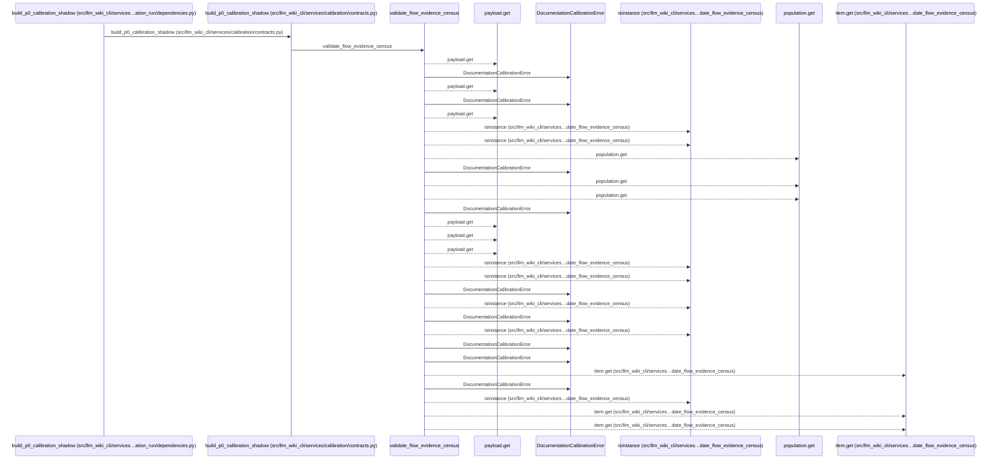
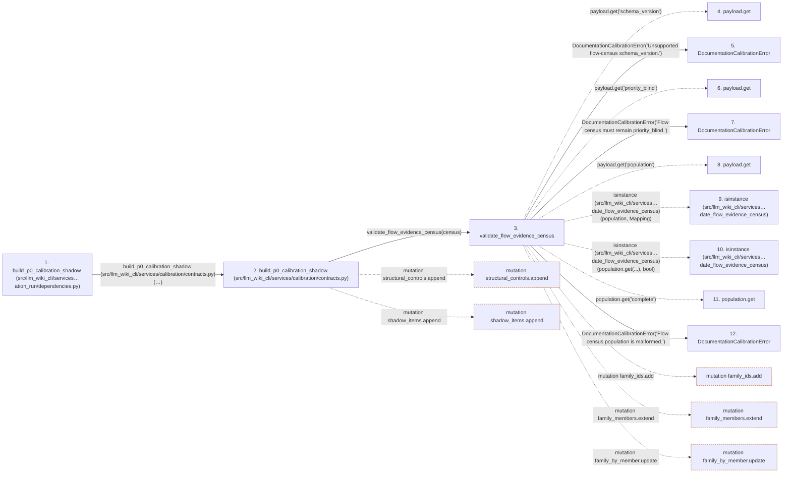

# build_p0_calibration_shadow

**Entry point:** `build_p0_calibration_shadow` (`api`)
**Source:** [documentation_run_dependencies](../modules/documentation_run_dependencies.md)
**Modules touched:** [calibration_contracts](../modules/calibration_contracts.md), [documentation_run_dependencies](../modules/documentation_run_dependencies.md), [validation](../modules/validation.md)

## Call sequence

<!-- Auto-generated from static call edges. Dashed arrows are external or unresolved calls. Reviewed runtime conditions and side effects belong in Behavior. -->

> Call sequence diagram shows 30 of 185 interactions; 155 omitted to keep the visualization within the 30-interaction and generated-diagram limits.

## Data flow

<!-- Auto-generated static analysis. Treat values and boundaries as best-effort hints, not runtime proof. -->

### Step data

| Step | Inputs | Reads | Writes | Returns |
|---|---|---|---|---|
| `build_p0_calibration_shadow (src/llm_wiki_cli/services…ation_run/dependencies.py)` | `worklist: Mapping[str, Any]`, `census: Mapping[str, Any]`, `candidate_records: Optional[Iterable[Mapping[str, Any]]]`, `policy_version: str` | - | - | `implementation(...)` |
| `build_p0_calibration_shadow (src/llm_wiki_cli/services/calibration/contracts.py)` | `worklist: Mapping[str, Any]`, `census: Mapping[str, Any]`, `candidate_records: Optional[Iterable[Mapping[str, Any]]]`, `policy_version: str` | `Mapping`, `Mapping`, `_CALIBRATION_PRIORITIES`, `P0_CALIBRATION_SHADOW_SCHEMA_VERSION` | `current_by_flow[...]`, `candidates[...]` | `{...}` |
| `validate_flow_evidence_census` | `payload: Mapping[str, Any]` | `P0_FLOW_CENSUS_SCHEMA_VERSION`, `Mapping`, `Mapping`, `_SOURCE_PROVENANCE`, `Mapping`, `Mapping`, `Mapping`, `Mapping` | - | - |
| `payload.get` | - | - | - | - |
| `DocumentationCalibrationError` | - | - | - | - |
| `payload.get` | - | - | - | - |
| `DocumentationCalibrationError` | - | - | - | - |
| `payload.get` | - | - | - | - |
| `isinstance (src/llm_wiki_cli/services…date_flow_evidence_census)` | - | - | - | - |
| `isinstance (src/llm_wiki_cli/services…date_flow_evidence_census)` | - | - | - | - |
| `population.get` | - | - | - | - |
| `DocumentationCalibrationError` | - | - | - | - |

### Call data

| From | To | Line | Call |
|---|---|---:|---|
| build_p0_calibration_shadow (src/llm_wiki_cli/services…ation_run/dependencies.py) | build_p0_calibration_shadow (src/llm_wiki_cli/services/calibration/contracts.py) | 165 | `implementation(worklist, census, candidate_records=candidate_records, policy_version=policy_version)` |
| build_p0_calibration_shadow (src/llm_wiki_cli/services/calibration/contracts.py) | validate_flow_evidence_census | 381 | `validate_flow_evidence_census(census)` |
| validate_flow_evidence_census | payload.get | 237 | `payload.get('schema_version')` |
| validate_flow_evidence_census | DocumentationCalibrationError | 238 | `DocumentationCalibrationError('Unsupported flow-census schema_version.')` |
| validate_flow_evidence_census | payload.get | 239 | `payload.get('priority_blind')` |
| validate_flow_evidence_census | DocumentationCalibrationError | 240 | `DocumentationCalibrationError('Flow census must remain priority_blind.')` |
| validate_flow_evidence_census | payload.get | 241 | `payload.get('population')` |
| validate_flow_evidence_census | isinstance (src/llm_wiki_cli/services…date_flow_evidence_census) | 242 | `isinstance(population, Mapping)` |
| validate_flow_evidence_census | isinstance (src/llm_wiki_cli/services…date_flow_evidence_census) | 242 | `isinstance(population.get(...), bool)` |
| validate_flow_evidence_census | population.get | 243 | `population.get('complete')` |
| validate_flow_evidence_census | DocumentationCalibrationError | 245 | `DocumentationCalibrationError('Flow census population is malformed.')` |

### Boundary effects

| Kind | Target | Step | Line |
|---|---|---|---:|
| mutation | `structural_controls.append` | `build_p0_calibration_shadow` | 398 |
| mutation | `shadow_items.append` | `build_p0_calibration_shadow` | 430 |
| mutation | `family_ids.add` | `validate_flow_evidence_census` | 351 |
| mutation | `family_members.extend` | `validate_flow_evidence_census` | 353 |
| mutation | `family_by_member.update` | `validate_flow_evidence_census` | 354 |

### Static analysis gaps

| Kind | Step | Target | Line |
|---|---|---|---:|
| unresolved_call | `validate_flow_evidence_census` | `payload.get` | 237 |
| unresolved_call | `validate_flow_evidence_census` | `payload.get` | 239 |
| unresolved_call | `validate_flow_evidence_census` | `payload.get` | 241 |
| external_call | `validate_flow_evidence_census` | `isinstance` | 242 |
| unresolved_call | `validate_flow_evidence_census` | `population.get` | 243 |
| step_limit | `build_p0_calibration_shadow` | `first 12 steps` | 0 |

## Behavior

This flow starts at `build_p0_calibration_shadow` and is classified as `api`. The generated call and data-flow sections are bounded static projections; runtime conditions and side effects require source-level confirmation.
