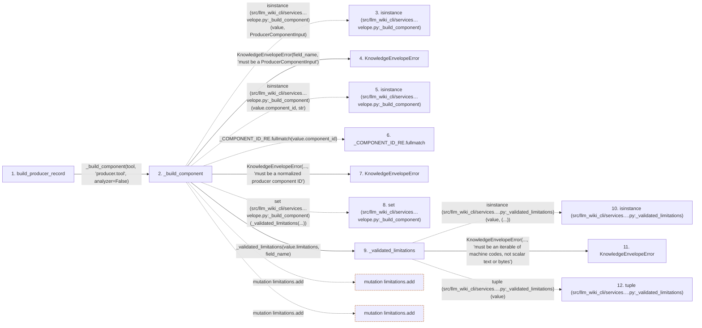

# build_producer_record

**Entry point:** `build_producer_record` (`api`)
**Source:** [knowledge_envelope](../modules/knowledge_envelope.md)
**Modules touched:** [knowledge_envelope](../modules/knowledge_envelope.md), [knowledge_evidence](../modules/knowledge_evidence.md), [knowledge_model](../modules/knowledge_model.md)

## Call sequence

```mermaid
sequenceDiagram
    participant p0 as build_producer_record
    participant p1 as _build_component
    participant p2 as isinstance (src/llm_wiki_cli/services…velope.py:_build_component)
    participant p3 as KnowledgeEnvelopeError
    participant p4 as _COMPONENT_ID_RE.fullmatch
    participant p5 as set (src/llm_wiki_cli/services…velope.py:_build_component)
    participant p6 as _validated_limitations
    participant p7 as isinstance (src/llm_wiki_cli/services….py:_validated_limitations)
    participant p8 as tuple (src/llm_wiki_cli/services….py:_validated_limitations)
    participant p9 as enumerate (src/llm_wiki_cli/services….py:_validated_limitations)
    participant p10 as _LIMITATION_CODE_RE.fullmatch
    participant p11 as limitations.add
    participant p12 as value.version.strip
    participant p13 as any (src/llm_wiki_cli/services…velope.py:_build_component)
    participant p14 as ord
    participant p15 as _reject_machine_local_paths
    participant p16 as set (src/llm_wiki_cli/services…reject_machine_local_paths)
    participant p17 as walk (src/llm_wiki_cli/services…reject_machine_local_paths)
    participant p18 as hash_component_configuration
    participant p19 as isinstance (src/llm_wiki_cli/services…sh_component_configuration)
    p0->>p1: _build_component
    p1-->>p2: isinstance (src/llm_wiki_cli/services…velope.py:_build_component)
    p1->>p3: KnowledgeEnvelopeError
    p1-->>p2: isinstance (src/llm_wiki_cli/services…velope.py:_build_component)
    p1-->>p4: _COMPONENT_ID_RE.fullmatch
    p1->>p3: KnowledgeEnvelopeError
    p1-->>p5: set (src/llm_wiki_cli/services…velope.py:_build_component)
    p1->>p6: _validated_limitations
    p6-->>p7: isinstance (src/llm_wiki_cli/services….py:_validated_limitations)
    p6->>p3: KnowledgeEnvelopeError
    p6-->>p8: tuple (src/llm_wiki_cli/services….py:_validated_limitations)
    p6->>p3: KnowledgeEnvelopeError
    p6-->>p9: enumerate (src/llm_wiki_cli/services….py:_validated_limitations)
    p6-->>p7: isinstance (src/llm_wiki_cli/services….py:_validated_limitations)
    p6-->>p10: _LIMITATION_CODE_RE.fullmatch
    p6->>p3: KnowledgeEnvelopeError
    p1-->>p11: limitations.add
    p1-->>p2: isinstance (src/llm_wiki_cli/services…velope.py:_build_component)
    p1-->>p12: value.version.strip
    p1-->>p13: any (src/llm_wiki_cli/services…velope.py:_build_component)
    p1-->>p14: ord
    p1->>p3: KnowledgeEnvelopeError
    p1->>p15: _reject_machine_local_paths
    p15-->>p16: set (src/llm_wiki_cli/services…reject_machine_local_paths)
    p15-->>p17: walk (src/llm_wiki_cli/services…reject_machine_local_paths)
    p1->>p3: KnowledgeEnvelopeError
    p1-->>p11: limitations.add
    p1->>p3: KnowledgeEnvelopeError
    p1->>p18: hash_component_configuration
    p18-->>p19: isinstance (src/llm_wiki_cli/services…sh_component_configuration)
```

<!-- Auto-generated from static call edges. Dashed arrows are external or unresolved calls. Reviewed runtime conditions and side effects belong in Behavior. -->

> Call sequence diagram shows 30 of 72 interactions; 42 omitted to keep the visualization within the 30-interaction and generated-diagram limits.

## Data flow

<!-- Auto-generated static analysis. Treat values and boundaries as best-effort hints, not runtime proof. -->

### Step data

| Step | Inputs | Reads | Writes | Returns |
|---|---|---|---|---|
| `build_producer_record` | `tool: ProducerComponentInput`, `extractors: Iterable[ProducerComponentInput]`, `plugins: Iterable[ProducerComponentInput]`, `extensions: Mapping[str, Any] \| None` | - | - | `producer` |
| `_build_component` | `value: ProducerComponentInput`, `field_name: str`, `analyzer: bool` | `ProducerComponentInput`, `UNKNOWN_COMPONENT_VERSION`, `UNKNOWN_COMPONENT_VERSION`, `VERSION_UNKNOWN`, `VERSION_UNKNOWN`, `VERSION_UNKNOWN`, `CONFIGURATION_BASIS_UNKNOWN`, `CONFIGURATION_BASIS_UNKNOWN` | - | `ProducerComponent(...)` |
| `isinstance (src/llm_wiki_cli/services…velope.py:_build_component)` | - | - | - | - |
| `KnowledgeEnvelopeError` | - | - | - | - |
| `isinstance (src/llm_wiki_cli/services…velope.py:_build_component)` | - | - | - | - |
| `_COMPONENT_ID_RE.fullmatch` | - | - | - | - |
| `KnowledgeEnvelopeError` | - | - | - | - |
| `set (src/llm_wiki_cli/services…velope.py:_build_component)` | - | - | - | - |
| `_validated_limitations` | `value: Iterable[str]`, `field_name: str` | - | - | `limitations` |
| `isinstance (src/llm_wiki_cli/services….py:_validated_limitations)` | - | - | - | - |
| `KnowledgeEnvelopeError` | - | - | - | - |
| `tuple (src/llm_wiki_cli/services….py:_validated_limitations)` | - | - | - | - |

### Call data

| From | To | Line | Call |
|---|---|---:|---|
| build_producer_record | _build_component | 962 | `_build_component(tool, 'producer.tool', analyzer=False)` |
| _build_component | isinstance (src/llm_wiki_cli/services…velope.py:_build_component) | 1784 | `isinstance(value, ProducerComponentInput)` |
| _build_component | KnowledgeEnvelopeError | 1785 | `KnowledgeEnvelopeError(field_name, 'must be a ProducerComponentInput')` |
| _build_component | isinstance (src/llm_wiki_cli/services…velope.py:_build_component) | 1790 | `isinstance(value.component_id, str)` |
| _build_component | _COMPONENT_ID_RE.fullmatch | 1791 | `_COMPONENT_ID_RE.fullmatch(value.component_id)` |
| _build_component | KnowledgeEnvelopeError | 1793 | `KnowledgeEnvelopeError(..., 'must be a normalized producer component ID')` |
| _build_component | set (src/llm_wiki_cli/services…velope.py:_build_component) | 1797 | `set(_validated_limitations(...))` |
| _build_component | _validated_limitations | 1797 | `_validated_limitations(value.limitations, field_name)` |
| _validated_limitations | isinstance (src/llm_wiki_cli/services….py:_validated_limitations) | 1847 | `isinstance(value, (...))` |
| _validated_limitations | KnowledgeEnvelopeError | 1848 | `KnowledgeEnvelopeError(..., 'must be an iterable of machine codes, not scalar text or bytes')` |
| _validated_limitations | tuple (src/llm_wiki_cli/services….py:_validated_limitations) | 1853 | `tuple(value)` |

### Boundary effects

| Kind | Target | Step | Line |
|---|---|---|---:|
| mutation | `limitations.add` | `_build_component` | 1800 |
| mutation | `limitations.add` | `_build_component` | 1824 |

### Static analysis gaps

| Kind | Step | Target | Line |
|---|---|---|---:|
| external_call | `_build_component` | `isinstance` | 1784 |
| external_call | `_build_component` | `isinstance` | 1790 |
| unresolved_call | `_build_component` | `_COMPONENT_ID_RE.fullmatch` | 1791 |
| external_call | `_validated_limitations` | `isinstance` | 1847 |
| step_limit | `build_producer_record` | `first 12 steps` | 0 |

## Behavior

This flow starts at `build_producer_record` and is classified as `api`. The generated call and data-flow sections are bounded static projections; runtime conditions and side effects require source-level confirmation.
