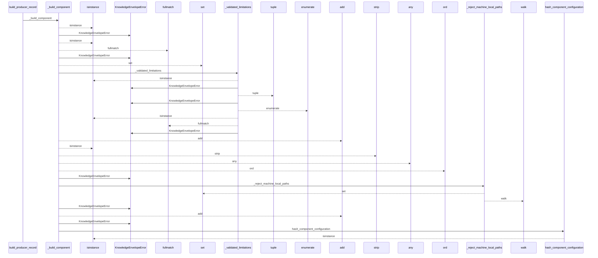
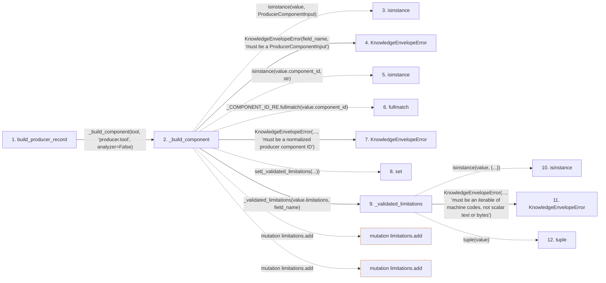

# build_producer_record

**Entry point:** `build_producer_record` (`api`)
**Source:** [knowledge_envelope](../modules/knowledge_envelope.md)
**Modules touched:** [knowledge_envelope](../modules/knowledge_envelope.md), [knowledge_evidence](../modules/knowledge_evidence.md), [knowledge_model](../modules/knowledge_model.md)

## Call sequence

<!-- Auto-generated from static call edges. Dashed arrows are external or unresolved calls. Reviewed runtime conditions and side effects belong in Behavior. -->

> Call sequence diagram shows 30 of 72 interactions; 42 omitted to keep the visualization within the 30-interaction and generated-diagram limits.

## Data flow

<!-- Auto-generated static analysis. Treat values and boundaries as best-effort hints, not runtime proof. -->

### Step data

| Step | Inputs | Reads | Writes | Returns |
|---|---|---|---|---|
| `build_producer_record` | `tool: ProducerComponentInput`, `extractors: Iterable[ProducerComponentInput]`, `plugins: Iterable[ProducerComponentInput]`, `extensions: Mapping[str, Any] \| None` | - | - | `producer` |
| `_build_component` | `value: ProducerComponentInput`, `field_name: str`, `analyzer: bool` | `ProducerComponentInput`, `UNKNOWN_COMPONENT_VERSION`, `UNKNOWN_COMPONENT_VERSION`, `VERSION_UNKNOWN`, `VERSION_UNKNOWN`, `VERSION_UNKNOWN`, `CONFIGURATION_BASIS_UNKNOWN`, `CONFIGURATION_BASIS_UNKNOWN` | - | `ProducerComponent(...)` |
| `isinstance` | - | - | - | - |
| `KnowledgeEnvelopeError` | - | - | - | - |
| `isinstance` | - | - | - | - |
| `fullmatch` | - | - | - | - |
| `KnowledgeEnvelopeError` | - | - | - | - |
| `set` | - | - | - | - |
| `_validated_limitations` | `value: Iterable[str]`, `field_name: str` | - | - | `limitations` |
| `isinstance` | - | - | - | - |
| `KnowledgeEnvelopeError` | - | - | - | - |
| `tuple` | - | - | - | - |

### Call data

| From | To | Line | Call |
|---|---|---:|---|
| build_producer_record | _build_component | 952 | `_build_component(tool, 'producer.tool', analyzer=False)` |
| _build_component | isinstance | 1664 | `isinstance(value, ProducerComponentInput)` |
| _build_component | KnowledgeEnvelopeError | 1665 | `KnowledgeEnvelopeError(field_name, 'must be a ProducerComponentInput')` |
| _build_component | isinstance | 1670 | `isinstance(value.component_id, str)` |
| _build_component | fullmatch | 1671 | `_COMPONENT_ID_RE.fullmatch(value.component_id)` |
| _build_component | KnowledgeEnvelopeError | 1673 | `KnowledgeEnvelopeError(..., 'must be a normalized producer component ID')` |
| _build_component | set | 1677 | `set(_validated_limitations(...))` |
| _build_component | _validated_limitations | 1677 | `_validated_limitations(value.limitations, field_name)` |
| _validated_limitations | isinstance | 1727 | `isinstance(value, (...))` |
| _validated_limitations | KnowledgeEnvelopeError | 1728 | `KnowledgeEnvelopeError(..., 'must be an iterable of machine codes, not scalar text or bytes')` |
| _validated_limitations | tuple | 1733 | `tuple(value)` |

### Boundary effects

| Kind | Target | Step | Line |
|---|---|---|---:|
| mutation | `limitations.add` | `_build_component` | 1680 |
| mutation | `limitations.add` | `_build_component` | 1704 |

### Static analysis gaps

| Kind | Step | Target | Line |
|---|---|---|---:|
| unresolved_call | `_build_component` | `isinstance` | 1664 |
| unresolved_call | `_build_component` | `isinstance` | 1670 |
| unresolved_call | `_build_component` | `_COMPONENT_ID_RE.fullmatch` | 1671 |
| unresolved_call | `_validated_limitations` | `isinstance` | 1727 |
| step_limit | `build_producer_record` | `first 12 steps` | 0 |

## Behavior

This flow starts at `build_producer_record` and is classified as `api`. The generated call and data-flow sections are bounded static projections; runtime conditions and side effects require source-level confirmation.
